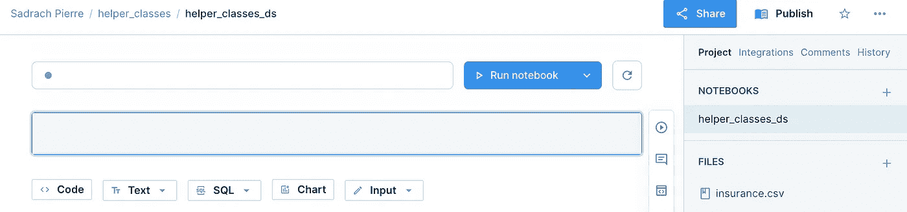

# 使用助手类掌握数据科学工作流

> 原文：<https://towardsdatascience.com/mastering-data-science-workflows-with-helper-classes-1134afbd0600>

## 用于 EDA、特征工程和机器学习的 Python 助手类


由[像素](https://www.pexels.com/photo/silver-ipad-on-white-book-page-289737/)上的[像素](https://www.pexels.com/@pixabay/)生成的图像

在计算机编程中，类是组织数据(属性)和函数(方法)的一种有用方式。例如，您可以定义一个类，该类定义与机器学习模型相关的属性和方法。这种类型的类的实例可能具有诸如训练数据文件名、模型类型等属性。与这些属性相关的方法可以是拟合、预测和验证。

除了机器学习，一般来说，类在数据科学中有广泛的应用。您可以使用类来组织各种 EDA 任务、功能工程操作和机器学习模型培训。这是很理想的，因为如果写得好，类会使理解、修改和调试现有的属性和方法变得容易。如果类方法被定义为完成一个明确定义的任务，这一点尤其正确。定义只做一件事的函数和类使理解和维护这些方法更加直接，这通常是一种好的做法。

虽然使用类可以使维护代码变得更加简单，但是随着复杂性的增加，它也会变得更加难以理解。如果你喜欢组织基本 EDA、特征工程和模型训练的属性和方法，一个单独的类可能就足够了。但是，当您为每种类型的任务添加更多的属性和方法时，这些对象的初始化会变得非常模糊，尤其是对于阅读您代码的合作者。考虑到这一点，随着复杂性的增加，为每种类型的任务(EDA、特征工程、机器学习)设置助手类而不是单个类是理想的。当开发复杂的 ML 工作流时，应该有单独的 EDA、特征工程和机器学习课程，而不是单一的课程。

在这里，我们将考虑每一种类型的任务，并看看如何编写一个单一的类，使我们能够执行它们。对于 EDA，我们的课程将允许我们读入数据，生成直方图和散点图。对于特征工程，我们的类将有一个采用对数变换的方法。最后，对于机器学习，我们班将有适合，预测和验证方法。

从这里我们将看到当我们添加额外的属性和方法时，类实例化和方法调用变得更加难以阅读。我们将为每种任务类型添加额外的方法和属性，并说明当我们增加复杂性时可读性如何受到损害。从这里我们将看到如何将我们的类分成更容易理解和管理的助手类。

对于这项工作，我将在 [Deepnote](https://deepnote.com/) 中编写代码，这是一个协作数据科学笔记本，使运行可重复的实验变得非常容易。我们将使用[医疗成本数据集](https://www.kaggle.com/datasets/mirichoi0218/insurance)。我们将使用患者属性，如年龄、体重指数和子女数量来预测医疗费用。这些数据在[数据库内容许可](https://opendatacommons.org/licenses/dbcl/1-0/) (DbCL: Public Domain)下公开免费使用、修改和共享。

## 面向对象的簿记模型类型

首先，让我们导航到 Deepnote 并创建一个新项目(如果您还没有帐户，可以免费注册)。

让我们创建一个名为“helper_classes”的项目，并在该项目中创建一个名为“helper_classes_ds”的笔记本。另外，让我们将 insurance.csv 文件拖放到页面左侧的“文件”面板中:



作者截图

我们将通过定义一个类来继续，该类包含机器学习工作流中的一些基本步骤。让我们从导入我们将使用的所有包开始:

作者创建的嵌入

让我们定义一个名为“MLworkflow”的类，它包含一个初始化字典的 init 方法，我们将使用字典来存储模型预测和性能。我们还将定义一个存储医疗成本数据的类属性:

```
class MLworkflow(object):
    def __init__(self):
        self._performance = {}
        self._predictions = {}
        self.data = pd.read_csv("insurance.csv")
```

接下来，我们将定义一个名为“eda”的方法来执行一些简单的可视化。如果您为变量直方图传递一个值“True ”,它将为指定的数字特征生成一个直方图。如果您为变量 scatter_plot 传递值“True ”,它将根据目标生成数字特征的散点图:

```
class MLworkflow(object):
    ...
    def eda(self, feature, target, histogram, scatter_plot):
        self.corr = self.data[feature].corr(self.data[target])
        if histogram:
            self.data[feature].hist()
            plt.show()
        if scatter_plot:
            plt.scatter(self.data[feature], self.data[target])
            plt.show()
```

接下来，我们将定义另一个名为“data_prep”的方法，它定义了我们的输入和输出。我们还将定义一个名为 transform 的参数，我们可以用它对数字列进行对数变换:

```
class MLworkflow(object):
    ...
   def data_prep(self, features, target, transform):
        for feature in features:
            if transform:
                self.data[feature] = np.log(self.data[feature])
        self.X = self.data[features]
        self.y = self.data[target]
```

我们还将定义一个拟合方法。它将为训练和测试拆分数据，其中 test_size 可以由“split”参数指定。我们还将提供适合线性回归或随机森林模型的选项。这显然可以扩展到任意数量的模型类型:

```
class MLworkflow(object):
    ...
    def fit(self, model_name, split):
        X_train, X_test, y_train, y_test = train_test_split(self.X, self.y, random_state=42, test_size=split)
        self.X_test = X_test
        self.y_test = y_test
        if model_name == 'lr':
            self.model = LinearRegression()
            self.model.fit(X_train, y_train)
        elif model_name == 'rf':
            self.model = RandomForestRegressor(random_state=42)
            self.model.fit(X_train, y_train)
```

然后，我们将定义一个 predict 方法，在我们的测试集上生成预测。我们将把结果存储在我们的预测字典中，字典键将是模型类型:

```
class MLworkflow(object):
    ...
    def predict(self, model_name):
        self._predictions[model_name] = self.model.predict(self.X_test)
```

最后计算每种模型类型的性能。我们将使用平均绝对误差作为我们的性能指标，并使用名为 validate 的方法将值存储在我们的性能字典中:

```
class MLworkflow(object):
    ...
    def validate(self, model_name):
        self._performance[model_name] = mean_absolute_error(self._predictions[model_name], self.y_test)
```

完整的类如下:

作者创建的嵌入

我们可以定义这个类的一个实例，并生成一些可视化效果:

作者创建的嵌入

然后，我们可以定义一个实例，并构建线性回归和随机森林模型。我们首先定义类的一个实例，并用我们希望使用的输入和输出调用数据准备方法:

```
model = MLworkflow()
features = ['bmi', 'age']
model.data_prep(features, 'charges', True)
```

然后，我们可以通过调用 fit 方法来构建一个线性回归模型，使用线性回归的 model_name 参数值“lr”和 20%的 test_size。然后，我们在模型实例上调用预测和验证方法:

```
model.fit('lr', 0.2)
model.predict('lr')
model.validate('lr')
```

我们可以对随机森林模型做同样的事情:

```
model.fit('rf', 0.2)
model.predict('rf')
model.validate('rf')
```

因此，我们的模型对象将有一个名为 _performance 的属性。我们可以通过模型对象访问它，并打印字典:

作者创建的嵌入

我们看到我们有一个字典，其中的关键字“lr”和“rf”的平均绝对误差值分别为 9232 和 9161。

## 簿记模型类型和用单个类分类分段的训练数据

虽然用来定义这个类的代码足够简单，但是随着复杂性的增加，阅读和解释起来会变得很困难。例如，如果除了能够监控 model_types 之外，我们还希望能够在数据中的不同类别上构建模型，那会怎么样呢？例如，如果我们希望只对女性患者训练线性回归模型，或者只对男性患者训练随机森林模型，该怎么办？让我们看看如何编写这个修改后的类。类似于在我们定义 init 方法之前，我们初始化必要的字典。我们将添加一个名为 models:

```
class MLworkflowExtended(object):
    def __init__(self):
        self._performance = {}
        self._predictions = {}
        self._models = {}
        self.data = pd.read_csv("insurance.csv")
```

eda 和数据准备方法基本保持不变:

```
class MLworkflowExtended(object):
    ...
    def eda(self, feature, target, histogram, scatter_plot):
        self.corr = self.data[feature].corr(self.data[target])
        if histogram:
            self.data[feature].hist()
            plt.show()
        if scatter_plot:
            plt.scatter(self.data[feature], self.data[target])
            plt.show()

    def data_prep(self, features, target, transform):
        self.target = target
        for feature in features:
            if transform:
                self.data[feature] = np.log(self.data[feature])
```

fit 方法包含相当多的变化。它现在接受变量 model_category 和 category_values 以及我们的随机森林算法的默认值。它还检查类别值是否在初始化的字典中。如果不是，就用一个空字典初始化它们。结果是字典的字典，其中最外面的键是分类值。分类键映射到的值是包含算法类型及其性能的字典。其结构如下:

```
_performance = {'category1':{'algorithm1':100, 'algorithm2':200}, 'category2':{'algorithm1':300, 'algorithm2':500}
```

我们还将过滤指定类别的数据。对应于此逻辑的代码如下:

```
 def fit(self, model_name, model_category, category_value, split, n_estimators=10, max_depth=10):
        self.split = split
        self.model_category = model_category
        self.category_value = category_value
        if category_value not in self._predictions:
            self._predictions[category_value]= {}
        if category_value not in self._performance:
            self._performance[category_value] = {}
        if category_value not in self._models:
            self._models[category_value] = {}

        self.data_cat = self.data[self.data[model_category] == category_value]
```

剩下的逻辑和我们之前的差不多。完整的功能如下:

```
 def fit(self, model_name, model_category, category_value, split, n_estimators=10, max_depth=10):
        self.split = split
        self.model_category = model_category
        self.category_value = category_value
        if category_value not in self._predictions:
            self._predictions[category_value]= {}
        if category_value not in self._performance:
            self._performance[category_value] = {}
        if category_value not in self._models:
            self._models[category_value] = {}

        self.data_cat = self.data[self.data[model_category] == category_value]

        self.X = self.data_cat[features]
        self.y = self.data_cat[self.target]

        X_train, X_test, y_train, y_test = train_test_split(self.X, self.y, random_state=42, test_size=split)
        self.X_test = X_test
        self.y_test = y_test

        if model_name == 'lr':
            self.model = LinearRegression()
            self.model.fit(X_train, y_train)
        elif model_name == 'rf':
            self.model = RandomForestRegressor(n_estimators=n_estimators, max_depth = max_depth, random_state=42)
            self.model.fit(X_train, y_train)
        self._models[category_value] = self.model 
```

注意，这个函数要复杂得多。

预测和验证方法是相似的。不同的是，我们现在也按类别存储预测和性能:

```
 def predict(self, model_name):
        self._predictions[self.category_value][model_name] = self._models[self.category_value].predict(self.X_test)

    def validate(self, model_name):
        self._performance[self.category_value][model_name] = mean_absolute_error(self._predictions[self.category_value][model_name], self.y_test)
```

完整的类如下:

作者创建的嵌入

然后，我们可以根据模型类型和类别进行不同的实验。例如，让我们在单独的女性和男性数据集上构建一些线性回归和随机森林模型:

作者创建的嵌入

我们可以对 region 类别做同样的事情。让我们对西南和西北进行实验:

作者创建的嵌入

虽然这样做很好，但是运行某些实验的代码变得难以阅读。例如，当拟合我们的随机森林时，第一次阅读我们代码的人可能不清楚传递给 fit 方法的所有值是什么意思:

```
model.fit('rf','region', 'northwest', 0.2, 100, 100)
```

随着我们增加类的功能，这可能会变得更加复杂。

## 簿记模型类型和带有助手类的分类分段训练数据

为了避免这种日益增加的复杂性，求助于基于 ML 工作流的每个部分定义的助手类通常是有帮助的。

我们可以从定义一个 EDA 助手类开始:

作者创建的嵌入

然后，我们可以使用 eda 类来访问特征工程类中的数据:

作者创建的嵌入

接下来，我们将定义我们的数据准备类。在数据准备类的 init 方法中，我们将初始化字典来存储模型、预测和性能。我们还将使用特征工程类将对数变换应用于 bmi 和年龄。最后，我们将修改后的数据和目标变量存储在数据准备属性中:

```
class DataPrep(object):
    def __init__(self):
        self._performance = {}
        self._predictions = {}
        self._models = {}
        feature_engineering = FeatureEngineering()
        feature_engineering.engineer(['bmi', 'age'], 'charges', True, False)
        self.data = feature_engineering.data
        self.target = feature_engineering.target

    def dataprep(self, model_name, model_category, category_value, split):
        self.split = split
        self.model_category = model_category
        self.category_value = category_value
        if category_value not in self._predictions:
            self._predictions[category_value]= {}
        if category_value not in self._performance:
            self._performance[category_value] = {}
        if category_value not in self._models:
            self._models[category_value] = {}
```

接下来，我们将在数据准备类中定义一个数据准备方法。我们将从定义训练/测试分割、模型类别和类别值的属性开始。然后，我们将检查类别值是否存在于我们的预测、性能和模型字典中。如果不是，我们将为新类别存储一个空字典:

```
class DataPrep(object):
    ...
    def dataprep(self, model_name, model_category, category_value, split):
        self.split = split
        self.model_category = model_category
        self.category_value = category_value
        if category_value not in self._predictions:
            self._predictions[category_value]= {}
        if category_value not in self._performance:
            self._performance[category_value] = {}
        if category_value not in self._models:
            self._models[category_value] = {}
```

然后，我们将筛选我们的类别，定义输入和输出，为训练和测试拆分数据，并将结果存储在数据准备属性中:

```
class DataPrep(object):
    ...
    def dataprep(self, model_name, model_category, category_value, split):
    ...
      self.data_cat = self.data[self.data[model_category] == category_value]

      self.X = self.data_cat[features]
      self.y = self.data_cat[self.target]

      X_train, X_test, y_train, y_test = train_test_split(self.X, self.y, random_state=42, test_size=split)
      self.X_test = X_test
      self.y_test = y_test
      self.X_train = X_train
      self.y_train = y_train 
```

完整的数据准备课程如下:

作者创建的嵌入

最后，我们定义一个模型训练类，它允许我们访问准备好的数据、训练我们的模型、生成预测和计算性能:

作者创建的嵌入

我们现在可以用我们的类层次结构进行一系列实验。例如，我们可以建立一个随机森林模型，只根据对应于女性患者的数据进行训练:

作者创建的嵌入

我们还可以建立一个线性回归模型，只根据女性患者的相关数据进行训练。此模型的性能将添加到现有的性能字典中:

作者创建的嵌入

我们可以对男性患者做同样的事情。以下是线性回归的结果:

作者创建的嵌入

对于随机森林:

作者创建的嵌入

我们看到，我们有一个几个实验及其相应的模型类型、类别级别和模型性能值的字典。

这篇文章中使用的代码可以在 [GitHub](https://github.com/spierre91/deepnote/blob/main/helper_class_ml.ipynb) 上找到。

## 结论

在这篇文章中，我们讨论了如何使用面向对象编程来简化数据科学工作流程的各个部分。首先，我们定义了一个 ML 工作流类，它支持简单的 ed a、数据准备、模型训练和验证。然后我们看到，当我们向类中添加功能时，类实例上的方法调用变得难以阅读。为了避免阅读和解释代码的问题，我们设计了一个由一系列助手类组成的类层次结构。每个助手类对应于 ML 工作流中的一个步骤。这使得理解方法变得容易，因为它们与高级任务相关，这有助于可读性和可维护性。我鼓励你在自己的 ML 项目中尝试一下。