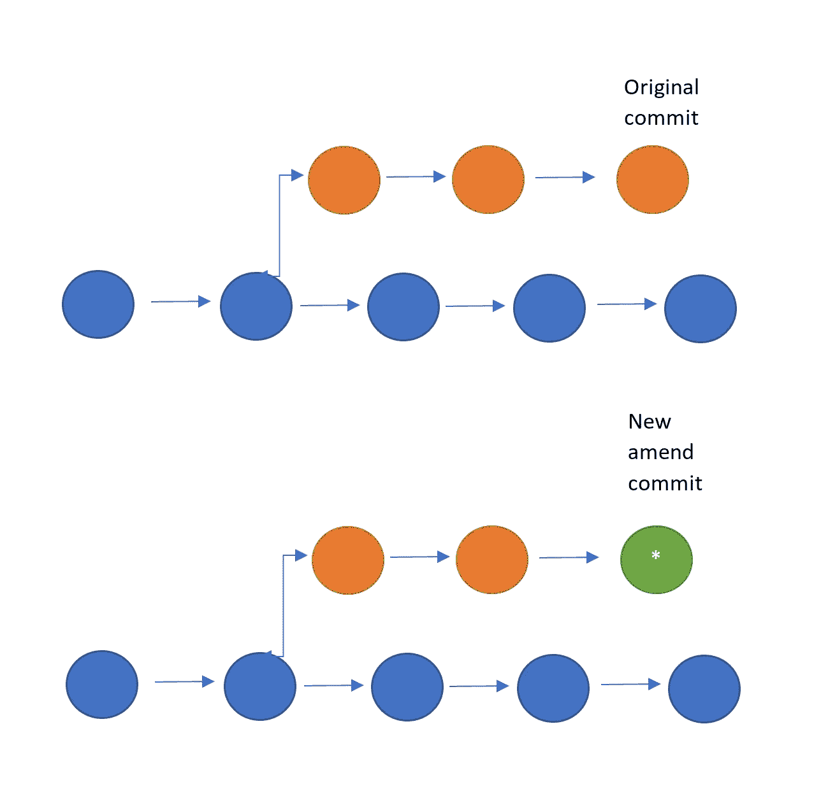

# 掌握 Git:修改提交

> 原文：<https://towardsdatascience.com/mastering-git-amending-commits-f46c2afc9508>

## 如何使用 git amend 更改您之前的提交


照片由 [Praveen Thirumurugan](https://unsplash.com/es/@praveentcom?utm_source=medium&utm_medium=referral) 在 [Unsplash](https://unsplash.com?utm_source=medium&utm_medium=referral) 拍摄

Git 是所有数据科学家和软件工程师都应该知道如何使用的工具。无论您是独自从事一个项目，还是作为一个大型分布式团队的一部分，了解如何使用 Git 从长远来看都可以为您节省大量时间。git 的关键功能之一是能够撤销、重做或编辑已经做出的更改。当第一次并不总是如预期的那样工作时，这可以用来确保在每次提交中具有清晰定义的变更的干净的提交历史。实现这一点的工具是`git --amend`,它使您能够修改您的最后一次提交，而无需在原始提交的基础上进行新的提交。这样做的好处是，您可以通过添加或删除文件和/或修改提交消息来改变上次提交的内容。

## 更改提交消息

使用`--ammend`函数的一个最简单的方法是简单地改变最后一次提交的消息。当您过早提交、临时提交或在撰写消息时忘记遵循某些团队约定时，这可能是有益的。更改提交消息可以确保它准确地描述了以前的提交，以便其他人可以确切地知道该更改包含什么。

要修改消息，当当前没有暂存任何内容时，您只需运行:

```
git commit --amend
```

这将打开您链接到 git 的编辑器，允许您修改之前的提交消息。如果您甚至不想打开编辑器，更改整个提交消息，您可以简单地添加`-m`选项，这将允许您在同一个命令中指定新消息。这可以通过以下方式实现:

```
git commit --amend -m "New commit message"
```

## 更改提交的文件

在某些情况下，您想要更改的不仅仅是附加到最后一次提交的消息。这可能是因为您忘记存放文件，在最初的提交中出错，或者因为一些额外的小更改应该在最后一次提交而不是新的提交中捆绑。这也可以通过`--amend`功能来完成。

为此，你所要做的就是简单地使用`git add file_name`将文件暂存起来，然后使用`git commit --amend`。典型的工作流程可能采取以下形式:

```
git add some_amazing_python.py
git commit -m "Some amazing work"#edit the files to remove an unecessary import
#and make it cleanergit add some_amazing_python.py
git commit --amend --no-edit
```

第二次升级文件时，使用`git commit --amend`会将第二次更改与第一次更改捆绑在一起。

您还会注意到,`--no-edit`标志被添加到了`git commit -amend`调用中。这样做是因为我们不希望在这次更改中更改提交消息，只更改文件。当然，如果你想改变消息，你可以移除这个标志来打开一个编辑器，或者使用`-m`选项来改变消息而不打开编辑器。

除了简单地向现有文件添加更改之外，您还可以从文件中删除上次提交的更改。这可以通过`git rm`功能而不是`git add`来删除文件。

## 警告！！！

`git commit -amend`通过删除以前的提交并创建一个新的提交来工作，如下图所示:



作者图片

因此，使用`git commit --amend`会改变存储库的历史。如果资源库已经公开共享，比如在 GitHub 上，并且其他开发人员已经在现有提交的基础上进行构建，这可能会使事情变得困难和混乱。这是因为在公开共享和使用时更改提交的历史将会产生合并冲突，这在将来很难解决。作为开发人员，您不想处理的一件事是合并冲突。所以如果改动已经公开，就不要用`--amend`。

唯一的例外是，如果你正在做你自己的分支，别人还没有接触过。这应该可以避免合并冲突的问题，但是在推送远程存储库时仍然会给自己带来困难。这是因为本地存储库和远程存储库之间的历史将会不同，这意味着必须通过强制提交到远程存储库来解决这个问题。这可以使用`git push -f`来完成，其中`-f`强制提交并用本地提交历史覆盖公共提交历史。只要确保这是在正确的分支上完成的！

## 结论

`git --amend`是一个非常有用的命令知道吗！如果遗漏了什么，它允许您更改提交消息，或者调整前一次提交中的更改。这可以为您和其他开发人员确保一个清晰的提交历史，并且在犯小错误的时候可以派上用场。只要确保你没有在已经公开的提交中使用它，或者当你在之前的提交中改变代码的行为时(这应该是一个新的！).

**来源**

[1][https://www.atlassian.com/git/tutorials/rewriting-history](https://www.atlassian.com/git/tutorials/rewriting-history)

[2][https://stack overflow . com/questions/179123/how-to-modify-existing-un pushed-commit-messages](https://stackoverflow.com/questions/179123/how-to-modify-existing-unpushed-commit-messages)

如果你喜欢你所读的，并且还不是 medium 会员，请使用下面我的推荐链接注册 Medium，来支持我和这个平台上其他了不起的作家！提前感谢。

[](https://philip-wilkinson.medium.com/membership) [## 通过我的推荐链接加入 Medium—Philip Wilkinson

### 作为一个媒体会员，你的会员费的一部分会给你阅读的作家，你可以完全接触到每一个故事…

philip-wilkinson.medium.com](https://philip-wilkinson.medium.com/membership) 

或者随意查看我在 Medium 上的其他文章:

[](/eight-data-structures-every-data-scientist-should-know-d178159df252) [## 每个数据科学家都应该知道的八种数据结构

### 从 Python 中的基本数据结构到抽象数据类型

towardsdatascience.com](/eight-data-structures-every-data-scientist-should-know-d178159df252) [](/a-complete-data-science-curriculum-for-beginners-825a39915b54) [## 面向初学者的完整数据科学课程

### UCL 数据科学协会:Python 介绍，数据科学家工具包，使用 Python 的数据科学

towardsdatascience.com](/a-complete-data-science-curriculum-for-beginners-825a39915b54) [](https://python.plainenglish.io/a-practical-introduction-to-random-forest-classifiers-from-scikit-learn-536e305d8d87) [## scikit-learn 中随机森林分类器的实用介绍

### UCL 数据科学学会研讨会 14:什么是随机森林分类器、实现、评估和改进

python .平原英语. io](https://python.plainenglish.io/a-practical-introduction-to-random-forest-classifiers-from-scikit-learn-536e305d8d87)