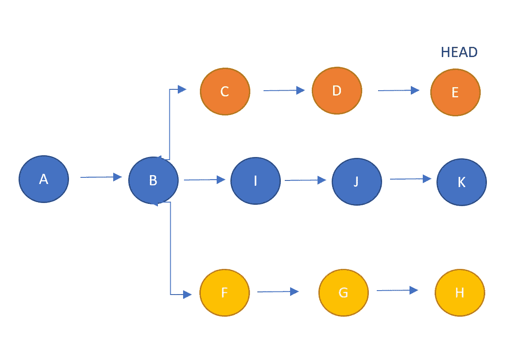
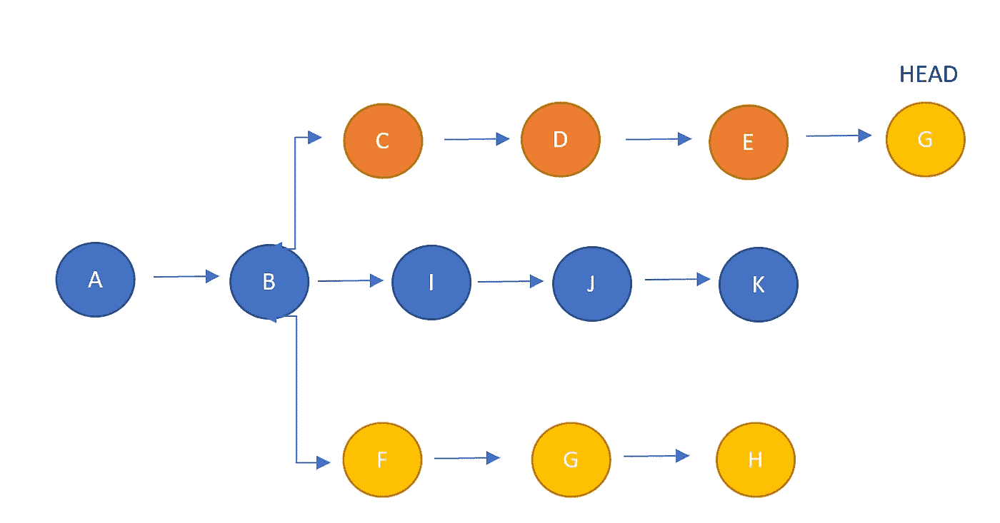

# 掌握 Git: Git 精选

> 原文：<https://towardsdatascience.com/mastering-git-git-cherry-pick-fbeb23eea04d>

## 如何将单个提交精选到您当前的分支


由 [Praveen Thirumurugan](https://unsplash.com/@praveentcom?utm_source=medium&utm_medium=referral) 在 [Unsplash](https://unsplash.com?utm_source=medium&utm_medium=referral) 上拍摄

Git 是所有数据科学家和软件工程师都应该知道如何使用的工具。无论您是独自从事一个项目，还是作为一个大型分布式团队的一部分，了解如何使用 Git 从长远来看都可以为您节省大量时间。git 的一个关键功能是能够从任何地方选择任何提交并复制到当前分支的头部。这可以通过命令`git cherry-pick`来完成，该命令可用于撤销更改、引入新功能、解决 bug 或确保提交附加到正确的分支。这当然是有用的，但你必须小心，不要在合并或重定基础可能更有益的情况下过度使用它。

## 樱桃采摘

`git cherry-pick`是一个有用的工具，它允许您从存储库中的任何地方复制一个提交，并将其附加到当前分支的头部。这使得它成为一个非常有用的工具，可以以多种方式使用，但避免过度使用通常是最好的做法。这是因为该命令会创建重复的提交，这会造成混乱的历史记录，并且在大多数情况下，合并或重置会更有好处。那么什么时候应该使用它:

*   **作为同事在不同的分支从事类似的工作**。在这种情况下，您的同事开发的类或函数可以帮助您当前的进展或将来的系统集成。为了将这种功能引入到您当前的分支中，并避免代码的重复，您可以简单地挑选出那些允许您继续工作的特定功能。这将集成功能，特别是如果它们是前端和后端系统，同时也减少了将来可能出现的合并冲突的数量。
*   **减少 bug。在某些情况下，当开发一个新特性时，你可能会发现一个来自另一个分支甚至主线的 bug(希望不是！).在这一点上，最好是尽快为客户获得一个 bug 补丁，这可能意味着在您当前的分支上开发补丁。在这一点上，您可以将您的变更精选到主分支或另一个分支中，以尽快解决 bug。**
*   **为了不失去功能**。在某些情况下，新功能可能不会在您希望的时候合并到 main 中。在这些情况下，为了获得您想要的特性，最好使用精选来挑选该功能。这样就保证了这个特性不会丢失！

## 使用 git 精选

使用`git cherry-pick`相对简单，因为您需要做的就是找到您感兴趣的提交引用，然后当您检查出您想要将功能引入的分支时，使用`git cherry-pick commit_reference`。例如:



作者图片

如果在提交`G`中有一些功能，在当前的特性分支中会很有用。您可以使用:

```
git cherry-pick G
```

这将改变提交历史，使得`G`现在也将出现在当前头部的尖端，如下所示:



为了能够识别您想要挑选的相关提交及其相关的提交引用，您可以使用命令`git log`或`git reflog`，它们将向您显示提交历史。

## **附加功能**

为了改进`git cherry-pick`的工作，我们还可以添加标志来改变功能，使它对我们想要的更有用:

*   选项将导致 git 在应用精选操作之前提示提交消息。这将允许您更改提交消息，如果您想反映它在该位置正在做什么。
*   `--no-commit` flag 将执行精选，但不是进行新的提交并将其添加到当前文件头，而是简单地移动文件内容，而不进行实际的提交。当您只想检查更改或查看更改如何与您的功能集成而不提交时，这可能很有用。
*   `-x`将在原始提交消息中添加一行“cherry picked from commit …”，用于无冲突提交。这在从公开可用的分支中挑选樱桃时会很有用。

您还可以通过指定`git cherry-pick branch_name`来指定想要将最新提交移动到哪个分支。这将从当前分支获取最新提交，并将其放在指定分支的末端。

此外，如果您想同时挑选多个提交，您可以添加它们的提交引用，用空格分隔。尽管不建议这样做，因为理想情况下，您应该一次只复制一个提交。

## 结论

`git cherry-pick`是一个强大的命令，如果正确使用，它会非常有用。它允许您将提交复制到当前分支的头部，当您想要共享功能但不想执行合并时，这对于解决在其他地方发现的错误或提交到错误的分支时非常有用。当合并或重定基础是更好的实践时，例如当多个提交可能被移动时，不应该使用它。您可以使用列出先前提交的`git log`命令找到您想要移动的提交的提交标识。

## 来源

[1]https://www.atlassian.com/git/tutorials/cherry-pick

[2]https://www.gitkraken.com/learn/git/cherry-pick

如果你喜欢你所读的，并且还不是 medium 会员，请使用下面我的推荐链接注册 Medium，来支持我和这个平台上其他了不起的作家！提前感谢。

[](https://philip-wilkinson.medium.com/membership) [## 通过我的推荐链接加入 Medium—Philip Wilkinson

### 作为一个媒体会员，你的会员费的一部分会给你阅读的作家，你可以完全接触到每一个故事…

philip-wilkinson.medium.com](https://philip-wilkinson.medium.com/membership) 

或者随意查看我在 Medium 上的其他文章:

[](/eight-data-structures-every-data-scientist-should-know-d178159df252) [## 每个数据科学家都应该知道的八种数据结构

### 从 Python 中的基本数据结构到抽象数据类型

towardsdatascience.com](/eight-data-structures-every-data-scientist-should-know-d178159df252) [](/a-complete-data-science-curriculum-for-beginners-825a39915b54) [## 面向初学者的完整数据科学课程

### UCL 数据科学协会:Python 介绍，数据科学家工具包，使用 Python 的数据科学

towardsdatascience.com](/a-complete-data-science-curriculum-for-beginners-825a39915b54) [](https://python.plainenglish.io/a-practical-introduction-to-random-forest-classifiers-from-scikit-learn-536e305d8d87) [## scikit-learn 中随机森林分类器的实用介绍

### UCL 数据科学学会研讨会 14:什么是随机森林分类器、实现、评估和改进

python .平原英语. io](https://python.plainenglish.io/a-practical-introduction-to-random-forest-classifiers-from-scikit-learn-536e305d8d87)