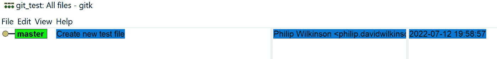
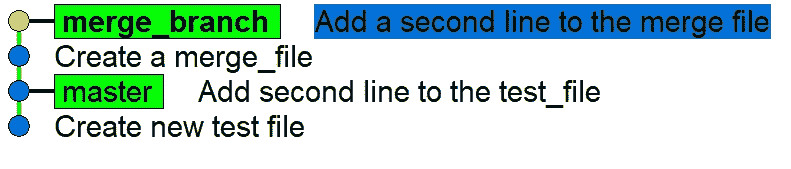
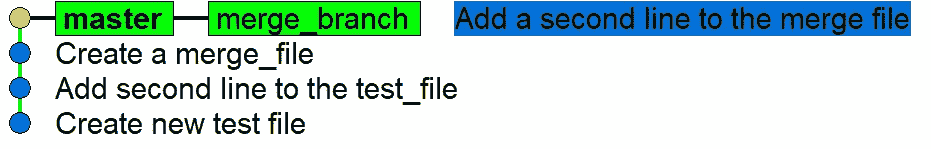
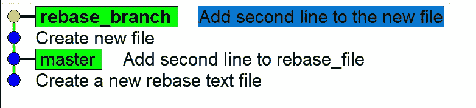
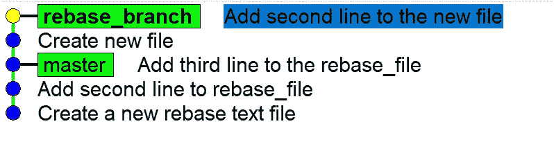
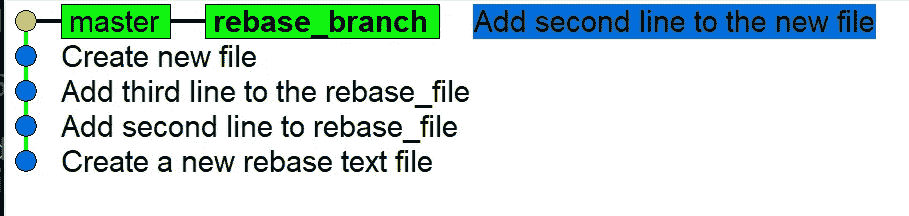

# 掌握 Git:合并和重建基础

> 原文：<https://towardsdatascience.com/mastering-git-merge-and-rebase-f2a7c5c348a9>

## 它们是什么，如何使用它们？


照片由 [Praveen Thirumurugan](https://unsplash.com/@praveentcom?utm_source=medium&utm_medium=referral) 在 [Unsplash](https://unsplash.com?utm_source=medium&utm_medium=referral) 上拍摄

Git 是所有数据科学家和软件工程师都应该知道如何使用的工具。无论您是单独从事一个项目，还是作为大型分布式团队的一部分，从长远来看，了解如何使用 Git 都可以为您节省大量时间。这是因为 git，以及更广泛的版本控制，允许您跟踪对代码库所做的更改，并与其他人有效地协作。你想逆转你所做的改变，用 git 很容易做到，你想从现有的代码中分离出一个新的特性，git，你想在你做改变的同时运行一个有效的产品，git，你想和其他人在同一段代码上工作，git 和 github！这真的很神奇。

学习其中一个重要的关键功能是合并和重组，将分支工作引入主线。阅读本文的大多数人都会在某个地方遇到过合并或重组(当然，有些比其他的更容易、更简洁)。这可能是因为你自己正在开发一个特性，你把它引入了你的主线，或者是其他人把他们已经完成的工作引入了一个共享的主线分支。这意味着理解 merge 和 rebase 是如何工作的，它们的区别是什么，以及如何使用它们来为自己服务，以便将来使用 git 时更加有效，这是非常重要的。

合并和重定基础之间的关键区别在于它如何处理代码历史，以及您是否需要新的提交。在合并的情况下，维护代码的历史，包括分支最初从主线分叉的点，并且需要新的提交来将分支合并在一起。相反，rebase 只是将新分支的提交放在主线的顶部，而不管分支的来源。这保持了主线中的线性，可以很容易地导航，但这是以保留提交的直接历史为代价的。您使用哪一个通常是个人偏好或取决于项目负责人，但为了以防万一，了解如何使用这两者是值得的！

## 安装

如果你已经安装了 git 和 gitbash，那太好了！不用担心设置，你应该准备好了。如果没有，请随意查看下面的帖子，其中涵盖了如何安装 git 和开始使用 git 命令。

</git-and-github-basics-for-data-scientists-b9fd96f8a02a>  

## 合并

一旦设置好 git 和 gitbash，我们就可以继续创建一个测试文件夹，我们将使用它来查看 git merge 会发生什么。我们将简单地称这个文件夹为`git_test_merge`,但是你想怎么叫都可以！一旦创建了文件夹，您就需要`cd`进入并创建一个新的空存储库。

为此，您将需要使用命令`git init`来创建新的存储库。然后你应该看到文件夹中创建的`.git`文件，并且`main`或`master`(如果你使用的是旧版本的 git)应该出现在你所在的文件夹目录之后。为此，您应该已经运行了这三个命令:

```
mkdir git_test_mergecd git_test_mergegit init
```

这将在文件夹`git_test_merge`中创建一个 git 存储库，并为您提供该存储库的所有功能。出于这个测试的目的，我们将首先创建一个文件，添加一些行并创建两个提交，然后再创建一个分支，稍后我们将合并到这个分支中。这只是为了展示提交的结构以及分支如何处理这些提交。

要创建一个文件并向其中添加一行，我们可以使用下面的命令`echo "This is a test file" >> test_file.txt`。这将创建文件`test_file.txt`，并附加第一行“这是一个测试文件”。如果你想检查这是不是真的，你可以使用命令`nano test_file.txt`来检查它是否工作。

一旦您创建了文件，我们希望使用`git add test_file.txt`提交该文件，然后我们可以使用`git commit -m "Create new test_file"`提交我们所做的更改。这将在我们的存储库中创建第一个提交。

这应该采用以下命令的形式:

```
echo "This is a test file" >> test_file.txtgit add test_file.txtgit commit -m "Create new test_file"
```

我们可以通过使用`gitk`使用内置的 git GUI 来检查这种情况。在这种情况下，将出现以下内容:



这是一个 GUI，向您显示以前的提交以及它们是如何交互的。到目前为止，我们只在主分支上创建了一个提交，如下所示。它还向您展示了是谁在何时提交的，以及与此提交相关的文件中的更改。虽然这是非常有用的功能，但我们将只关注之前提交的可视化表示，这样我们就可以看到`git merge`和`git rebase`都发生了什么。

在我们继续之前，我们可以创建第二个提交，这样在我们创建一个新的分支来合并之前，我们可以在我们的`master`分支上看到一个清晰的历史。这可以通过以下方式简单实现:

```
echo "This is the second line of the test_file" >> test_file.txtgit add test_file.txtgit commit -m "Add second line to the test_file"
```

此时，我们应该在`master`分支上看到两个提交，这创建了一个清晰的历史。然后我们想要创建一个分支，稍后我们想要将它合并回`master`分支。出于我们的目的，这可以称为`merge_branch`，但是通常以您试图创建的特征命名。我们可以使用以下命令创建这个分支:

```
git checkout -b merge_branch
```

这将创建分支(由于`-b`命令)并由于`checkout`命令检查分支。

如果您再次使用`gitk`,您应该会看到如下内容:


其中我们现在有一个`master`和一个`merge_branch`，它们目前都处于“向 test_file 添加第二行”提交状态。我们还可以看到，我们已经检出了`merge_branch`，因为它是粗体的(不是很清楚，但它在那里)。

为了检查 merge 是如何工作的，我们可以为这个分支创建两个新的提交。这将像以前一样通过创建一个新文件并向其中添加两行来完成。您可以自己尝试一下，看看是否可以复制我们在上面完成的过程，如果不能，那么您可以遵循下面的命令:

```
echo "This is a new file" >> merge_file.txtgit add merge_file.txtgit commit -m "Create a merge_file"echo "This is the second line of the merge file" >> merge_file.txtgit add merge_file.txtgit commit -m "Add a second line to the merge file"
```

然后我们可以再次使用`gitk`命令来查看`merge_branch`应该比主分支提前两次提交，如下所示:



如果我们现在简单地进行合并，我们将不得不使用`git checkout master`检查`master`分支并运行`git merge merge_branch`。结果看起来会像这样:



这将为您提供一个完整的合并，很好，但它并没有真正显示您想要的合并。以这种方式运行它将会把来自`merge_branch`的所有提交放到`master`分支上。这并没有显示太多，因为在现实中，`master`分支可能会有进一步的提交，这会使过程变得复杂。

因此，我们可以通过检查`master`分支并创建一个新的提交来复制它。这可以通过以下方式实现:

```
git checkout masterecho "This is the third line" >> test_file.txtgit add test_file.txtgit commit -m "Add third line to the test_file"
```

然后我们需要创建合并，将`merge_branch`引入到`master`分支中。我们这样做是因为**位于我们想要将提交放入**的分支中。在这种情况下，我们已经检查了`master`分支，所以我们是在正确的地方。

然后我们执行`git merge merge_branch`，指定我们想要将`merge_branch`合并到主分支中。然后，它会要求将提交消息添加到合并中，因为合并将被注册为提交。这种情况下，我们可以简单的命名为`merge merge_branch into master`。

一旦完成，我们就将`merge_branch`合并到`master`分支中。我们可以再次使用`gitk`将它形象化如下:


在这里，提交的图形保留了提交来自两个分支的位置，这两个分支源自提交“将第二行添加到 test_file”。我们还可以看到它们在那之后如何分化的历史，直到我们将`merge_branch`合并回`master`。

这样做的好处是它维护了提交历史和顺序。您知道提交的顺序以及它们来自哪里，这意味着跟踪提交来自哪里变得更加容易。然而，问题是，如果你有许多分支，你想合并，那么这可能会变得凌乱和难看。这意味着清楚地理解历史会变得困难，这也是为什么许多开发人员更喜欢使用 rebase 而不是 merge。

## 重置基础

git 中的 Rebasing 将接受指定的提交，并将它们放在另一个分支中的提交之上。这样做的好处是，一旦您删除了分支，提交流将呈现线性，这将很容易导航和跟踪。然而，这样做的缺点是，它不能像合并那样直接保存工作流的历史。

为了了解这是如何工作的，我们可以基本上重复我们为合并工作流所采取的大部分步骤。我们可以使用`mkdir git_test_rebase`、`cd`创建一个名为`git_test_rebase`的新文件夹，然后使用`git_init`初始化 git 存储库。然后，我们可以创建一个包含两行代码和两次提交的新文件:

```
echo "This is a new file in the rebase folder" >> rebase_file.txtgit add rebase_file.txtgit commit -m "Create a new rebase text file"echo "This is the second line in the rebase file" >> rebase_file.txtgit add rebase_file.txtgit commit -m "Add second line to rebase_file"
```

由此，我们可以创建一个新的分支，稍后我们将使用以下内容将该分支重置回`master`分支:

```
git checkout -b "rebase_branch"
```

在这个新分支中，和以前一样，我们可以创建另一个新文件并添加两个提交，这样新分支就有了一些历史:

```
echo "This is a new file in the rebase branch" >> new_file.txtgit add new_file.txtgit commit -m "Create new file"echo "This is the second line in the new file" >> new_file.txtgit add new_file.txtgit commit -m "Add second line to the new file"
```



然后我们可以进行`checkout master`分支，以便像以前一样，我们可以向`rebase_file`添加一个新行，并在主分支上创建第三个提交:

```
echo "Third line to the rebase_file" >> rebase_file.txtgit add rebase_file.txtgit commit -m "Add third line to the rebase_file"
```

在这一点上，我们回到了在最后一个存储库中执行`merge`时的位置，在`master`分支中执行了三次提交，在`rebase_branch`中执行了两次提交，在第二次提交后 rebase 分支被分支。

这里的不同之处在于，我们现在必须再次对`checkout`和`rebase_branch`进行调整，因为**是从**中您想要合并的分支开始执行的，而不是从您想要合并的分支开始。一旦我们完成了这些，我们可以使用`git rebase master`来告诉分支，我们想要将这个分支的所有提交重新放入`master`分支。我们可以再次使用`gitk`来检查发生了什么:



这里的主要区别是这个`rebase`命令只是将来自`rebase_branch`的提交放在了`master`分支提交之上，而不需要创建新的提交。它也没有将`master`分支指针移动到最近提交的位置。为此，我们可以使用以下命令强制`master`分支执行`rebase_branch`上的最新提交:

```
git branch -f master rebase_branch
```

这将显示:



当我们做`gitk`时。为此，你必须确保没有检出`master`分支，否则你将无法移动指针。

我们可以看到，rebase 已经将`rebase_branch`的提交放在了`master`分支的顶部，我们必须将`master`分支的指针向上移动到这些新的提交。虽然这保留了提交的行结构，并且看起来很清晰，但是它没有按照提交的顺序保留提交的历史，这对于某些人来说是不理想的。

## 结论

现在，您知道了如何在一个特性分支上执行合并和重置，以合并提交。要记住的一个关键点是，必须从您想要合并的分支执行 rebase，而合并必须从您想要合并的分支执行。您还需要记住，合并将保留提交的历史以及它们来自哪里，但它可能会创建一个混乱的历史，通常很难破译，您需要一个额外的提交。相比之下，rebase 会产生一个很好的线性历史，易于阅读，但它不会保留它们的直接历史，而是将来自签出分支的提交放在指定分支的现有提交之上。您更喜欢哪种类型将是个人偏好之一，取决于他们各自的权衡，但在项目中，通常最好在开始时指定您将使用哪种约定。否则，您可能会以 rebases 和 merges 结束，这会混淆存储库的历史。

如果你喜欢你所读的，并且还不是 medium 会员，请使用下面我的推荐链接注册 Medium，来支持我和这个平台上其他了不起的作家！提前感谢。

<https://philip-wilkinson.medium.com/membership>  

或者随意查看我在 Medium 上的其他文章:

</eight-data-structures-every-data-scientist-should-know-d178159df252>  </a-complete-data-science-curriculum-for-beginners-825a39915b54>  <https://python.plainenglish.io/a-practical-introduction-to-random-forest-classifiers-from-scikit-learn-536e305d8d87> 