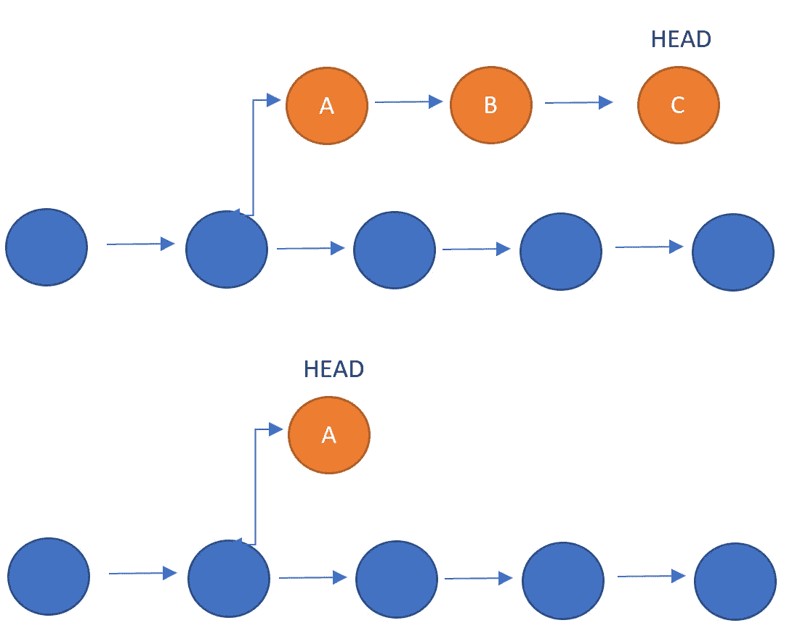
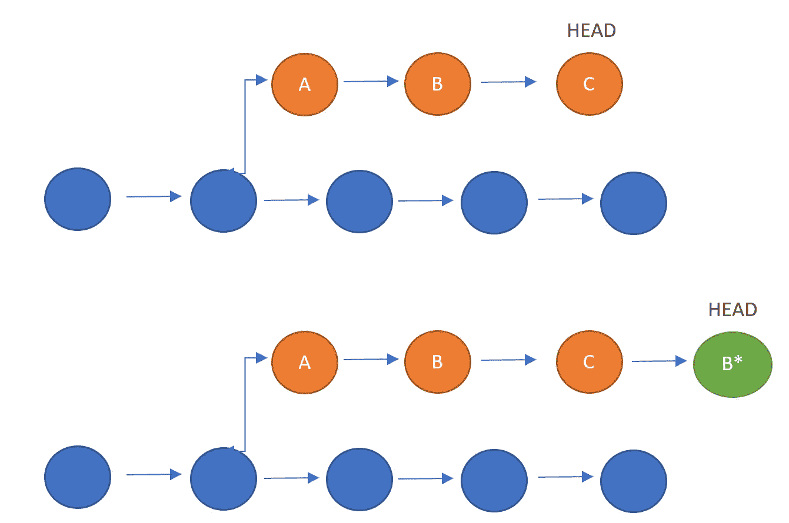

# 掌握 Git:重置 v 还原

> 原文：<https://towardsdatascience.com/mastering-git-reset-v-revert-12701108a451>

## 你应该使用哪一个，为什么？


照片由 [Praveen Thirumurugan](https://unsplash.com/@praveentcom?utm_source=medium&utm_medium=referral) 在 [Unsplash](https://unsplash.com?utm_source=medium&utm_medium=referral) 上拍摄

Git 是所有数据科学家和软件工程师都应该知道如何使用的工具。无论您是独自从事一个项目，还是作为一个大型分布式团队的一部分，了解如何使用 Git 从长远来看都可以为您节省大量时间。这是因为 git，以及更广泛的版本控制，允许您跟踪对代码库所做的更改，并与其他人有效地协作。你想逆转你所做的改变，用 git 很容易做到，你想从现有的代码中分离出一个新的特性，git，你想在你做改变的同时运行一个有效的产品，git，你想和其他人在同一段代码上工作，git 和 github！这真的很神奇。

Git 是所有数据科学家和软件工程师都应该知道如何使用的工具，所以我整理了一系列有助于掌握 git 的关键工具和功能。这篇文章是这个系列的第二篇文章，将介绍 git 重置和 git 恢复，它们可以用来撤销提交历史中的更改。如果您错过了本系列的第一篇文章，关于 git merge 和 git rebase，可以在下面找到链接:

[](/mastering-git-merge-and-rebase-f2a7c5c348a9)  

git 用户会遇到的两个常用工具是`git reset`和`git revert`的工具。这两个命令的好处是，您可以使用它们来删除或编辑您在之前提交的代码中所做的更改。理解它们是如何工作的将会为你节省大量的时间，让你编写更干净的代码，并且当你这样做的时候对提交有更多的信心。

## 重置

在提交级别(我们改变整个提交)，重置是将分支的当前尖端移动到先前提交的一种方式。这样做是为了从当前分支中删除我们不再需要的提交，或者撤销已经做出的任何更改。一个例子是使用下面的命令将分支`new-feature`从当前的`HEAD`向后移动两次提交:

```
git checkout new-feature reset HEAD~2
```

看起来像这样:



作者图片

朝向`new-feature`分支头部的两个提交变得悬空或孤立。这意味着它们将在下次 Git 执行垃圾收集时被删除，实质上是从提交历史中删除它们。

但是，其效果取决于附加到命令的标志:

*   标志意味着尽管我们回复了两次提交，但这些提交中的更改仍然是工作目录的一部分，并被准备提交。如果此时运行`git commit`，那么属于提交`C`和`B`一部分的所有更改都将被提交，您将处于与重置前相同的阶段。
*   `--mixed`是默认标志，在没有指定其他标志时使用。这样，虽然工作目录没有更改，也就是说没有文件被更改，但这些更改都不会被提交。这意味着如果你运行`git status`，你会看到所有被修改的文件都是红色的，等待提交。
*   `--hard`标志将更改暂存快照和工作目录，以删除提交`B`和`C`中的所有更改。这意味着你根本看不到`B`或`C`的变化，就像它们从未存在过一样。这是最极端的重置，意味着它将把所有东西都变回提交`A`后的状态。

`git reset`的这种用法是一种简单的方法，可以撤销还没有与其他人共享的更改。这是因为`git reset`改变了存储库的历史，所以应该只在改变没有公开时使用，比如当推送到远程存储库时。否则，当其他开发人员在您使用`git reset`更改的提交基础上构建时，可能会出现导致合并冲突的问题，这肯定不会使您成为团队中最受欢迎的开发人员！

这意味着当提交主要在您的本地存储库时，可以使用`git reset`。用例包括当在当前分支上开发的新特性应该是它们自己的分支的一部分时，当在先前的提交中引入了错误并且您想要移除它们时，或者当您想要改变提交历史时，例如不同提交中的不同文件或者不同提交名称。

## 归还

虽然`git reset`应该主要用于存储库的非公共分支，但是有时您想要撤销对公共存储库所做的更改。这可能是因为所做的更改引入了意外的错误，或者更改本身并不需要。在这种情况下，应该使用`git revert`而不是`git reset`。

这是因为恢复会通过创建新的提交来撤消提交。这使它成为撤销公共提交历史中的更改的安全方式，因为它不会覆盖任何历史，而是在新的提交中撤销所有这些更改。例如，当您想要撤销提交`B`中所做的更改时，您可以使用`git revert B`创建一个新的提交来撤销所有这些更改。这样做的时候，git 会找出在`B`中所做的更改，如果可能的话撤销所有这些更改，然后将一个新的提交添加到现有的项目中，如下所示:

```
git revert B
```



作者图片

如果可以进行更改，并且没有合并冲突，那么将打开一个编辑器，要求您命名将被添加到当前头文件末尾的新提交，就像`B*`一样。

这保存了提交历史，并潜在地减少了您的团队可能必须处理的合并冲突的数量。但是在你这么做之前，因为`git revert`有可能覆盖文件，你需要提交或者隐藏在恢复操作中可能丢失的更改

## 结论

`git reset`和`git revert`都是撤销先前提交中所做更改的有用命令。虽然`git reset`通过将分支的当前头移回指定提交来实现这一点，从而改变提交历史，但是`git revert`通过创建新提交来实现这一点，该新提交撤销指定提交中的改变，因此不改变历史。这意味着，当您想要在多次提交中撤销更改时，`git reset`可能更有用，但通常应该仅在更改尚未公开时使用，而`git revert`可以在仅需要撤销特定提交时使用，甚至可以在更改已经公开时使用。知道如何使用这两个命令会让你在提交时更有信心，因为你知道它们是可以撤销的，并且有希望让你和你的团队更有效率！

如果你喜欢你所读的，并且还不是 medium 会员，请使用下面我的推荐链接注册 Medium，来支持我和这个平台上其他了不起的作家！提前感谢。

[](https://philip-wilkinson.medium.com/membership)  

或者随意查看我在 Medium 上的其他文章:

[](/eight-data-structures-every-data-scientist-should-know-d178159df252)  [](/a-complete-data-science-curriculum-for-beginners-825a39915b54)  [](https://python.plainenglish.io/a-practical-introduction-to-random-forest-classifiers-from-scikit-learn-536e305d8d87) 