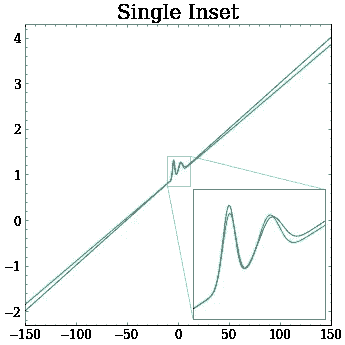
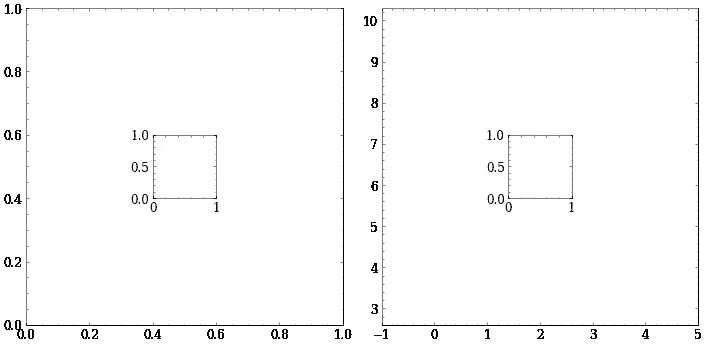
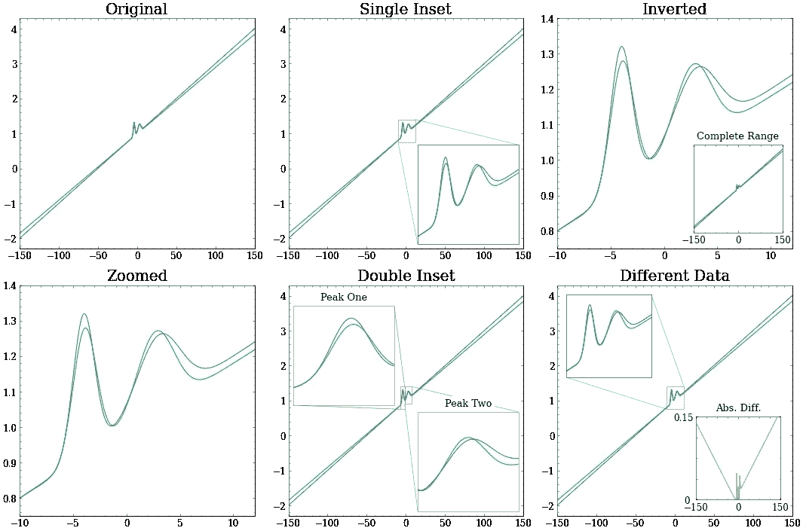
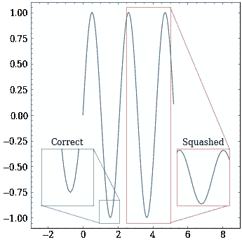
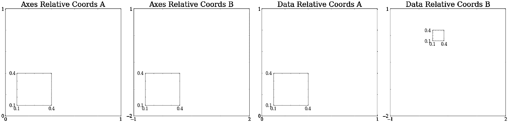
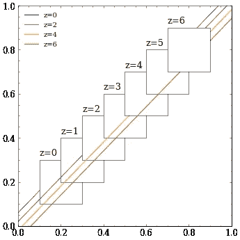

# 在 Matplotlib 中控制插入轴

> 原文：<https://towardsdatascience.com/mastering-inset-axes-in-matplotlib-458d2fdfd0c0>


由 [geralt](https://pixabay.com/users/geralt-9301/) 在 [Pixabay](https://pixabay.com/illustrations/laptop-technology-online-monitor-6962810/) 上拍摄封面图像。

[嵌入轴](https://matplotlib.org/stable/api/_as_gen/matplotlib.axes.Axes.inset_axes.html)是 Matplotlib 中一个奇妙的(**且经常未被充分利用的**)工具。它们可用于:

1.  放大图的特定部分以**更详细地显示它们**。
2.  **用附加信息替换图中的空白区域**。
3.  给你的数字一点额外的活力！

在这篇文章中，我将介绍使用嵌入轴的基本知识，然后给出如何**定制和改进你的绘图的额外细节。本文末尾的 **Python 笔记本**中包含了用于生成所有图的代码。**

## 基础知识

创建嵌入轴有三个主要组成部分。首先，您需要一个现有的环绕轴来添加插入轴。然后，您需要创建插入轴，并定义它在环绕轴中的位置。最后，您需要将插入数据绘制到插入轴上。一个可选步骤是**添加线条来指示插入缩放**。这可以通过以下方式实现:

```
# Code snippet to create inset axes.
# axis is the surrounding axis into which the inset axis will be added# Create an inset axis in the bottom right corner
axin = axis.inset_axes([0.55, 0.02, 0.43, 0.43])# Plot the data on the inset axis and zoom in on the important part
plot_data(axin)
axin.set_xlim(-10, 12)
axin.set_ylim(0.75, 1.4)# Add the lines to indicate where the inset axis is coming from
axis.indicate_inset_zoom(axin)
```

在上面的例子中，`axis.inset_axes`创建了插入轴`axin`，并定义了它在原始`axis`中的位置(稍后将详细介绍这个定位)。插入轴中显示的区域是通过设置轴限制来控制的，即`axin.set_xlim`和`axin.set_ylim`——把这想象成**裁剪原始图**，这样我们可以放大重要的部分。只需使用`indicate_inset_zoom`即可添加缩放线和边框。

这将产生类似如下的结果:



使用单个插入轴放大部分绘图的示例。作者创造的形象。

嵌入轴的定位是**轴相对于**轴的定位。这意味着位置与轴限制无关。嵌入轴的坐标应在[0，0](左下角)和[1，1](右上角)之间。`axis.inset_axes`需要四个参数来定义边界:[x0，y0，width，height]。因此，例如，[0.4，0.4，0.2，0.2]给出了一个位于图中心的插入轴，**，而不管轴限制**是什么:



当外部轴限制改变时，插入轴不会移动，因为(默认情况下)位置是相对于轴的。作者创造的形象。

## 越来越花哨

我们可以通过使用嵌入轴让**更有创意**:

1.  没有理由为什么我们不能在我们的地块中有**多个插入轴**。也许我们想放大两个区域？
2.  有时，嵌入轴中的内容可能实际上比整体情节更有趣。我们可以**交换内容**，以便周围的绘图包含放大的版本，并且插入轴显示更宽的视图。
3.  插入轴甚至不需要显示与周围绘图相同的数据。放大只是一个用例。显示**附加信息**也很好。

下面我们用上面的图给出了这些不同用例的例子。看看**带插入轴的图比无聊的原始图好看多了！**



使用嵌入轴制作更有趣的图的一系列选项。作者创造的形象。

## 更多提示

创建插入轴时，还有一些需要注意的事项。

**纵横比** —考虑插入轴的纵横比与其显示的原始区域的纵横比非常重要。这会导致插入轴中原始数据的**拉伸或挤压**，这可能会导致数据失真。例如:



使用嵌入轴时要注意不同的纵横比。作者创造的形象。

**轴定位** —上面，我提到了*轴相对于*坐标定位嵌入轴。或者，可以使用相对于坐标的*数据。创建插入轴时设置`transform=axis.transData`。不过要小心！这使得嵌入轴的位置对轴限制敏感:*



轴与数据相对定位。当轴限制改变时，使用数据相对定位时，插入轴会移动。作者创造的形象。

**Z 排序—** 默认情况下，插入轴应该出现在您已经绘制的任何内容的顶部。然而，**对于手动控制**，您可以调节`zorder`来控制顶部的内容:



更改插入轴的 z 顺序值允许您将它们放置在现有数据的顶部，甚至是彼此之上。作者创造的形象。

下面是我用来生成本文中的情节的 **Python 笔记本**:

这就是我使用 **Matplotlib 嵌入轴**的指南。如果您有任何问题，请发表评论或联系我。**感谢阅读，密谋愉快！**