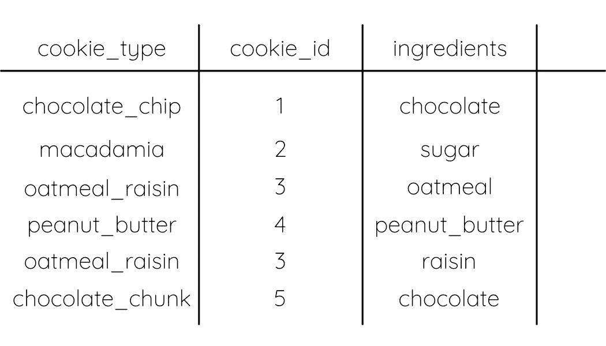
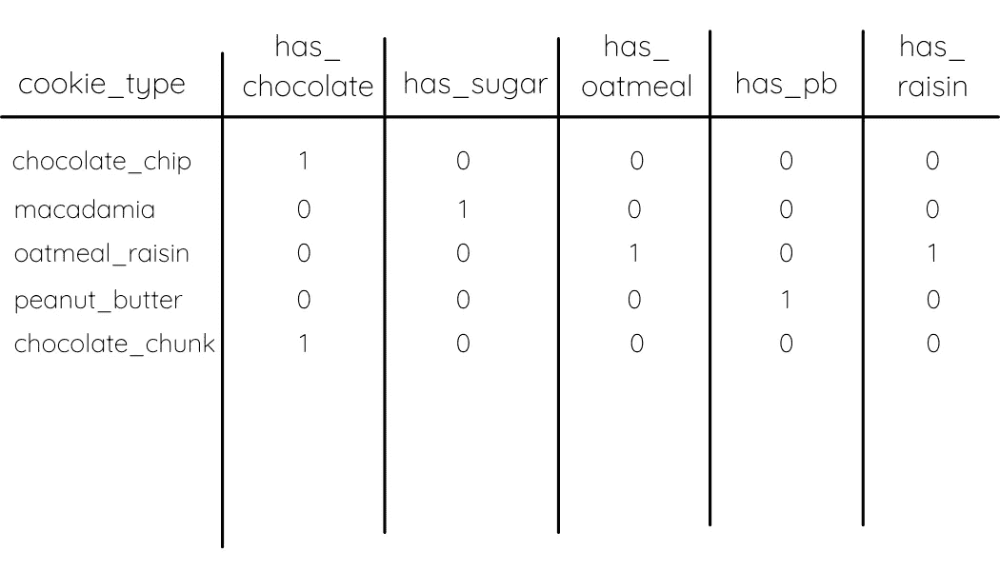
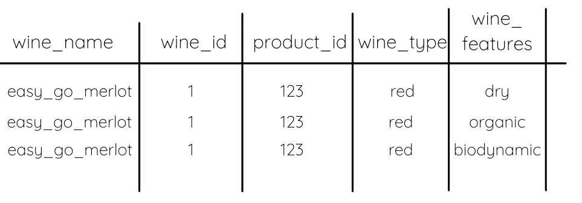
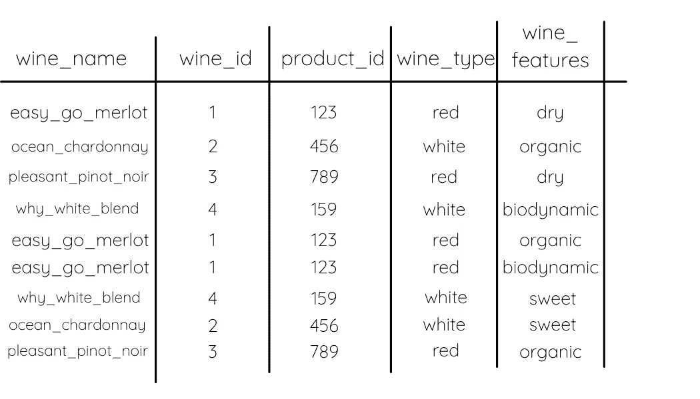
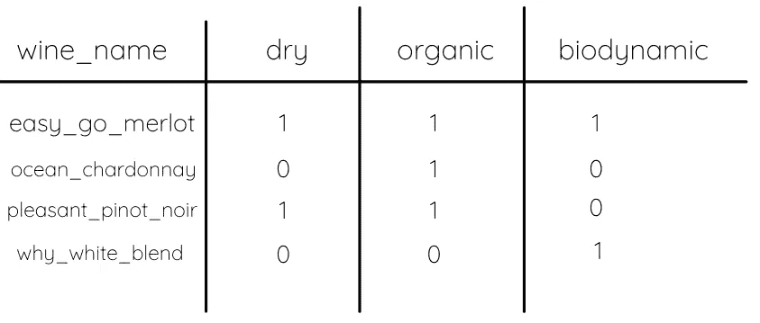

# 在 dbt 中掌握数据透视表

> 原文：<https://towardsdatascience.com/mastering-pivot-tables-in-dbt-832560a1a1c5>

## 这个函数将节省您编写 SQL 的时间。


照片由[恩库鲁列科·乔纳斯](https://unsplash.com/@nkululekojonas?utm_source=unsplash&utm_medium=referral&utm_content=creditCopyText)在 [Unsplash](https://unsplash.com/s/photos/spin?utm_source=unsplash&utm_medium=referral&utm_content=creditCopyText) 上拍摄

有多少次你不得不把一个过于复杂的解决方案放在一起来解决一个简单的问题？如果你以前曾经编写过代码，你可能至少可以列出一些例子。对我来说，有几次是围绕着数据透视表进行的。它们听起来很简单，但是用 SQL 写起来很复杂。

幸运的是，我最近发现 dbt 在 [dbt utils](https://github.com/dbt-labs/dbt-utils) 中有一个函数，可以快速简单地创建数据透视表。不需要复杂的聚合或连接！

# 什么是数据透视表？

首先，让我们从什么是数据透视表开始。不，这不是 Excel 数据透视表。它是一个函数，将一列中的唯一值转换成它们自己的列，用一个布尔值填充该行的相应单元格。

例如，透视如下所示的数据…



作者图片

…会产生如下所示的数据…



作者图片

# 数据透视表用例

这是聚合和计算数据中是否存在某些特征的好方法。当我发现这个技巧时，我需要旋转一个充满不同葡萄酒特征的列。我希望每个特征都有一列，并有一个值告诉我该葡萄酒是否存在该特征。

使用数据透视表也是确保表中有唯一主键的理想方法。通常，当您的列包含多个 id 可能存在的不同属性时，您的主键不再是唯一的。由于一个列会产生重复项，因此最终会有多个 id 相同的行。

还不理解？

让我们看看这一款酒。看到除了`wine_features`列，每一列的值都是一样的吗？因为这种酒是干的、有机的、生物动态的，所以创建了一个新的行来代表这些特征。



作者图片

这通常是因为您需要将数据库中的表连接在一起。不幸的是，数据透视表是避免这个问题并保持数据模型整洁的唯一方法。

# 你如何使用 dbt 数据透视表？

dbt 包含一个名为[**dbt _ utils . pivot**](https://github.com/dbt-labs/dbt-utils/blob/main/macros/sql/pivot.sql)**的函数，它可以帮助您使用一行简单的代码透视表格。**

**看起来是这样的:**

**`{{ dbt_utils.pivot(‘<column name>’, dbt_utils.get_column_values(ref(‘<table name>’), ‘<column name’)) }}`**

**您只需指定要透视的列名。确保用单引号括起来。**

**您还可以指定该列所在的表的名称。同样，确保你用单引号括起来。**

**不幸的是，这需要是数据库中的一个永久表。你不能引用一个由 CTE 创建的表格，这是一个错误。我必须创建一个永久表，其中包含我需要连接在一起的表，然后在这个 pivot 函数中引用这些表。让它成为自己的中介模型就行了。**

**在实际查询中使用 pivot 函数时，它应该是这样的:**

```
select
   wine_name,
   {{ dbt_utils.pivot('wine_features', dbt_utils.get_column_values(ref('wine_features_joined'), 'wine_features')) }}
from {{ ref('wine_features_joined') }} 
group by wine_name
```

**您可以看到，该函数替换了 SQL 查询中列名通常所在的位置。只有作为分组依据的列才是应该选择的其他列。**

**还要注意，我使用了一个`{{ ref() }}`函数，因为我从一个永久表中进行选择，该表已经作为数据模型存在于我的 dbt 环境中。不要从 cte 中选择！**

**如果我们从一张葡萄酒及其不同特征的表格开始，看起来像这样…**

****

**作者图片**

**使用 pivot 函数运行我在上面展示的查询将导致该表如下所示:**

****

**作者图片**

**注意曾经是`wine_features`列中的值的特性现在是列标题。这些列中的布尔值显示该功能是否存在于原始列中。**

# **另一件需要记住的事情是…**

**通常，旋转列的数据类型很难处理。请确保将它们转换为适当的数据类型，并根据需要重命名它们。在这里，您可以看到透视列的数据类型是一个数字。显然，这是错误的。**

****

**作者图片**

**我不得不为我的每一个专栏重新编写和重命名我的专栏:**

```
wine_features."organic" AS is_organic
```

**引号允许您选择雪花中的列，尽管数据类型与预期的不同。**

# **结论**

**现在，您已经准备好使用 dbt utils pivot 函数来透视表了！这将使你的生活变得更加简单，你的代码也更加整洁。请继续关注更多关于 dbt 在其 utils 包中为您提供的便利函数的文章。**

**在那之前，通过[订阅](https://mailchi.mp/e04817c8e57e/learn-analytics-engineering)我的时事通讯来了解更多关于 dbt 和现代数据栈的知识。**