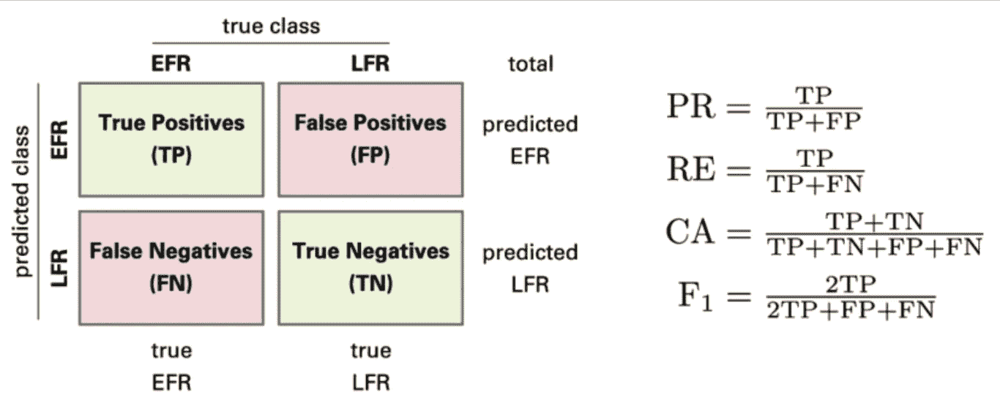
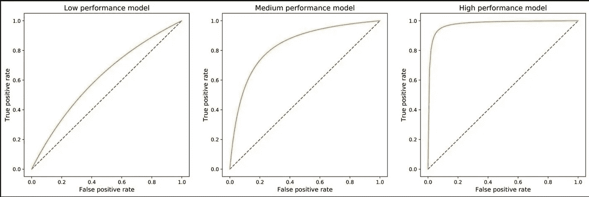

# 通过讲故事掌握分类模型的评估

> 原文：<https://towardsdatascience.com/mastering-the-evaluation-of-classification-models-with-storytelling-f8a9f63f3723>

## 数据科学家必备的知识


照片由 [Unsplash](https://unsplash.com?utm_source=medium&utm_medium=referral) 上的 [Aditya Romansa](https://unsplash.com/@adroman?utm_source=medium&utm_medium=referral) 拍摄

今天，我们可以从世界各地获得源源不断的数据。分类模型是最流行的机器学习工具之一，用于在数据中发现模式并理解它，以便我们可以揭示决策的相关见解。它们是一种监督学习的形式，在这种学习中，我们训练一个模型，根据预先确定的特征对数据点进行分组。反过来，该模型输出数据点属于特定类别的可能性或概率。

用例层出不穷，广泛分布于各个行业— *语音识别、垃圾邮件检测、异常/欺诈检测、客户流失预测、客户细分和信用评估。*

**因此，作为一名数据科学家，掌握分类模型的艺术至关重要。**

在本文中，我们将关注在数据科学中创建模型的最后一个步骤:评估模型性能，或者换句话说，评估分类的好坏。

**有什么比一个好故事更能解释这些指标以及如何使用它们呢？**

*假设你是所在城市医院产前部的负责人。你的目标是为未来的父母提供最积极的体验。在这方面，你们雇佣了最好的医生，并组建了一支由护士和助产士组成的梦之队来支持他。*


[乌斯曼·优素福](https://unsplash.com/@usmanyousaf?utm_source=medium&utm_medium=referral)在 [Unsplash](https://unsplash.com?utm_source=medium&utm_medium=referral) 上拍摄的照片

医生忙得不可开交，没有时间检查所有的病人以确定他们是否怀孕。所以他使用分析和不同的血液标记进行验证。护士的角色是探访病人以确保预见性。这里我们有 4 种可能的情况:

*   *医生说病人怀孕了，护士确认
    →* ***真阳性(TP)***
*   *医生说病人怀孕了，但护士宣布无效
    →* ***假阳性【FP】***
*   *医生说病人没有怀孕，护士确认
    →* ***真阴性(TN)***
*   *医生说病人没有怀孕，但护士宣布无效
    →* ***假阴性(FN)***

*作为部门主管，你专注于提供最佳质量的服务，因此你想评估医生在识别早孕方面的能力。为此，您可以使用 5 个关键指标:*

## 1.准确(性)

准确性可能是最常见的度量标准，因为它相对容易理解。它是**正确预测数除以预测总数的比值。**

```
(TP+TN) / (TP + FP + TN + FN)
```

换句话说，准确性会告诉我们医生在给病人分类方面有多好。

50%的准确率意味着这个模型和掷硬币一样好。一般来说，根据应用领域的不同，我们的目标是达到 90%、95%或 99%以上的精度。

> 记住:有人说，如果我们有高精度，我们就有一个好模型。只有当数据集平衡时才是这样，也就是说，类的大小相对均匀。

假设在患者群中有更多未怀孕的患者(*，即怀孕患者占少数*)。在这种情况下，我们说样本是不平衡的，精确度不是评估性能的最佳指标。

## 2.精确

精度是正确预测的正元素数除以预测的正元素总数。所以这是一个准确性和质量的衡量标准——它告诉我们医生在预测怀孕方面有多好。

```
TP / (TP + FP)
```

> 根据模型应用，具有高精度可能是至关重要的。始终评估出错的风险，以决定精度值是否足够好。

如果医生宣布怀孕(但他错了)，这可能会影响患者，因为他们可能会就这个重大消息做出改变人生的决定(例如，买新房子或换车)。

## 3.回忆

回忆——又名敏感度或真阳性率或命中率，是与实际阳性数相比，正确预测的阳性元素数。它告诉我们医生在检测怀孕方面有多好。

```
TP / (TP + FN)
```

> 与 precision 类似，根据模型应用，拥有高召回率可能是至关重要的。有时，我们不能错过一个预测(欺诈，癌症检测)。

假设医生错过了一个病例，没有预测到怀孕。患者在怀孕期间可能会保持一些不健康的习惯，如吸烟或饮酒。

## 4.特征

特异性—也称为选择性或真阴性率，总结了当结果为阴性时预测阳性类别的频率。**可以理解为误报警指示灯**。

```
TN / (TN + FP)
```

> 理想情况下，一个模型应该具有**高特异性和**高召回率，但这是一个权衡。每个模型都需要选择一个阈值。

基于上面提到的原因，我们不想错过一个怀孕案例。同时，如果我们没有可靠的血液标志物来确认怀孕，我们也不想提醒患者。作为部门主管，你需要决定医生的预后不够好的转变点是什么，我们需要护士进行体检。

## **5。F-measure | F1 得分**

F1 分数是精确度和召回率的加权调和平均值。它反映了一个模型的有效性——**当错过一个病例或错误宣布怀孕同样有风险时，医生的表现如何。**

```
2 x (Precision x Recall) / (Precision + Recall)
```

> 当样本不平衡，准确性变得不合适时，我们可以使用 F1 分数来评估模型的性能。

如果没有怀孕的患者比怀孕的患者多得多，我们认为样本是不平衡的，并将使用 F1 分数来评估医生的表现。

既然我们已经设置了评估分类模型的关键指标，我们可以更仔细地研究如何以一种令人信服的方式可视化它们。

## 混淆矩阵

混淆矩阵或误差矩阵是一个简单的表格，汇集了来自分类模型的预测结果:*真阳性、真阴性、假阳性&假阴性。*它通过分解每个类别的正确和错误预测的数量，帮助可视化分类器产生的错误类型。



来源:[蛋白质折叠过程中早期折叠残基可解释分类模型的应用(Sebastian Bittrich)](https://www.researchgate.net/publication/330174519_Application_of_an_interpretable_classification_model_on_Early_Folding_Residues_during_protein_folding)

> 混淆矩阵突出显示了模型在进行预测时混淆的地方。

因此，与单独使用准确性相比，这是一种有用的可视化方法，因为它显示了模型的薄弱之处，并提供了改进它的可能性。

## ROC 曲线和精确回忆曲线

ROC 曲线是假阳性率(也称为反向特异性)对真阳性率(也称为灵敏度)的曲线图。如果每个类别的患者数量大致相等(*即平衡数据集*)，则应使用精确-召回曲线，而非平衡病例应使用精确-召回曲线([来源](https://machinelearningmastery.com/roc-curves-and-precision-recall-curves-for-classification-in-python/#:~:text=Generally,%20the%20use%20of%20ROC,moderate%20to%20large%20class%20imbalance.))。

> 一个好的模型用一条从 0 到 1 快速增长的曲线来表示。该公司表示，该模型不会牺牲太多的精确度来获得高召回率。

一个糟糕的模型——又名无技能分类器——不能区分类别，因此，在所有情况下都预测一个随机或恒定的类别。这些模型由从图的左下角到右上角的对角线表示。



来源:作者

所以你现在可能知道曲线的形状给了我们调试模型的宝贵信息:

*   如果曲线更接近左下方的随机线，则表明假阳性较低，真阴性较高。另一方面，如果图的 y 轴上有更大的值，这意味着更高的真阳性和更低的假阴性。
*   如果曲线不平滑，则意味着模型不稳定。

这些曲线也是比较模型和选择最佳模型的重要工具。

曲线下面积(AUC 或 AUROC)通常用于总结模型技巧。它可以取从 0.5(最差模型)到 1(完美模型)的值。

> AUROC 值越高，模型越好。

**现在，您已经掌握了开始评估您的分类模型所需的所有基本知识，对于您的数据科学家角色来说，同样重要的是，要有一个好的故事来向大量观众传达您的表现。**

像往常一样，给我留下你的评论和[消息](https://www.linkedin.com/in/aureliegiraud9000/)，我会很高兴收到你的来信，让这篇文章变得更好。在 Medium 上关注我，了解更多关于数据科学的内容。

<https://agiraud.medium.com/membership> 