# 基于显微图像处理的材料数据挖掘

> 原文：<https://towardsdatascience.com/materials-data-mining-via-image-processing-of-micrographs-4814e7112e40>

## *基于显微图像的特征提取的基本处理步骤*

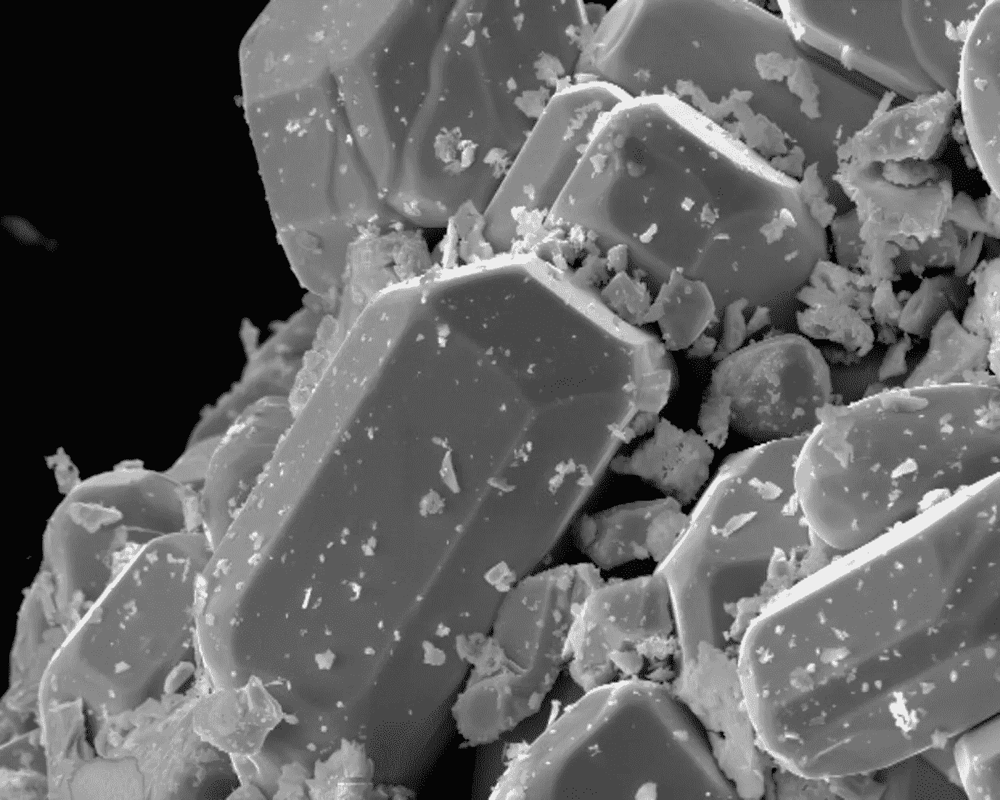

照片由 [Joyita Bhattacharya](https://unsplash.com/@bjoyita?utm_source=unsplash&utm_medium=referral&utm_content=creditCopyText) 在 [Unsplash](https://unsplash.com/s/photos/micrograph?utm_source=unsplash&utm_medium=referral&utm_content=creditCopyText) 上拍摄

**背景**

在我的文章“[使用 Matminer 和 Pymatgen](/uncovering-the-potential-of-materials-data-using-matminer-and-pymatgen-83126fadde1c) 发现材料数据的潜力”中，我讨论了材料四面体的概念——为各种技术用途开发材料的基本框架。占据四面体顶点的重要参数是过程、结构、属性和性能。

结构的特征基于特征长度尺度，该尺度可以从几埃( *1 埃= 10* ⁻ ⁰ *米)*到几百微米 *(1 微米= 10* ⁻ *⁶米)*变化。长度刻度用于在显微镜下辨别特征。使用非常强大的高分辨率显微镜，如[这台](https://www.youtube.com/watch?v=eSKTFXv5rdI)，人们可以识别小到原子甚至更小的特征。

微米和亚微米尺寸的特征，称为微结构，使用不同类型的显微镜捕获为图像或显微照片。这些微观结构存储了大量信息，这些信息对于理解材料的性质和性能至关重要。我们可以使用机器学习/深度学习从这些图像中挖掘重要的特征。典型的微结构包含基于像素强度或对比度可区分的特征。一些重要的特征是分隔不同域(也称为颗粒或晶粒)的边界或界面。这些域在形状、大小、取向、大小分布和空间排列(统称为形态学)上可以变化。这些特征影响材料的性质。

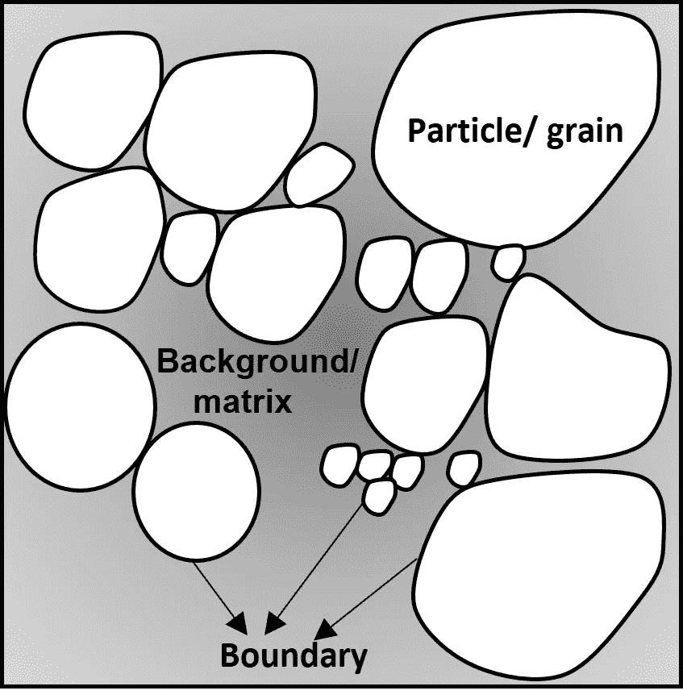

作者图片:微观结构示意图

尽管可以使用其他材料表征技术来研究这些特征，但显微镜的优势在于可视化。自'*'眼见为实'*以来，显微照片为材料的行为提供了更可信的解释。显微照片的处理揭示了定性和定量特征。比方说，如果我们想要进行颗粒尺寸和形态的定量测量，就需要对边缘进行精确的识别。此外，边缘检测也有助于研究颗粒之间的界面结构。在某些材料(尤其是合金)中，某些元素可能会在界面上偏析，从而影响强度、导电性等性能。

通过人工观察进行边缘检测是一项单调乏味的任务，并且涉及各种人为误差。为了最小化这样的错误，需要自动化这样的过程。该过程的自动化需要实施稳健的数字图像处理和数据挖掘算法。既然我已经强调了显微照片的数字图像分析的重要性，让我带你看一些基本的处理步骤。我使用了基于 python 的开源库 [scikit-image](https://scikit-image.org/) 进行演示。出于同样的目的，您也可以探索 PIL 的 OpenCV。

*查看图像并获得形状*

下面的代码片段显示了如何读取图像并找到它的尺寸或“形状”。shape 属性以元组的形式产生图像的维度。在这张当前的显微照片中，它是(1800，1500)-高度和宽度分别是 1800 和 1500 像素。请注意，这是一个灰度图像，因为元组中的第三项没有被提及，而是采用默认值 1。

```
p = io.imread("Particles.jpg")
p.shape
```

***一般处理步骤:图像的去噪、锐化和亮度调整***

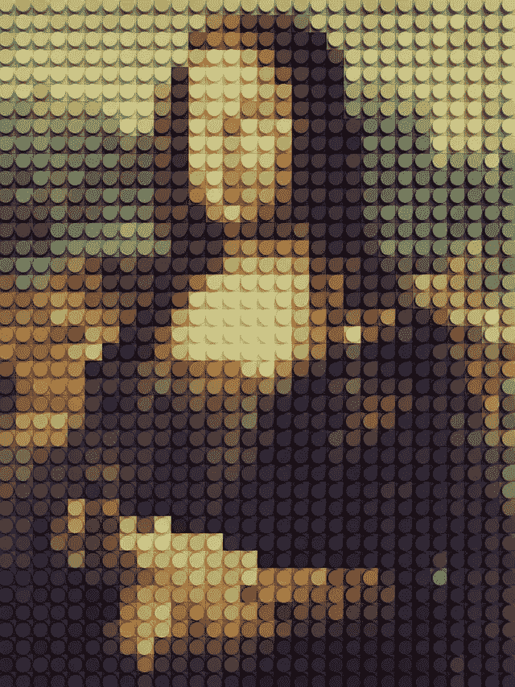

由 [Vadim Bogulov](https://unsplash.com/@franku84?utm_source=unsplash&utm_medium=referral&utm_content=creditCopyText) 在 [Unsplash](https://unsplash.com/s/photos/lego?utm_source=unsplash&utm_medium=referral&utm_content=creditCopyText) 上拍摄的照片

用于去噪、锐化、边缘检测的图像矩阵的细化主要涉及与滤波器/核矩阵的卷积运算。[卷积操作](http://www.songho.ca/dsp/convolution/convolution2d_example.html)包括首先水平和垂直翻转 2D 滤波器(内核),随后是图像矩阵**的逐元素乘法和加法。**注意，在对称核矩阵的情况下，翻转是不必要的。

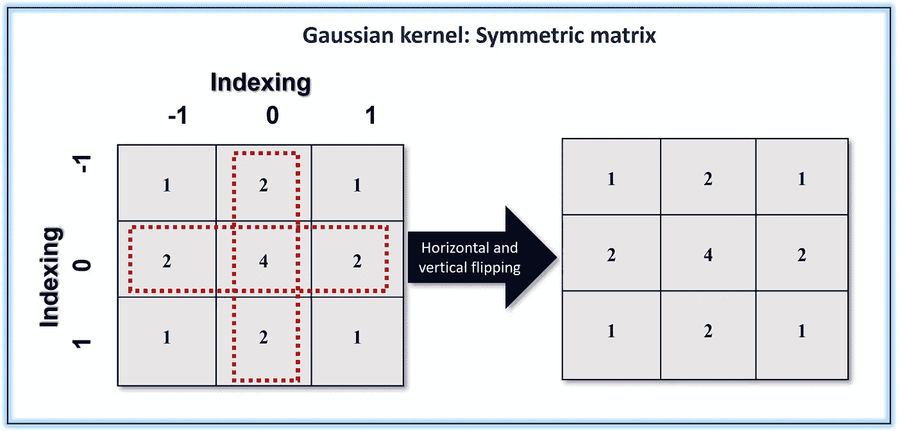

作者图片

这里，我将考虑两个滤波器- **高斯**和**中值**，分别用于显示与卷积相关和不相关的图像中的**噪声降低**。

线性高斯滤波器通过卷积对图像矩阵进行操作。属性“sigma”是高斯滤波器中的标准偏差。sigma 值越高，越模糊。

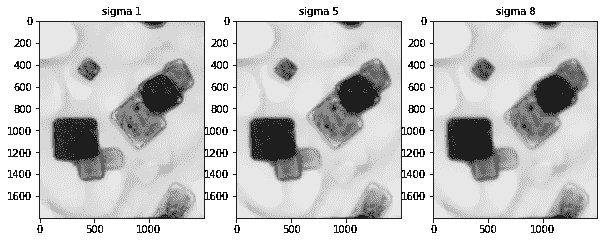

高斯模糊随着西格玛而增加

中值滤波是一个非线性过程。当滤波器窗口沿图像矩阵滑动时，所述矩阵的中值像素值作为输出信号。为了更好地理解，示出了图形表示。

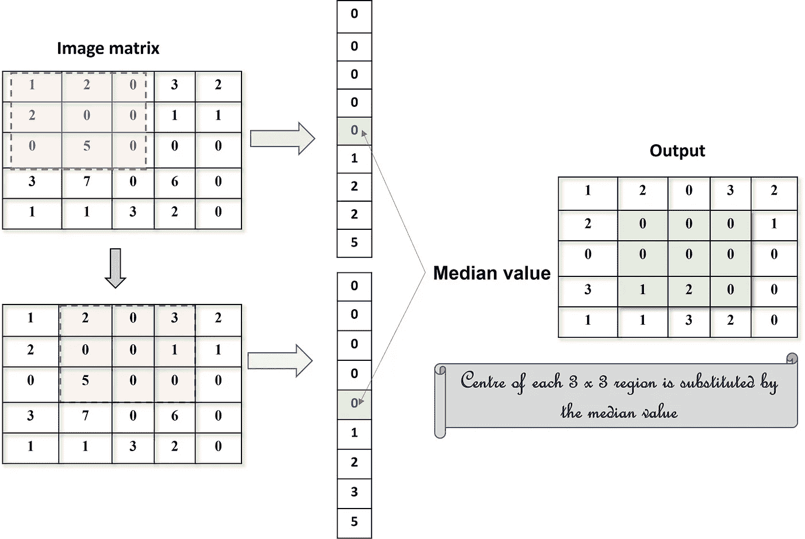

作者图片:中值过滤器的图形表示

在移除诸如盐和胡椒类型的电子噪声时，该滤波器优于高斯滤波器。虽然高斯平滑会导致边缘模糊，但中值平滑会保留边缘。

与去噪相反，我们可以使用 skimage 的*“滤镜模块”*的“*反锐化掩模”*功能**锐化散焦或模糊的图像**以准确识别其中的特征。下面显示了代码片段以及输入(散焦图像)和输出(锐化)图像，以供比较。

```
Sharpimg = filters.unsharp_mask(p, radius = 20.0, amount = 1.0)fig, ax = plt.subplots(nrows =1, ncols =2, sharex = True, figsize =(15,15))ax[0].imshow(p, cmap = 'gray')
ax[0].set_title("Original", fontsize = 10)
ax[1].imshow(Sharpimg, cmap ='gray')
ax[1].set_title("Sharpened",fontsize = 10)
```

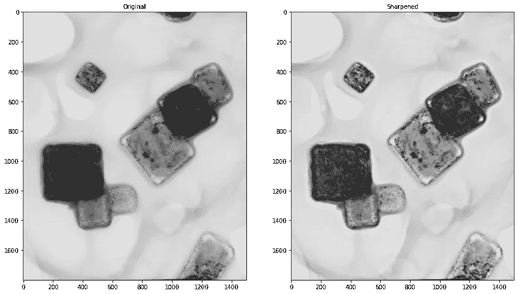

代码输出

有时，**调节亮度**也会使图像变得清晰，以便进行特征检测，这可以使用 skimage 的*“曝光模块”*的功能*“adjust _ gamma”*来完成。通过应用幂律变换获得伽马校正的输出图像。

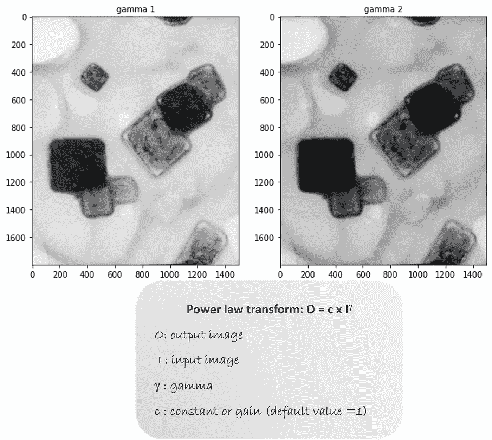

伽马校正显微照片

***图像分割阈值:生成二值图像***

**阈值处理**当我们需要根据像素强度将图像背景从前景中分离出来时，就需要用到阈值处理。例如，在[超合金](https://matmatch.com/learn/material/superalloys)(用于飞机喷气发动机、燃气轮机的材料)微观结构的情况下，背景是基底金属，前景由赋予这类材料超高强度的沉淀物组成。有时，背景可能只是用于装载样品以便在显微镜下进行研究的样品架。在这种情况下，用于阈值处理的图像显示了透射电子显微镜(TEM)网格/支架上的四角颗粒。应用不同类型的阈值方法来区分背景(TEM 网格)和粒子。对于给定的显微照片，我们发现均值阈值处理比其他方法做得更好，它清晰地形成了二值图像，如代码输出片段所示。

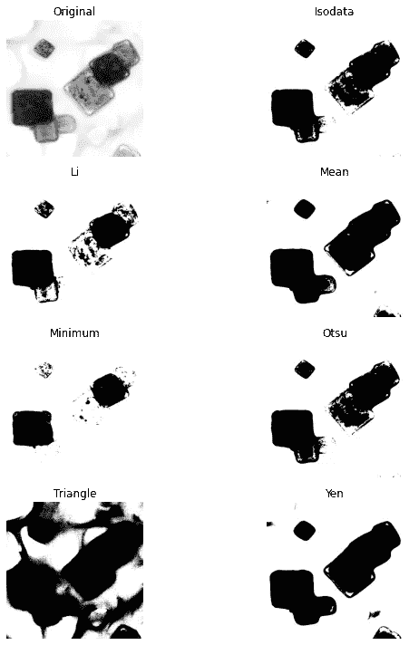

显示不同阈值方法的代码输出

上述方法是在对图像进行进一步处理以提取有意义的定性和定量特征之前，获得无噪声图像的一些初步步骤。正如本文开头提到的，粒度是控制材料性能的重要参数/特征之一。为了从图像中估计颗粒尺寸，我们需要生动地检测颗粒的边缘。并且使用各种边缘检测滤波器，该任务变得容易。在这里，我将讨论其中的几个。

***使用 Roberts、Sobel、Canny 滤波器进行边缘检测***

[**罗伯茨**](https://scikit-image.org/docs/dev/api/skimage.filters.html?highlight=roberts%20filter#skimage.filters.roberts) 和 [**索贝尔**](https://scikit-image.org/docs/dev/api/skimage.filters.html?highlight=sobel#skimage.filters.sobel) **滤波器**分别是 2×2 和 3×3 卷积核。这两种滤波器都具有用于水平和垂直边缘检测的 x 和 y 分量。Sobel 内核操作的代码片段以及相应的输出如下所示。

```
from skimage.filters import sobel,sobel_v, sobel_h
p_sobel = sobel(p_g, mode='reflect')
p_sobel_v=sobel_v(p_g)
p_sobel_h=sobel_h(p_g)
```

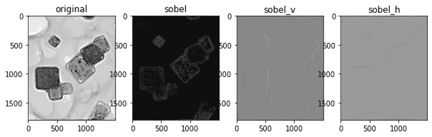

Sobel 过滤器:代码输出片段

[**Canny**](https://scikit-image.org/docs/dev/api/skimage.feature.html?highlight=canny#skimage.feature.canny) **滤波器**通过平滑、Sobel 算子的梯度近似、使用滞后阈值检测边缘来执行多任务工作。函数' *canny* '具有用于高斯平滑和高低阈值的 sigma 等参数。

***用于检测边缘方向的 Gabor 滤波器***

该线性过滤器捕捉微结构中特征的纹理或**取向分布。取向分布决定了材料性能的均匀性。颗粒/晶粒的随机取向导致均匀/各向同性性质，而特定方向的取向，技术上称为*优选取向*，导致各向异性性质。Gabor 滤波器的复正弦分量提供了与方向相关的信息。所述滤波器的输出具有实部和虚部。想了解更多关于 Gabor 滤镜的知识，请点击 [**这里**](http://ttsuchi.github.io/2015/08/26/gaborfilters.html) 。**

让我们尝试生成一组具有 0°、60°、90°和 120°取向的 [Gabor 滤波器](https://scikit-image.org/docs/dev/api/skimage.filters.html?highlight=gabor#skimage.filters.gabor)，并将它们应用于显示不同取向粒子的原始透射电子显微照片。我正在分享代码片段以及下面的输出过滤图像。我们可以清楚地看到各个过滤图像中的方向*(用与粒子边缘一致的黄色虚线突出显示)*。请注意，已过滤图像的实部会显示出来。

```
p_gabor =[]for degree in (0, 60, 90, 120):
    real,imag = filters.gabor(p, frequency=0.05, theta =(degree* (np.pi)/180))
p_gabor.append(real)
```

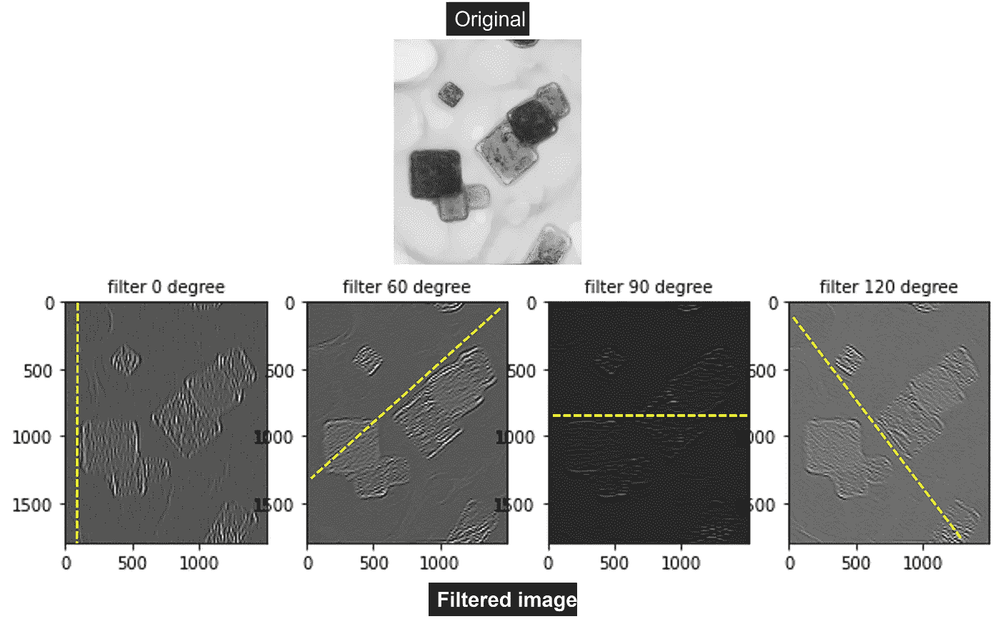

Gabor 滤波图像捕捉粒子的方向

我们也可以应用 Gabor 核来提取方向信息。生成一组不同方向的 Gabor 核，然后允许它们与图像矩阵交互，以解析相应方向的边缘，如下面的快照所示。

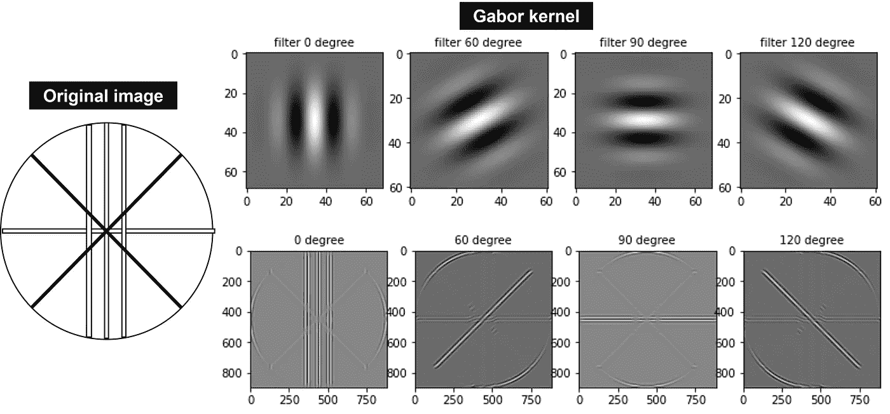

作者对原始图像进行了 Gabor 核处理

点击 [**这里**](https://github.com/Bjoyita/ImageProcessing) 从我的 GitHub 库中获取基本图像处理的完整代码。

**总结**

挖掘定性和定量特征是理解材料微观结构信息属性的关键。此外，来自生物成像的数据是医疗保健行业的支柱。因此，明智地处理这些显微照片是至关重要的。

尽管有几个商业图像处理软件，为同样的目的生成你自己的算法是有成本效益和灵活性的。最重要的是，它打开了通过机器学习实现自动化的大门。

在这篇文章中，我解释了一些定性提取信息的基本处理步骤，例如检测粒子边缘和方向。然而，从显微照片中提取完整的数据还需要对相关特征进行定量评估，这将在我的下一篇文章中讨论。

直到那时，快乐的图像处理！！