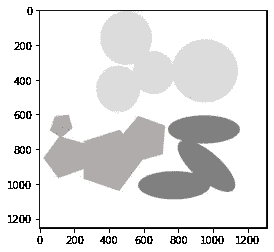
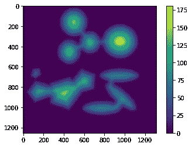
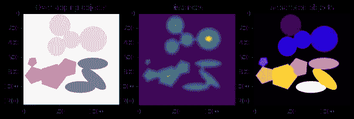
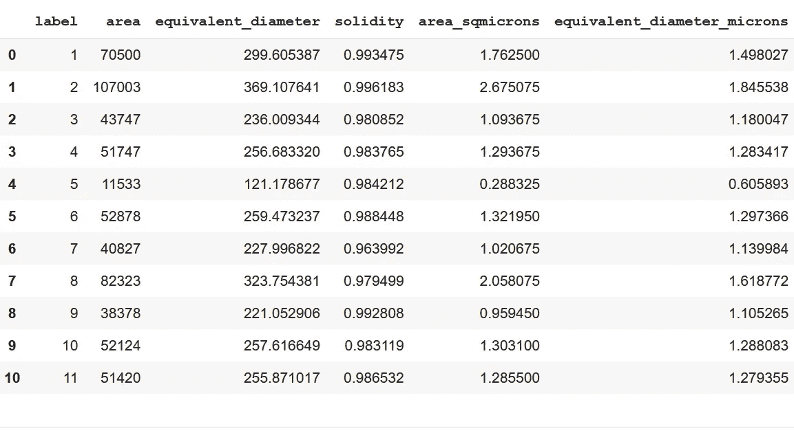
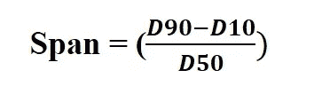
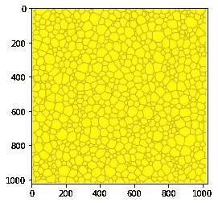
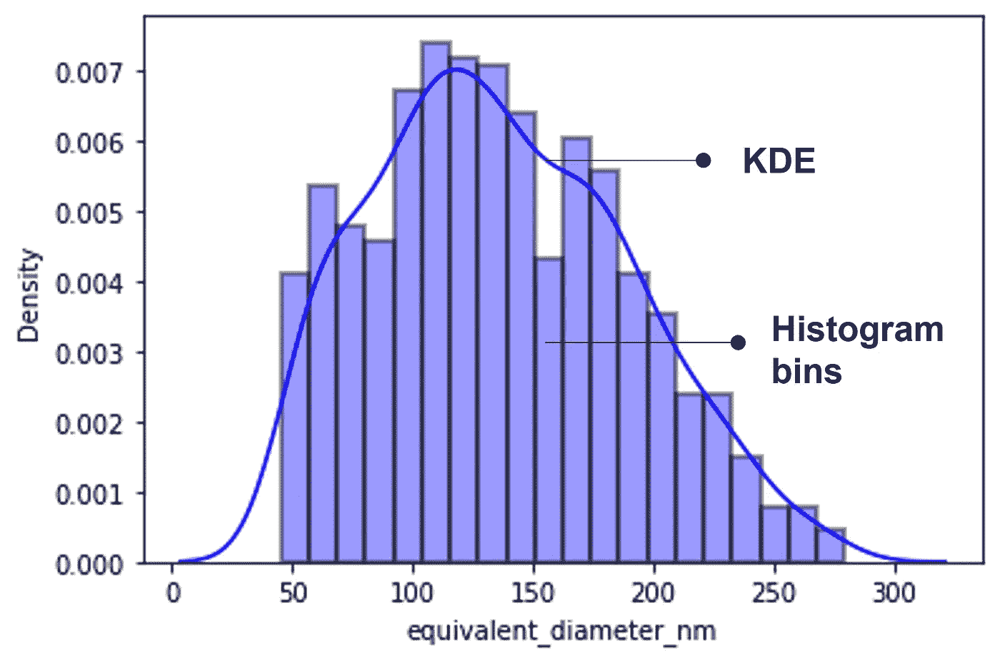

# 通过显微照片的图像处理挖掘材料数据:第二部分

> 原文：<https://towardsdatascience.com/materials-data-mining-via-image-processing-of-micrographs-part-ii-87e4807723fb>

## 从图像测量材料特性


斯文·米克在 [Unsplash](https://unsplash.com/s/photos/measurement?utm_source=unsplash&utm_medium=referral&utm_content=creditCopyText) 上的照片

*“一图胜千言。”—阿尔伯特·爱因斯坦*

**背景**

我的上一篇文章“通过显微照片的图像处理进行材料数据挖掘”解释了显微照片处理的一些基本和关键步骤。如前所述，显微照片捕捉材料的细微微米/亚微米尺寸特征，这些特征会显著影响材料的性能。在这里，我将讨论使用 [scikit-image 对一个这样的特征——“颗粒大小”的定量评估。](https://scikit-image.org/)

**参数测量**

**案例研究 1:应用分水岭算法从聚类中检索单个颗粒尺寸**


鲍里斯·巴尔丁格在 [Unsplash](https://unsplash.com/s/photos/basin?utm_source=unsplash&utm_medium=referral&utm_content=creditCopyText) 上拍摄的照片

让我先展示一张不同形状和大小的颗粒重叠在一起的合成显微照片。我们首先将单个粒子从簇/聚集体中分离出来。然后我们测量这些分离出来的粒子的大小。借助分水岭算法——一种图像分割方法——实现颗粒的解聚。我正在分享上述活动的一步一步的指南。

***第一步:导入必要的库并加载镜像***

```
**# IMPORTING LIBRARIES**
import numpy as np
import pandas as pd
import matplotlib.pyplot as plt
from scipy import ndimage as ndi
from skimage import io, color
from skimage.segmentation import watershed
from skimage.feature import peak_local_max**# LOADING IMAGE**im1 = io.imread("O3.jpg")
plt.imshow(im1, cmap ='gray')
```



作者图片:显示集群的合成显微照片

图像有几个粒子簇，它的维数用一个元组(1254，1313，3)表示。元组的前两个元素表示高度和宽度，第三个元素告诉我们通道的数量(颜色的数量)。该图像是具有三个通道/颜色的 RGB 图像。

***第二步:转换成灰度图像***

我已经应用了从 skimage 的颜色模块导入的函数 rgb2gray 来将 rgb 图像转换为灰度。

***第三步:阈值化得到二值图像***

在使用 try_all_threshold 函数对该图像进行其他阈值方法处理之后，发现平均阈值方法最适合于该图像。

***第四步:计算欧氏距离变换***

[欧几里德距离](https://en.wikipedia.org/wiki/Euclidean_distance)是图像中任意两个像素之间最近距离的度量。图像的每个像素被分类为源/背景像素(具有零强度)或目标像素(具有非零强度)。我们观察到从任何物体的中心到背景的欧几里得距离有一个递减的梯度。从图像中获得的距离图很好地捕捉到了这一点:



距离地图

***第五步:寻找局部峰值和分水岭线***

从地理上来说，分水岭是分隔流域的高地。我们将相同的概念应用于粒子/对象集群的图像分割。在这种情况下，簇中单个对象边界的像素强度构成分水岭，将它们彼此分开。

我们首先通过应用函数 peak_local_max 来定位粒子的峰值(局部最大值)的坐标。我们使用该函数的输出作为[分水岭函数](https://scikit-image.org/docs/dev/api/skimage.segmentation.html?highlight=watershed#skimage.segmentation.watershed)中的标记。我们为图像中的每个粒子标记这些标记。这些标记构成了将单个颗粒从聚集体中分离出来的分水岭。该任务的代码片段如下所示。

```
coords = peak_local_max(distance, min_distance =100)
mask = np.zeros(distance.shape, dtype=bool)
mask[tuple(coords.T)] = True
markers,_= ndi.label(mask)
```

***第六步:应用分水岭算法进行图像分割***

最后，应用具有诸如反距离变换图像、标记和掩模(二值图像)的参数的分水岭算法，我们获得分离的粒子。通过应用 matplotlib 颜色图，簇中这些粒子的个性以不同的颜色显示。

```
individual_particles = watershed(-distance, markers, mask=binary)
```



显示原始图像、距离图和分段图像的代码输出(应用分水岭功能后)

**案例研究 2:特性测量——粒度和粒度分布**

让我们继续上面的图片，我们应用分水岭算法来分离粒子和簇。我们现在开始测量颗粒尺寸。

**图像中比例因子的作用**

在详细讨论特征/参数值的计算之前，我们需要理解图像中的“**比例**的概念。任何图像中的比例因子给出了对象/特征的度量的概念。数字图像由称为像素的小点组成。像素的大小决定了用来拍照的仪器的分辨率。

根据在图像中捕获的实际物理对象的尺寸，在任何图像上提供代表以千米/厘米/毫米/微米/纳米为单位的特定值的几个像素的刻度线或条。例如，谷歌地图有一个以英里或公里为单位的比例尺。相反，显微照片具有微米/纳米的比例尺，因为它们捕捉材料的小长度尺度特征。

没有比例尺是不可能测量图像的特征的。因此，具有可量化特征的图像应该总是包含比例尺。

***尺寸测量使用***[***region props***](https://scikit-image.org/docs/dev/api/skimage.measure.html#skimage.measure.regionprops)***skimage . measure 模块*** 功能

将 regionprops 函数应用于标记图像区域的测量代码如下所示。

```
from skimage.measure import label, regionprops, regionprops_table
label_img = label(individual_particles, connectivity = im2.ndim)props=regionprops(label_img, im2)for p in props:
display('label: {} area: {}'.format(p.label, p.area))
props_t = regionprops_table(label_img, im2, properties='label','area', 'equivalent_diameter','solidity'])df = pd.DataFrame(props_t)
```

使用 regionprops_table 函数将面积、等效直径和实度等属性制成与 pandas 兼容的表格。考虑每像素 0.005 微米的标度来计算颗粒的尺寸。



显示颗粒大小的代码输出

当显微照片中有不同尺寸的颗粒时，参数“颗粒尺寸分布”变得很重要。所有现实世界的物质都包含无数的粒子(比如[多晶](https://en.wikipedia.org/wiki/Crystallite)金属)。显微照片只捕捉到材料的一小部分代表性区域。正如本文开头提到的，颗粒大小决定了材料的几个重要属性。

现在，问题是应该考虑平均颗粒尺寸还是整个颗粒尺寸分布。平均粒度是指粒度均匀的材料，而 PSD 是粒度在一定范围内变化的材料的重要参数。

显示 D10、D50 和 D90 百分位的粒度分布图提供了大量信息，并被用作理解材料性能的指南。此外，它通过计算如下定义的“跨度”告诉我们参数的一致性。



较小的跨度值表示颗粒尺寸更加一致。另一方面，较大的跨度值意味着分布的异质性。

我已经采取了下面的模拟图像，以显示颗粒大小分布的计算。



作者图片:模拟图片

这张图片显示了大量大小不同、分离良好的单个颗粒。因为在这个图像中没有粒子群，所以应用分水岭函数的步骤是不相关的。首先，我们将此图像转换为灰度，然后进行阈值处理。然后，我们将 label 函数应用于二进制图像，生成一个带标签的图像(如下所示),用不同的颜色显示不同大小的粒子。


标签图像

应用每像素 4 纳米的标度来计算代表颗粒尺寸的**当量直径。*注意，等效直径是与区域面积相同的圆的直径。*我们使用 regionprops 和 regionprops_table 直接计算并列出所需的属性。然后，该表格被导出为电子表格文件。使用 Numpy 的百分位数函数，我们获得了统计参数— D10、D50 和 D90 百分位数。因此，估计大约等于 1 的跨度，这表明模拟图像的粒子尺寸不均匀。注意，跨度越接近零表示 PSD 越一致。**

***粒度分布可视化***

我使用了[**Seaborn**](https://seaborn.pydata.org/)——一个统计数据可视化库，使用 *distplot 函数*绘制颗粒尺寸分布。该函数结合了直方图和核密度估计(KDE)函数。下图显示了模拟图像的粒度分布图。



粒度分布图

**代码:**请[**点击**](https://github.com/Bjoyita/ImageProcessing) 这里可以从我的 Github 库中获取代码。

**总结**

定量估计是图像数据处理的基本部分，因为它有助于决策。**在图像中定义比例尺**对于特征的量化是强制性的。此外，在定量分析之前，图像需要经历一组细化步骤。

在这篇文章中，我通过拍摄两张图像来说明上述观点，目的是挖掘颗粒尺寸数据。我演示了一个额外的预处理步骤的必要性，即应用分水岭函数来分离第一幅图像**中有重叠颗粒的颗粒，以进行尺寸计算。**否则我们会得到大小不同的粒子群。这将完全误导对材料属性的相同解释。

这篇文章的另一个亮点是描述了颗粒尺寸分布的**意义，而不是包含不同尺寸**颗粒的系统(图片)的单一平均值。PSD 是具有结构异质性的材料**(例如多晶材料)**的重要量化指标。****

我希望这篇文章将有助于从图像中计算可测量的参数，这些参数可以作为预测算法的输入。

感谢阅读！