# 每个数据科学家都应该知道的数学优化试探法

> 原文：<https://towardsdatascience.com/mathematical-optimization-heuristics-every-data-scientist-should-know-b26de0bd43e6>

寻找最佳解决方案(在最高的顶端)。图片由 Dall-E 2 提供。

## 本地搜索、遗传算法等等

解决数学优化问题有许多不同的方法。您可以使用贪婪算法、约束编程、混合整数编程、遗传算法、局部搜索等等。根据问题的大小和类型，以及期望的解决方案质量，一种技术可能比另一种更好。

这篇文章概述了解决离散优化问题的不同启发式方法。首先，我解释了用数学方法描述优化问题所需的三个要素。然后，我将给出一些常见的和性能良好的搜索试探法的解释。

# 最优化问题

这里有一个简短的数学优化复习。为了从数学上定义一个优化问题，你需要以下三个组成部分:*决策变量*、*约束*和*目标*。

让我们看一个简单的例子。你是一个小邮局，你每投递一个包裹就赚不同的钱。送货车的空间有限。投递部门希望在每一轮投递中投递尽可能高的总价值。你应该递送哪些包裹？

图片作者。

## 决策变量

决策变量可以取不同的值。目标是找到决策变量的最佳值。最好的价值观是什么？这取决于目标和约束条件。在投递后的例子中，每个包裹都有一个二元决策变量。如果不传递包，则变量为 0，如果传递包，则变量为 1。

## 限制

约束是不允许的事情或界限，通过正确设置它们，你肯定会找到一个在现实生活中可以实际使用的解决方案。投递后的例子中的一个约束:你不能投递所有的包裹，因为投递车的空间有限。如果货车的最大空间等于 600，您应该添加一个约束，以确保所选的包不会超过此限制。

## 目标

目标是你在最优化问题中的目标，这是你想要最大化或最小化的。投递局的目标是选择最有价值的包裹进行投递。在目标中，您希望最大化所选包的总价值。

以下是该示例的完整描述:

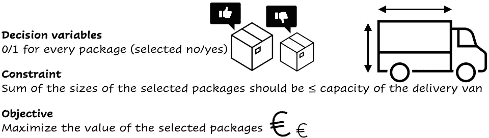

问题的数学描述。图片作者。

如果一个问题是明确定义的(即存在一个可行解)，那么对于优化问题总是存在至少一个最优解。很难找到这些最优解决方案中的一个，尤其是当问题很大很复杂的时候。并不是这篇文章中讨论的所有技术都能保证找到最佳解决方案。但是，如果您将它们正确地应用于大型问题，它们会比使用约束或混合整数编程技术的解决方案更快。

# 优化技术

有不同的试探法可以用来解决优化问题。在这里，我将解释其中的一些。

我假设你已经熟悉蛮力，即尝试所有可能的解决方案并跟踪最佳方案。另一个你可能知道的技术是动态编程，在这里问题被分解成更小的子问题。如果你不熟悉动态编程和暴力破解，[这篇文章](/choosing-fast-with-dynamic-programming-b6916da543f4)解释了它们。当你的问题很小时，蛮力和动态编程完全可以使用。当问题越来越大时，他们将花费太多的时间并且效率低下。蛮力和动态编程不是启发式的，因为它们不会减少搜索空间。您可以通过系统地测试一个较小的解决方案子集的所有可能的解决方案(蛮力),决定将蛮力与局部搜索或遗传算法结合起来。

## 贪婪算法

要解决投递局问题，一个简单的方法是从贪婪算法开始。他们给出了一个基准，并很快提供解决方案。greedy 背后的想法是，你选择一个包裹，直到送货车装满。你不选择任何包，但你可以从最有价值的包开始。你继续这样做，直到货车装满。假设货车的最大载客量为 60，以下是我们将选择的包装:

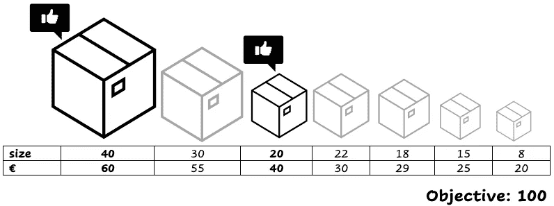

贪婪选择:最高值。图片作者。

还有其他方法来决定下一个套餐。通过将每个包装的价值和尺寸相除，可以得到每个包装的每个尺寸单位的价值。你可以把它描述为价值密度。通过选择每尺寸单位价值最高的包装，有可能提出更好的解决方案。

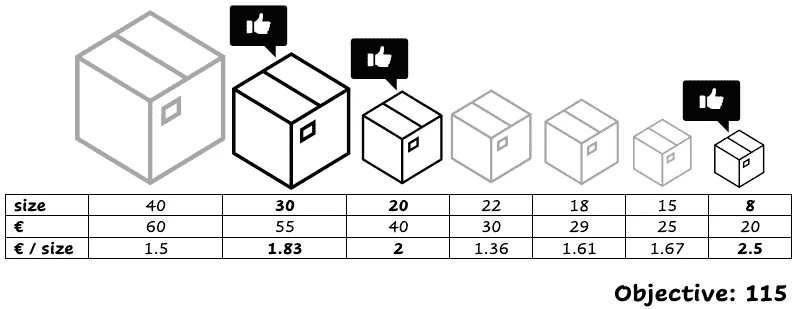

贪婪选择:每尺寸单位的最高值。图片作者。

贪婪的一个优点是速度快。但是对于更复杂的问题，在大多数情况下，解决方案远非最优。

## 本地搜索

下一个技巧很有趣。本地搜索非常直观。它是这样运作的:你从一个解决方案开始，你要通过局部行动来改进这个解决方案。这意味着你对当前的解决方案做了一点小小的改动，从而提高了目标。您继续应用局部移动，直到没有更多的移动可以提高目标。

让我们再来看看交货的例子。我们可以从一个解决方案开始:

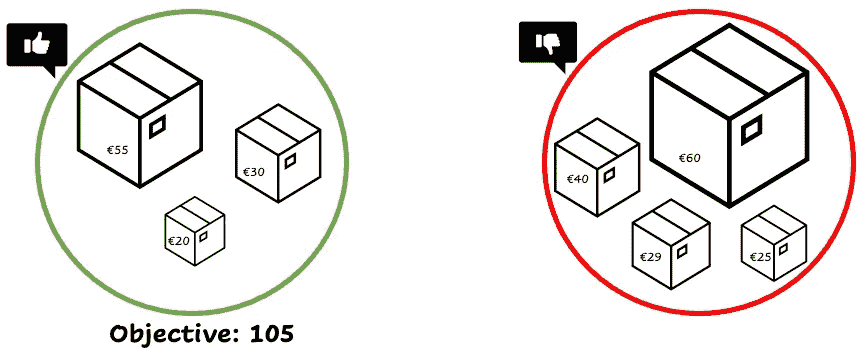

左边是本地搜索开始解决方案，右边是其他包。图片作者。

局部移动可以是将选定的包与未选定的包交换。我们密切关注容量限制，并努力满足每次本地搬迁的需求。移动的一个例子可能是:

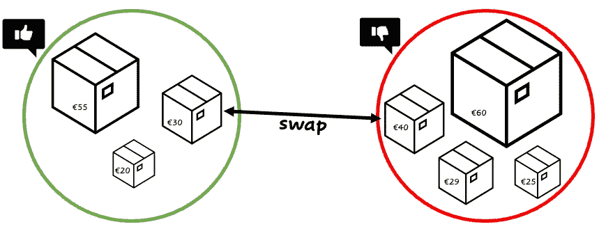

局部移动:交换两个包来增加目标。图片作者。

移动后，新的目标值为 115。我们从选择中删除具有较低值的包，并添加具有较高值的包，同时仍然有一个可行的解决方案。

通过应用一个局部移动，你可以达到的所有可能的解决方案被称为当前解决方案的*邻域*。

你不能超过货车的容量限制。所以在这种情况下，如果一个包比其他任何包都大，即使价值很高，我们也绝不会选择这个包！

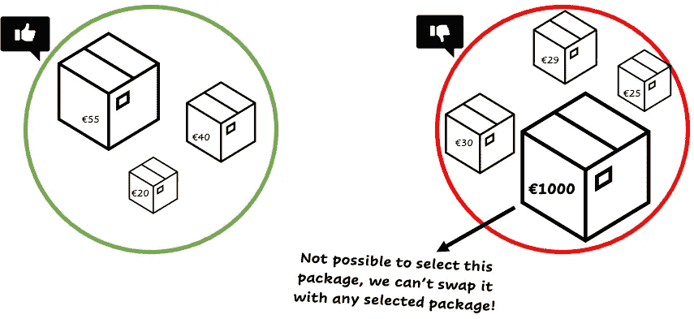

陷入局部最优。图片作者。

这是本地搜索的一个缺点。你可能会陷入局部最优:

局部最优。图片作者。

有办法克服这个问题。你可以选择一次交换多个包，使之等同于一次移动。通过这样做，你的邻居增加了，你可以找到更多的解决方案。

你也可以决定从多个解决方案开始，而不是一个。然后对每个解重复交换过程，这被称为*迭代局部搜索*。

另一种方法是选择以一定概率使目标变得更糟的行动:

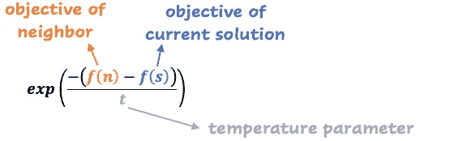

降低目标值时选择包的概率。图片作者。

如果温度参数很大，接受降级移动的可能性很高。如果温度小，这个几率就低。*模拟退火*就是利用了这个概率。它从高温开始，然后逐渐降低。这意味着，在开始的时候，你是在执行一个随机的解决方案。当温度降低时，搜索变成局部的。模拟退火在硬基准测试中表现出色。

禁忌搜索是我想提到的最后一种避免局部最优的技术。禁忌搜索的想法是跟踪你已经访问过的解决方案。不允许再回到他们身边。将所有以前的解决方案保存在内存中的成本会很高。相反，您可以决定存储转换或保持固定大小的禁忌列表。

可以结合迭代局部搜索、模拟退火和禁忌搜索等技术。

## 遗传算法

你也可以决定使用遗传算法。遗传算法的核心思想是反映自然选择的过程。解决问题的方法叫做个体。首先，从生成初始种群开始。这个群体是由个体组成的。然后，你计算每一个人的适应度。您可以将适应度函数与目标进行比较。最适合的个体(他们有最好的客观价值)被选择出来进行繁殖，以便产生后代。

对于我们的递送示例，每个包裹都是一个基因，其值可以是 0 或 1。我们有四个人的初始群体看起来像这样:

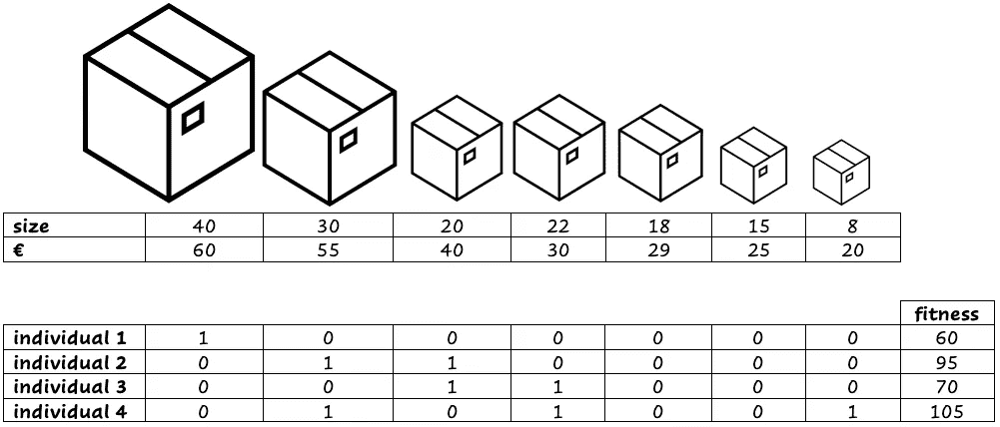

遗传算法的初始种群(4 个个体)。图片作者。

现在我们选择最适合的个体(最高的客观价值)来产生后代。在我们的例子中，个体 2 和 4 具有最高的适合度值。有不同的方法可以产生后代，一种常见的方法是随机选择一个交叉点，交换基因直到这个交叉点。

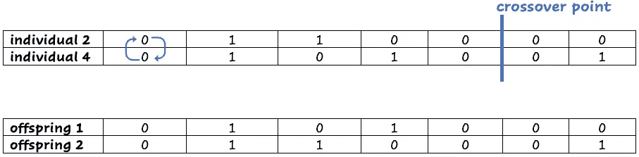

交叉:交换最佳个体的基因，直到交叉点。图片作者。

下一步是突变。我们以较低的随机概率翻转一些基因，在我们的情况下，让我们取 0.14 (1 除以 7，7 是包装的数量)。这是重要的一步，因为我们希望保持多样性，防止过早趋同。我们将变异后代 1:

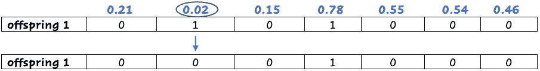

突变:将一个基因按一定概率从 0 -> 1 或 1 -> 0 进行切换。图片作者。

现在，我们将计算新个体的适应度。人口数量是固定的。具有最低适应值的个体死亡。

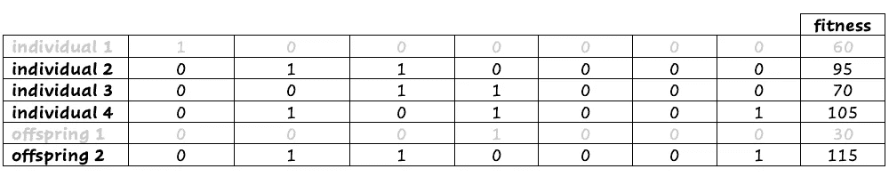

加上后代，适应值最低的个体死亡。图片作者。

下面是完整的算法:

1.  创建初始种群。
2.  重复直到收敛:
    - **选择**中最适者的个体。
    -选择一个**交叉**点创建后代。
    - **突变**基因。
    -计算适应度，一些个体死亡。

使用遗传算法，也有可能陷入局部最优。有多种方法可以克服这一点。您可以创建初始群体的子集，并在选择阶段进行随机化。这可以防止在选择过程中反复使用相同的群体。另一种避免局部极小值的方法是给存活时间更长的个体和/或比其他个体更独特的个体额外的奖励，因为他们可以帮助找到一个通用的解决方案。

## 混合技术

这里讨论的快速找到高质量解决方案的最后一种方法是通过组合不同的技术。

一个例子是*大邻域搜索*，其中局部搜索与约束规划(CP)或混合整数规划(MIP)相结合。CP 和 MIP 的缺点是它们在处理大型问题时会遇到困难，并且需要大量时间来获得最优解。通过将本地搜索与 CP 或 MIP 相结合，你就拥有了两个世界的精华。你可以用 CP 或 MIP 解决小的子问题，用局部搜索选择一个新的子问题。

*大型小区搜索*的步骤是:

1.  从问题的可行解决方案开始。你可以使用任何你喜欢的技术找到解决方法。
2.  重复直到满足一个标准:
    -选择一个邻域(问题的一部分)。
    -优化这个子问题(用 CP 或 MIP)。

在求解过程中，你会跟踪最佳解。例如，可以通过固定一组变量来定义邻域。

混合方法的另一个例子是 *memetic 算法*。模因算法结合了遗传算法和局部搜索。

以混合方式结合多种“工具”。由[猎人哈利](https://unsplash.com/@hnhmarketing?utm_source=medium&utm_medium=referral)在 [Unsplash](https://unsplash.com?utm_source=medium&utm_medium=referral) 上拍摄的照片

# 结论

在这篇文章中，你已经看到了不同的启发式方法来解决数学优化问题。希望你能通过局部搜索、遗传算法或混合方法快速找到优化问题的解决方案！还有其他有趣的和性能良好的搜索试探法，如粒子群优化，蚁群优化和随机隧道。

## 有关系的

</four-ways-to-combine-mathematical-optimization-and-machine-learning-8cb874276254>  </how-to-handle-optimization-problems-daf97b3c248c>  </choosing-fast-with-dynamic-programming-b6916da543f4> 