# Matplotlib vs. Plotly:让我们决定一劳永逸

> 原文：<https://towardsdatascience.com/matplotlib-vs-plotly-lets-decide-once-and-for-all-dc3eca9aa011>

## 从 7 个关键方面进行深入快速的比较

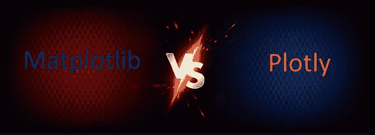

作者的愚蠢形象

足球迷有一个令人讨厌的习惯。每当一名年轻但公认杰出的球员出现时，他们都会将他与梅西或罗纳尔多等传奇人物相提并论。他们选择忘记那些传奇人物在新手长出牙齿之前就已经统治了这项运动。将 Plotly 与 Matplotlib 进行比较，从某种意义上来说，类似于开始时的情况。

Matplotlib 从 2003 年开始被大量使用，而 Plotly 在 2014 年才刚刚问世。

此时许多人已经厌倦了 Matplotlib，所以 Plotly 因其新鲜感和交互性而受到热烈欢迎。尽管如此，该库不能指望从 Matplotlib 那里夺取 Python 绘图包之王的头把交椅。

2019 年，当 Plotly 在 7 月发布其 [Express API](https://towardsdev.com/comprehensive-guide-to-plotly-express-in-python-the-hottest-graphing-library-e42e911a56c8?source=your_stories_page-------------------------------------) 时，事情发生了巨大的变化。这激发了人们对图书馆的兴趣，人们开始到处使用它。

随着另一个主要版本(5.0.0)于去年 6 月发布，我认为 Plotly 已经足够成熟，可以与 Matplotlib 相提并论。

说完这些，我们开始吧:

**自定义函数来绘制分数。完整的功能体可以在我创建的**[**GitHub gist**](https://gist.github.com/ibexorigin/44d47dfd30f083b27d041f6b1a6a3bd8)**上看到。**

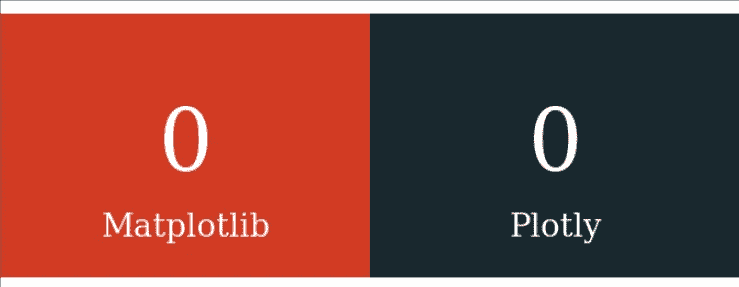[](https://ibexorigin.medium.com/membership)  

获得由强大的 AI-Alpha 信号选择和总结的最佳和最新的 ML 和 AI 论文:

[](https://alphasignal.ai/?referrer=Bex)  

# 1.API 可用性

让我们从比较它们的 API 的易用性开始。两者都提供高级和低级接口来与核心功能交互。

## 1.1 高级 API 的一致性(Pyplot 与 Express)

一方面，Plotly Express 在一致性方面表现出色。它只包含访问内置图的高级功能。它没有引入执行现有功能的新方法，而是一个包装器。所有对 Express 的 plot 调用都返回核心人物对象。

另一方面，PyPlot 接口将所有绘图功能和定制打包到一个新的 API 中。即使绘图调用具有相同的签名，定制功能也不同于 Matplotlib 的面向对象 API 中的功能。

这意味着如果你想切换界面，你必须花时间去了解它们的区别。

此外，在 Matplotlib 中创建 plots 会返回不同的对象。例如，`plt.scatter`返回一个`PathCollection`对象，而`plt.boxplot`返回一个字典。这是因为 Matplotlib 为每个绘图类型实现了不同的基类。对许多人来说，这确实令人困惑。

```
plot_scores(mpl=0, px=1)
```

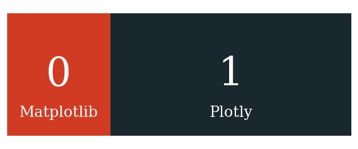

## 1.2 在 API 之间切换所需的代码量

要从 PyPlot 切换到 Matplotlib 的 OOP API，只需改变与核心数据结构的交互方式，比如`figure`和`axes`对象。对图的调用具有相似的签名，并且参数名称不会改变。

从 Plotly Express 切换到 Plotly Graph Objects (GO)需要一个陡峭的学习曲线。创建所有绘图的函数签名发生了变化，GO 为每个绘图调用添加了更多的参数。尽管这样做是为了引入更多的定制，但我认为情节最终会异常复杂。

另一个缺点是 GO 将一些核心参数移到了情节调用之外。例如，可以在 Plotly Express 中的绘图内直接创建对数轴。在 GO 中，您可以使用`update_layout`或`update_axes`功能来实现这一点。而 Matplotlib 的 PyPlot 或者 OOP API 就不是这样(参数不移动也不改名字)。

```
plot_scores(mpl=1, px=1)
```

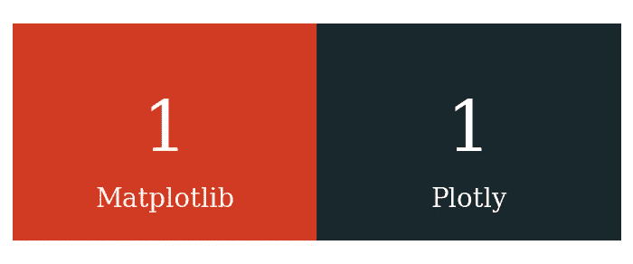

## 1.3 定制 API

尽管有一个单独的关于定制的章节，但是我们必须从 API 的角度来讨论它。

Matplotlib 中的所有定制都有独立的功能。这允许你以代码块的形式改变情节，并使用循环或其他程序。

相比之下，Plotly 广泛使用字典。虽然这为您与图和数据的交互提供了一定的一致性，但它以代码可读性和长度为代价。由于许多人更喜欢`update_layout`函数，它的参数经常以一大堆嵌套字典结束。

您可能会停下来思考这些 API 之间的差异，但是 Matplotlib 的 API 更 Pythonic 化，可读性更好。

```
plot_scores(2, 1)
```

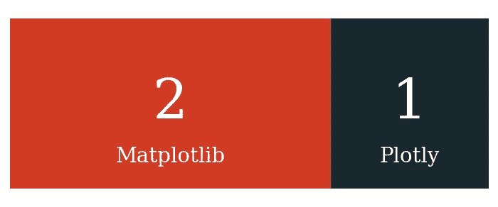

# 2.速度

要了解速度之间的真正差异，我们必须使用更大的数据集。我将从 Seaborn 导入钻石数据集，并比较创建简单散点图所需的时间。

我将使用`%%timeit` magic 命令，该命令多次运行相同的代码块来查看标准偏差误差。

测量 Matplotlib:

绘图测量:

Matplotlib 几乎比 Plotly 快 80 倍，SD 误差更低。可能这是因为 Plotly 渲染了交互剧情。让我们再次检查速度，这次关闭交互性:

不幸的是，关闭交互性并没有多大帮助。Matplotlib 在速度上碾压 Plotly:

```
plot_scores(3, 1)
```

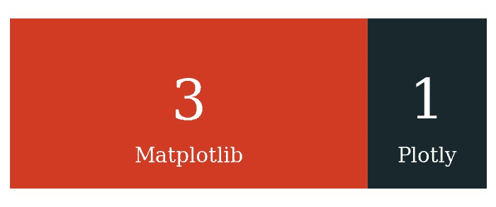

# 3.支持的绘图类型数量

在这一领域，Plotly 处于领先地位。从 Plotly API 参考中，我数出了近 50 个独特的图。尤其是，Plotly 是一流的，当谈到某些类型的图表。

例如，它专门支持财务绘图，并提供了`figure_factory`子包来创建更复杂的自定义图表。

另一方面，Matplotlib 有适度的情节选择。我不认为他们会与 Plotly 提供的丰富选择相匹配，即使我们添加了 Seaborn 的情节:

```
plot_scores(3, 2)
```

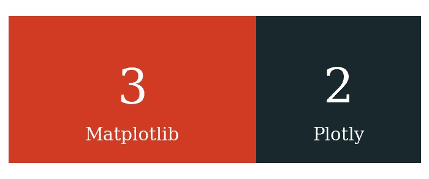

# 4.交互性

嗯，如果只有 Plotly 有这个功能，怎么比较交互性呢？

没有多少人知道这一点，但在 Jupyter 笔记本之外，默认情况下，Matplotlib 绘图以交互模式呈现。

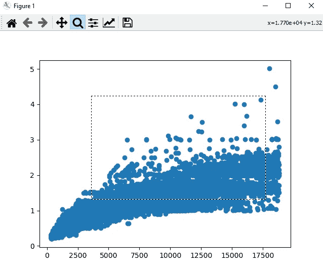

作者截图

不幸的是，这种程度的交互性与 Plotly 相比根本不算什么。所以，让我们把普洛特利的分数提高一分:

```
plot_scores(3, 3)
```

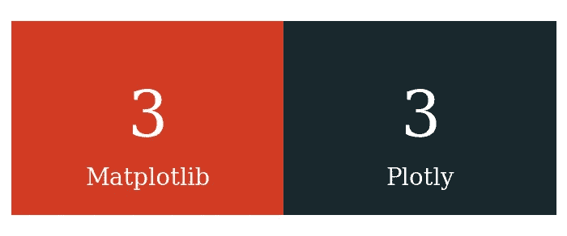

现在，对于决胜局——除了一般的交互性，Plotly 还提供了自定义按钮:

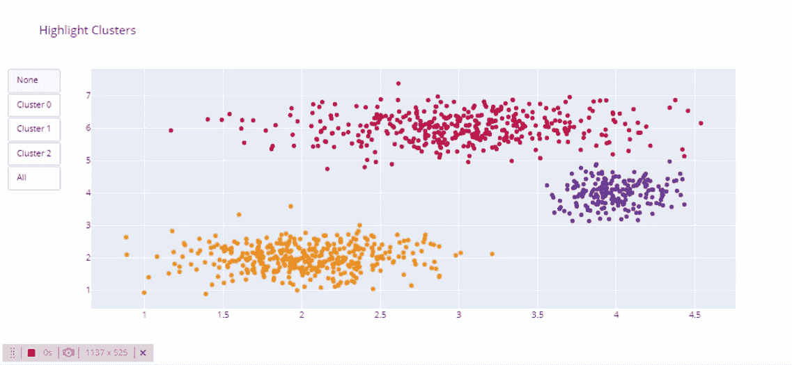

滑块:

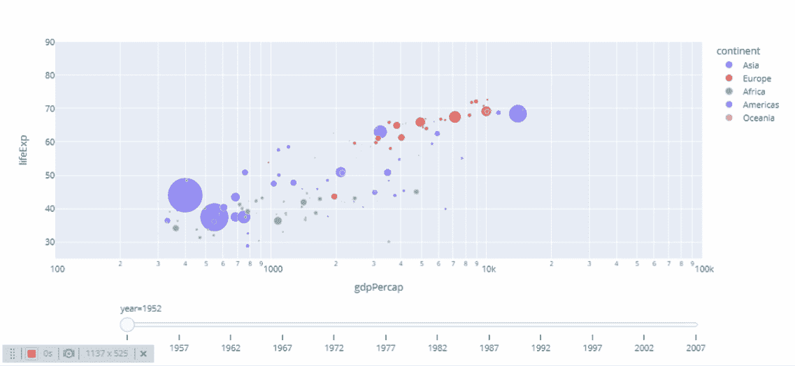

以及更多将整体用户体验提升到更高水平的功能。这值得再提一点:

```
plot_scores(3, 4)
```

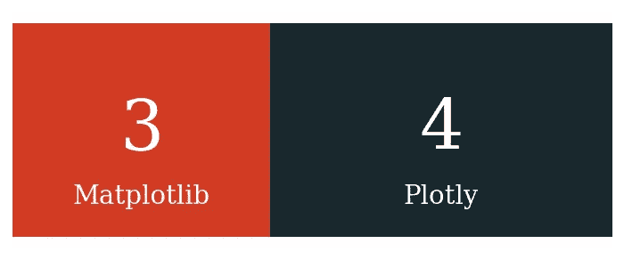

# 5.自定义

对于许多数据科学家来说，定制就是一切。您可能希望根据您的项目数据创建自定义主题并使用品牌颜色(一个很好的例子可以在这里的[看到](https://www.kaggle.com/joshuaswords/netflix-data-visualization)用于可视化网飞数据)。

也就是说，让我们看看您可以优化的最重要的组件以及它们在包之间的差异。

## 5.1 颜色和调色板

Matplotlib 和 Plotly 都有专门的颜色和调色板子模块。

Matplotlib 允许用户使用颜色标签、十六进制代码、RGB 和 RGBA 系统来更改绘图元素的颜色。最值得注意的是，在`mpl.colors.CSS4_COLORS`下，可以通过 100 多个 CSS 颜色标签。

Plotly 确实实现了相同的功能，但是 Matplotlib 提供了来自其他绘图软件如 Tableau 的颜色。此外，在 Matplotlib 中传递颜色和调色板不会造成混乱。

在 Plotly 中，至少有六个参数处理不同的调色板。相比之下，MPL 只有两个灵活的参数`color`和`cmap`，可以适应您传递的任何颜色系统或调色板。

```
plot_scores(4, 4)
```

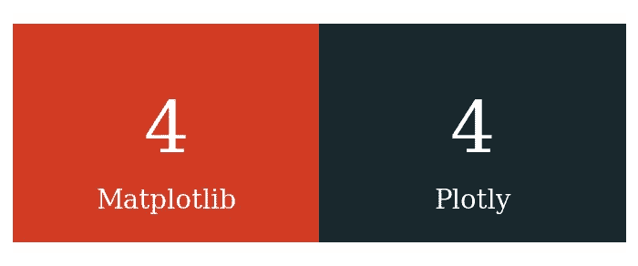

## 5.2 默认样式

在临时分析期间，不需要超出默认设置。这些类型的分析通常会持续很长时间，因此这些默认设置必须能够即时生成尽可能高质量的图表。

我想我们所有人都同意 Matplotlib 默认，嗯，真糟糕。看看这两个图书馆创建的奥运会运动员身高体重散点图:

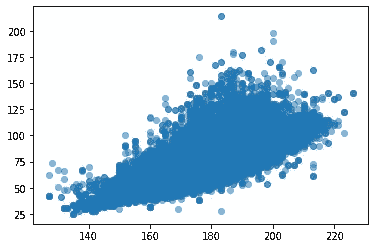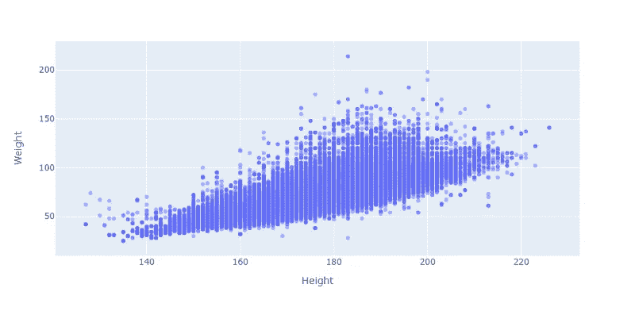

普洛特利的看起来更好。

此外，我喜欢 Plotly 坚持数据可视化最佳实践的方式，比如只在必要时使用额外的颜色。

例如，当创建条形图或箱线图时，Plotly 使用统一的颜色而不是调色板。Matplotlib 做的正好相反，它给每个条形图或箱线图着色，即使这种颜色没有给图添加新的信息。

```
plot_scores(4, 5)
```

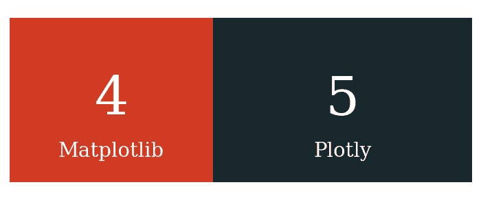

## 5.3 主题

Plotly 采取这一部分仅仅是因为它有神奇的“黑暗模式”(叫我主观，我不在乎)。它看起来更舒服，给情节一种奢华的感觉(尤其是和我最喜欢的红色搭配的时候):

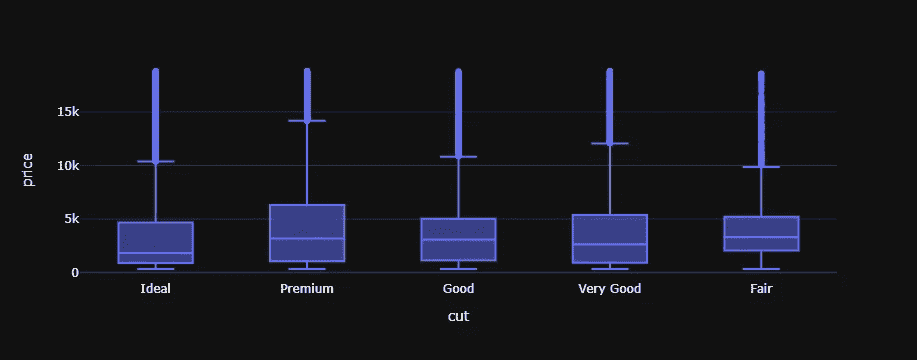

在朱庇特实验室看起来太光滑了！

```
plot_scores(4, 6)
```

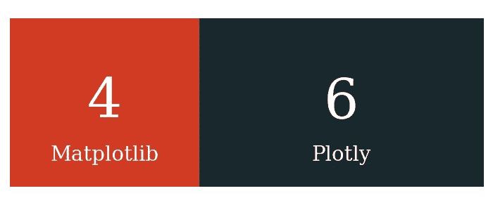

## 5.4 全局设置

我花了这么长时间来集成 Plotly 的原因是它缺乏控制全局设置的功能。

Matplotlib 有`rcParams`字典，您可以很容易地调整它来设置全局绘图选项。你可能会认为一个非常依赖字典的图书馆会有一个类似的字典，但是不！

Plotly 在这方面真的让我很失望。

```
plot_scores(5, 6)
```

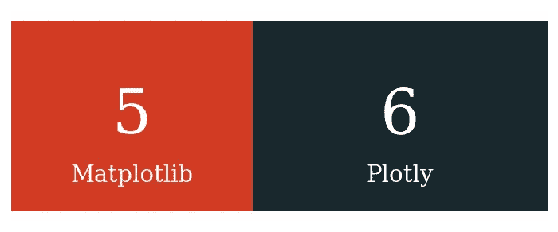

## 5.5 轴

轴最重要的组成部分是刻度线和刻度标签。

老实说，直到今天，我还没有完全掌握如何在 Matplotlib 中控制 ticks。这是因为 Matplotlib 没有一致的 API 来控制轴。

你可能会责怪我不够努力，但我通过查看一次文档，就明白了我需要学习的关于控制虱子的一切。

Plotly 只有一种处理 ticks 的方式(通过`update_xaxes/update_yaxes`或`update_layout`)。当您在 Express 和 GO 之间切换时，这些函数不会改变，而在 Matplotlib 中，情况并非如此。

```
plot_scores(5, 7)
```

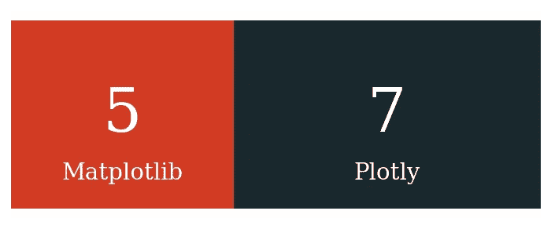

## 5.6 控制图表的个别方面如何？

我们必须把这个给 Matplotlib。我这样做不是因为普洛特利已经领先了，我必须保持这种阴谋。

Matplotlib 将各个组件实现为单独的类，使其 API 非常精细。更精细意味着有更多的选项来控制图中可见的对象。

以箱线图为例:


即使情节看起来空白，它允许几乎无限的定制。例如，在返回的字典的`boxes`键下，您可以将每个箱线图作为面片对象进行访问:

这些对象打开了所有发生在 Matplotlib 下的神奇事物的大门。它们也不局限于箱线图，你可以从许多其他图中访问[面片对象](https://matplotlib.org/stable/api/_as_gen/matplotlib.patches.Patch.html)。使用这些面片对象，您可以自定义绘图中形状周围的每条线、每个角和每个点。

```
plot_scores(6, 7)
```

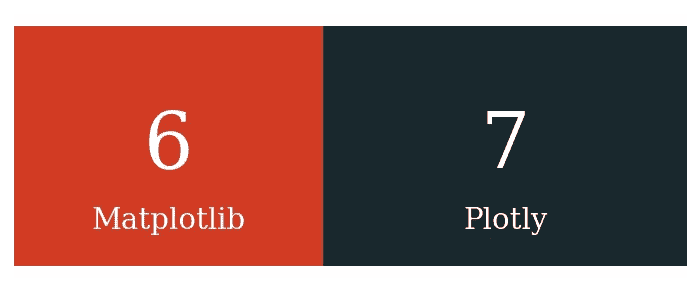

# 6.散点图

散点图在统计分析中起着举足轻重的作用。

它们用于了解相关性和因果关系，检测异常值，并在线性回归中绘制最佳拟合线。所以，我决定用一整节来比较两个图书馆的散点图。

为此，我将选择前面章节中的身高与体重散点图:


Matplotlib 的默认散点图。

我知道，看起来很恶心。然而，看着我做一些定制，把情节变成一件(好吧，我不会说艺术):

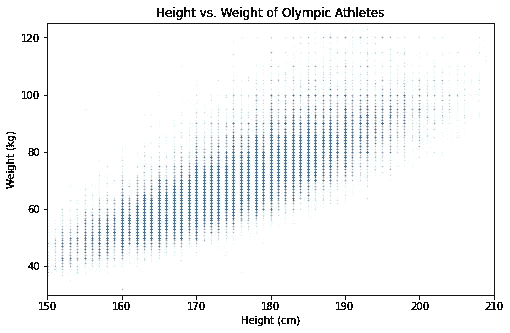

减小分笔成交点大小并降低其不透明度后的相同散点图

在应用最后一步之前，我们可以看到这些点围绕不同的行和列进行分组。让我们添加抖动，看看会发生什么:

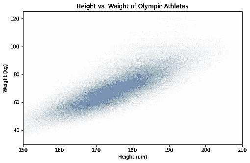

抖动后相同的散点图。

现在比较最初的图和最后的图:


**左图——初始图。右—转换后。**

我们甚至不知道这些点在 Plotly 中被分组为行和列。它不允许将标记大小更改为小于默认值。

这意味着我们不能抖动分布来考虑体重和身高在离散值上四舍五入的事实。

```
plot_scores(7, 7)
```

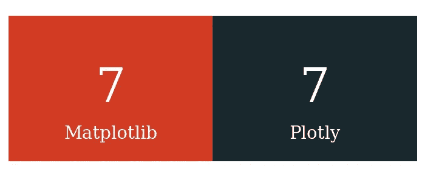

哇！到目前为止一直是不分上下。

# 7.证明文件

作为最后一个组成部分和决胜局，让我们比较文档。

当我还是初学者的时候，Matplotlib 文档是我期望找到问题答案的最后一个地方*。*

*首先，如果不打开其他几个链接页面，你就无法阅读文档的任何一页。文件是一个混乱的怪物。*

*第二，它的教程和示例脚本似乎是为学术研究人员编写的，几乎就像 Matplotlib 故意恐吓初学者一样。*

*相比之下，Plotly 要有条理得多。它有完整的 [API 参考](https://plotly.com/python-api-reference/)，并且它的教程大多是单机版的。*

*它并不完美，但至少看起来不错——感觉不像你在读 90 年代的报纸。*

```
*plot_scores(7, 8)*
```

*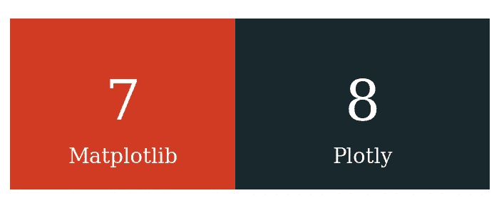*

*> 2022 年更新:Matplotlib 完全修改了它的文档，看起来非常令人愉快。我们可以称这部分为平局。*

# *摘要*

*老实说，我在写这个比较的时候，完全相信 Matplotlib 最终会胜出。*

*当我完成一半的时候，我知道会发生相反的情况，我是对的。*

*Plotly 确实是一个非凡的图书馆。尽管我让我的个人偏好和偏见影响了分数，但没有人能否认这个软件包已经实现了许多里程碑，并且仍在快速发展。*

*这篇文章并不是要说服你放弃一个包而使用另一个。相反，我想强调每个包擅长的领域，并展示如果将这两个库都添加到您的工具箱中，您可以创建什么。*

*感谢您的阅读！*

*[](https://ibexorigin.medium.com/membership)  [](https://ibexorigin.medium.com/subscribe)  

**我的更多故事:**

[](https://ibexorigin.medium.com/yes-these-unbelievable-masterpieces-are-created-with-matplotlib-b62e0ff2d1a8)  [](/an-in-depth-tutorial-to-python-decorators-that-you-can-actually-use-1e34d3d2d305)  [](https://ibexorigin.medium.com/how-to-use-matplotlib-annotations-like-you-know-what-you-are-doing-da61e397cce3)  [](/the-easiest-way-to-deploy-your-ml-dl-models-in-2022-streamlit-bentoml-dagshub-ccf29c901dac) *