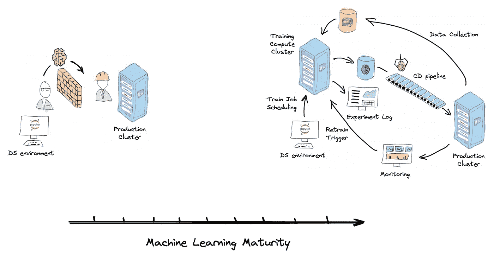
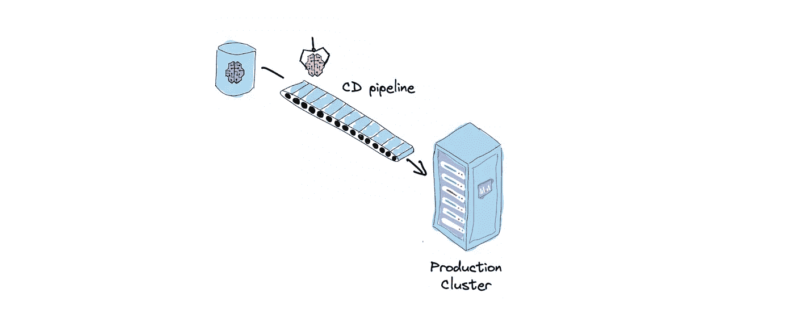
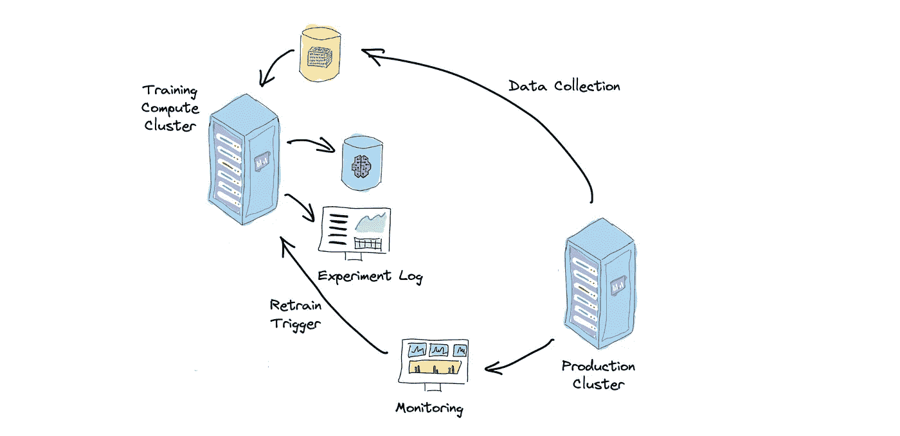
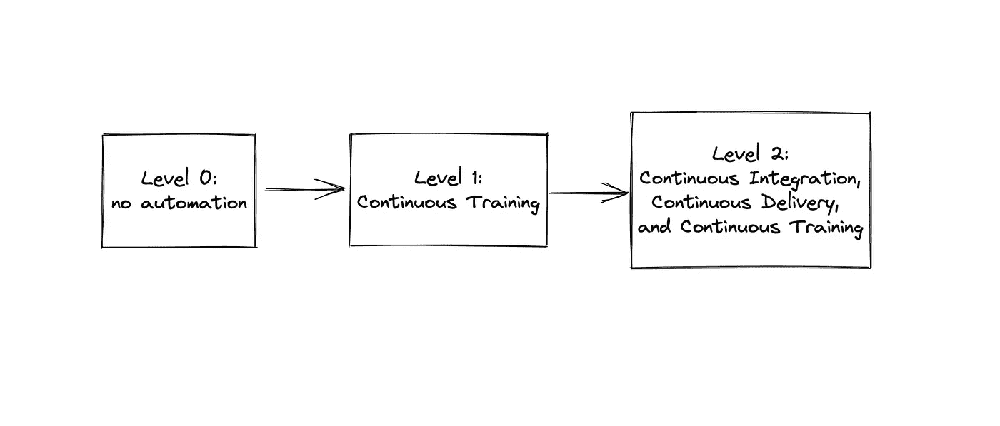
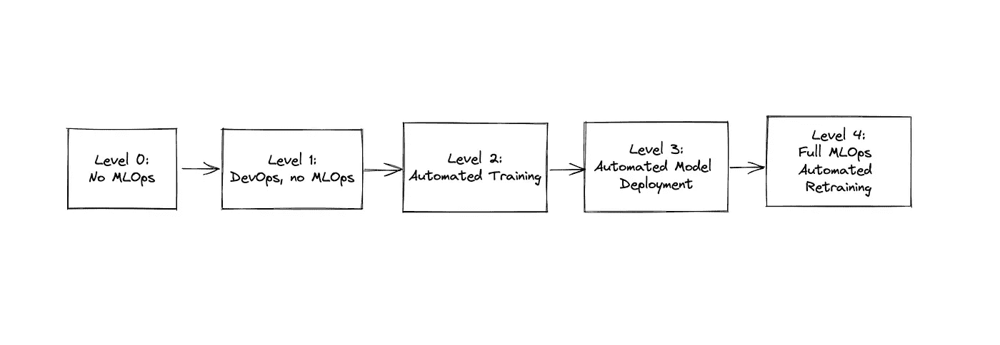
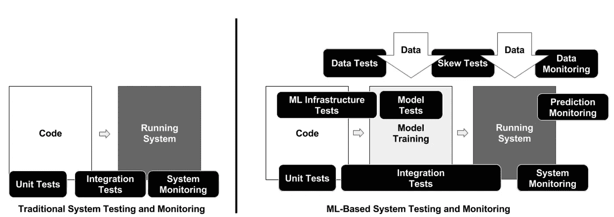
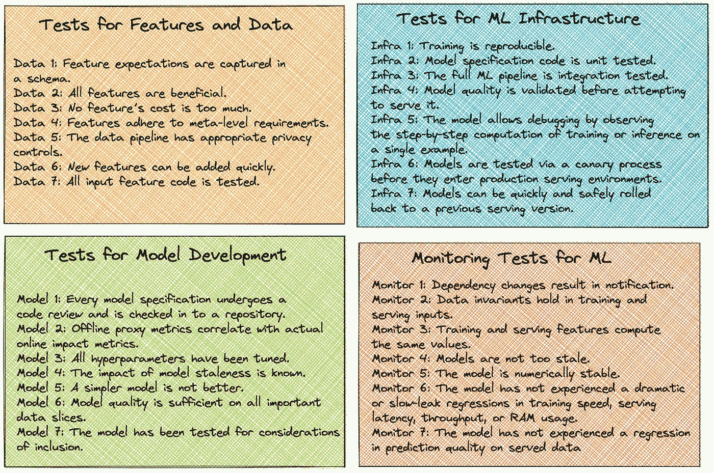

# 机器学习系统的成熟度

> 原文：<https://towardsdatascience.com/maturity-of-machine-learning-systems-358bab34bf69>

## 机器学习系统现有成熟度框架综述

机器学习系统成熟度。图片由作者提供

低质量的机器学习系统对业务不利。它们很难适应和改进来满足业务需求。同时，它们也很贵。他们在错误修复和调试上消耗了大量的操作资源。随着时间的推移，他们倾向于积累技术债务和熵。它们脆弱、不可靠，并导致糟糕的客户体验。因此，不断提高我们机器学习系统的质量和成熟度至关重要。

然而，根据我的经验，机器学习行业普遍存在低质量的系统。为什么？在我看来，缺乏结构化的指导是最重要的因素。没有这样的指导，改进活动通常是稀少的和不系统的。机器学习团队常常不得不为了更切实的商业目标而牺牲它们。或者他们被一个完全成熟的环境的要求所淹没，而不知道实现它的渐进步骤。

在本文中，我试图解决这个问题，并提供三个现有框架的概述，这些框架可以指导您的 ML 团队构建成熟的生产就绪的机器学习系统:

*   **Google Cloud MLOps 成熟度级别**和 **Azure MLOps 成熟度模型** —专注于采用 CI/CD 和持续培训等 MLOps 实践的通用框架。
*   **ML 测试分数** —专注于测试和监控的 Google 框架。它提供了一个量化机器学习系统成熟度的单一指标，以及一系列改进它的具体活动。

# 机器学习成熟度

当我们谈论机器学习的现实应用时，我们需要考虑机器学习系统。不仅仅是机器学习模型。在我之前的一篇文章中，我概述了这些概念之间的区别，并提供了一些例子。前者包含后者，并定义了我们如何训练和使用它。我喜欢将术语机器学习系统定义为使用机器学习方法向客户交付价值的所有活动及其工件。

为什么谈论机器学习系统比仅仅关注提高我们的模型质量更有帮助？因为创建可靠的、生产级的机器学习系统暴露了许多小玩具示例或研究实验中没有发现的新问题。机器学习系统很难构建和维护。

*   **机器学习系统很脆弱**。我们在建立它们的时候做了很多隐含的假设。数据分布或契约的微小变化都可能使整个系统行为失常。与传统的软件系统相比，这些错误很难被发现。
*   **他们积累技术债务。**与传统软件相比，机器学习系统有许多额外的债务来源。技术债务很难量化和区分工作的优先次序。随着时间的推移，它会消耗越来越多的运营成本，并减缓任何改进。
*   **他们需要激励不一致的孤立团队的协作。**默认设置中的数据科学家、ML 工程师和数据工程师具有相互矛盾的目标和 KPI，这在系统中造成了内部冲突。

为了让机器学习系统可以投入生产，它必须处理这些问题。这就是我们所说的成熟。机器学习成熟度是机器学习系统的属性，而不是机器学习模型。它反映了:

*   您的数据科学团队改进模型的速度。
*   生产中发生的错误数量。
*   我们识别这些错误并从中恢复的速度有多快。

> 机器学习成熟度是机器学习系统的属性，而不是机器学习模型。

让我们深入现有的机器学习成熟度框架。

# Google Cloud MLOps 成熟度级别

这个框架在[这个谷歌云架构中心文档](https://cloud.google.com/architecture/mlops-continuous-delivery-and-automation-pipelines-in-machine-learning)中定义。它将重点放在 MLOps 上。

MLOps 是一项将 DevOps 实践和文化适应于机器学习系统的运动。它旨在通过调整他们的激励和打破孤岛来统一数据工程师、ML 工程师、软件工程师和数据科学家。DevOps 在软件工程方面取得了巨大的成功。它有助于解决不同团队(开发人员、运营人员、业务人员和安全人员)之间的长期冲突。它还表明，敏捷性和健壮性并不是敌人，可以在不牺牲一个的情况下实现两者。通过 MLOps，我们试图在 ML 工程领域复制 DevOps 的核心理念。

## 提高 ML 系统稳健性的实践

该框架强调了提高 ML 系统稳健性的三大实践:

*   不断尝试 ML 管道的新实现
*   监控生产中模型和数据的质量
*   经常重新培训生产模型

我们通过向我们的机器学习系统引入持续集成、持续交付和持续培训来实施这些实践。

## 连续累计

持续集成(CI)是一种 DevOps 实践，它提倡每个团队成员的工作成果必须频繁地合并到一个单一的真实来源中，这个来源被称为版本控制系统(VCS)中的主干。后者通常是 Git。经常意味着每天。主干必须随时准备好部署到开发、试运行或生产环境中。这意味着我们必须保证主干是稳定的，同时鼓励频繁的变化。听起来很矛盾。这个冲突的解决方案是测试自动化。持续集成就是实现各种各样的自动化测试，并将它们集成到您的管道中，减少破坏主干的机会。

ML 项目的持续集成意味着数据科学家和 ML 工程师使用 VCS 来共享和协作他们的功能。他们不断地将 Jupyter 笔记本的关键功能重构和卸载到适当的编程语言源文件(Python 包)中。他们对他们的训练和预测管道和数据进行测试。它们持续与主干同步。

由于一些团队成员缺乏工程技能，并且数据科学代码库的一大块具有一次性使用的实验性质，CI 在 ML 项目中经常是棘手的。

## 连续交货

连续 ML 模型交付。图片由作者提供。

持续交付是 CI 之后的下一个逻辑步骤。CI 确保代码库在一个版本中拥有所有最新的变更，并能正常运行，而持续交付确保它是可部署的。可部署意味着无需人工操作即可快速部署。理想情况下，它应该只是一个按钮点击。连续交付通过自动化部署工作流中的所有步骤(构建包和映像、运行集成和验收测试、安全测试以及部署到不同的环境)再次使这成为可能。

与传统的软件开发相比，ML 项目的连续交付也增加了另一层复杂性。我们需要交付训练管道、预测管道和训练好的模型。

CI/CD 允许我们以更低的成本更快地试验和部署新的 ML 模型。这意味着我们可以在有限的时间内更快地迭代并产生更好的结果。

## 持续培训

连续训练(CT)是 ML 系统独有的新特性。它涉及自动再训练和服务模型。在真实的生产场景中，ML 模型可能会经常过时。需要模型再培训程序的情况示例:

*   模型性能下降(我们能够在生产中跟踪它)
*   非分布样本累积
*   数据/概念漂移
*   新的训练数据可用，这可以改进我们当前的模型性能。

在这种情况下，DS 和 ML 工程团队需要在更新的训练数据集上训练模型，验证其性能，并部署新版本。如果这些活动成本很高或者锁定在特定的团队成员身上，这可能会有问题。持续的培训使这一过程自动化。

持续训练是机器学习系统检测再训练需求、再训练模型、验证模型、有时在很少或没有人工干预的情况下自动部署模型的能力。

持续训练。图片由作者提供。

这使得机器学习系统更具适应性，因此也更健壮。

CT 通常至少需要实现以下组件:

*   自动化数据收集:新生产数据的 ETL，以更新培训和验证数据集。
*   自动化训练管道:端到端的模型训练过程，获取训练数据并产生训练的模型参数。
*   自动化模型验证:这允许 ML 系统自动确定模型是否是可部署的。
*   模型存储:存储经过训练的模型参数和元数据，以跟踪它们的沿袭和性能。允许唯一的模型识别和查询。
*   再训练触发:启动再训练程序的触发信号。它可以是数据漂移警报、cron 作业或新数据可用性。

Google Cloud MLOps 成熟度框架提倡在 ML 系统中实现这三种能力:持续集成、持续交付、持续培训。他们的自动化水平反映了一个 ML 系统的成熟度。

该框架区分了三个成熟度级别:

Google Cloud MLOps 成熟度级别。图片由作者提供。

*   0 级:在构建和部署 ML 模型时没有自动化。这是基本级别，构建和部署 ML 模型完全是手动的。
*   **第一级:持续训练。**这是我们实施自动化持续培训的下一个成熟度级别。这增加了我们 ML 系统的健壮性和适应性，并允许我们根据新数据频繁地重新训练生产模型。
*   **第二级:持续集成、持续交付和持续培训。**最高级的成熟度。为了实现这一目标，我们通过 CI/CD 自动交付 ML 管道。这允许我们更快地试验新的模型实现。数据科学和软件工程团队是一致的。ML 系统具有高度的适应性和鲁棒性。

这些级别为改进您的 ML 系统提供了方向和高级里程碑。但是要使用这个模型，您需要将它视为一个通用模板。它需要根据您的组织和 ML 系统进行填充和调整。你需要发展出一套系统的练习方法。一些 DevOps 工具可以帮助你做到这一点。其中包括持续改进、丰田 Kata 和价值流图。

让我们看看下一个成熟度模型，它与 Google Cloud MLOps 成熟度级别非常相似。

# Azure MLOps 成熟度模型

该框架在随后的文档的[中定义。它还侧重于采用 MLOps 原则和实践来指导团队开发生产级机器学习系统。](https://learn.microsoft.com/en-us/azure/architecture/example-scenario/mlops/mlops-maturity-model)

它定性地评估人员、流程和技术，并强调您的 ML 系统的两个方面:

*   软件工程师、数据科学家、数据工程师和机器学习工程师之间的协作。
*   整个机器学习生命周期的自动化。

它区分了五个成熟度级别:

Azure MLOps 成熟度级别。图片由作者提供。

*   **0 级:无 MLOps。**数据科学、ML/数据工程和软件工程团队各自为政。工作流涉及大量的移交，几乎没有自动化。
*   **1 级:DevOps，无 MLOps。**应用的软件组件通过自动化 CI/CD 管道交付。机器学习模型和管道仍然通过移交手动交付。团队之间的协作水平较低。
*   第二级:自动化训练。数据科学家与 ML 工程师合作，将实验脚本转化为可重复使用和可复制的培训程序。实验结果正在被追踪。
*   **第三级:自动化模型部署。**这是通过 CI/CD 管道自动部署 ML 模型的级别。数据科学、ML 工程和软件工程团队保持一致。
*   **第 4 级:全 MLOps 自动化再培训。**持续培训的水平。

到目前为止，我们讨论的两个模型都有一个缺点。它们是通用的，不能直接操作。它们描述了 ML 系统的一般理想状态和模式，但并没有为你提供实现它们的具体可行的方法。最重要的是，它们是不可量化的。

让我们看看本文中的最后一个模型。

# ML 测试分数

谷歌团队在他们的论文[“ML 测试分数:ML 生产准备和技术债务减少的指标”(E.Breck 等人，2017)](https://research.google/pubs/pub46555/) 中介绍了这一框架。它的目标是指导团队如何在 ML 系统中识别、优先化和对抗技术债务。这些系统可以是任何规模和成熟度的:从学生论文研究项目到高可用性、可伸缩和低延迟的生产系统。

对抗软件系统(尤其是 ML 系统)技术债务的主要武器是测试和监控。ML 系统需要更广泛地使用这两种实践，因为它们固有的更高的复杂性。下面这张纸上的图片显示了这一点。

传统软件系统与 ML 系统的测试。图像来源:E.Breck 等人的 ML 测试分数:ML 生产准备和技术债务减少的一个标尺。

但是缺乏系统的方法导致了两个问题。测试很少具有足够的优先级来实现，因为总是有“更重要的事情要做”当他们这样做时，不清楚测试什么才能获得最大的好处。

因此，为了克服这两个问题，该框架的作者做出了两个主要的设计决策。要发挥作用，框架必须:

*   可操作的(Actionable):它必须提供一套具体的方法来规划团队活动的待办事项。该框架由具体的、可操作的测试组成，这些测试可以转化为团队待办事项中的标签或史诗。
*   **可量化**:它必须提供一个单一的评分标准，以允许团队在彼此之间以及在其他任务上区分这些活动的优先级。该框架提供了计算这种度量的算法。

## ML 系统断言

ML 测试分数由 28 个可操作的测试组成，分为 4 类:

*   功能和数据测试
*   模型开发测试
*   ML 基础设施测试
*   ML 的监控测试

ML 系统断言。图片由作者提供。

每个测试充当一个要检查的断言。它的违反表明 ML 系统中可能存在故障。健壮的 ML 系统必须经常检查这些断言。我鼓励你阅读原始论文，以获得每个测试的详细描述。

## ML 系统评分系统

除了测试之外，该框架还提供了一个带有单一标量指标的评分系统。最终测试分数计算如下:

*   对于上面的每个测试，手动执行
    测试，并记录和分发结果，可获得半分。
*   如果有一个系统
    在重复的基础上自动运行该测试，则得满分。
*   分别合计 4 个部分的得分。
*   最后的 ML 测试分数是通过取 4 个部分中每个部分的分数总和的
    最小值来计算的。

基于测试分数的值，ML 系统有 6 个成熟度级别:

ML 测试分数。E.Breck 等。图片来源:ML 测试分数:ML 生产准备就绪和技术债务减少的指标。

您可以根据这个标准评估您当前的成熟度级别。然后，您可以为您的 MLOPs / ML 工程团队设定下一个里程碑阶段的目标 KPI。该框架允许您确定差距，并计划必要的活动以达到计划的 KPI。

假设你已经根据这个标准确定了你当前的 ML 成熟度等级低于 1。您设定的目标是在本季度末将其提高到 2。您已经发现，监控 ML 测试是导致 ML 测试分数表现不佳的最薄弱环节。因此，您有一个可能要实现的监控测试的待办事项，您可以根据项目的具体细节对其进行优先级排序。

你不仅有一个具体的算法来提高你的 ML 成熟度，而且你有一个具体的 KPI 来在设置优先级时捍卫这些活动。你向管理层传达了一个明确的信息，询问你的贡献和成果。

# 结论

上述框架可以帮助您的 ML 工程团队建立一个系统的持续改进实践，以提高您的 ML 系统的成熟度。

您可以使用它们作为指南:

*   确定 ML 成熟度的当前差距。
*   估计新活动的工作范围，以弥补这些差距。
*   为他们建立现实的成功标准。
*   确定作为此类活动的结果，您将交付的可交付成果。

# 跟我来

如果你觉得我与你分享的想法很有趣，请不要犹豫，在[媒体](https://medium.com/@areshytko)、[推特](https://twitter.com/areshytko)、 [Instagram](https://www.instagram.com/areshytko/) 或 [LinkedIn](https://www.linkedin.com/in/areshytko) 上联系我们。