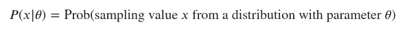
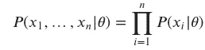
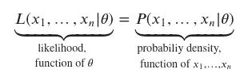
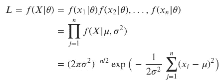
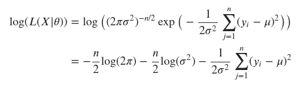
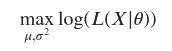
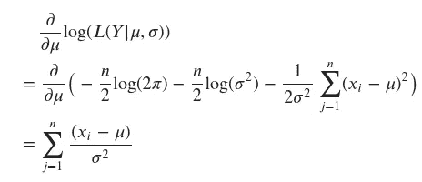
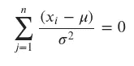
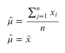
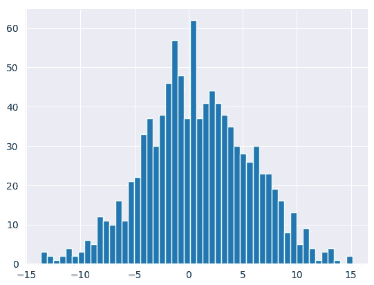

# 张量流概率的最大似然估计

> 原文：<https://towardsdatascience.com/maximum-likelihood-estimation-from-scratch-in-tensorflow-probability-2fc0eefdbfc2>

## 概率深度学习

# 介绍

本文属于“概率深度学习”系列。这个每周系列涵盖了深度学习的概率方法。主要目标是扩展深度学习模型，以量化不确定性，即知道他们不知道的东西。

我们使用张量流和张量流概率开发我们的模型。TensorFlow Probability 是一个构建在 TensorFlow 之上的 Python 库。我们将从能在张量流概率中找到的基本对象开始，并理解我们如何操纵它们。我们将在接下来的几周内逐步增加复杂性，并将我们的概率模型与现代硬件(如 GPU)上的深度学习相结合。

迄今发表的文章:

1.  [张量流概率简介:分布对象](https://medium.com/towards-data-science/gentle-introduction-to-tensorflow-probability-distribution-objects-1bb6165abee1)
2.  [张量流概率简介:可训练参数](https://medium.com/towards-data-science/gentle-introduction-to-tensorflow-probability-trainable-parameters-5098ea4fed15)
3.  [张量流概率中从零开始的最大似然估计](/maximum-likelihood-estimation-from-scratch-in-tensorflow-probability-2fc0eefdbfc2)
4.  [tensor flow 中从头开始的概率线性回归](/probabilistic-linear-regression-from-scratch-in-tensorflow-2eb633fffc00)
5.  [使用 Tensorflow 进行概率回归与确定性回归](https://medium.com/towards-data-science/probabilistic-vs-deterministic-regression-with-tensorflow-85ef791beeef)
6.  [Frequentist 与 Tensorflow 的贝叶斯统计](https://medium.com/towards-data-science/frequentist-vs-bayesian-statistics-with-tensorflow-fbba2c6c9ae5)


图 1:我们今天的口头禅:最大化对数似然和最小化负对数似然是一样的([来源](https://unsplash.com/photos/Rz5o0osnN6Q)

像往常一样，代码可以在我的 [GitHub](https://github.com/luisroque/probabilistic_deep_learning_with_TFP) 上找到。

# 最大似然估计

让我们回忆一下上一篇文章最后分享的关于*最大似然估计*的内容。

*最大似然估计*是深度学习模型中常用的训练程序。目标是在给定一些数据的情况下，估计概率分布的参数。简而言之，我们希望最大化我们在一些假设的统计模型下观察到的数据的概率，即概率分布。

我们还引入了一些符号。连续随机变量的概率密度函数粗略地表示样本取特定值的概率。我们将这个函数表示为 *𝑃* ( *𝑥* | *𝜃* )，其中 *𝑥* 是样本值， *𝜃* 是描述概率分布的参数:



```
tfd.Normal(0, 1).prob(0)

<tf.Tensor: shape=(), dtype=float32, numpy=0.3989423>
```

当从同一分布(我们通常假设)中独立地*抽取多个样本时，样本值 *𝑥* 1，…， *𝑥𝑛* 的概率密度函数是每个个体 *𝑥𝑖* 的概率密度函数的乘积。正式书写:*



我们可以通过一个例子很容易地计算出上述内容。假设我们有一个标准的高斯分布和一些样本:*𝑥*1 = 0.5， *𝑥* 2=0， *𝑥* 3=1.5。正如我们上面定义的，我们只需要计算每个样本的概率密度函数，然后将输出相乘。

```
X = [-0.5, 0, 1.5]

np.prod(tfd.Normal(0, 1).prob(X))

0.01819123
```

现在，我想以某种方式给出一些关于概率密度函数和*可能性*函数之间差异的直觉。他们本质上是在计算相似的东西，但是观点相反。

从概率密度函数开始，我们知道它们是我们样本的函数 *𝑥* 1，…， *𝑥𝑛* 。注意参数 *𝜃* 被认为是固定的。所以，当参数 *𝜃* 已知时，使用概率密度函数，我们的兴趣是找出相同样本 *𝑥* 1，…， *𝑥𝑛* 的概率。简而言之，当我们知道产生某个过程的分布，并且我们想从中推断出可能的值时，我们就使用这个函数。

相反，在*似然*函数的情况下，我们已知的是样本，即观察数据 *𝑥* 1、…、 *𝑥𝑛* 。这意味着我们的独立变量现在是 *𝜃* ，因为我们不知道哪个分布产生了我们观察到的这个过程。因此，当我们知道某个过程的样本时，即我们收集了数据，但我们并不真正知道最初是什么分布产生了该过程时，我们就使用这个函数。既然我们知道这些数据，我们有兴趣对它们来自的分布做出*推论*。

让我们引入更多的符号来帮助连接这些点。对于*可能性*函数，惯例是使用字母 *𝐿* ，而对于概率密度函数，我们引入了上面的符号。我们可以这样写:



我们准备用参数 *𝜇* 和 *𝜎* 定义高斯分布的似然函数:



作为一个获得更多关于*可能性*函数的直觉的练习，我们可以生成足够的样本来直观地一瞥它的形状。请注意与我们在上一篇文章中计算的概率密度函数相比，计算*可能性*函数的不同之处。我们对从概率分布中生成样本不感兴趣，我们感兴趣的是生成使观测数据的概率最大化的参数 *𝜃* ，即 *𝑃* ( *𝑥* 1，…， *𝑥𝑛* | *𝜃* )。

我们使用与上述相同的样本:𝑥1 = 0.5，𝑥2 = 0，𝑥3 = 1.5。

```
X

[-0.5, 0, 1.5]
```

为了能够构建 2D 可视化，我们可以创建在一个间隔上均匀间隔采样的潜在参数的网格，从[-2，2]和[0，3]之间的*𝜎*采样*𝜇*。由于我们对每个参数的 100 个值进行了采样，我们得到了 *𝑛* ^2 可能的组合。对于每个参数组合，我们需要计算每个样本的概率，并将它们相乘(按照我们上面分享的过程)。

```
μ = np.linspace(-2, 2, 100)
σ = np.linspace(0, 3, 100)

l_x = []
for mu in μ:
    for sigma in σ:
        l_x.append(np.prod(tfd.Normal(mu, sigma).prob(X)))

l_x = np.asarray(l_x).reshape((100, 100)).T
```

我们现在准备绘制*可能性*函数。注意，它是观察样本的函数，回想一下，这些是固定的，参数是我们的自变量。

```
plt.contourf(μ, σ, l_x)
plt.xlabel('μ')
plt.ylabel('σ')
plt.colorbar()
plt.title('Likelihood');
```


图 2: *样本的高斯似然函数𝑥*1 = 0.5， *𝑥* 2=0， *𝑥* 3=1.5

正如我们已经分享的，我们对最大化我们数据的概率感兴趣。这意味着我们想要找到*似然*函数的最大值，这可以借助微积分来实现。事实上，函数相对于参数的一阶导数的零点应该足以帮助我们找到原函数的最大值。

我们现在遇到一个新问题，这个问题我们在之前的文章中已经介绍过了——将许多小概率相乘在一起可能在数值上不稳定。为了克服这个问题，我们可以使用相同函数的对数变换。自然对数是一个单调递增的函数，这意味着如果 x 轴上的值增加，y 轴上的值也会增加。这很重要，因为它确保了概率对数的最大值出现在与原始概率函数相同的点上。它为我们做了另一件非常方便的事情，它将我们的乘积转化为总和。

让我们执行转换:



我们就快到了，现在我们可以着手解决优化问题了。最大化我们数据的概率可以写成:



如上所述，可以对上面导出的表达式进行求导以找到最大值。扩展我们的参数，我们有 log(*𝐿*(*𝑋*|*𝜇*， *𝜎* )。由于它是两个变量 *𝜇* 和*𝜎*的函数，我们使用偏导数来找到*最大似然估计*。

让我们专注于 *𝜇* ̂(帽子表示它是一个估计量，即我们的输出)，我们可以使用以下公式计算它:



为了找到最大值，我们需要找到临界值，因此我们需要将上面的表达式设置为零。



然后，



这是数据的平均值，你应该不会感到惊讶。

我们可以计算出样本的μ和σ的最大值:𝑥1 = 0.5，𝑥2 = 0，𝑥3 = 1.5，并与真实值进行比较。

```
idx_μ_max = np.argmax(l_x, axis=1)[-1]
print(f'μ True Value: {np.array(X).mean()}')
print(f'μ Calculated Value: {μ[idx_μ_max]}')
print(f'σ True Value: {np.array(X).std()}')
print(f'σ Calculated Value: {σ[np.nanargmax(l_x[:,idx_μ_max], axis=0)]}')

μ True Value: 0.3333333333333333
μ Calculated Value: 0.3434343434343434
σ True Value: 0.8498365855987975
σ Calculated Value: 0.8484848484848485
```

# 张量流概率的最大似然估计实现

让我们首先创建一个正态分布的随机变量，并从中抽取样本。通过绘制随机变量的直方图，我们可以看到分布的形状。

```
x_train = np.random.normal(loc=1, scale=5, size=1000).astype('float32')[:, np.newaxis]

plt.hist(x_train, bins=50);
```



图 3:参数 *𝜇* =1、 *𝜎* =5 的正态分布随机变量直方图。

我们可以计算随机变量的平均值，这是我们想要使用*最大似然估计*学习的值。

```
x_train.mean()

0.85486585
```

正如我们在上一篇文章中看到的，我们可以将 TensorFlow `Variable`对象定义为分布的参数。这向 TensorFlow 发出信号，表明我们希望在学习过程中学习这些参数，无论我们使用哪个参数。

```
normal = tfd.Normal(loc=tf.Variable(0., name='loc'), scale=5)
normal.trainable_variables

(<tf.Variable 'loc:0' shape=() dtype=float32, numpy=0.0>,)
```

下一步是定义我们的损失函数。在这种情况下，我们已经看到了我们想要实现的目标——最大化我们的*可能性*函数的对数变换。然而，在深度学习中，我们通常会最小化我们的损失函数，如果我们将我们的*可能性*函数的符号改为负值，这可以很容易地实现。

```
def nll(x_train):
    return -tf.reduce_sum(normal.log_prob(x_train))
```

最后，我们可以建立我们的培训程序。我们将使用一个定制的训练循环，以便我们可以自己定义过程细节(即使用我们的定制损失函数)。

正如我们在之前的文章中所分享的，我们使用 API`tf.GradientTape()`来访问 TensorFlow 的自动微分特性。接下来，我们简单地指定要训练的变量，最小化和应用梯度的损失函数。

```
@tf.function
def get_loss_and_grads(x_train):
    with tf.GradientTape() as tape:
        tape.watch(normal.trainable_variables)
        loss = nll(x_train)
        grads = tape.gradient(loss, normal.trainable_variables)
    return loss, grads

optimizer = tf.keras.optimizers.SGD(learning_rate=0.001)
```

我们已经准备好运行我们的训练程序了。

```
@tf.function
def get_loss_and_grads(x_train):
    with tf.GradientTape() as tape:
        tape.watch(normal.trainable_variables)
        loss = nll(x_train)
        grads = tape.gradient(loss, normal.trainable_variables)
    return loss, grads

optimizer = tf.keras.optimizers.SGD(learning_rate=0.001)

Step 000: Loss: 13768.004 Loc: 0.855
Step 001: Loss: 13768.004 Loc: 0.855
Step 002: Loss: 13768.004 Loc: 0.855
...
Step 1997: Loss: 13768.004 Loc: 0.855
Step 1998: Loss: 13768.004 Loc: 0.855
Step 1999: Loss: 13768.004 Loc: 0.855
```

我们应该为此欢呼。我们已经通过最大化我们首先生成的采样数据的概率，计算了参数 *𝜇* 的*最大似然估计*。正如我们在下面看到的，这很有效，我们能够得到一个非常接近原始值的𝜇值。

```
print(f'True Value: {x_train.mean()}')
print(f'Estimated Value: {normal.trainable_variables[0].numpy()}')

True Value: 0.8548658490180969
Estimated Value: 0.8548658490180969
```

# 结论

本文从理论和实践两方面介绍了使用张量流概率的最大似然估计 T2 过程。我们从陈述概率密度函数和*可能性*函数之间的差异开始。第一种方法是固定参数 *𝜃* ，让样本成为自变量。相反，在*可能性*函数的情况下，数据是固定的(即观察到的)，参数 *𝜃* 是我们想要学习的变量。然后，我们通过一个简单的例子直观地了解了*可能性*函数的形状。最后，我们通过定义张量流`Variable`、负对数似然函数和应用梯度，使用张量流概率实现了一个定制的训练程序。

下周，我们将开始构建我们的第一个算法。到时候见！

保持联系: [LinkedIn](https://www.linkedin.com/in/luisbrasroque/)

# 参考资料和材料

[1] — [Coursera:深度学习专业化](https://www.coursera.org/specializations/deep-learning)

[2] — [Coursera:深度学习的 tensor flow 2](https://www.coursera.org/specializations/tensorflow2-deeplearning)专业化

[3] — [张量流概率指南和教程](https://www.tensorflow.org/probability/overview)

[4] — [TensorFlow 博客中的 TensorFlow 概率帖子](https://blog.tensorflow.org/search?label=TensorFlow+Probability&max-results=20)