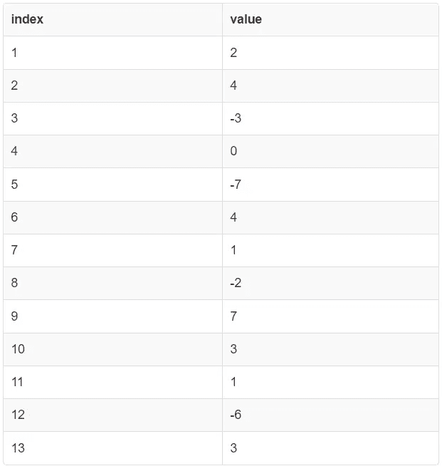
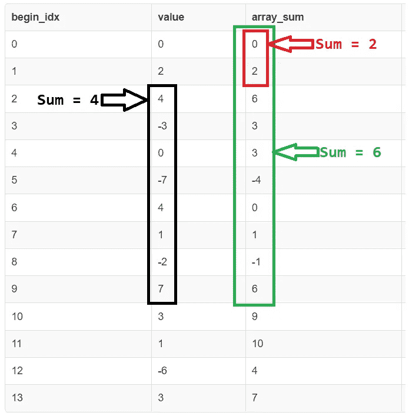
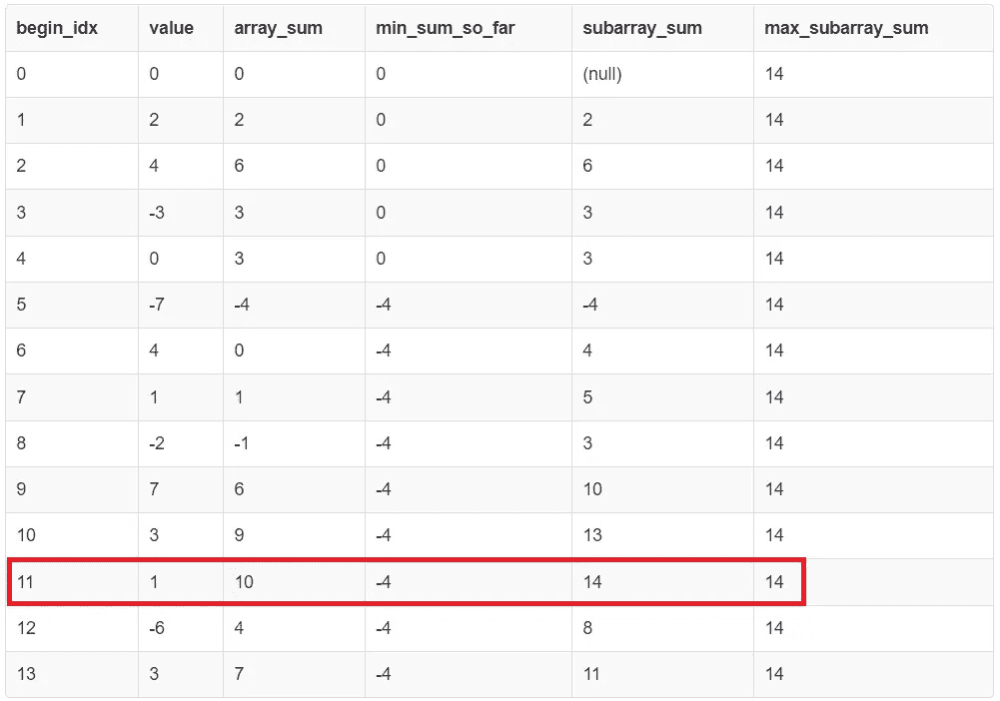

# 使用 SQL 的最大子数组和

> 原文：<https://towardsdatascience.com/maximum-subarray-sum-using-sql-e1befa75d055>

## 如何用声明式查询语言实现解决方案

最大和子数组和问题要求你找出整数数组中元素和最大的那个子数组。这是一个流行的计算机科学编程问题，通常用命令式编程语言(如 C++、Java、Python 等)来解决。然而，看看如何在声明式查询语言(如 SQL)中实现它是很有趣的。


卡斯帕·卡米尔·鲁宾在 [Unsplash](https://unsplash.com?utm_source=medium&utm_medium=referral) 上的照片

我希望这是尝试使用声明性 SQL 语法解决传统编程问题的一系列文章中的第一篇。为什么？因为好玩！

# 问题陈述

给定一个整数数组，找出具有最大元素和的整数连续子数组(至少有一个来自原始数组的元素)。

这个问题的讨论可以在很多地方找到，包括:

1.  [极客之福](https://www.geeksforgeeks.org/largest-sum-contiguous-subarray/)
2.  [guru99](https://www.guru99.com/largest-sum-contiguous-subarray.html)
3.  [定标器](https://www.scaler.com/topics/kadanes-algorithm/)

上面所有的链接都讨论了传统编程语言的 O(n)时间实现。然而，我们着眼于完全用 SQL 构建一个 O(n)时间的解决方案(没有任何过程扩展)。

# 输入表模式

```
CREATE TABLE array_data(index SERIAL PRIMARY KEY, value INTEGER NOT NULL);

INSERT INTO array_data(value)
VALUES(2), (4), (-3), (0), (-7), (4), (1), (-2), (7), (3), (1), (-6), (3);
```

```
SELECT * FROM array_data;
```



表 array_data 的内容(图片由作者提供)

# 第一种解决方案:O(n)

显而易见的第一种解决方案是生成子数组可以拥有的每一对有效索引(这是 O(n ),因为每个索引都与其后的一个索引成对出现),然后对于每一对索引，计算该范围内的值的总和。

计算总和需要输入(每对索引)的线性时间，因此该解决方案的总成本为 O(n)

```
WITH all_pair_sums AS (
  SELECT
    lhs.index AS begin_idx,
    rhs.index AS end_idx,
    SUM(for_values.value) AS array_sum
  FROM
    array_data lhs INNER JOIN array_data rhs
  ON lhs.index <= rhs.index
  INNER JOIN array_data for_values
  ON for_values.index BETWEEN lhs.index AND rhs.index
  GROUP BY 1, 2
  ORDER BY lhs.index ASC, rhs.index ASC
)

SELECT * FROM all_pair_sums
WHERE array_sum = (SELECT MAX(array_sum) FROM all_pair_sums);
```


SQL 中 O(n)解的结果(图片由作者提供)

**估计成本:**对于一个 13 行的输入表，这个查询的估计成本(根据解释)是 [108M](https://explain.depesz.com/s/B2Gy) 。

# 第二种解决方案:O(n)

我们可以执行的第一个优化是避免从给定的数组索引(begin_idx)开始重复计算每个数组的。相反，我们可以为从给定索引开始的每个子阵列维护一个运行总和。

这需要使用[窗口函数](https://www.postgresql.org/docs/current/tutorial-window.html)，并且将成本降低到 O(n)，因为我们正在处理它之前的每个数组索引的每个索引。

```
WITH all_pair_sums AS (
  SELECT
    lhs.index AS begin_idx,
    rhs.index AS end_idx,
    SUM(rhs.value) OVER (PARTITION BY lhs.index ORDER BY rhs.index ASC) AS array_sum
  FROM
    array_data lhs INNER JOIN array_data rhs
  ON lhs.index <= rhs.index
  ORDER BY lhs.index ASC, rhs.index ASC
),

with_max AS (
  SELECT
    begin_idx,
    end_idx,
    array_sum,
    MAX(array_sum) OVER() AS max_subarray_sum
  FROM all_pair_sums
)

SELECT begin_idx, end_idx, array_sum
FROM with_max
WHERE array_sum = max_subarray_sum;
```

这里， **array_sum** 列存储从索引 **begin_idx** 开始到 **end_idx** 结束的数组的运行总和。


SQL 中 O(n)解的结果(图片由作者提供)

**估计成本:**这个查询在一个 13 行的输入表上的估计成本(根据解释)是 [371k](https://explain.depesz.com/s/cZU0) 。与之前的方法相比，减少了 99.65%。

# 第三种解决方案:O(n)

观察:要找到从索引 I 开始到索引 j 结束的子数组的和，我们可以找到子数组[0..j]并从中减去子阵列[0..i-1]。换言之， **sum[i..j] = sum[0..j] — sum[0..i-1]** 。



索引为[2]的子阵列元素之和..9]通过执行 sum([0..9]) — sum([0..1])(图片由作者提供)

上面的列 **array_sum** 存储子数组**[0]的元素总和的值..【begin _ idx】。**

这个解决方案的最终代码如下所示。

```
WITH running_sum AS (
  SELECT
    index AS begin_idx,
    value,
    SUM(value) OVER (ORDER BY index ASC) AS array_sum
  FROM
    (SELECT 0 AS index, 0 AS value
     UNION ALL
     SELECT * FROM array_data
    ) AS temp
  ORDER BY index ASC
),

running_sum_with_min AS (
  SELECT
    begin_idx,
    value,
    array_sum,
    MIN(array_sum) OVER(ORDER BY begin_idx ASC) AS min_sum_so_far
  FROM running_sum
),

sum_of_subarray AS (
  SELECT
    begin_idx,
    value,
    array_sum,
    min_sum_so_far,
    array_sum - LAG(min_sum_so_far, 1) OVER(ORDER BY begin_idx ASC) AS subarray_sum
  FROM running_sum_with_min
),

max_sum_of_subarray AS (
  SELECT
    begin_idx,
    value,
    array_sum,
    min_sum_so_far,
    subarray_sum,
    MAX(subarray_sum) OVER() AS max_subarray_sum
  FROM sum_of_subarray
)

SELECT *
FROM max_sum_of_subarray
WHERE subarray_sum = max_subarray_sum;
```

如果打印中间表 **max_sum_of_subarray** ，就是这个样子。以红色突出显示的行是保存具有最大总和的连续子数组的值的行。



max_sum_of_subarray 表(图片由作者提供)

这种解决方案的一个缺点是，虽然我们有结束索引，但我们没有开始索引。通过在中间表上运行另一个查询来搜索值-4 的第一次出现，可以很容易地获取这个值。

这个子数组是索引[6..11].这个子数组中元素之和的值是 10 — (-4) =14。

请注意，我们插入了一个带有(index，value) = (0，0)的虚拟行，以确保第一个有效行(即 index = 1 的行)的延迟操作不会最终生成空值，从而导致不正确的结果。

**估计成本:**对于一个 13 行的输入表，这个查询的估计成本(根据解释)是 [695](https://explain.depesz.com/s/cfeg) 。与第一种方法相比减少了 99.99%，与第二种方法相比减少了 99.81%。

## 尽管在这个解决方案的 SQL 中的多个 cte 中有一个 ORDER BY 子句，为什么这个解决方案被称为 O(n)？

原始输入表的**索引**列是主键列(因此是唯一的)。PostgreSQL 的默认索引类型是 B 树，允许进行排序的全表扫描，这是我们在本解决方案的所有 cte 中基本上正在做的事情。因此，我们希望优化器会注意到这一点(加上中间表也是经过排序的),并完全避免排序操作。即使无法推导出这一点，运行时间回归到 **O(n log n)** ，但不会比这更差。

# SQL 小提琴

这篇文章中所有解决方案的 SQL 链接可以在[这里](http://sqlfiddle.com/#!17/b0eb547/8)找到。

# 结论

我们看到了用 SQL 解决同一问题的多种方法，效率各不相同。尽管最后一个解决方案拥有最多的代码，但它在运行时间和 CPU 利用率方面是最高效的。将解决方案分解成更小的 cte 有助于代码的可读性和可维护性。

如果你想看到更多的使用声明性 SQL 语法解决的常规编程问题，请添加评论，如果可能的话，我会尽力去做，或者写下为什么很难做到。