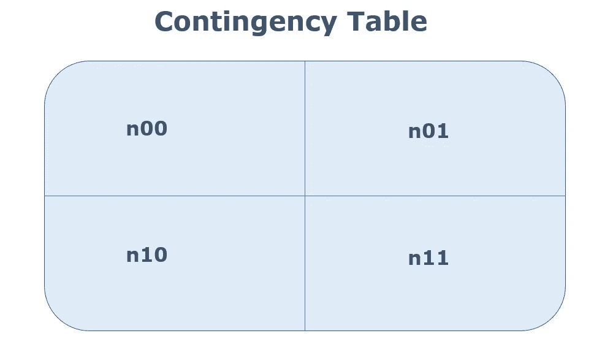
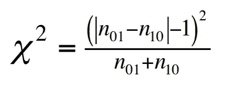
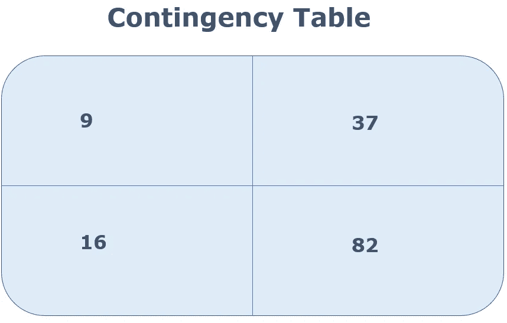
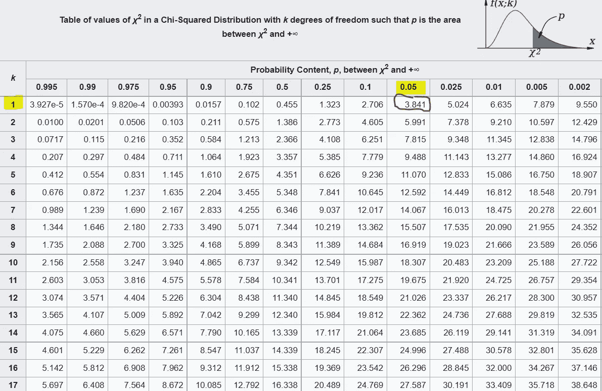

# 用 Python 评估机器学习分类器的 McNemar 测试

> 原文：<https://towardsdatascience.com/mcnemars-test-to-evaluate-machine-learning-classifiers-with-python-9f26191e1a6b>

艾萨克·史密斯在 [Unsplash](https://unsplash.com?utm_source=medium&utm_medium=referral) 上拍摄的照片

## 了解如何使用 Python 通过显著性测试比较 ML 分类器

# 介绍

在我的[上一篇文章](https://medium.com/@marcellopoliti/hypotesis-testing-and-climate-change-7ef750ce149e)中，我谈到了使用统计工具正确比较不同模型的重要性，以便在选择阶段选择最佳模型。

在这篇文章中，我想特别关注一个统计测试，作为一名数据科学家或机器学习工程师，你需要知道这个测试。您可以使用此测试来确定两个分类器之间是否存在统计上的显著差异，以便您实际上可以只使用最好的一个。

## 麦克内马试验

当我们有匹配对时，需要比较两个分类器的性能时，可以使用 McNemar 测试。如果在两个分类器 A 和 B 之间有许多不同的预测，那么如果我们有许多数据，那么测试工作得很好。

通过该测试，我们能够比较两个分类器在具有单个测试集的 N 个项目上的性能，这与您过去在[配对 t-test](/paired-t-test-to-evaluate-machine-learning-classifiers-1f395a6c93fa) 中所做的相反。

## **假设**

1.  随机抽样调查
2.  独立性ˌ自立性
3.  相互排斥的群体

## 相依表

McNemar 的测试旨在主要关注两个分类器之间的差异，因此关注他们以不同方式预测的情况。所以我们要做的第一件事就是去计算下面的值。

列联表(图片由作者提供)

*   **n00**:A 和 B 误分类的项目数
*   **n01** :被 A 误分类但未被 B 误分类的项目数
*   **n10**:B 误分类但 A 未误分类的项目数
*   **n11**:A 和 B 都正确分类的项目数
*   **零张力** : n01 = n10

> 零假设:A 和 B 的错误率相同。

麦克纳玛检验**基本上是成对卡方检验**的一种形式，所以接下来我们需要使用以下公式计算 X 值。

卡方(图片由作者提供)

## **示例**

列联表(图片由作者提供)

**X = 7.55**

假设我们希望显著性水平 p = 0.05。如果 **X > X (0.05)** (在双尾检验中)，我们可以拒绝无效假设。

所以我们用一个自由度= 1 的卡方表。

**X 表(来源:**[https://en . wikibooks . org/wiki/Engineering _ Tables/Chi-Squared _ distribution)](https://en.wikibooks.org/wiki/Engineering_Tables/Chi-Squared_Distibution)

由于 **7.55 > 3.84，我们可以拒绝零假设**并声明分类器 A 和 B 之间存在显著差异！

## 让我们编码

# 最后的想法

> *假设检验为做出关于感兴趣人群的数据决策提供了一个可靠的框架。它有助于研究人员成功地将数据从样本外推至更大的人群。*

比较一次在不同模型上得到的结果来选择哪一个是最好的，从来都不是一个好方法。统计测试允许我们客观地陈述一个模型是否表现得更好。每次你运行实验，统计测试是用来显示你所做的比以前存在的更好，去看看任何机器学习论文就知道了！

# 结束了

*马赛洛·波利蒂*

[Linkedin](https://www.linkedin.com/in/marcello-politi/) ， [Twitter](https://twitter.com/_March08_) ， [CV](https://march-08.github.io/digital-cv/)