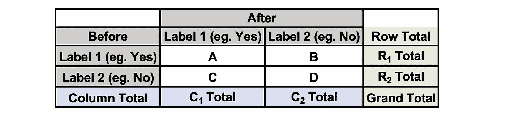
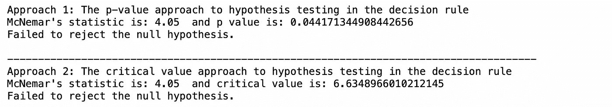
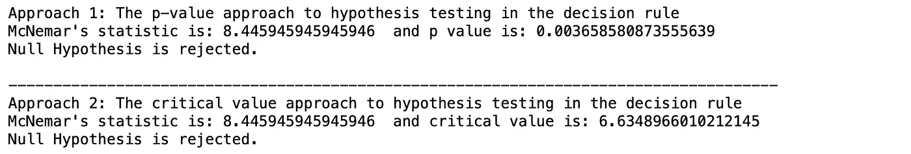

# McNemar 的测试，使用 Python

> 原文：<https://towardsdatascience.com/mcnemars-test-with-python-e1bab328d15c>

## 执行麦克纳玛测试的完整初学者指南(带代码！)

塞尔吉奥·罗塔在 [Unsplash](https://unsplash.com) 上拍摄的照片

在本文中，我将介绍麦克纳玛检验的基本原理，这是一种用于比较两个相依总体比例的统计方法**。[1]**

*   这是一种配对卡方检验(χ2)，但这一次，两个群体都是**依赖**。
*   仅用于成对的名义数据。
    1。**前后对比数据**，以揭示营销活动、药物测试等中认知、态度、行为的任何变化。
    2。**配对病例对照** :
    一、每个病例都有配对对照，即年龄、性别、种族等匹配。
    二。双胞胎研究，即配对是双胞胎。[2]

与χ2 检验类似，在计算麦克内马统计量之前，需要将数据排列在 2×2 列联表中。[1]

表 1:对同一个样本进行两次测试(之前和之后)的结果的 2x2 列联表。图片作者。

麦克纳玛检验中的零假设(H₀)是**边际同质性**，即每个结果的两个边际概率是相同的( **R₁总数= C₁总数**类似地 **R₂总数= C₂总数**)，如果我们扩展方程→ A + B = A + C → B = C [1]

检验统计量具有一个自由度的近似χ2 分布:

麦克内马的测试统计。图片作者。

## A.麦克内马前后数据检验

> 日本汽车制造商丰田和三菱都致力于增加他们在中东的市场份额。在总共 100 个客户中，60 个首选丰田，其余的在看到任何东西之前首选三菱。然而，在观看完丰田新发布的电视广告首映后，相同的受访者被要求再次考虑这两个品牌，并选择他们现在更喜欢的品牌，结果如下表所示。在 1%的显著性水平上，有证据表明顾客在广告后改变了主意吗？

表 2:调查摘要 2x2 列联表。图片作者。

根据假设检验的五步流程:
让π₁ =广告筛选前喜欢丰田的真实客户比例
π₂ =广告筛选后喜欢丰田的真实客户比例
h₀:π₁=π₂
h₁:π₁≠π₂
α= 0.01
根据麦克纳玛的检验统计:

结论:我们没有足够的证据表明广告筛选前后偏好丰田的客户的真实比例是不一样的，在 1%的显著水平上。

## B.配对病例对照资料的麦克内马检验

> 进行了一项实验来比较两种哮喘治疗方法在消除急诊室就诊方面的有效性。200 对哮喘患者按疾病严重程度配对。每对中的一名患者被分配治疗 A，另一名被分配治疗 b。实验将记录患者是否至少因呼吸困难而去过一次急诊室。在 1%的显著性水平上，是否有证据表明这两种治疗方法不是同样有效？

表 3:实验总结 2x2 列联表[3]

根据假设检验的五个步骤:
让π₁ =治疗 a 的患者中去急诊室的真实比例
π₂ =治疗 b 的患者中去急诊室的真实比例
h₀:π₁=π₂
h₁:π₁≠π₂
α= 0.01
根据麦克纳玛的检验统计:

结论:我们有足够的证据表明，在 1%的显著性水平上，这两种治疗方法不是同等有效的

## 结论

麦克内马检验是卡方检验的一种。然而，与用于检验两个变量之间关系的卡方检验(独立性的χ2 检验)不同，麦克内马检验用于检查两个相关群体的感知、态度和行为是否有任何变化。每当相同的个体被测量两次(在调查之前和之后)、配对(双胞胎或已婚夫妇)、配对对照(即在一些变量上匹配(在上述例子中根据疾病的严重程度对哮喘患者配对))时，使用麦克内马检验。

## 推荐阅读

          

## 参考

[1] [麦克内马检验—统计库文本](https://stats.libretexts.org/Bookshelves/Applied_Statistics/Book%3A_Learning_Statistics_with_R_-_A_tutorial_for_Psychology_Students_and_other_Beginners_(Navarro)/12%3A_Categorical_Data_Analysis/12.08%3A_The_McNemar_Test)

[2] [麦克纳玛的测试——维基百科](https://en.wikipedia.org/wiki/McNemar's_test)

[3] [威斯康星大学麦迪逊分校 BMI541/99 讲座:生物统计学和医学信息学](https://www.biostat.wisc.edu/~lindstro/15.contingency.tables.10.29.pdf)，2022