# 均值、中值和众数:它们是什么，什么时候应该使用它们？

> 原文：<https://towardsdatascience.com/mean-median-and-mode-what-are-they-and-when-should-you-use-them-edc3949aa142>

## 统计 101

## 你可能还记得高中统计课上的均值、中值和众数，但它们经常被误用。我们看看应该如何使用它们——以 Python 和 Pandas 为例。

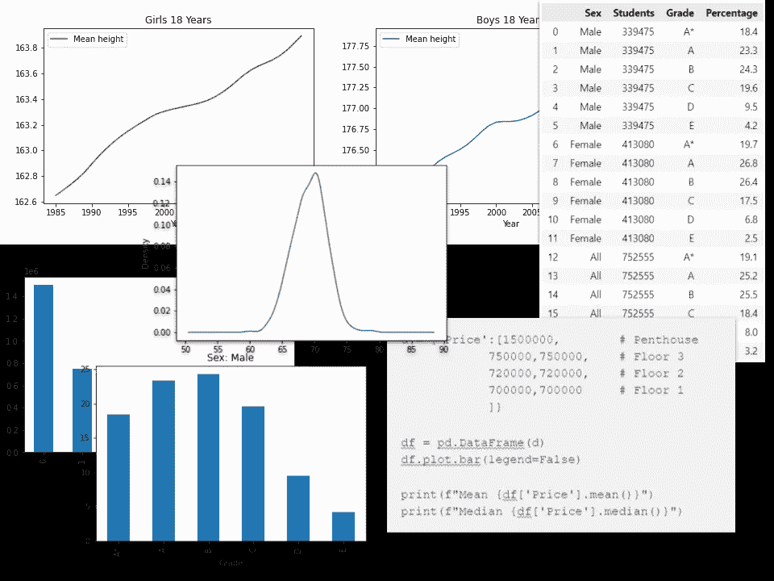

作者的各种图像

18 岁英国男性的平均身高是多少？还是马德里的房子均价？还是英格兰高中生达到的平均成绩？

这些都是很好的问题，但它们各自的含义略有不同。

第一种情况的平均值是用*平均值*计算出来的，房价用*中位数*和学校成绩用*模式*来表示会更好。

我们将尝试并解决何时使用哪种测量方法。

# 平均水平

平均值是集中趋势的度量，是一组数据的一种总结或概述。通常，我们希望通过将一组值相加，然后除以这些值的个数来计算它。但这只是“平均”一词的三种基本解释之一。

我刚刚描述的一个是平均值，这对于像身高这样的正态分布的数据非常适用。*中值*是中间值，意味着该值的两侧有相同数量的测量值。

正如 Alberto Cairo 告诉我们的，“你需要记住的是，均值对极值非常敏感，而中值则不敏感。中位数是一个有抵抗力的统计数字。”

也就是说，相对少量的异常值不会从根本上改变中值，而平均值会。在某些情况下，这可以使中位数成为一个更好的衡量标准，我们稍后在研究房价时会看到这一点。

第三个“平均值”是*模式*，它是集合中最常见的值，通常是处理分类数据时的唯一选项。

让我们来看一些如何使用它们的例子。

# 平均值

你可以合法地追踪 18 岁英国人的身高，把他们的身高加在一起，然后除以 18 岁英国人的数量。(这是一项艰巨的任务，所以你可能想取一个有代表性的样本——你还想把他们分成两组:男性和女性)

如果你追踪这个时间，你会得到如下图。

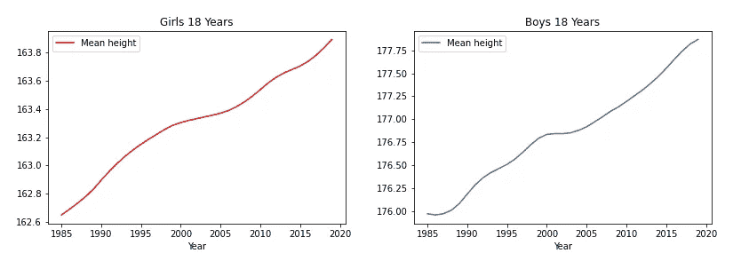

图片由作者提供—数据来源: [*我们的世界在数据中*](https://ourworldindata.org/grapher/average-height-by-year-of-birth?country=~OWID_WRL) ，知识共享许可

这很好，因为人类的身高遵循正态分布。

在正态分布中，值均匀分布在中心点周围，类似于下图所示的左侧和右侧逐渐变小。

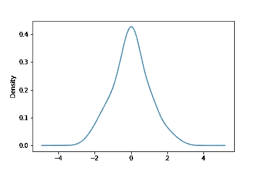

正态分布曲线-作者图片

如果我们观察一组人的身高，我们可以看到测量结果遵循着几乎相同的模式。

在下图中，我们使用了有影响力的统计学家弗朗西斯·高尔顿爵士(1822-1911)在他的著名实验中记录的身高数据，该实验阐释了回归均值的统计概念(他指出，较矮的人的成年后代往往比他们的父母高，而较高的父母的后代往往比他们的父母矮)。

我们使用这里的数据只是为了探索 500 多名 18 岁成年男性的身高范围。高尔顿的数据是在公共领域，可以在许多网站上找到。在这里，我从哈佛大学的 Dataverse 下载了它。

在下面的代码中，我们过滤了高尔顿的数据，创建了一个所有男性身高的密度图。

```
gal = pd.read_csv('galton-stata11.csv', delimiter='\t')
gal['height'][gal['male']==1].plot.density();
```

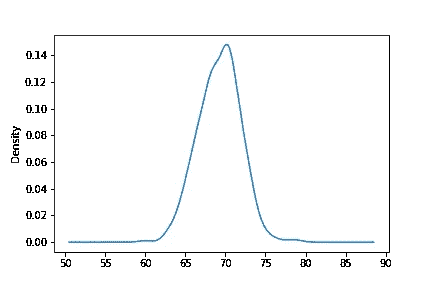

高尔顿的身高数据——资料来源:哈佛数据世界的公共领域数据

如你所见，图表非常接近正态分布，平均值约为 70 英寸。

Pandas 给了我们一种方便的方法，可以用来求一系列值的平均值

```
gal['height'][gal['male']==1].mean()
```

从中我们得到了结果:

*69 . 430108*

# 中间值

在正态分布的情况下，平均值和中值是相同的值，但对于其他类型的分布则不是这样。

拿房价问题来说。世界上大多数主要城市都有各种各样的房产和价格，但也有相对较少的非常昂贵的房产。这些昂贵的房产扭曲了平均值。

因此，与其衡量马德里一套公寓的平均价格，不如衡量一套普通公寓的价格更有意义。

听起来是一回事吗？让我们看一个简单的虚构例子。想象一下，一个公寓楼有不同大小的物业:它们大多是三居室公寓，但在大楼的顶部有一个豪华阁楼，占据了大楼的整个顶层。

该公寓楼位于马德里市中心的热门区域，距离 Retiro 公园不远。没有一套公寓会便宜。

假设有 4 层。每层楼都有两个三居室公寓，底层价格为 70 万€，下一层为 72 万€，上一层为 75 万€，顶层是顶层，我们说过是顶层公寓，有五个卧室，价值 150 万欧元。

如果我们对价格进行算术平均，我们将得到大约 834，285€的平均值。但没有人支付公寓的价格，除了一个人之外，所有人都低于这个数字，因为只有一个人不得不为他们的公寓支付 150 万美元。

因此，即使是平均价格，平均数也不是一个非常有用的数字。衡量平均值的更好方法是中值，即 720，000€的中间值，它更好地代表了大多数人支付的价格。

下面是说明该示例的一小段代码:

```
d = {'Price':[1500000,        # Penthouse
            750000,750000,    # Floor 3
            720000,720000,    # Floor 2
            700000,700000     # Floor 1
            ]}df = pd.DataFrame(d)
df.plot.bar(legend=False)print(f"Mean {df['Price'].mean()}")
print(f"Median {df['Price'].median()}")
```

它打印出以下内容:

意思是说 8360 . 488888868686

*中位数 720000.0*

观察柱状图可以清楚地看出，平均价格并不能很好地说明公寓价格，中位数是一个更好的衡量标准。

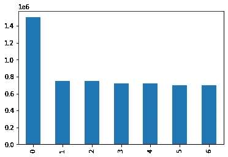

这是一个简单的例子，但它说明了任何大城市的房地产价格范围，在这些城市中，普通房屋或公寓的价格远低于相对较少的非常昂贵的房地产。

因此，平均值是所有房地产价格的平均值，中位数是平均房地产价格，在这种类型的例子中，这是一个更有用的数字。

# 模式

该模式可用于数值数据，但通常用于查找分类数据的集中趋势。

让我们来看看我们的第三个问题，英语高中生的平均考试成绩。下面是 Ofqual⁴提供的 2021 年 18 岁学生“A level”考试成绩表(a level 基本上是英国学生进入大学的途径)。

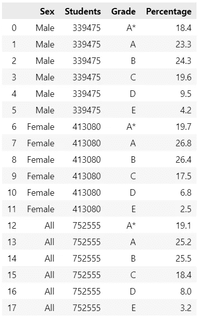

作者图片——来源:Ofqual⁴

成绩分为 A*、A、B、C、D 和 E，成绩按性别分列，并给出了每个成绩的百分比。所以你可以看到 18.4%的男生获得了 A*，19.7%的女生获得了相同的成绩，总的来说，所有学生获得 A*的比例是 19.1%。

显然，我们无法通过计算平均值来找到平均值，因为数据不是数字，但我们可以清楚地看到哪个是最受欢迎的等级。这里有一些柱状图可以说明这一点:

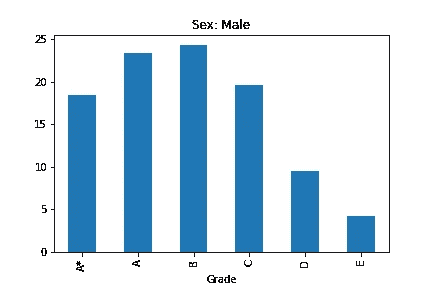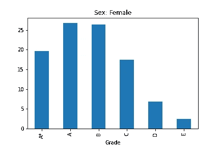

由此我们可以看出，获得“B”级的男性比其他任何人都多，但对于女性来说，却是“A”级。

这是最受欢迎的等级，即*模式*，这是显示平均等级的一种清晰方式。

Pandas 也给了我们一个计算模式的有用方法。这是一组虚构的数据，或多或少遵循上述模式。它显示了 33 名学生及其成绩的列表:6 名学生获得了 A*，8 名获得了 A，9 名获得了 B，6 名获得了 C，3 名获得了 D，1 名获得了 E。

我们将其转换为数据帧，并按如下方式计算模式:

```
res = {'Grade':[ 'A*','A*','A*','A*','A*','A*',
                 'A','A','A','A','A','A','A','A',
                 'B','B','B','B','B','B','B','B','B',
                 'C','C','C','C','C','C',
                 'D','D','D',
                 'E']}r = pd.DataFrame(res)
r.mode()
```

我们从熊猫身上得到的结果是一个数据框架:

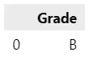

数据框中的第一行给出了值“B ”,这是该列表的模式，因为“B”等级比任何其他等级都多。

为什么是数据帧？因为可以有不止一种模式。让我们改变数据，使“A”级和“B”级的数量相同。

```
res = {'Grade':[ 'A*','A*','A*','A*','A*','A*',
                 'A','A','A','A','A','A','A','A','A',
                 'B','B','B','B','B','B','B','B','B',
                 'C','C','C','C','C','C',
                 'D','D','D',
                 'E']}r = pd.DataFrame(res)
r.mode()
```

现在我们有两种模式-数据是多模式的-这反映在生成的数据框中。

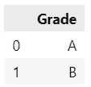

作者图片

有趣的是，如果我们从上面的房价数据中找出模式，我们会得到下面的结果。

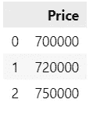

作者图片

在这种情况下，因为三种价格下的公寓数量相同，所以我们有三种模式，这不是很能说明问题，因此强化了中位数是该数据的更好衡量标准的观点。

## 代码和数据

您可以在我的 Github 页面上找到一个 Jupyter 笔记本的链接，上面有代码(除此之外还有更多)和文章中使用的所有数据文件。

[](https://alanjones2.github.io) [## AlanJones:编码、科学和技术

### 使用 Streamlit、Plotly、Python 和 Flask 为 web 构建数据可视化应用程序。适用于…的文章、教程和应用程序

alanjones2.github.io](https://alanjones2.github.io) 

一如既往地感谢您的阅读，如果您想了解我发表的新文章，请考虑注册下面的电子邮件提醒或订阅我偶尔在 [Substack](https://technofile.substack.com/) 上发布的免费简讯。

[](https://technofile.substack.com) [## 技术文件

### 技术、科学、数据科学和编码。点击阅读阿兰·琼斯的技术文件，这是一个子堆栈出版物，包含…

technofile.substack.com](https://technofile.substack.com) [](https://medium.com/membership/@alan-jones) [## 通过我的推荐链接-阿兰·琼斯加入媒体

### 阅读阿兰·琼斯的每一个故事(以及媒体上成千上万的其他作家)。你的会员费直接支持艾伦…

medium.com](https://medium.com/membership/@alan-jones) 

## 笔记

1.  这句话出自大卫·施皮格尔哈尔特的优秀著作《统计学的艺术:如何从数据中学习》 ，大卫·施皮格尔哈尔特，2021
2.  来自:[真实的艺术:用于交流的数据、图表和地图](https://www.amazon.com/Truthful-Art-Data-Charts-Communication/dp/0321934075/ref=sr_1_1?crid=8HMSER2S3KGY&amp;keywords=the+truthful+art&amp;qid=1648296406&amp;sprefix=the+truthful%252Caps%252C208&amp;sr=8-1&_encoding=UTF8&tag=alanjones01-20&linkCode=ur2&linkId=a2754f486d4ed4cd3e076ea9d9bd80e3&camp=1789&creative=9325)，阿尔贝托·开罗，2016
3.  高尔顿的数据可以从很多地方获得(尝试谷歌“高尔顿身高数据”)，但这个版本是从哈佛大学的 Dataverse 下载的:Francis Galton，2017，“[高尔顿身高数据](https://dataverse.harvard.edu/file.xhtml?persistentId=doi:10.7910/DVN/T0HSJ1/WO9T4N&version=1.1#)”，[https://doi.org/10.7910/DVN/T0HSJ1](https://doi.org/10.7910/DVN/T0HSJ1)，哈佛 Dataverse，公共领域许可证 [CC0 1.0](http://creativecommons.org/publicdomain/zero/1.0)
4.  A-level 数据是 qual[https://analytics.ofqual.gov.uk/apps/Alevel/Outcomes/](https://analytics.ofqual.gov.uk/apps/Alevel/Outcomes/)的*发布的结果的子集，根据[开放政府许可 v3.0](https://www.nationalarchives.gov.uk/doc/open-government-licence/version/3/) 使用*

*(本文包含代销商链接，这意味着如果你购买了某样东西，我会得到一小笔佣金，但你不会再为该产品支付任何费用)*