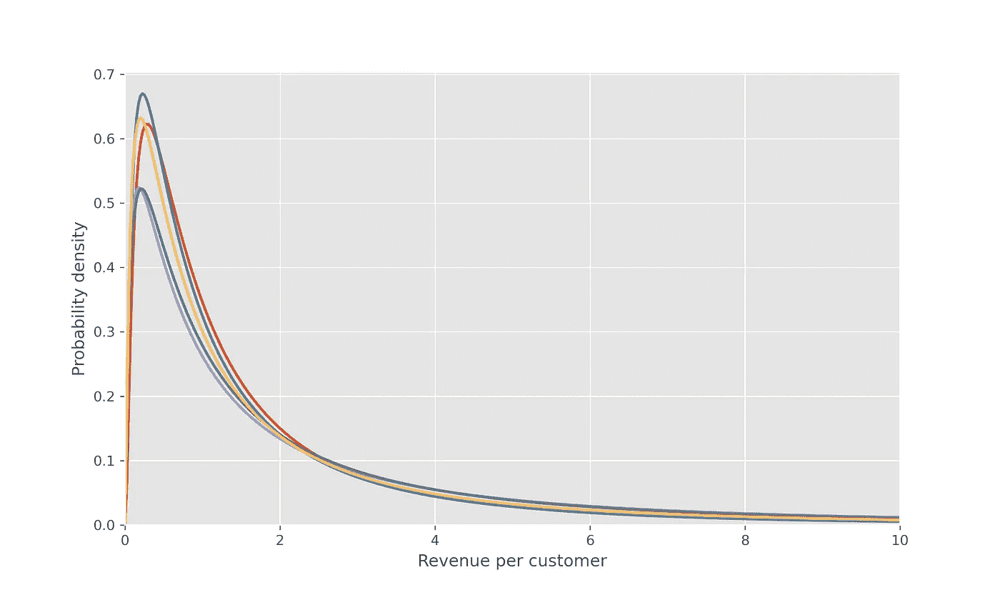
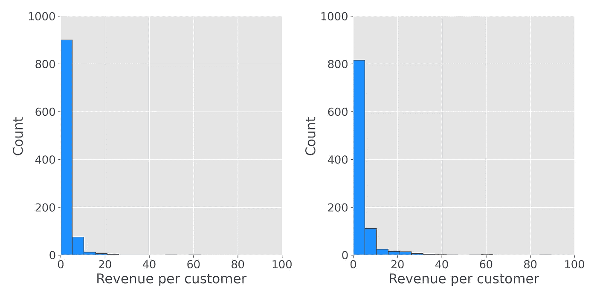
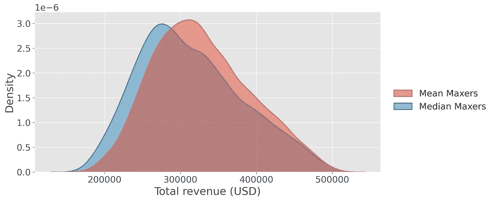
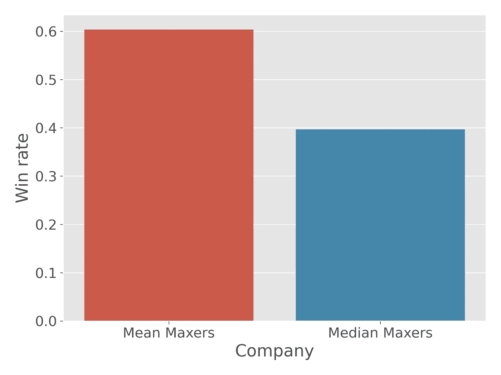

# 均值还是中值？基于决策而不是分配来选择

> 原文：<https://towardsdatascience.com/mean-or-median-choose-based-on-the-decision-not-the-distribution-f951215c1376>

## 即使对于有偏差的数据，平均值有时也会导致更好的决策

雷米·吉林在 [Unsplash](https://unsplash.com?utm_source=medium&utm_medium=referral) 上拍摄的照片

当我面试数据科学申请者时，我最喜欢的问题之一是，“*什么时候使用平均值而不是中位数更好？*

这个问题不仅帮助我评估候选人的统计学基础，还让我一瞥他们是如何处理问题的。他们强调数据的本质还是决策？

大多数候选人会这样回答:

> 当数据遵循对称分布时，平均值通常更好。当数据有偏差时，中位数更有用，因为平均值会被异常值扭曲。”

这个答案抓住了我在**统计课程**中学到的传统智慧。它侧重于数据的性质，而不考虑分析的目标。

**决策分析课程**教会了我解决这个问题的不同方法。决策分析引导我们关注我们的目标，而不是关注数据的本质。

> 事实上，在许多应用中，即使数据有偏差，平均值也比中值更有用。

让我们从三个经典的例子开始，这些例子都涉及到有偏差的数据，在这些数据中，平均值或中值都出现了惊人的错误。

## 示例 1:货币彩票

假设你可以选择玩下面的一个机会游戏:

**游戏甲:**

*   1/3 的机会赢得 1 美元
*   1/3 的机会赢得 2 美元
*   1/3 的机会赢得 3 美元

**游戏 B:**

*   1/3 的机会赢得 1 美元
*   1/3 的机会赢得 1.90 美元
*   赢得 100 万美元的三分之一机会

你会选哪一个？

大多数人会选择玩游戏 B，即使它的中位数较低(1.90 美元对 2.00 美元)。在这种情况下，使用平均值更有意义，即使分布是偏斜的。

中位数的论点在这里没有意义:

“我应该把我的决定建立在一个不受事实影响的标准上，即我有 1/3 的机会通过 b 游戏成为百万富翁。”

100 万美元的 1/3 概率是一个极端值，但它是分布的一部分，与决策相关。

## 例 2:比尔·盖茨走进一家酒吧

一个常见的笑话是这样的:

"比尔·盖茨走进一家酒吧，里面的每个人都成了百万富翁."

这个笑话凸显了均值是如何具有误导性的。没有上下文，人们可能会认为酒吧里全是百万富翁，而实际上可能是零个百万富翁。在这种情况下，中位数给出了一个大多数人会觉得更直观的结果。

这个例子的一个重要特征是，它是关于**数据通信**而不是**决策。**这个例子是唯一一个不涉及明确决策的例子。

关于数据通信的观点无疑是正确的；研究人员在报告家庭收入时使用中位数是有充分理由的。中位数通常能更好地说明什么是“典型”值，这有助于提供关于数据集的直觉。

> 给出“典型”值的最直观感觉的度量不一定是导致最佳决策政策的度量。

## 示例 3:一家考虑扩张的公司

一家公司正在考虑扩张。扩展将涉及雇用 300 名新员工，因此公司需要估计该计划的总成本。

工资和收入一样，倾向于向右倾斜。我们可以预计，新工作的平均工资将高于中位数。

公司的一名分析师决定使用中位数，因为工资的分布是向右倾斜的。他们用中位数乘以 300 来估算雇佣新员工的总成本。

事实证明，实际成本比他们的估计要高得多。为什么？*因为他们本该使用卑鄙的手段。*

在这种情况下，公司感兴趣的是总数。**平均数与总数有直接关系(总数=平均数 x N)，但中位数没有。**

> 一般来说，当分析的目的是估计总体时，无论分布的形状如何，平均值都比中值更有用。

# 两家竞争公司的模拟

评估统计方法有效性的最佳方法之一是对合成数据进行蒙特卡罗模拟。

因此，让我们模拟一家基于**均值**做出决策的公司与一家基于**中位数**做出决策的公司竞争。

我们可以模拟的一个相对简单的商业决策是 A/B 测试。在 A/B 测试中，一个公司面临着发布产品的两个不同版本(变体)的决定——A 和 B。

为简单起见，我们将这模拟为“赢家通吃”测试，这意味着公司选择测试中出现更好的变体，而不计算统计显著性。当没有控制组时，这种方法是合理的，并且商业问题的风险相对较低。

在向**整个**客户群发布变体 A 或 B 之前，公司用客户样本测试变体 A，用不同的客户样本测试变体 B。

基于变体 A 和 B 在测试中的表现，公司选择向整个客户群发布变体 A 或变体 B。

这里是设置的摘要。在每次模拟中:

*   我们将随机生成两个偏态分布。这些分布代表变量 A 和 b 的每用户收入的真实分布。
*   为了决定发布哪个变体，这些公司将分析一个数据集，该数据集由变体 A 的发行版中的 1，000 个和变体 B 的发行版中的 1，000 个组成。这些绘图组成了“测试数据集”
*   为了隔离决策方法的影响，**两家公司分析相同的 A/B 测试数据集。**
*   每个公司将根据测试数据集选择 A 或 B。
*   在选择了一种变体之后，每家公司都会向其整个客户群“大规模”推出其首选变体。我们将通过从每个公司选择的发行版中生成 100，000 个抽奖来模拟这一步骤。这些抽奖代表了从每家公司的 100，000 名客户那里获得的收入。
*   业务目标是最大化**总收入**，所以我们会在每个公司大规模发布其首选变体时，根据每个公司的总收入来评估每个公司的决策政策。

现在让我们进入 Python 实现。完整的实现可以在 [GitHub](https://github.com/tbuffington7/a-tale-of-two-companies) 上获得。我鼓励读者尝试它，以理解不同的决策框架如何导致不同的业务结果。

首先，我们需要编写一个生成随机偏态分布的函数。我选择对数正态分布，因为它们是偏斜数据的常见模型。

回想一下，如果变量 *x* 具有对数正态分布， *log(x)* 具有正态分布。我发现根据基础正态分布的均值( *mu* )和标准差( *sigma* )来表征对数正态分布的参数是很直观的。

在这个函数中，我们从 0 到 0.5 之间的均匀分布中随机抽取 *mu* ，从 1 到 1.5 之间的均匀分布中抽取 *sigma* :

该函数生成如下所示的分布:

图片作者。模拟中使用的随机生成的偏斜分布的示例。

在每次模拟中，公司将得到两个这样的分布，他们需要从每个分布中随机抽取 1000 个样本，从中选择一个。

以下是测试数据集的一个示例:

图片作者。公司在给定模拟中分析的测试数据示例。

看着这些数据集，这两家公司就应该如何做出决策得出了不同的结论:

*   *中值最大值*注意到分布非常偏斜。事实上，看起来有些数据点可能是异常值。为了减少异常值的影响，他们选择测试数据集具有**更高中位数**的分布。
*   *均值最大化者*意识到潜在的目标是最大化总收入，所以他们选择测试数据集均值**更高的分布。**

我们可以用以下函数来表示两家公司的决策政策:

运行 5，000 次模拟后，两家公司的收入分布如下所示。

图片作者。5，000 次模拟中每家公司的收入分布。

虽然两家公司的总收入在模拟中有所不同，但很明显，平均最大者的收入分配明显更高。

我们也可以看一个柱状图来回答这个问题:*平均最大值超过中值最大值的时间百分比是多少？*

图片作者。两家公司的胜率。

在大约 60% **的模拟中，平均最大值优于中值最大值。**

这个结果很有意思。凭直觉，这两家公司似乎应该经常得出相同的结论，因为具有较高平均值的分布通常应该具有较高的中值。

基于我们使用的对数正态参数，这些公司在大约 70%的模拟中选择了相同的变量。当这两家公司选择相同的变体时，有 50%的可能性其中一家会胜过另一家。

然而，当公司选择不同的变量时，**在大约 86%的模拟中，平均最大值优于中值最大值**。

这些数字取决于我们使用的确切模拟设置，但关键是这代表了一种相当常见的业务情况，其目标是最大化总价值。**有了这个目标，基于中间值而非平均值做出决策会导致战略劣势。**

# 什么时候我们应该使用中位数(或者，更一般地，分位数)？

需要说明的是，我并不是说中间值从来没有帮助。有时中间值与分析的目标一致。

在有些应用中，中位数(或分位数)比平均数更有优势。以下是一些例子:

1.  **数据讲故事。**当手头没有明确的决策时，中位数通常更有助于报告有偏差的数据。它给出了分布中“典型”值的更直观的感觉。然而，对于为公司工作的数据科学家来说，手头几乎总是有一个决定。
2.  **有时候一个问题直接用中位数来回答。**如果我们需要知道给定的工资是否高于部门工资的一半，我们需要中位数。
3.  当我们关心确保一定水平的服务时。例如，我与消防部门合作时，他们关心的是以高概率提供一定的响应时间。因此，他们经常使用第 90 个百分位数的响应时间来评估自己的表现。如果他们使用*平均*响应时间，他们可以用非常短的响应时间来补偿长的响应时间，这与公共安全目标不一致。
4.  **当我们受到激励去最小化预测的绝对误差时。**正如本文[中所讨论的](https://www.tandfonline.com/doi/full/10.1080/10691898.2009.11889533)，分布的中值是使平均绝对误差最小的值。

# 日志转换呢？

处理倾斜数据的一种常见方法是使用数据转换，例如取对数。这些转换在许多应用中是有帮助的；它们可以减轻右倾，强制数据为正，并提高预测模型的性能。

然而，我们还需要小心，不要以无意中改变决策政策的方式使用它们。

您更喜欢以下两个选项中的哪一个:

*   选项 1:一张 10 美元钞票和一张 1 美元钞票
*   选项 2:两张 5 美元的钞票

大多数人会选择选项 1，因为$10 + $1 大于$5 + $5。如果在求和之前进行对数变换，您会更喜欢选项 2，因为$5 x $5 大于$10 x $1。**日志转换改变了决策策略。**

这个变化不*必然*不好。在某些情况下，将决策建立在乘积而非总和的基础上是有意义的。

> 当我们努力使统计变得更容易时，问题就出现了，这无意中把我们的利益相关者引入了一个次优的策略。

在上一节的模拟中，我考虑添加第三家公司，即 *Log Transformers* ，它将在取平均值之前取测试数据集的对数。然后他们会选择在对数尺度上具有更大平均值的变量。该策略相当于选择具有较高[几何平均值](https://en.wikipedia.org/wiki/Geometric_mean)的分布。

中值等于对数正态分布的几何平均值，因此*对数转换器*将具有与*中值最大值几乎相同的策略。他们的策略也不如平均最大化者。*

# 离群值呢？

当最优决策政策建议我们应该使用平均值而不是中位数时，我们需要小心异常值，因为它们会扭曲平均值。

但答案不是用一个导致次优决策的指标来代替均值。

相反，我们应该首先理解**为什么**数据集中有离群值。

它们是测量误差的结果吗？如果是这样，我们应该考虑将他们排除在分析之外。如果离群值是对现实的准确测量，我们需要使用合理的判断。

离群值可能是侥幸的结果。例如，在一个电子商务网站上，一小部分客户可能是订单异常大的企业。如果您正在运行一个 A/B 测试，并且一个测试组包括一个像这样的用户，它可能会以一种不希望的方式扭曲结果。

根据具体情况，其他方法，如 [winsorized 手段](https://en.wikipedia.org/wiki/Winsorized_mean)可能会有所帮助。这里没有通用的解决方案。最好的建议是专注于分析的目标，发展领域知识以理解异常值的原因，然后从那里使用良好的判断。

> 在处理离群值时，首先要关注理解它们为什么存在。之后，问问自己，他们是否是分布中有意义的一部分。

# 我们应该使用汇总统计数据吗？

有些人认为汇总统计在某些情况下会产生误导，我们应该关注“整个分布”。

这个想法有一些优点。查看整个分布可以揭示标准汇总统计无法捕捉的洞察力。

例如，观察 A/B 测试中的分布可以揭示不同的影响——这意味着一种治疗对一些用户的影响可能不同于其他用户。

然而，我们的目标通常是将数据转化为决策，这需要以可操作的方式总结分布。

> 定量决策框架要求用单个数字概括一个分布，量化它与决策者偏好的一致程度。

没有这一点，我们就无法量化一种分布是否优于另一种分布。决策分析有助于解决这个问题；它的中心目标之一是用一个单一的数字——行动的效用——来捕捉偏好和分布。

所以，是的，我们需要汇总统计数据。我们应该解释是什么驱动了汇总统计数据，但重要的是我们知道如何以一种捕捉决策者偏好的方式来汇总分布。

同样重要的是要注意，*还有许多其他的方法来总结分布，比如调和平均法、几何平均法和某些等价法。根据决策的性质，它们在某些情况下都是有用的。*

# 结论

既然我们已经深入探讨了这个问题，我们可以对“什么时候使用平均值而不是中位数更好？”给出一个更深思熟虑的答案

我会这样回答这个问题:

> 使用平均值或中值的选择应该主要由分析的目标决定。当潜在的业务决策取决于总额(例如总收入或总销售额)时，平均值通常是更好的指标，因为与中位数不同，它与总额有直接关系。平均值对极值很敏感，因此应注意确保它们是在干净、有意义的数据集上计算的。当分布是偏斜的时候，中位数可以提供一个“典型”值的更直观的感觉，但这并不一定意味着它是最优决策政策的基础。

这个主题还强调了数据科学家需要将决策分析的主题与统计、机器学习和编程一起纳入他们的学习计划。

感谢你阅读这篇文章。如果您对更多决策分析和统计内容感兴趣，请在 [Medium](https://tyler-c-buffington.medium.com/) 上关注我，或者在 [LinkedIn](https://www.linkedin.com/in/tyler-buffington-phd-82a1a212a/) 上联系我。

# 推荐资源:

1.  **Ronald a . Howard 的《决策分析基础》。这本书为决策分析的核心概念提供了一个极好的概述。这些概念帮助我成长为一名数据科学家。**
2.  [***从决策角度看均值、中值和众数*梅林达·米勒·霍尔特和斯蒂芬·m·斯卡利亚诺**](https://www.tandfonline.com/doi/full/10.1080/10691898.2009.11889533) **。**本文概述了使均值、中值或众数成为决策最佳衡量标准的数学条件。一些描述的激励结构在实践中并不常见，但本文为选择汇总统计数据提供了一个有趣的数学框架。
3.  [***你能解开这个射箭谜语*吗？**](https://www.youtube.com/watch?v=HIq57Ct7SbE)***by FiveThirtyEight(YouTube 视频)。这个谜语概括了一种情况，在这种情况下，均值不是决策的理想衡量标准。一些人指出这个谜语是均值无用的一个例子，因为分布是偏斜的。相反，我认为这是关于分析的目标。目标是最大化获胜概率，这不同于最大化期望总分。***