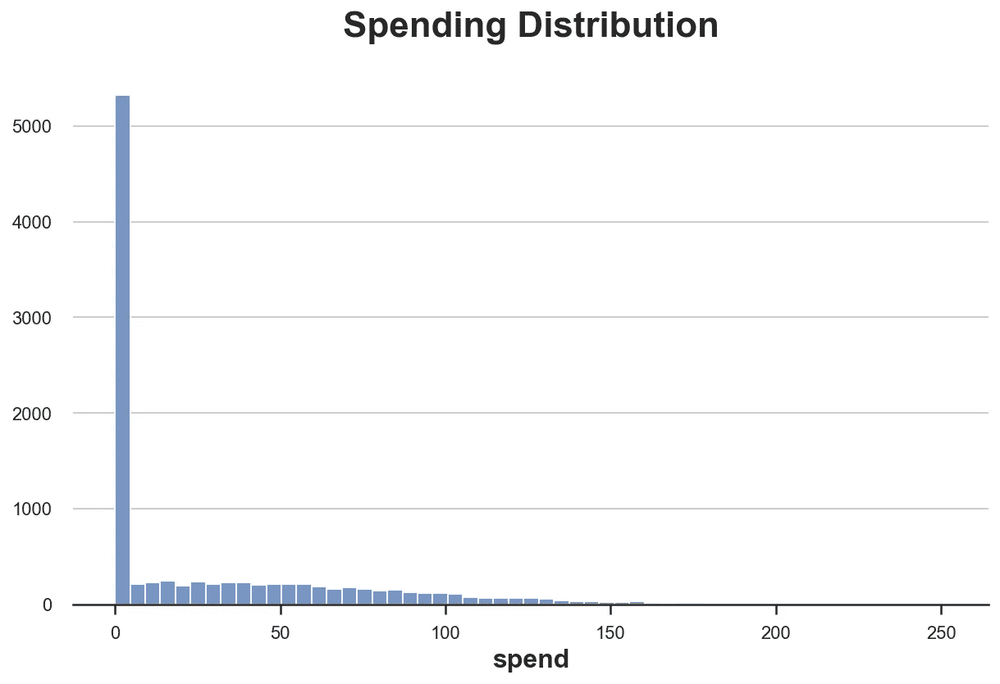
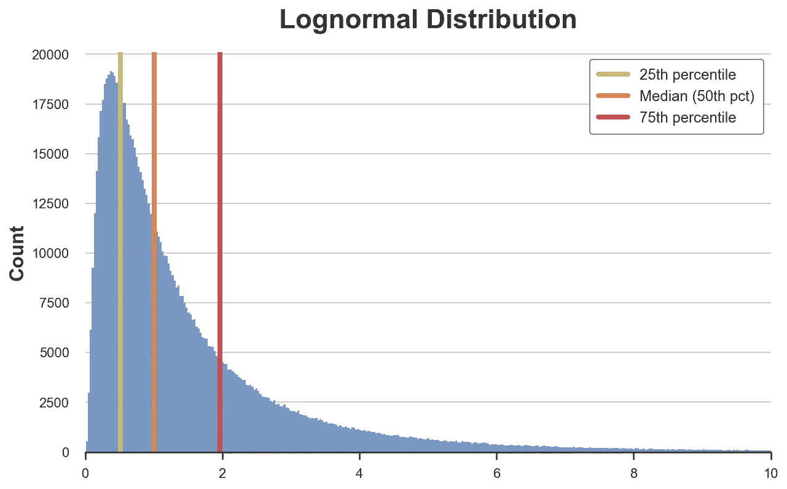
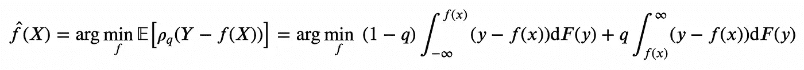
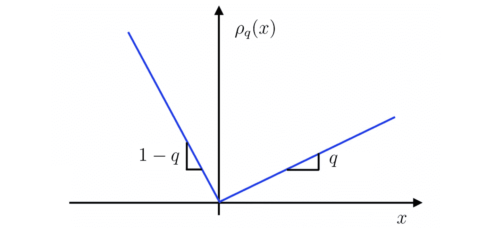
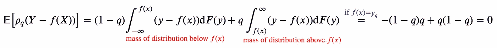
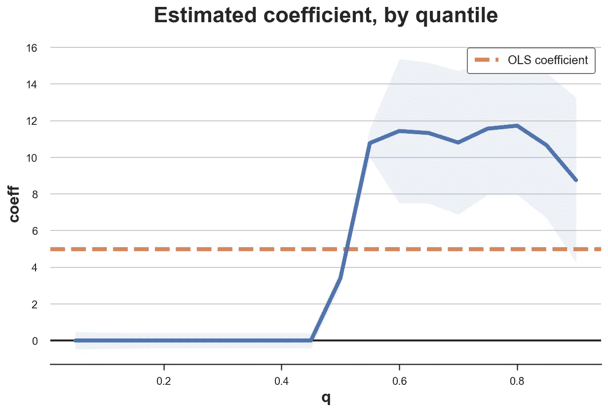
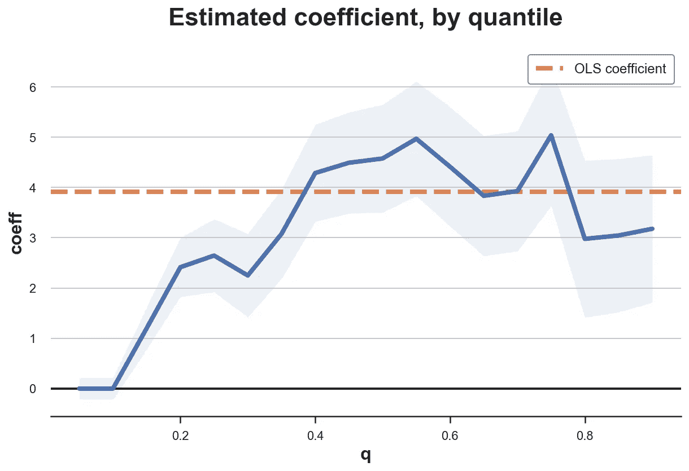

# 平均因果效应与中位数因果效应

> 原文：<https://towardsdatascience.com/mean-vs-median-causal-effect-37057a6c54c9>

## [因果数据科学](https://towardsdatascience.com/tagged/causal-data-science)

## *介绍 A/B 测试中的分位数回归*

封面图片，由作者使用[nightcafe](https://creator.nightcafe.studio/)生成

在 A/B 测试中，也称为[随机对照试验](https://en.wikipedia.org/wiki/Randomized_controlled_trial)，我们通常估计**平均治疗效果(ATE)** :治疗(药物、广告、产品……)对感兴趣的结果(疾病、公司收入、客户满意度……)的影响，其中“平均值”取自测试对象(患者、用户、客户……)。ATE 是一个非常有用的量，因为它告诉我们，如果我们用同样的方法治疗一个新的受试者，我们可以预期的效果。

然而，有时我们可能对不同于平均值的数量感兴趣，例如 [**中值**](https://en.wikipedia.org/wiki/Median) 。中位数是对*中心趋势*的另一种度量，它对异常值更稳健，并且通常在偏斜分布的情况下提供更多信息。更一般地说，我们可能想要估计结果分布的不同分位数[的影响。一个**常见用例**是研究 UI 变化对网站加载时间的影响:一个稍微大一点的网站可能对大多数用户来说是一个察觉不到的变化，但对少数连接非常慢的用户来说是一个很大的变化。另一个常见的用例是研究产品变化对很少有人购买的产品的影响:是现有客户购买更多，还是我们在吸引新客户？](https://en.wikipedia.org/wiki/Quantile)

这些问题很难用估计平均治疗效果的线性回归来回答。更合适的工具是**分位数回归**，它可以替代估计*中位治疗效果*。在本文中，我们将简要介绍分位数回归和分位数处理效应的估计。

# 忠诚卡和消费

假设我们是一家网上商店，我们想增加销售额。我们决定向顾客提供一张优惠卡，当他们在商店增加消费时，可以享受折扣。我们想评估忠诚卡是否能有效增加销售额，所以我们进行了一个 **A/B 测试**:我们随机地只向一部分顾客提供忠诚卡。

我从`[src.dgp](https://github.com/matteocourthoud/Blog-Posts/blob/main/notebooks/src/dgp.py)`导入数据生成过程`dgp_loyalty()`。我还从`[src.utils](https://github.com/matteocourthoud/Blog-Posts/blob/main/notebooks/src/utils.py)`引进了一些绘图函数和库。为了不仅包括代码，还包括数据和表格，我使用了 [Deepnote](https://deepnote.com) ，一个类似 Jupyter 的基于网络的协作笔记本环境。

现在，我们来看看数据。我们有 10，000 名客户的信息，我们观察他们的`spend`以及他们是否被提供了`loyalty`卡。我们还观察了一些人口统计数据，比如`age`和`gender`。

有趣的是，我们注意到感兴趣的结果`spend`，似乎有很多零。让我们深入了解一下。

## 平均值与中位数

在分析我们的实验之前，让我们看看我们的结果变量`spend`。我们首先使用**中心性度量**来检查它。我们有两个主要的选择:平均值和中间值。

首先，它们是什么？**平均值**捕捉平均值，而**中值**捕捉分布中心的值。一般来说，平均值在数学上更容易处理和解释，而中位数对异常值更稳健。你可以在网上找到很多文章来比较这两种方法，并建议哪一种更合适以及何时使用。我们来看看均值和中位数`spend`。

我们如何解读这两个数字？人们在我们商店平均消费 28 美元。但是，超过 50%的人什么都不花。正如我们所看到的，这两项措施都提供了大量信息，并且在一定程度上是互补的。通过绘制其直方图，我们可以更好地理解`spend`的分布。

支出分布，按作者分类的图像

从平均值和中值来看，`spend`的分布非常**偏斜**，超过 5000 名顾客(总共 10000 名)没有消费任何东西。

一个自然的问题是:我们对平均`spend`或中位数`spend`的`loyalty`卡片的影响感兴趣吗？第一个将告诉我们客户是否平均花费更多，而第二个将告诉我们客户是否平均花费更多。

线性回归可以告诉我们`loyalty`牌对平均`spend`的影响。然而，如果我们对`loyalty`卡片对中位数`spend`(或其他分位数)的影响感兴趣，我们能做什么呢？答案是**分位数回归**。

# 分位数回归

使用**线性回归**，我们尝试估计一个结果变量 *Y* (在我们的示例中为`spend`)相对于一个或多个解释变量 *X* (在我们的示例中为`loyalty`)的*条件期望函数*。

条件期望函数，作者图片

换句话说，我们想找到一个函数 *f* 使得 *f(X) =* 𝔼[ *Y|X* 。我们通过解决以下**最小化问题**来做到这一点:

条件期望函数的估计，作者图片

可以看出，解决这个极小化问题的函数 *f* 确实是 *Y* 的条件期望，相对于 *X* 。

由于 *f(X)* 可以是无限维的，我们通常估计 *f(X)* 的一个**参数形式**。最常见的是线性形式 *f(X)=βX* ，其中 *β* 通过求解相应的最小化问题来估计:

线性回归系数，作者图片

线性形式不仅仅是方便，还可以解释为 *f(X)* 的**最佳局部逼近**，参考泰勒展开式。

使用**分位数回归**，我们做同样的事情。唯一的区别是，我们不是估计 *Y* 相对于 *X* 的条件期望，而是要估计 *Y* 相对于 *X* 的 *q* - [分位数](https://en.wikipedia.org/wiki/Quantile)。

条件分位数函数，作者图片

首先，什么是**分位数**？维基百科的定义说

> 在统计学和概率学中，分位数是将概率分布的范围划分为具有相等概率的连续区间的切割点，或者以同样的方式划分样本中的观察值。常见的分位数有特殊的名称，如四分位数(四组)、十分位数(十组)、百分位数(100 组)。”

例如，0.1 分位数表示位于分布质量的 10%右侧的值。**中位数**是 0.5 分位数(或者，等价地，50ᵗʰ百分位或 5ᵗʰ十分位)，对应于分布中心的值。让我们看一个简单的例子，使用[对数正态分布](https://en.wikipedia.org/wiki/Log-normal_distribution)。我绘制了三个四分位数，将数据分成四个大小相等的区间。

对数正态分布的分位数，按作者分类的图像

如我们所见，三个四分位数将数据分成四个大小相等的区间。

那么，分位数回归的**目标**是什么呢？目标是找到一个函数 *f* 使得 *f(X) = F⁻ (y_q)* ，其中 *F* 是 *Y* 的[累积分布函数](https://en.wikipedia.org/wiki/Cumulative_distribution_function)，而 *y_q* 是 *Y* 分布的*q*-分位数。

我们如何做到这一点？用一点线性代数就可以表明，我们可以获得条件分位数作为下面的**最小化问题**的解:

条件分位数函数估计，作者图片

其中 *ρ_q* (上面隐式定义)是具有以下形状的辅助加权函数。

Rho 加权函数，图片由作者提供

目标函数背后的**直觉**是什么？

这个想法是我们可以这样解释这个等式

目标函数解释，图像由作者提供

所以，当 *f(X)* 对应分位数 *y_q* 时，目标函数值为零。

与之前完全一样，我们可以估计出 *f* 的一个**参数形式**，并且与之前完全一样，如 [Angrist、Chernozhukov 和 Fernández-Val (2006)](https://onlinelibrary.wiley.com/doi/abs/10.1111/j.1468-0262.2006.00671.x) 所示，我们可以将其解释为**最佳局部近似**。

分位数系数，作者图片

我们写了 *β̂ _q* 来表示这是条件 *q* 分位数函数的最佳线性近似系数。

我们如何估计分位数回归？

## 估计

[statsmodels](https://www.statsmodels.org/stable/index.html) 包允许我们用`[quantreg()](https://www.statsmodels.org/dev/generated/statsmodels.regression.quantile_regression.QuantReg.html)`函数估计分位数回归。我们只需要在拟合模型时指定分位数 *q* 。我们用 *q=0.5* ，对应中值。

分位数回归估计`loyalty`的正系数。这个估计与线性回归相比如何？

线性回归的估计系数较高。这是什么意思？稍后，我们将在分位数回归系数的*解释*上花费更多时间。

我们能以其他变量作为分析的条件吗？我们怀疑`spend`也会受到客户人口统计的影响，我们希望通过对`age`和`gender`进行条件分析来提高我们估计的精确度。我们可以将变量添加到`quantreg()`模型中。

当我们对`age`和`gender`进行条件分析时，`loyalty`的系数增加。线性回归的情况并非如此。

有几件事我们还没有提到。第一个是**推理**。在分位数回归中，我们如何计算估计值的置信区间和 p 值？

## 推理

累积分布 *F* 的 *q-* 分位数的估计值 *y* 的渐近方差由下式给出

分位数渐近方差，作者图片

其中 *f* 是 *F* 的[密度函数](https://en.wikipedia.org/wiki/Probability_density_function)。这个表达式可以分解成**两个分量** : *q(1-q)* 和 *f⁻ (y)* 。

第一个分量 *q(1-q)* 告诉我们，分位数越接近分布的中心，分位数的方差就越高。为什么会这样呢？首先，我们需要考虑一个点的分位数何时响应第二个点的值的变化而变化。当第二个点从第一个点的左侧交换到右侧(反之亦然)时，分位数会发生变化。如果第一个点位于分布的中间，这在直觉上是非常容易的，但是如果它位于极值，这就非常困难了。

第二个成分， *f⁻ (y)* ，告诉我们，如果点**是孤立的**，那么方差更高，因此我们对它的了解更少。

重要的是，估计分位数的方差需要对 *Y* 的整个分布进行**估计。这是通过近似来完成的，并且计算量非常大。如果这个过程变得计算量太大，像 bootstrap 或[贝叶斯 bootstrap](/6ca4a1d45148) 这样的替代程序总是可用的。**

第二个我们还没有谈到的是估算系数的**解释**。我们通过中值回归得到了`spend`的较低系数`loyalty`。这是什么意思？

## 解释

线性回归系数的**解释**很简单:每个系数都是条件期望函数𝔼[ *Y|X* 相对于 *X* 一维的导数。在我们的例子中，我们可以将`loyalty`的回归系数解释为平均`spend`从获得`loyalty`卡开始增加。重要的是，这里的“平均”是指平均而言，每个客户都是如此。

然而，分位数回归系数的解释是很棘手的。之前，我们很想说`loyalty`卡增加了中位顾客 3.4 美元的消费。但是**是什么意思**？是同一个中位客户花费更多，还是我们有不同的中位客户？这可能看起来像一个哲学问题，但它对报告分位数回归结果有重要意义。在第一种情况下，我们正在做一个声明，至于线性回归系数的解释，适用于一个*单一个体*。在第二种情况下，我们正在对*分布*进行陈述。

[Chernozhukov 和 Hansen (2005)](https://onlinelibrary.wiley.com/doi/abs/10.1111/j.1468-0262.2005.00570.x) 表明一个强有力但有用的假设是**秩不变性**:假设处理**不改变**分布的相对组成。换句话说，如果我们在实验前按`spend`对人进行排名，我们假设这个排名不受`loyalty`卡的引入的影响。如果我以前花的比你少，我以后可能会花更多，但仍然比你少(对任何两个人来说)。

在这种假设下，我们可以将分位数系数解释为**位于结果分布不同点的单个个体**的边际效应，如上面提供的第一种解释。此外，我们可以报告许多分位数的治疗效果，并将每个分位数解释为不同个体的局部效果。让我们绘制不同分位数`spend`的治疗效果分布图。

分位数因果效应，按作者分类的图像

这个情节**极有见地**:对于几乎一半的客户来说，`loyalty`卡没有任何作用。另一方面，已经在消费的顾客最终会消费更多(大约多 10/12 美元)。这是一个非常强大的洞察力，我们可能会错过一个估计平均影响为 5 美元的线性回归。

我们可以重复同样的练习，根据`gender`和`age`进行分析。

条件分位数因果效应，作者图片

对其他协变量的调节消除了治疗效果的异质性。这张卡增加了大多数人的支出。

# 结论

在本文中，我们探讨了一个不同的**因果估计**:中位数治疗效果。与我们通常估计的平均治疗效果相比如何？利弊与中位数的利弊密切相关相对于作为*集中趋势*衡量标准的均值。中位治疗效果更能说明对普通受试者的影响，对异常值也更稳健。然而，它们在计算上要求更高，并且它们需要用于识别的强假设，例如秩不变性。

## 参考

[1] R. Koenker，[《分位数回归》](https://www.cambridge.org/core/books/quantile-regression/C18AE7BCF3EC43C16937390D44A328B1) (1996)，剑桥大学出版社*。*

*[2] R. Koenker，K. Hallock，[分位数回归](https://www.aeaweb.org/articles?id=10.1257/jep.15.4.143) (2001)，*《经济展望杂志》*。*

*[3] V. Chernozhukov，C. Hansen，[一个分位数处理效应的 IV 模型](https://onlinelibrary.wiley.com/doi/abs/10.1111/j.1468-0262.2005.00570.x) (2005)，*计量经济学*。*

*[4] J. Angrist，V. Chernozhukov，I. Fernández-Val，[错误设定下的分位数回归，应用于美国工资结构](https://onlinelibrary.wiley.com/doi/abs/10.1111/j.1468-0262.2006.00671.x) (2006)，*计量经济学*。*

## *相关文章*

*   *[Dag 和控制变量](/b63dc69e3d8c)*
*   *[贝叶斯自举](/6ca4a1d45148)*
*   *[再见散点图，欢迎入库散点图](/a928f67413e4)*

## *密码*

*你可以在这里找到 Jupyter 的原始笔记本:*

*<https://github.com/matteocourthoud/Blog-Posts/blob/main/notebooks/quantile_reg.ipynb> * 

## *感谢您的阅读！*

**真的很感谢！*🤗*如果你喜欢这个帖子并且想看更多，可以考虑* [***关注我***](https://medium.com/@matteo.courthoud) *。我定期发布与因果推理和数据分析相关的主题。我尽量让我的帖子简单而精确，总是提供代码、例子和模拟。**

**还有，一个小小的* ***免责声明*** *:我写作是为了学习所以错误是常态，尽管我尽力了。当你发现他们的时候，请告诉我。也很欣赏新话题的建议！**