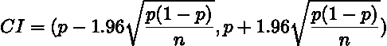
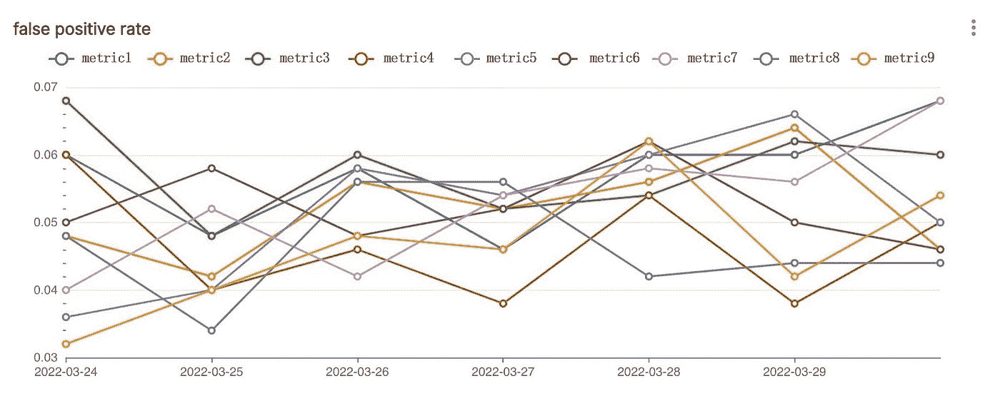
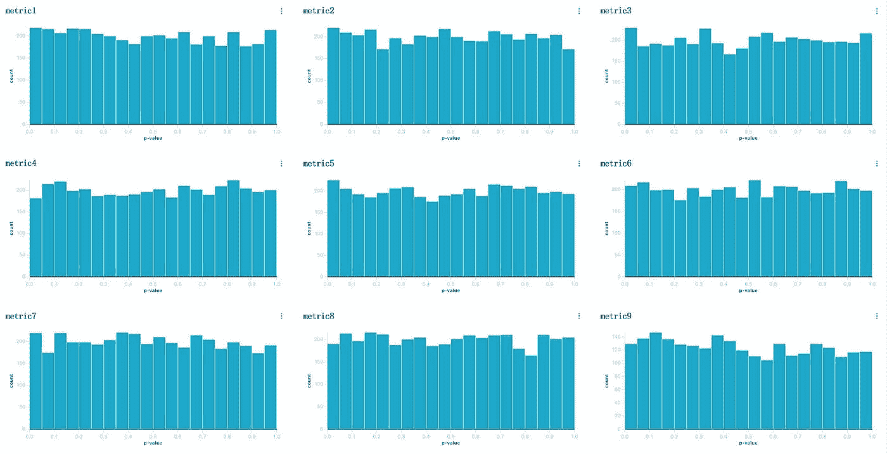
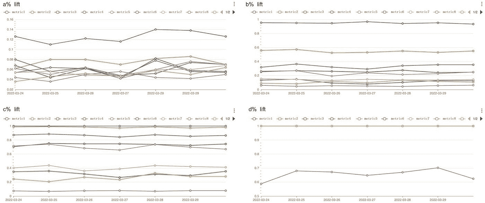

# 使用模拟的 A/A 和 A/B 测试测量 A/B 测试平台的运行状况

> 原文：<https://towardsdatascience.com/measure-a-b-testing-platform-health-with-simulated-a-a-and-a-b-tests-7a68b800d0e1>

## 我们如何通过模拟来确保我们的 A/B 测试平台的可靠性

投稿人: [Max 李](https://medium.com/@qike_max_li)，[孙耀威贾](https://www.linkedin.com/in/zhengwen-jia-b32441157/)

照片由[威廉·沃比](https://unsplash.com/@wwarby?utm_source=medium&utm_medium=referral)在 [Unsplash](https://unsplash.com?utm_source=medium&utm_medium=referral) 拍摄

A/B 测试在数据驱动型公司的决策中起着至关重要的作用。这通常是新产品设计、商业策略、机器学习模型等的成败的最终决定权。A/B 测试平台中的不准确性降低了从 A/B 测试中得出的所有商业决策。在本文中，我们分享了不断评估 A/B 测试平台可靠性的方法，以确保实验平台值得信赖。

连续评估的目标是测量[I 型误差](https://en.wikipedia.org/wiki/Type_I_and_type_II_errors)率和[功率](https://en.wikipedia.org/wiki/Power_of_a_test)，等于 1-[II 型误差](https://en.wikipedia.org/wiki/Type_I_and_type_II_errors)率。第一类错误率和功效决定了[假设检验](https://en.wikipedia.org/wiki/Statistical_hypothesis_testing)的质量。类型 I 错误(误报)通常是当新功能对业务指标没有重大影响时，对有益/有害产品功能的错误声明。发布一个没有影响的特性是一种浪费，可能会导致在一个没有结果的领域的进一步投资。第二类错误(假阴性)导致得出有益/有害产品特征是中性的结论。当我们基于错误的 A/B 测试结果，扼杀一个可能需要几个月来构建的产品特性时，这是一个机会的错过。

# 模拟 A/A 测试测量第一类错误率

为了测量 I 型错误率(假阳性率)，我们每天使用过去七天积累的数据运行 500 次模拟 A/A 测试。每个模拟的 A/A 测试将用户随机分为控制组和处理组，并以与生产指标计算管道相同的方式计算两个实验组的指标。

它需要大量的 A/A 测试来精确地测量 I 型错误率，但是用实时用户流量运行所有的重复测试成本太高。模拟 A/A 测试离线运行，因此对应用/网站延迟没有影响。

我们发现在 I 型错误率测量中，500 次重复在计算成本和精度之间取得了平衡。在标称 *p* 值阈值为 0.05 的情况下，对于可靠的 A/B 测试平台，预期的 I 型错误率(假阳性率)为 5%。假设我们的假阳性率确实是 5%，那么[蒙特卡洛模拟](https://en.wikipedia.org/wiki/Monte_Carlo_method)中的每次重复都是一次独立的[伯努利试验](https://en.wikipedia.org/wiki/Bernoulli_distribution)，成功概率为 5%。因此，我们的假阳性测量的 95%置信区间(CI)为

CI 随着重复次数的平方根缩小( *n* )。下表显示了不同重复次数下计算的 CI。

表 1。CI 随着重复次数的平方根( *n* )而缩小

图 1 展示了一个仪表板，用于监控一段时间内的误报率。

图一。连续假阳性率评估

此外，我们不断评估来自模拟 A/A 测试的 *p* 值的分布。当零假设为真，并且满足所有其他假设时，*p*-值应均匀分布[1]。零假设为μ1=μ2，其中μ1 和μ2 分别是对照桶和处理桶的总体均值。

图二。A/A 测试的 p 值分布

# 模拟 A/B 测试测量功率

[统计功效](https://en.wikipedia.org/wiki/Power_of_a_test)，等于 1-类型 II 错误(假阴性)率，同样重要，但由于缺乏基本事实，评估起来更具挑战性。我们通常没有能够提高指标的产品特性。否则，我们早就实施了。另一方面，使用劣质版本的产品来评估 A/B 测试平台的假阳性将是昂贵的，有时甚至是不道德的。模拟 A/B 测试使我们能够在不影响用户体验的情况下评估各种业务场景中的能力。

我们与模拟 A/A 测试类似地进行模拟 A/B 测试，除了我们在处理组中引入合成差异，即，为处理组中的用户增加 1%的度量值。在模拟 A/B 测试中，我们知道由于综合引入的差异，零假设(即，无效果)不成立。模拟 A/B 测试中的任何中性结果(没有统计意义的结果)都是第二类错误(假阴性)。

此外，通过模拟，我们可以在各种场景中评估 A/B 测试的能力。一些说明性的场景是:

*   对照和处理之间不同水平的度量差异:0.1%、0.2%、0.5%等。
*   不同模式的差异:新产品功能主要影响重度用户，新产品指标的有效性取决于用户属性(如年龄、地理位置、语言)等。

注:典型的[功效分析](https://en.wikipedia.org/wiki/Power_of_a_test#Power_analysis)相当于具有一致差异的模拟 A/B 测试——处理桶中的总体平均值一致移动 X 量。通过模拟的 A/B 测试，我们可以理解具有更复杂业务假设的 A/B 测试的统计能力。

图 3 显示了不同高度的模拟 A/B 测试的结果，其中有一个< b < c < d. When the lift reaches c%, most metrics have sufficient powers. Also, even when the lifts are the same, different metrics have different levels of power due to the difference in the variances of the metrics.

Fig 3\. Continuous false negative rate evaluation

# Conclusion

The more we improve our A/B testing platform, the more we realize that devil is in the details. It is surprisingly hard to get your A/B testing right. Something seemingly straightforward can lead to [严重缺陷](/assign-experiment-variants-at-scale-in-a-b-tests-e80fedb2779d)，看似合理的方法可能会产生非常[不准确的结果](/how-wish-a-b-tests-percentiles-35ee3e4589e7)。对 A/B 测试平台的健康状况进行系统评估至关重要。模拟 A/A 和 A/B 测试持续测量平台的健康状况。

我们的目标是在未来的工作中使我们的评估更加全面和方便。尽管由于使用来自所有用户的数据，我们当前的模拟 A/A 测试是通用的，但我们计划通过按需安排 A/A 测试来启用特定于实验的模拟 A/A 测试，仅让用户参与特定实验。此外，我们计划在模拟的 A/B 测试中添加更复杂的场景，以代表各种各样的业务案例。

# 感谢

感谢齐超对这个项目的贡献。我们也感谢 Pai Liu 的支持，以及 Pavel Kochetkov、Lance Deng 和 Delia Mitchell 的反馈。

Wish 的数据科学家热衷于构建一个值得信赖的实验平台。如果你对解决这一领域的挑战性问题感兴趣，我们正在为数据科学团队[招聘](https://www.wish.com/careers/jobs)。

# 参考

[1] Murdoch，Duncan J .，蔡玉玲，和 James Adcock，[《P 值是随机变量》](https://www.tandfonline.com/doi/abs/10.1198/000313008X332421) (2008)，美国统计学家，62.3:242–245。