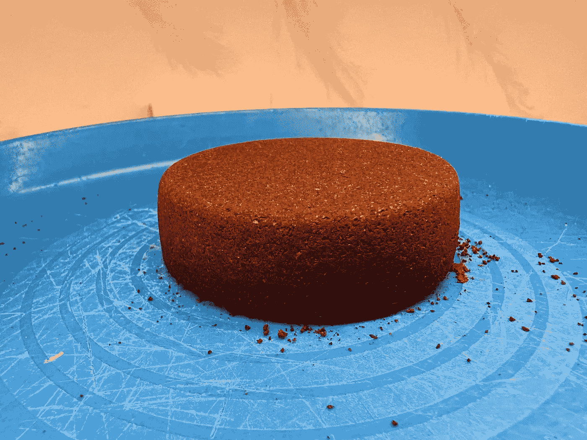
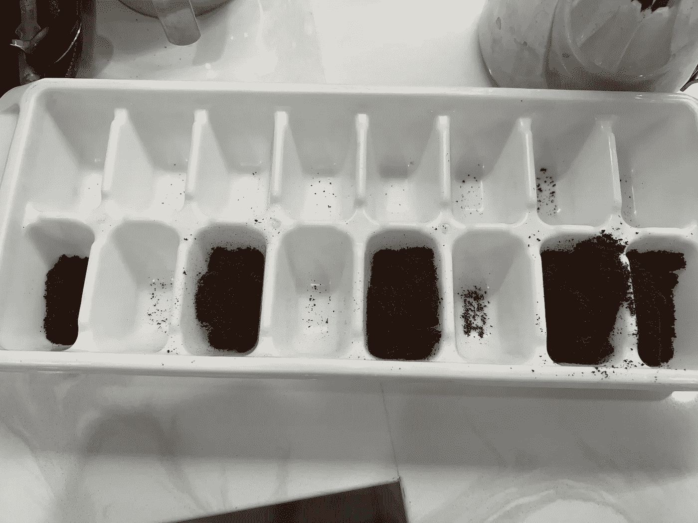
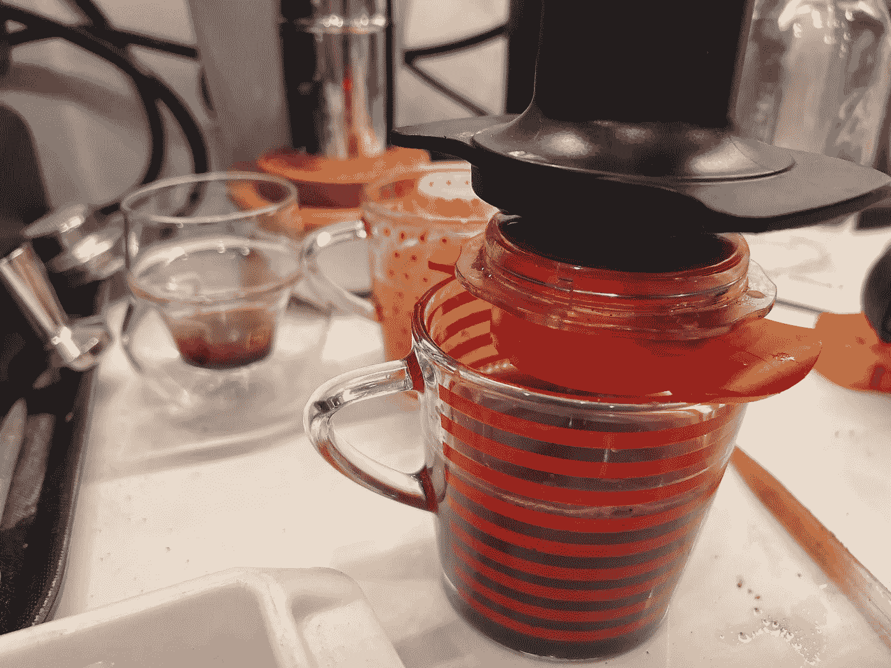
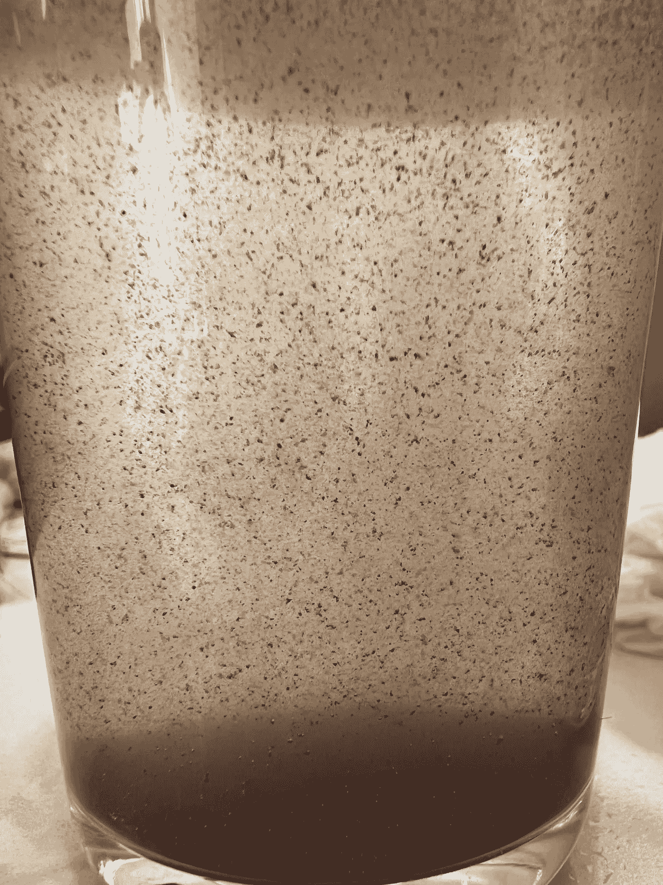
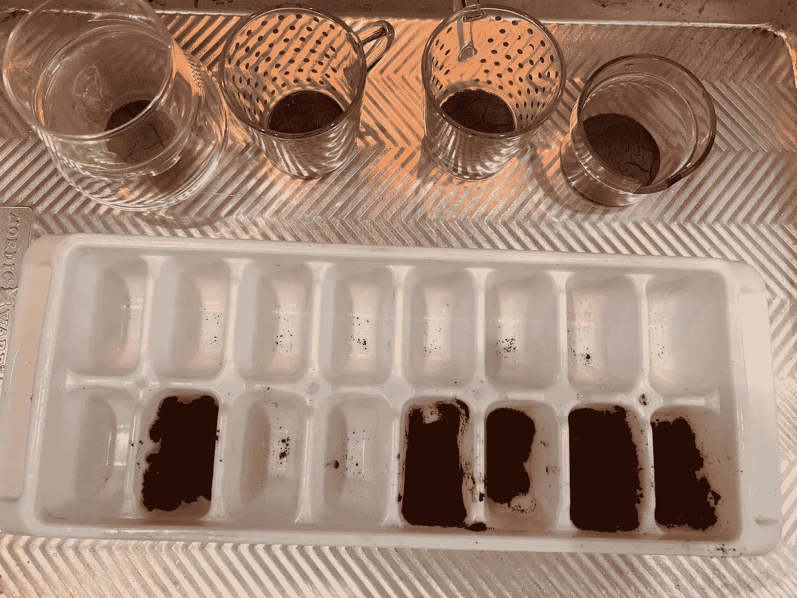
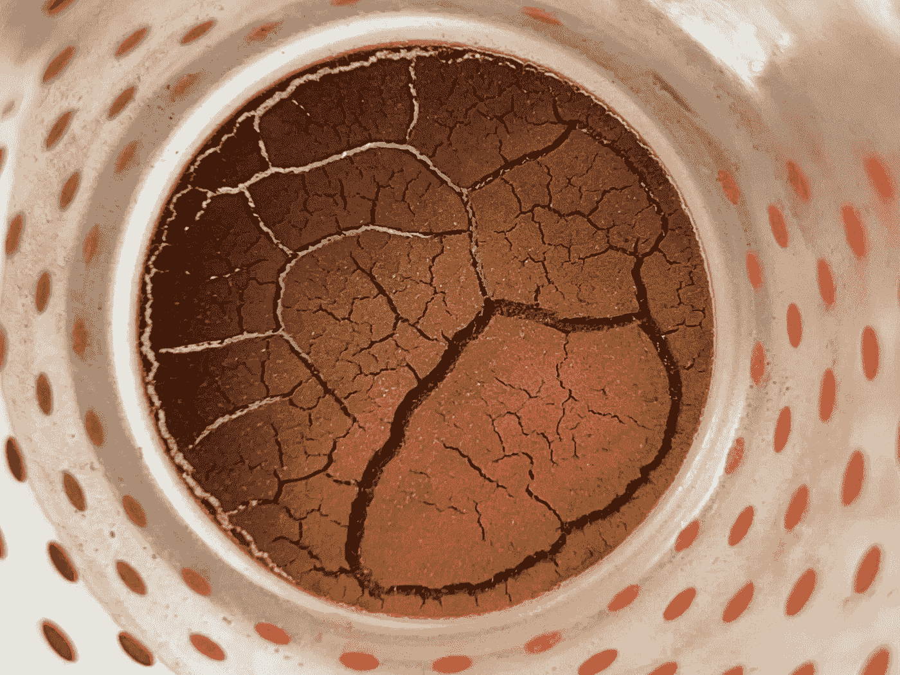
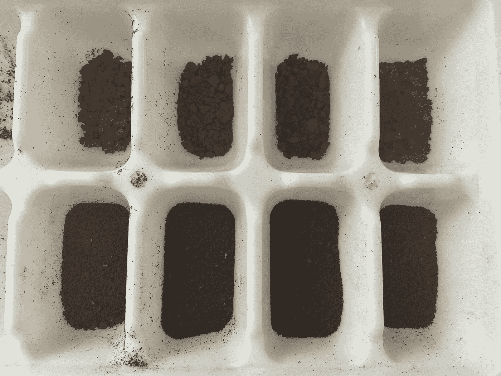
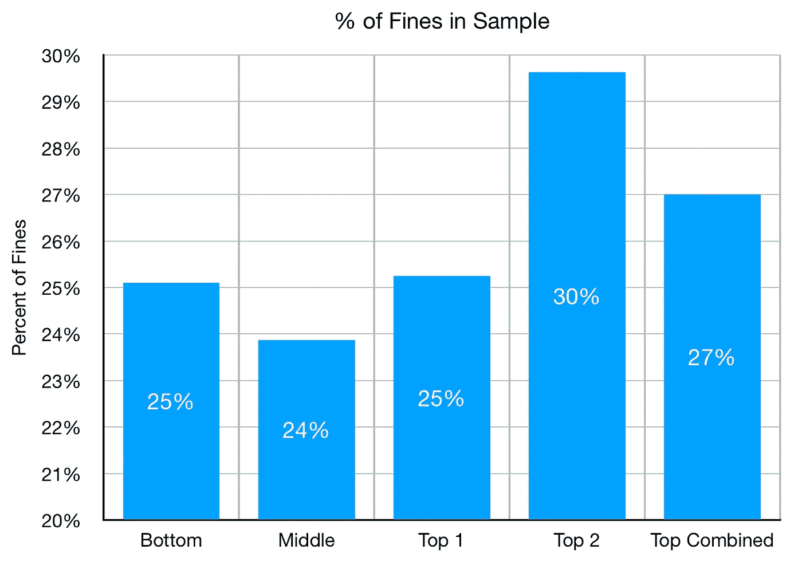

# 用水测量咖啡粉末

> 原文：<https://towardsdatascience.com/measuring-coffee-fines-using-water-aa17595526c9>

## 咖啡数据科学

## 受强制微粒迁移启发的有趣方法

在思考我的[强制微粒迁移实验](https://youtu.be/67FnyGrlP2c)时，我认为这将是一种测量整个圆盘中微粒的有趣方法。您可以使用成像或筛选来测量微粒，但这两种方法都有一些挑战。对于成像，你不能解决最小的罚款。对于筛分来说，不花大力气筛分 200um 以下甚至 300um 以下是有挑战性的。

通过我的强制微粒迁移实验，我能够推出所有比过滤篮孔更细的微粒。我想我可以干燥样品，更好地测量粉末。

  

# 冰球准备

我在一个 20 克的 VST 篮子里用了 22 克，我用 Atago 测量了 8:1 的 EY，所以大部分可提取的咖啡都被提取出来了。然后我让冰球冷却。

所有图片由作者提供

后来，我把它切成了片。我的目标是超过 3 片，但是很难。我最后是底部一片，中间一片，顶部分成两个样本。

我把切片放在一个冰块托盘里，这是我储存粉末的首选方式。

然后，我将一些水推入，迫使较细的颗粒通过过滤篮。

这里有一个视频回顾了我是如何强迫微粒迁移的，这本质上是一个湿筛。

在这个过程中，有很多悬浮颗粒。

我让它们沉淀下来，然后把水移走。我在低温下烘干了样品。

最终的细粒比用细筛筛过的普通咖啡要细得多。

最后，我对四个样品分别进行了粗选和精选。

然后我用 Acaia Pyxis 秤称了每个样品的重量，并计算了每个样品中细颗粒的百分比。

我预计，如果在原始镜头中微粒迁移，底部的微粒百分比会比其他层高。然而，事实并非如此。

我不确定为什么顶层的细屑更多，这可能是测量、切割或强制迁移过程中的错误。一些细颗粒可能已经迁移出了注射液，但是注射液中出来的细颗粒的量最终小于 0.01 克(即将进行实验)。

最终，这个实验是反对微粒迁移理论的又一个标志，并且它提供了一个容易重复的实验。之前实验的问题是要知道你是否真的得到了所有更细的粒子。湿筛似乎有助于测量最细的粉末。

如果你愿意，可以在推特、 [YouTube](https://m.youtube.com/channel/UClgcmAtBMTmVVGANjtntXTw?source=post_page---------------------------) 和 [Instagram](https://www.instagram.com/espressofun/) 上关注我，我会在那里发布不同机器上的浓缩咖啡照片和浓缩咖啡相关的视频。你也可以在 [LinkedIn](https://www.linkedin.com/in/dr-robert-mckeon-aloe-01581595) 上找到我。也可以关注我在[中](https://towardsdatascience.com/@rmckeon/follow)和[订阅](https://rmckeon.medium.com/subscribe)。

# [我的进一步阅读](https://rmckeon.medium.com/story-collection-splash-page-e15025710347):

[我未来的书](https://www.kickstarter.com/projects/espressofun/engineering-better-espresso-data-driven-coffee)

[我的链接](https://rmckeon.medium.com/my-links-5de9eb69c26b?source=your_stories_page----------------------------------------)

[浓缩咖啡系列文章](https://rmckeon.medium.com/a-collection-of-espresso-articles-de8a3abf9917?postPublishedType=repub)

工作和学校故事集