# 测量嵌入漂移

> 原文：<https://towardsdatascience.com/measuring-embedding-drift-aa9b7ddb84ae>

## 测量非结构化数据的嵌入/向量漂移的方法，包括计算机视觉和自然语言处理模型

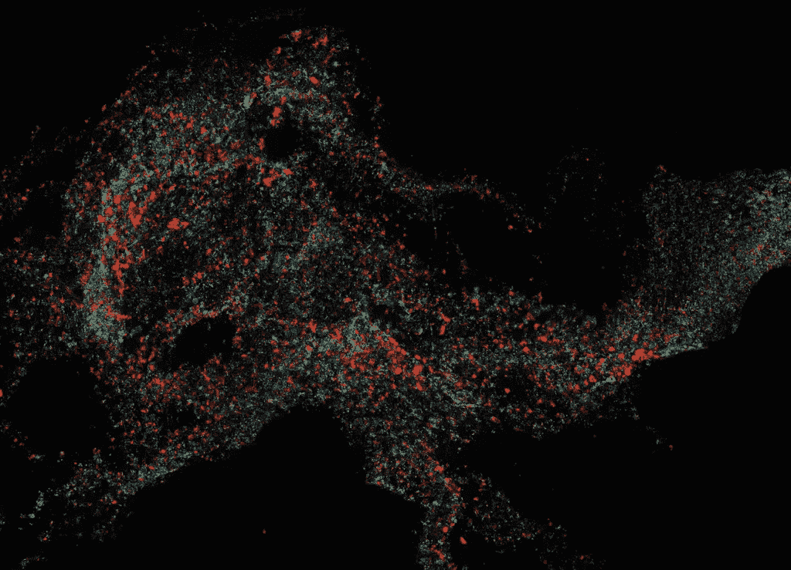

作者图片

*本文是与 Arize AI 的首席执行官兼联合创始人 Jason Lopatecki 合作撰写的*

图像等非结构化数据中的数据漂移很难测量。通常用于结构化数据漂移的指标，如[群体稳定性指数](https://arize.com/blog-course/population-stability-index-psi/) (PSI)、库尔贝克-莱布勒散度( [KL 散度](https://arize.com/blog-course/kl-divergence/))和詹森-香农散度( [JS 散度](https://arize.com/blog-course/jensen-shannon-divergence/))以及 [Kolmogorov Smirnov 检验](https://arize.com/blog-course/kolmogorov-smirnov-test/))，允许对结构化标签进行统计分析，但不能扩展到非结构化数据。测量非结构化数据漂移的一般挑战是，您需要了解非结构化数据本身内部关系的变化。简而言之，你需要更深入地理解数据，才能理解漂移。

非结构化漂移的目标是检测两个非结构化数据集是否不同，如果不同，则让工作流了解数据集不同的原因。这篇文章推荐了一种非结构化漂移的全局测量和方法。一旦发生漂移检测，用于故障排除的根本原因工作流程将在[之前的](https://arize.com/blog/monitor-unstructured-data-with-arize/) [文章](/visualizing-your-embeddings-4c79332581a9)中介绍。

# 非结构化数据中的漂移意味着什么？

## 图像漂移的例子

当团队强调图像数据中的问题时，通常存在各种各样的问题。这些问题包括图像模糊、有斑点、变亮、变暗、旋转和裁剪。

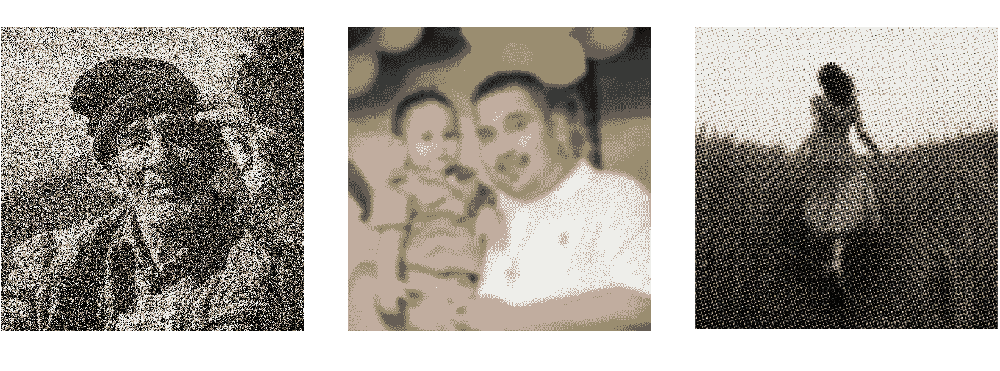

*图像变暗、模糊或有斑点的问题(图片由作者提供)*

当然，用于计算机视觉模型的图像面临各种形状和大小的挑战。要解决这些问题，您需要一种方法，在这种方法中，您不需要先验地知道您需要检测的所有问题的组合，因为在实践中通常不可能知道。

团队想要检测的更常见的数据漂移事件之一与图像质量问题无关，它实际上是找到不在原始训练集中的对象的示例。在生产数据中观察到的、在训练集中缺失的独特情况、事件、人员或对象是什么？

*来自训练集的单个苹果(图片由作者提供)*

例如，训练集可能包括单个苹果的图片，但不包括多个苹果或其他水果的图片。

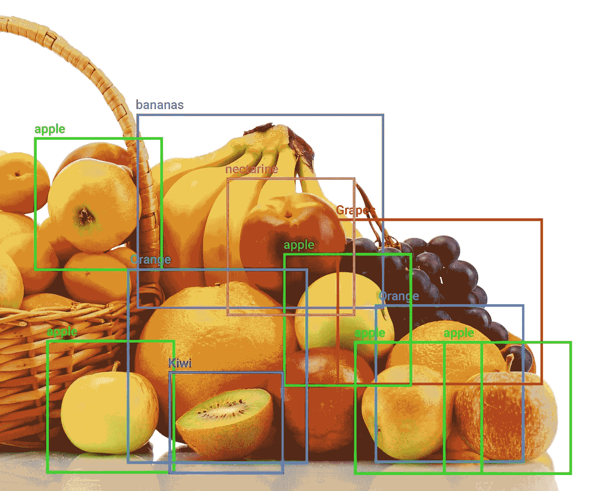

*生产中见到的多种苹果和混合水果(图片由作者提供)*

与第一张图相比，上面的水果篮包含了相当多的其他关系和对象。如果原始训练集只包括苹果本身的图片，则类似上面的图片可能会导致模型出现问题。

## 文本漂移的例子

考虑到语言不断进化的本质，自然语言处理(NLP)模型的潜在问题也同样多种多样。例如，随着时间的推移，数据中术语的任何变化或者单词或短语的上下文或含义的变化都会导致漂移。[资源匮乏的语言](https://ai.facebook.com/research/no-language-left-behind/)和言语中的文化差异也会加剧 ML 团队的困难。

文本漂移最常见的一种情况是，在生产中出现了一个在训练数据中不存在的单词、类别或语言。例如，如果在生产中第一次遇到西班牙语评论，对数百万英语服装产品评论进行训练的情感分类模型的性能可能会下降。如果突然要求这种模型预测(比如)专业医疗设备评论的情绪，它也会陷入困境。

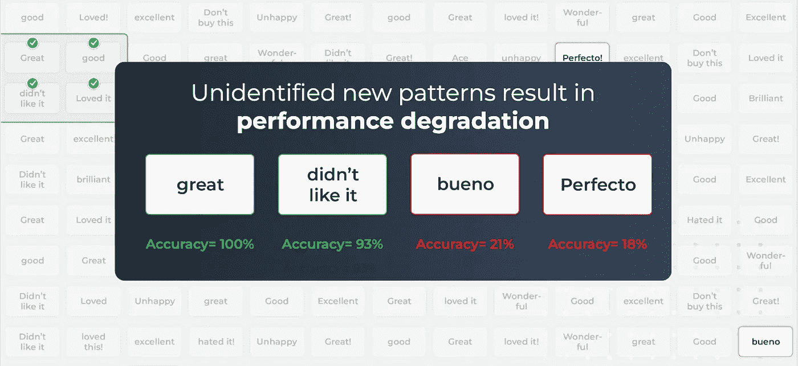

作者图片

# 提取嵌入

为了理解所有的结构关系并监控它们何时改变，我们需要利用[嵌入](https://arize.com/blog-course/embeddings-meaning-examples-and-how-to-compute/)来捕捉非结构化数据中的潜在结构。

嵌入可以被认为是表示通过非结构化数据学习的潜在结构的向量。

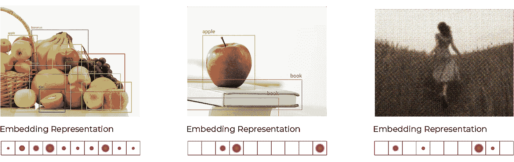

*嵌入矢量表示(图片由作者提供)*

一组嵌入，其中每个嵌入代表一个图像或预测，映射出高维空间中的曲面(流形)。

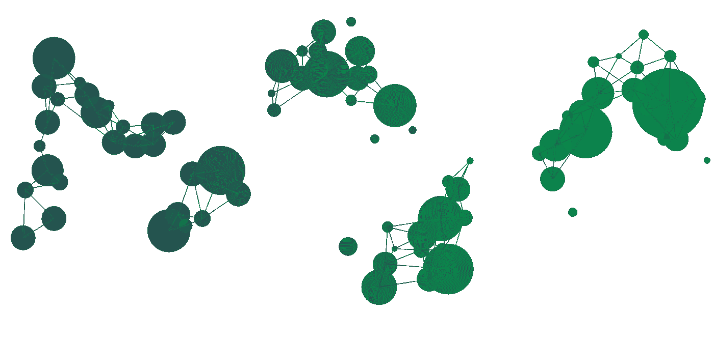

*高维曲面示例(图片由作者提供)*

上面的例子显示了由高维向量数据表示的表面和关系。有苹果的图像将与其他有苹果的图像有关系。有多种水果的图像将与苹果和其他水果的图像都有关系。他们会在高维空间中彼此靠近。

随着卷积神经网络(CNN)的深入，嵌入表示图像内部特征或信息的复杂组合。嵌入包含了决定图像结构所需的所有信息，从模糊到物体的存在。

从那里，很容易从任何神经网络中提取嵌入。

## 案例 1:拥有模型

理想的情况是，团队可以访问原始模型，并可以在产品中提取嵌入内容，以便观察。在这种情况下，从生产中的当前模型中提取嵌入。这种方法的优点是，监控发生在模型内部观察到的结构上，因此更有可能捕捉到模型是否在数据上有问题。

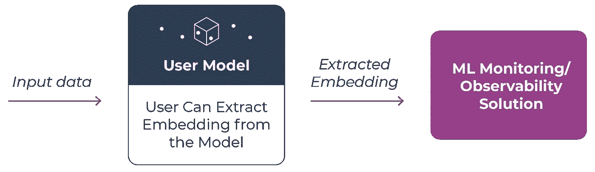

*选项 1:从模型中提取嵌入内容(作者图片)*

在嵌入漂移分析的情况下，建议在分类之前提取最后一个完全连接的层来创建图像嵌入。例如，它是包括所有复合潜在结构信息的层，以做出图像级决策。除了与训练集中的图像相关的一般质量信息之外，潜在结构将包含关于图像中的结构的信息，例如对象和动作。

在使用[视觉转换器(ViT)](https://huggingface.co/docs/transformers/model_doc/vit') 的情况下，建议您提取多层感知器(MLP)正在作用的嵌入，以做出图像级决策。对于如何从一个众所周知的拥抱脸模型中提取嵌入的例子，这里有一个[的分步指南](https://colab.research.google.com/github/Arize-ai/tutorials_python/blob/main/Arize_Tutorials/Embeddings/CV/Arize_Tutorial_CV_Image_Classification_HuggingFace.ipynb)。

## 案例 2:使用全局模型

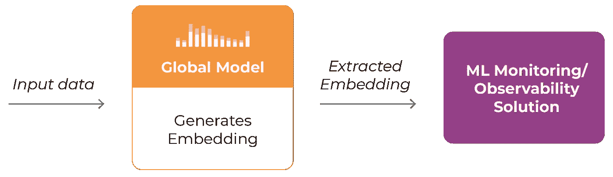

*选项 2:从数据中提取嵌入内容(图片由作者提供)*

第二种选择是使用全局的、预训练的模型来从数据中提取嵌入。使用像 BERT 这样的基础模型来提取嵌入是有利的，因为不需要对生产模型进行修改。对于测试和运行内部数据，这也是一个简单的选择。一个缺点是，它只查看数据本身，而不查看内部模型决策。

一旦我们生成了嵌入，我们现在可以查看嵌入漂移度量来比较嵌入组，以了解它们作为一个组是如何漂移的。

# 嵌入漂移度量

比较不同时期之间的嵌入是我们检测漂移是否发生以及漂移发生在哪里的方法。

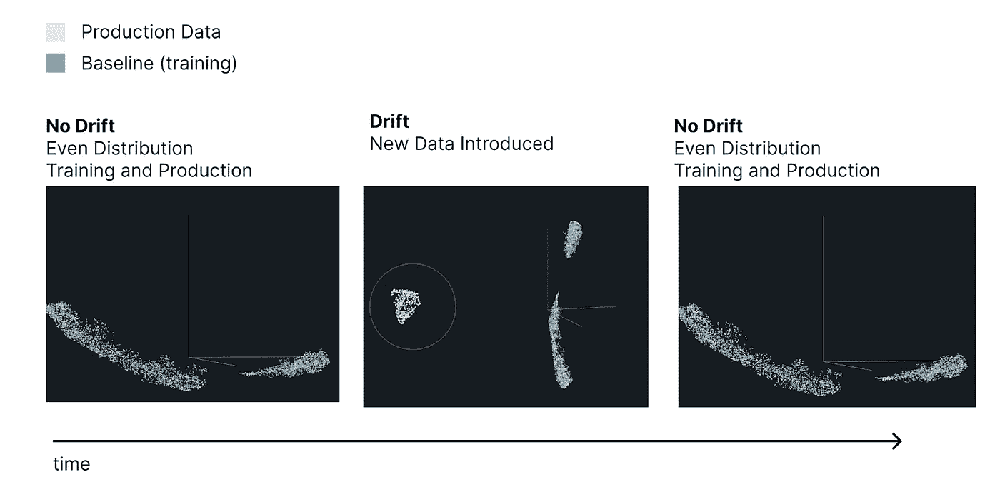

*嵌入漂移—引入新数据(图片由作者提供)*

在上面的示例中，灰色点是生产环境中的预测，而蓝色点是训练中的预测。人们可以看到，在培训和生产的相似时期，这些点重叠得相当紧密。在这个例子中，一组新的有问题的数据(模糊的图像)被添加到数据集，产生了一组与其他非常不同的预测。

有许多漂移测量可以应用于嵌入。这些包括超盒 IOU、[欧几里德距离](https://arize.com/blog-course/embedding-drift-euclidean-distance/)、余弦距离和基于聚类的组纯度分数。在这篇文章中，我们将深入探讨欧几里德距离和余弦距离及其功效。

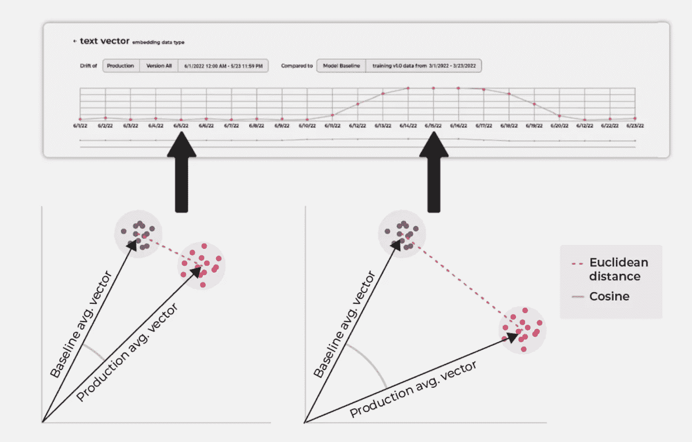

作者图片

上图显示了两组向量——一组用于基线，另一组用于生产。当两个向量相距较远时，欧几里德距离和余弦距离都较大。这被监控为嵌入漂移。

## 欧氏距离是如何计算的？

简单的欧几里德距离检查确定生产数据组的平均质心是否已经远离基线组。

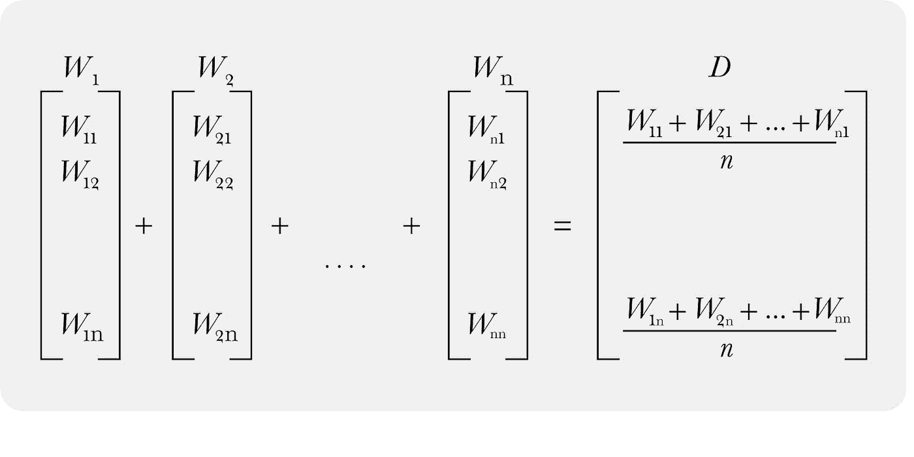

*嵌入平均值和质心(图片由作者提供)*

上述计算将表示单组数据(即生产矢量)，对所有矢量求和，并创建质心。

一旦计算出生产向量和基线向量的平均值，就可以得到欧几里德距离。为了计算，取两个向量之间的差，然后取差之和的平方根。

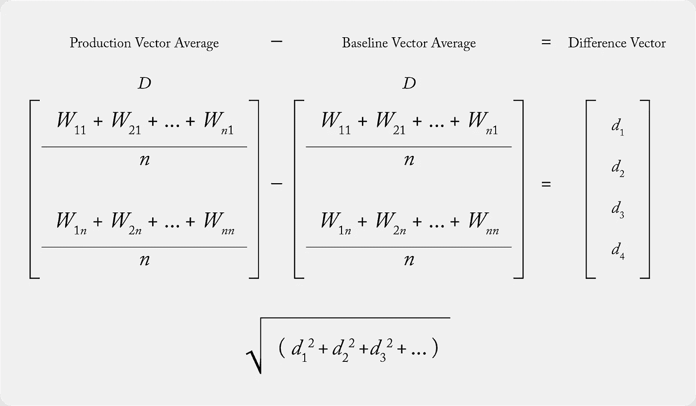

作者图片

## 余弦距离是如何计算的？

余弦距离本质上是 *1 —余弦相似度*。两个向量越相似，距离越小。他们越不相似，距离就越大。

为了计算余弦距离，我们再次需要两个向量，在本例中，我们取一个生产向量和一个基线向量。余弦距离的计算:

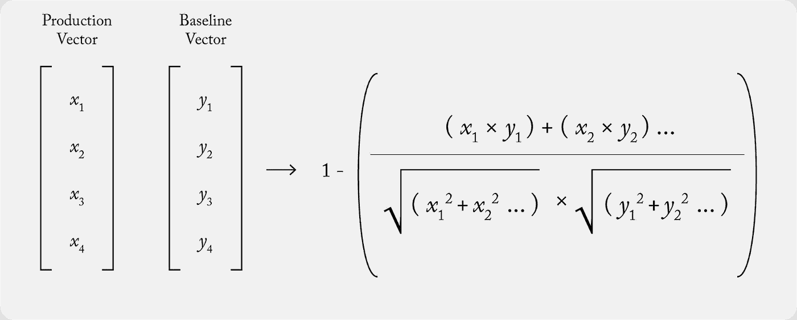

作者图片

换句话说:

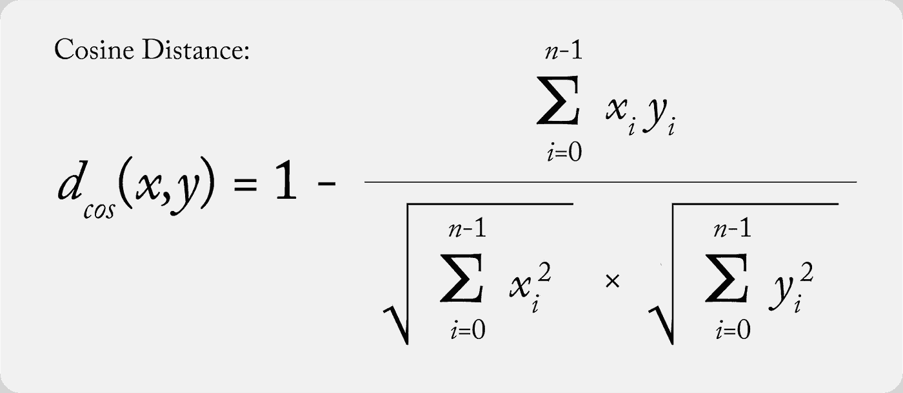

作者图片

## 测试欧几里德距离的功效

在测试了大量相当复杂的漂移测量方法后，我们发现与其他方法相比，监控嵌入集的简单欧几里德距离是稳定的、灵敏的和可扩展的。

当比较数据集之间的欧几里得距离和余弦距离时，当漂移增加时，余弦更加敏感和显著。欧几里得仍然检测到这种变化，但在实验中更加稳定。

在下图中，左边的 Y 轴是欧几里德增量，右边的 Y 轴是余弦增量。它们的方向相似。

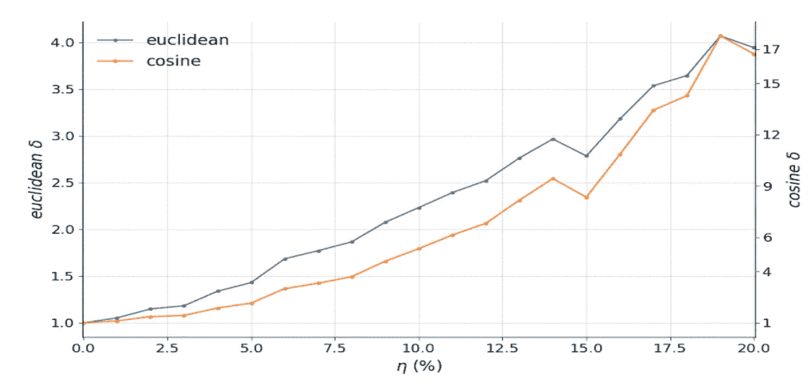

作者图片

下一节重点介绍了几个引入漂移的真实实验，欧几里德距离精确地获得了数据漂移。

## 实验结果# 1——将培训之外的新价值引入生产

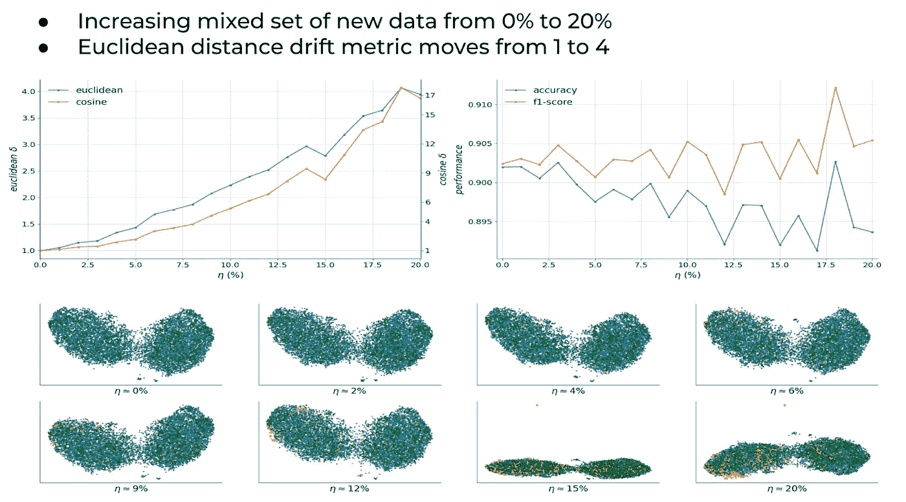

缓慢增加的漂移数据(图片由作者提供)

上图显示了一个混合在生产数据中的漂移数据示例，该数据不在训练数据集中。即使许多向量在流形中重叠并且彼此靠近，左上角的欧几里得距离度量也能检测到差异。

## 实验结果#2 —将完全不同的数据引入生产数据

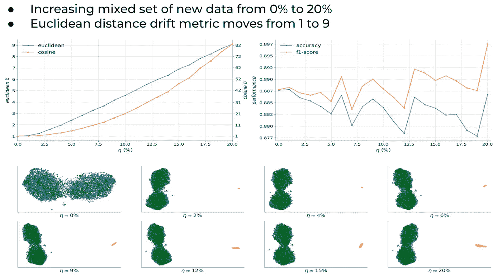

缓慢增加的漂移数据(图片由作者提供)

这里的数据集示例有一个向量空间，对于漂移的数据来说，它看起来非常不同，在右边底部的图像中显示了一个黄色组。随着越来越多的漂移数据混入生产数据集中，欧氏距离会增加并检测到数据差异(左上角)。

## 其他技术

为了在欧几里德距离之上添加更健壮的警报统计，可以对嵌入度量使用 KS 2 样本测试。可以从嵌入集中提取多个样本，分别计算每个样本集的欧几里德距离度量，并且可以使用 KS 检验来确定是否发生了漂移。

# 结论

随着 CV 和 NLP 模型的激增，越来越多的 ML 团队正在寻求嵌入漂移来帮助检测和理解他们的非结构化数据中的差异。在[测试了](https://arize.com/blog-course/embedding-drift-euclidean-distance/)大量不同数据的不同场景后，我们发现利用欧几里德距离是一种敏感、稳定且可扩展的测量方法，有助于完成这项任务。

# 联系我们

如果这个博客引起了你的注意，并且你渴望了解更多关于[机器学习可观察性](https://arize.com/ml-observability/)和[模型监控](https://arize.com/model-monitoring/)，请查看我们的其他[博客](https://arize.com/blog/)和[资源](https://arize.com/resource-hub/)！如果您有兴趣加入一个有趣的 rockstar 工程团队来帮助制作成功的模型，请随时[联系](https://arize.com/contact/)我们，或者[注册一个免费账户](https://app.arize.com/auth/join)，或者在这里[找到我们的空缺职位](https://arize.com/careers/)！