# 测量咖啡折光仪的精确度

> 原文：<https://towardsdatascience.com/measuring-refractometer-accuracy-to-groundtruth-for-coffee-421929644587>

## 咖啡数据科学

## 更好的取样，以更好地了解 TDS 与 Brix 和 Groundtruth

我每天使用一台[折光仪](/affordable-coffee-solubility-tools-tds-for-espresso-brix-vs-atago-f8367efb5aa4)(一台数字 Atago)来测量总溶解固体(TDS)，然后用它来计算提取率(EY)。我假设 Atago 是准确的，但没有 Atago 或任何折光仪生产商提供的数据。他们只给出准确的数字。我已经做了一些其他的测试，但是我想看看我如何能更好地测试 groundtruth。

我将 Atago 与 Brix 视觉折射仪进行了比较，然后将这两者与一些基本事实进行了比较。我用了两种物质来制作 groundtruth: [浓缩咖啡粉](https://medium.com/geekculture/what-is-espresso-powder-608236a54c58)和糖。我把这些溶于水中，做了一些试验。

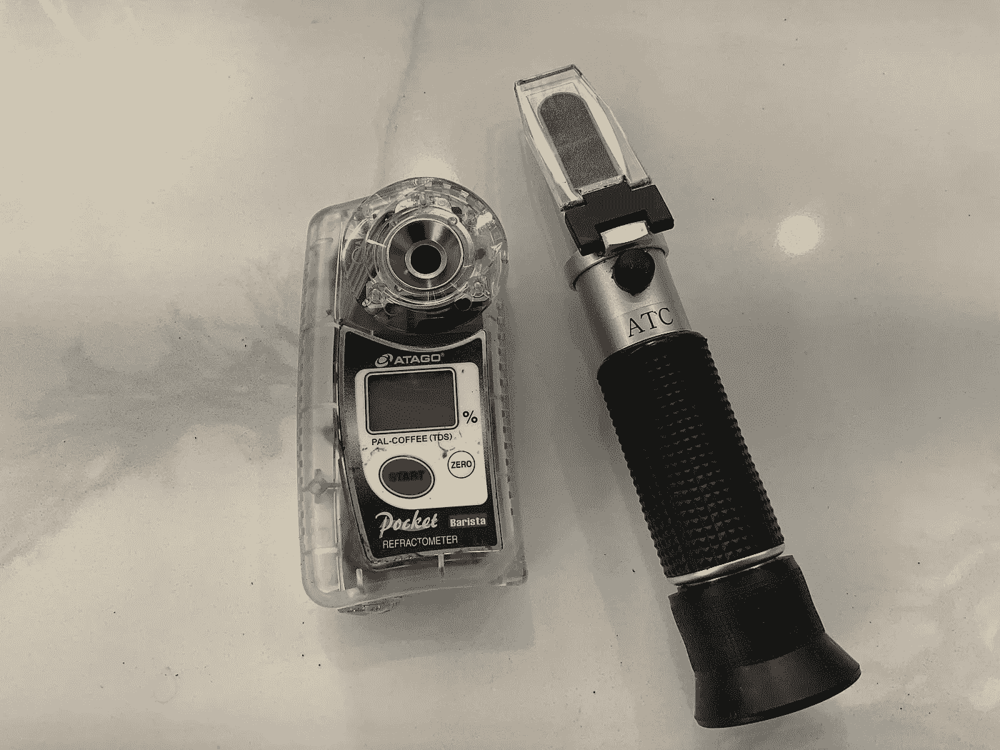

Atago 和视觉白利，所有图片由作者提供

将白利糖度转换为 TDS 的通用公式为 TDS = 0.85 *白利糖度。我想看看这个常数有多精确，或者二阶多项式是否更合适。

视觉白利折光仪的一个挑战是它们有时难以读取。您可以在两个散列标记之间进行分辨，这样您就可以达到 0.1°白利糖度的精度，这对于浓缩咖啡读数来说很好，但对于 pourover 来说，读数较低时就不那么好了。

浓缩咖啡粉或咖啡的白利糖度读数有点模糊，但纯糖的线条非常清晰。通常，如果你采取足够的读数，你可以获得更好的阅读咖啡的一致性。通常，正确的读数是颜色下降的边缘。

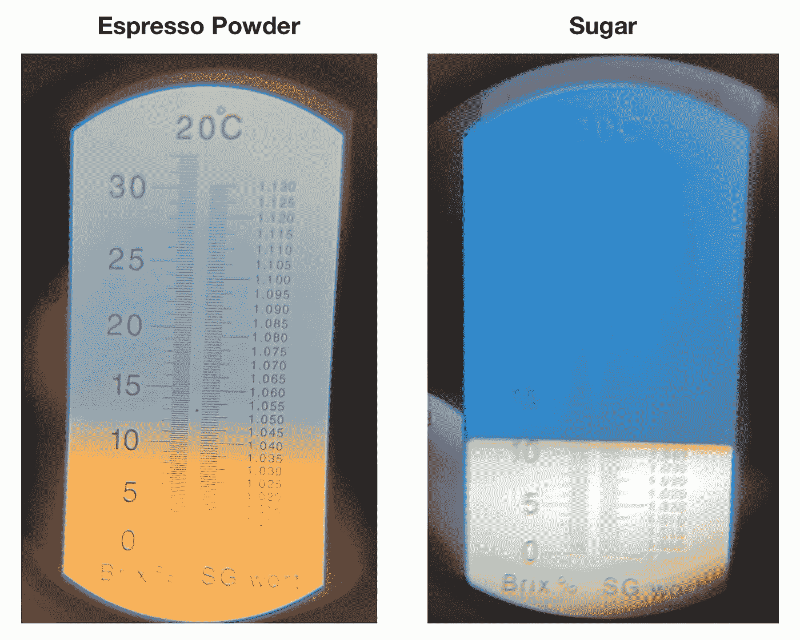

现实生活中的图像更清晰。

# 以前的数据

我刚拿到 Atago 的时候收集了一些[数据](/affordable-coffee-solubility-tools-tds-for-espresso-brix-vs-atago-f8367efb5aa4)。我在上半场和下半场各投各拉。绘制这些数据点显示，0.9074 的直线非常符合数据。

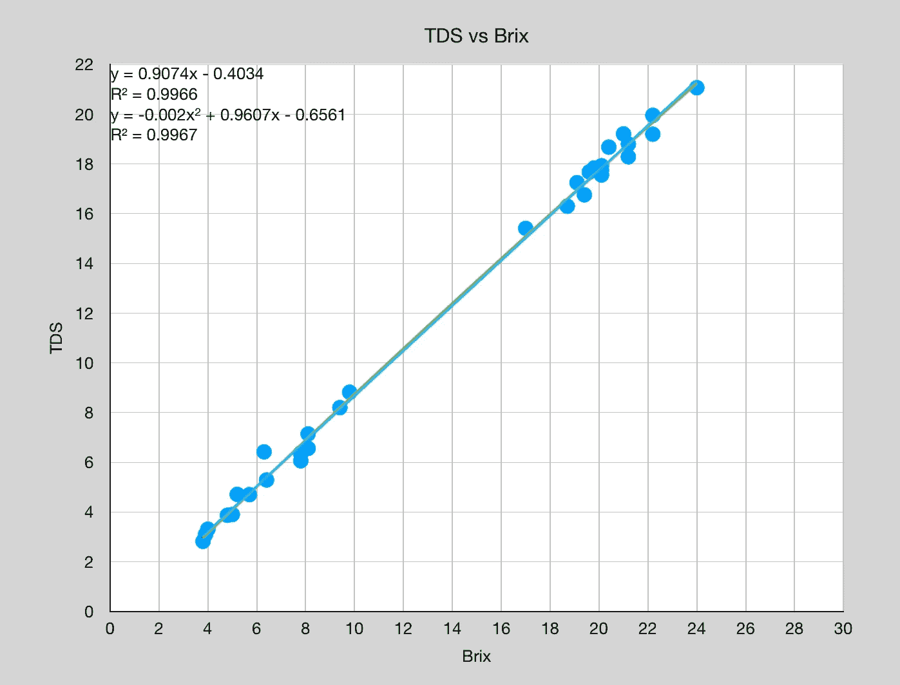

所以我把数据分成了前半部分和后半部分。较高的 TDS 值在 0.8322 处更接近于 0.85，但是较低的值是 0.902。仍然有一点噪音。我想知道白利糖度和 TDS 之间的联系在多大程度上取决于从照片中提取的内容和时间。

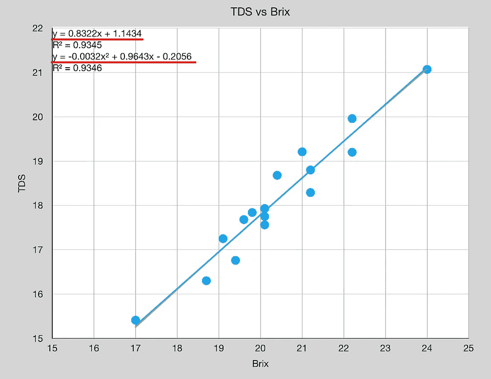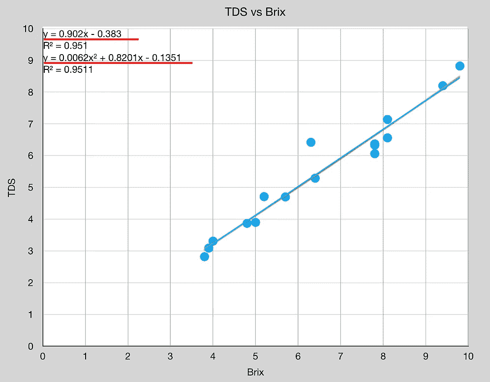

# 浓缩咖啡粉作为研磨的真理

我从浓缩咖啡粉开始，我知道浓缩咖啡粉和水的重量，根据经验知道 TDS。然后，我使用这些样品和随后稀释的起始溶液来获得曲线上的多个点。

数据没有太多噪音，趋势有很好的相关性。TDS 对 Brix 的趋势线斜率为 0.88，但仍不是 0.85。

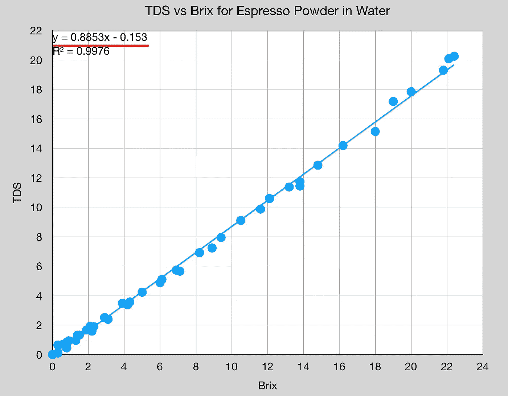

当将 TDS 或 Brix 与 groundtruth 进行比较时，Brix 的趋势线是 0.994，这意味着浓缩咖啡粉不像我想象的那样具有代表性。它比咖啡更接近糖，因为 TDS 测量值的斜率为 0.894。

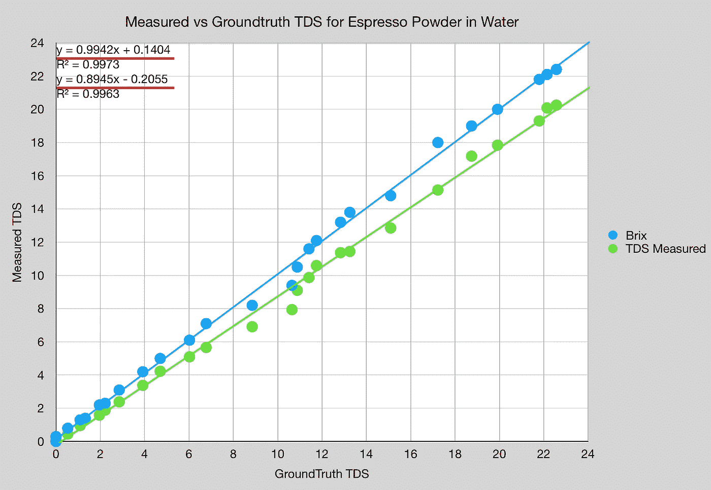

# 糖水是真理

我用糖水做了同样的实验，但 TDS 和 Brix 之间的关系仍然不是 0.85。最佳拟合线的斜率为 0.8711。

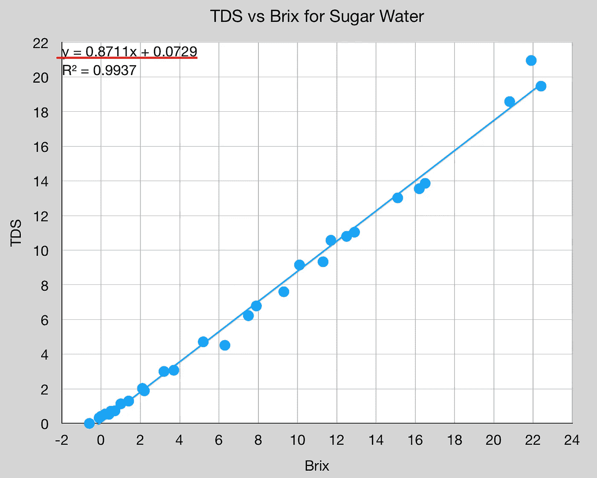

如果移除(22，21)处的一个异常值，最佳拟合的斜率为 0.85。

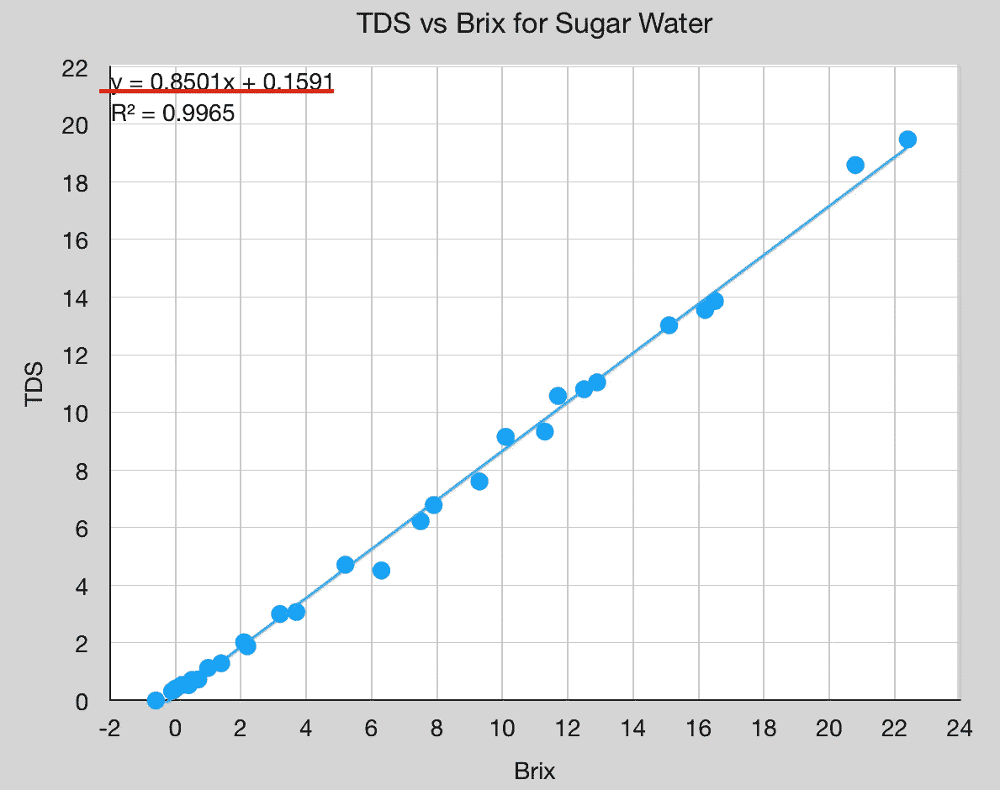

当我查看测量的 TDS 与 groundtruth 时，它更接近 0.85，为 0.8492，这意味着 Atago 中有一个偏移，可以用来测量咖啡而不是糖水。

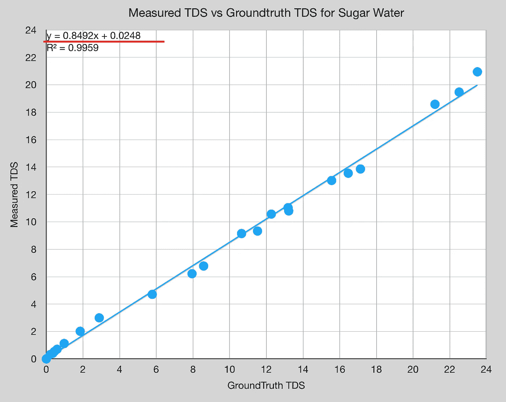

在较低的值上发生了一些奇怪的事情。我关注的是小于 4 的 TDS，这些点的最佳拟合线非常接近 y = x 或斜率 1。

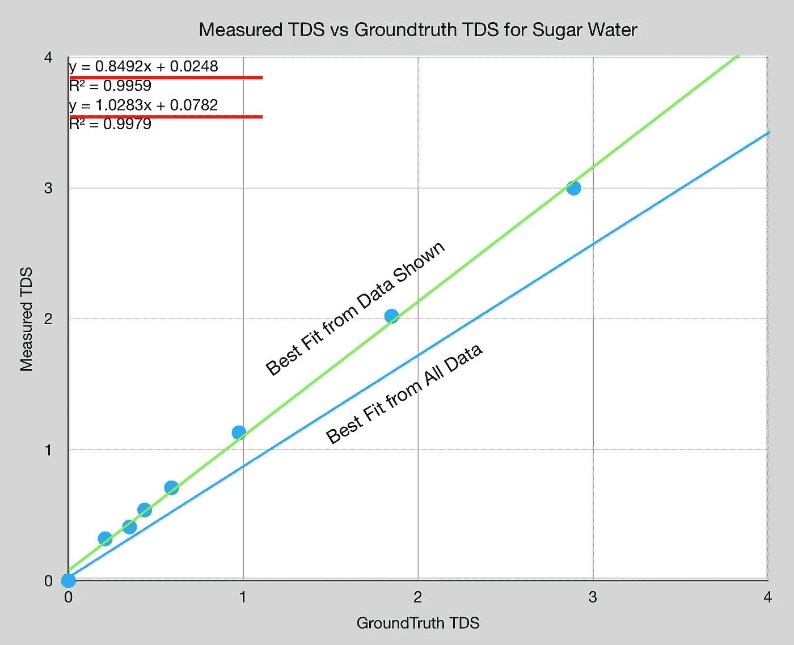

我也对比了白利糖度和地面真实度，在下端发生了一些奇怪的事情。

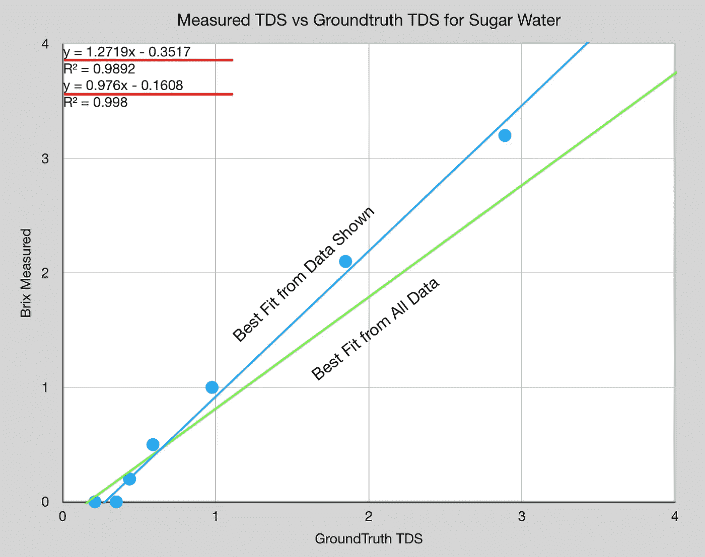

我发现的问题比我想回答的要多:

1.  我需要一个更好的研磨真理或者一个改良的咖啡研磨真理。
2.  较低 TDS 的解决方案行为古怪，这可能是由于一些最佳拟合方程。
3.  需要更多的数据来理解 TDS 对于镜头的不同部分是如何准确的。因此，用多种掺水样品拍摄的意大利腊肠将是一个有趣的体验。

如果你愿意，可以在推特、 [YouTube](https://m.youtube.com/channel/UClgcmAtBMTmVVGANjtntXTw?source=post_page---------------------------) 和 [Instagram](https://www.instagram.com/espressofun/) 上关注我，我会在那里发布不同机器上的浓缩咖啡照片和浓缩咖啡相关的视频。你也可以在 [LinkedIn](https://www.linkedin.com/in/dr-robert-mckeon-aloe-01581595) 上找到我。也可以关注我在[中](https://towardsdatascience.com/@rmckeon/follow)和[订阅](https://rmckeon.medium.com/subscribe)。

# [我的进一步阅读](https://rmckeon.medium.com/story-collection-splash-page-e15025710347):

[我未来的书](https://www.kickstarter.com/projects/espressofun/engineering-better-espresso-data-driven-coffee)

[我的链接](https://rmckeon.medium.com/my-links-5de9eb69c26b?source=your_stories_page----------------------------------------)

[浓缩咖啡系列文章](https://rmckeon.medium.com/a-collection-of-espresso-articles-de8a3abf9917?postPublishedType=repub)

[工作和学校故事集](https://rmckeon.medium.com/a-collection-of-work-and-school-stories-6b7ca5a58318?source=your_stories_page-------------------------------------)