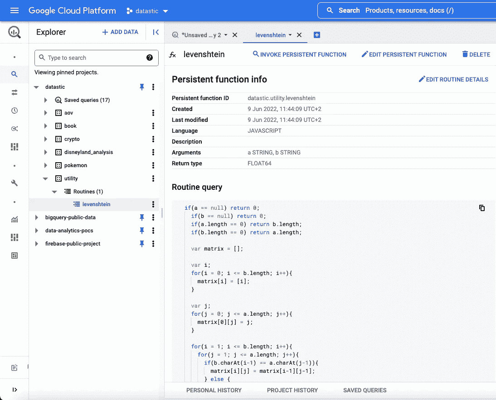
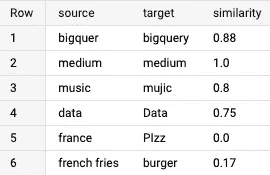
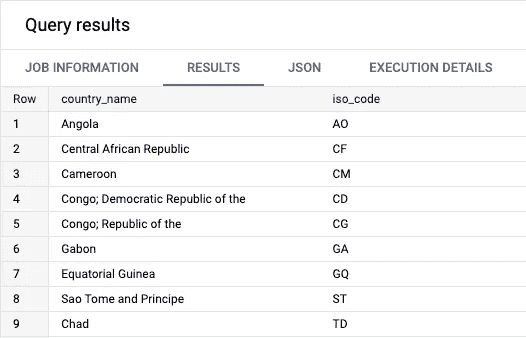
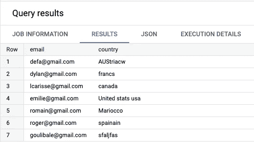
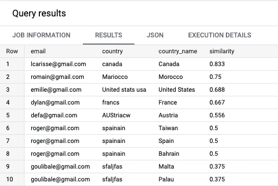

# 使用 SQL 度量 BigQuery 中的字符串相似性

> 原文：<https://towardsdatascience.com/measuring-string-similarity-in-bigquery-using-sql-33c490638c89>

## 使用 Levenshtein 距离来发现相似或重复的值，清理您的数据，等等

照片由 S [uraj Kardile](https://unsplash.com/@suraj09?utm_source=medium&utm_medium=referral) 在 [Unsplash](https://unsplash.com?utm_source=medium&utm_medium=referral) 上拍摄

## 使用 Levenshtein 距离方法

该方法可用于(Soundex，LIKE statement，Regexp)执行**字符串相似性或字符串匹配**，以识别两个相似但不相同的元素(文本、字符串、输入)。

此方法可用于各种应用程序，包括识别重复项、处理拼写错误的用户输入数据、清理客户数据等等。

> Levenshtein 方法的思想是计算两个字符串之间的最小编辑距离。

但是什么是“编辑”距离呢？它由三个动作组成:**插入**、**替换**、**、**删除。这三个动作被算法赋予相等的权重，基本上是 1。

为了帮助理解这些机制，这里有几个例子:

*   **Bigquer→Bigquery**:**字母`y`加在最后，所以距离会是 1(我们做了 1 个加法)。**
*   ****音乐→ mujic** : 字母`j`是来自音乐的字母`s`的替换，距离也是 1(我们做了 1 次替换)。**
*   ****薯条→ frij** : 字母`french`和空格被**追加**，字母`j`是**代替`e`，字母`s`被**删除**。(我们增加了 7 处，替换了 1 处，删除了 1 处)****

**这种方法在比较一个完整字符串和另一个完整字符串时特别有效(在比较一个句子中的关键字或比较一个句子和另一个句子时效果较差)。**

**你可以在维基百科上找到关于该算法的更多信息。**

 **[## 莱文斯坦距离-维基百科

### 在信息论、语言学和计算机科学中，Levenshtein 距离是一个字符串度量，用于测量…

en.wikipedia.org](https://en.wikipedia.org/wiki/Levenshtein_distance)** 

**现在我们已经学习了理论和应用，让我们看看如何在 SQL 中应用它。**

## **创建持久函数**

**您可以将 UDF 定义为持久的或临时的**。**主要区别在于持久函数可以被多个查询重用和访问(就像在项目中创建数据集一样),而临时函数只适用于您当前在编辑器中运行的查询。**

**就个人而言，我喜欢使用我称之为**实用程序**的数据集，因为它允许我存储**表和函数，我可以在其他数据集和查询中重用**。**

**下面是我们将在 BigQuery 中用到的 **Javascript UDF 函数**:**

**作为 Javascript UDF 的 Levenshtein 距离函数**

**当执行此查询时，它将出现在您的项目结构中，如下所示:**

****

**函数出现在您指定的数据集中的例程下(图片由[作者](https://romaingranger.medium.com/)提供)**

**请注意，该函数不是返回版本数量的实际差异(如果我们做了 1 个加法，则返回 1)，而是将**返回一个 0 到 1 范围内的值**。其中 1 表示完全相似，0 表示完全不相似。**

**在我们的第一个理论示例中，**big quer→big query**:**添加了字母`y`，表示距离为 1。我们的函数将首先计算版本数除以最长的输入字符串，在本例中，8 个字符的**big query**(1 个加法/ 8 个长度)是距离。****

****为了得到相似度，**我们简单的反过来，**用 1-(1/8) **= 0，875******

****但是首先，让我们看一个真实的 SQL 查询！****

## ****在 SQL 查询中使用函数****

****既然这个函数已经被保存为一个持久的 UDF，您可以简单地通过写下它的位置来调用它。在我们的示例中，将使用以下方式调用它:****

****``datastic.utility.levenshtein`(source,target)`****

****我们准备了几个案例来测试我们的方法产生的相似性得分。****

****评估 Levenshtein 距离函数的测试案例****

****该查询将输出以下结果:****

********

****我们每个测试案例的 Levenshtein 距离的结果(图片由[作者](https://romaingranger.medium.com/)提供)****

****第一种情况，多了一个字母，导致两个词的相似度**为 0.88！******

****这两种极端情况也被证明:对于相同的单词组合 **medium | medium** ，结果是相似度为 1，而对于相反的单词组合 **france | PIzz** ，结果是相似度为 0。****

## ****公开可用数据的真实示例****

****我们想要解决的用例是**从我们的 CRM** 中更正用户国家数据。我们注意到有很多拼错的数据，我们将使用 BigQuery 公共数据来帮助我们。****

****该表包含 BigQuery 提供的数据，****

****并包含以下格式的所有国家名称:****

********

****BigQuery 公共国家数据表(图片由[作者](https://romaingranger.medium.com/)提供)****

****现在，我们的 CRM 数据表包含以下信息，**一封电子邮件和一个国家**(显然有一些拼错的单词)****

********

****我们的客户数据表(图片由[作者](https://romaingranger.medium.com/)提供)****

****让我们尝试解决我们现实世界的用例。为此，我们将执行以下查询，该查询由四个步骤组成:****

*   ****从 BigQuery 加载国家数据****
*   ****正在加载我们的 CRM 数据****
*   ****应用一个`CROSS JOIN`语句并计算我们的 Levenshtein 函数****
*   ****对结果进行排序，找出最相似的国家****

****还有，塔达姆🎉，结果如下:****

********

****Levenshtein 函数在我们的 CRM 数据集上的结果(图片由作者提供)****

****正如你所看到的，这个方法有一些注意事项，因为我们有时会返回多行，因为两组字符串非常相似(这是西班牙**的情况，西班牙**与西班牙**相似，巴林和台湾******

****我们决定使用一个`CROSS JOIN`语句来连接我们的两个数据表。这意味着我们将把 CRM 表中的每一行与 country 表中所有可能的国家进行比较。在我们的示例中，我们的 CRM 数据有 7 行，我们的国家数据集有 250 行，这将产生结果 **7x250=1750 行**。****

****通过使用 QUALIFY 子句对最相似的国家进行排名，可以减少这一结果，但是根据您的使用情况，`CROSS JOIN`解决方案将需要大量的计算。****

## ****利用更大的数据集走得更远****

****对于我们的例子，我们使用了一个小的 CRM 数据集(7 行)。相比之下，我在一个拥有**800 万客户**的数据集上重用了同一个 country 表(250 行)，使用 BigQuery 花费了大约 **33 秒，这还是相当快的。如果您要使用更大的数据集(可能有数十亿行)，那么我会推荐使用数组而不是使用连接，在 BigQuery 中使用连接会减少所需的资源。******

****要解决的第二个困难是当我们的 Levenshtein 距离函数返回多个结果时选择最佳相似性。我的建议是将 Levenshtein 方法与其他方法结合起来，如正则表达式或 Soundex，这将为相似性得分提供额外的权重，并可能允许更好的选择。****