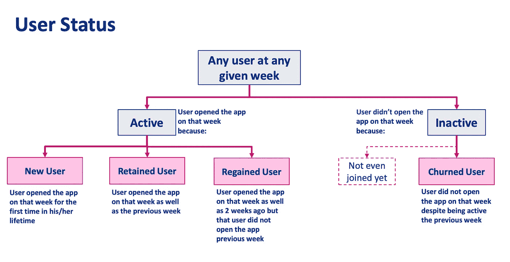
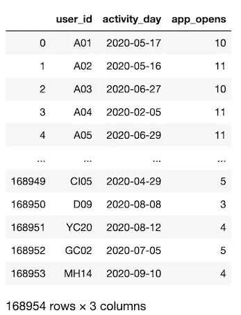
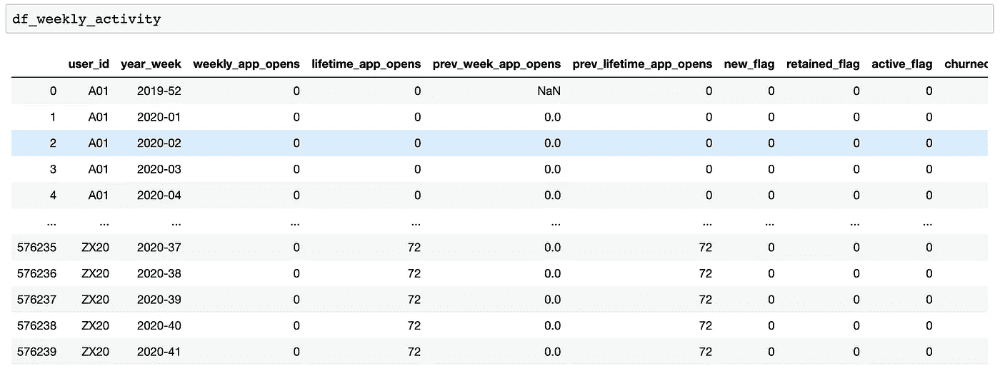
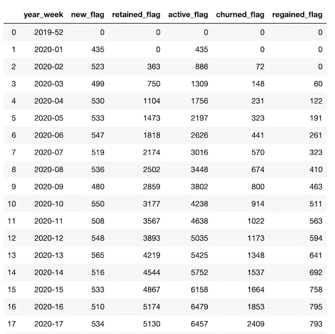
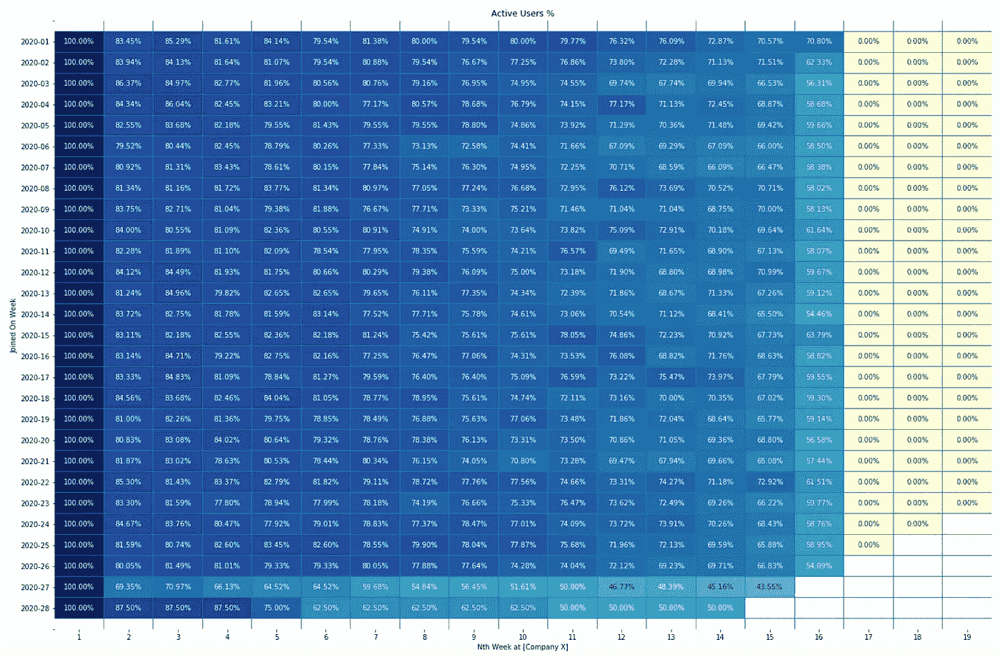
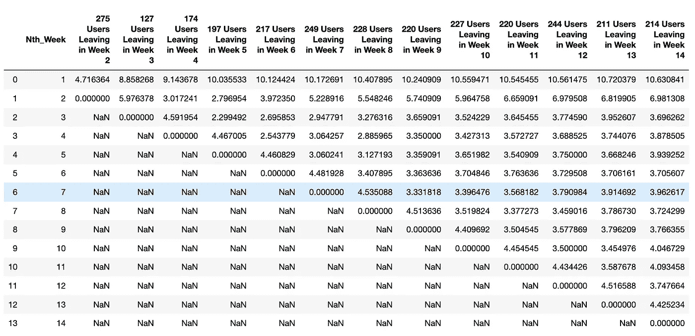
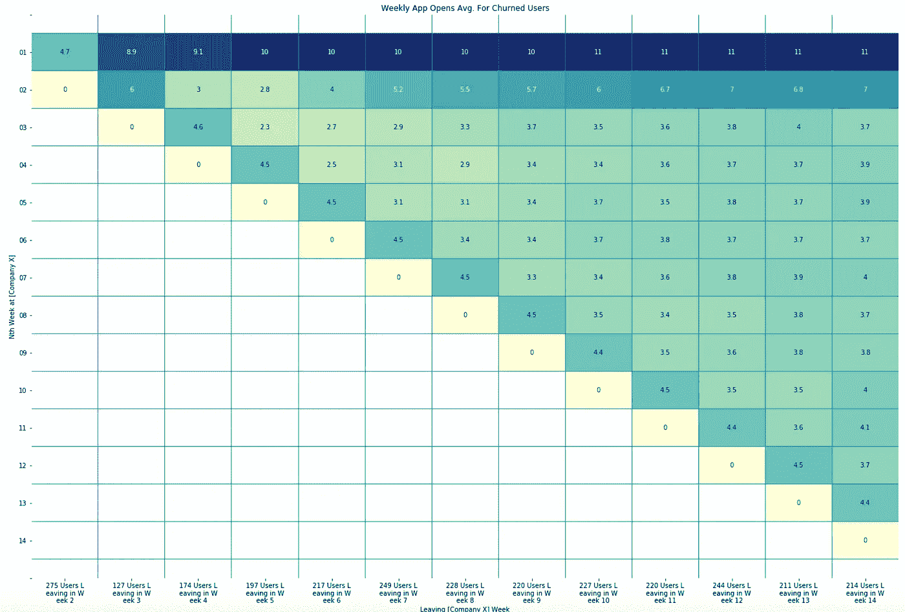

# 使用群组分析测量用户参与度

> 原文：<https://towardsdatascience.com/measuring-user-engagement-with-cohort-analysis-96c46b386862>

## SQL 用于举重，熊猫用于深潜


威廉·沃比在 [Unsplash](https://unsplash.com?utm_source=medium&utm_medium=referral) 上的照片

公司需要能够测量用户参与度和保留度，以量化各种信息，例如(I)它如何随时间演变，(ii)它对外部事件和季节性的敏感程度，以及(iii)不同的用户群如何参与他们的产品。该产品通常是一个应用程序，用户可以与之交互，以获得一些服务。因此，**参与度**可以简单地定义为**用户在应用**上的活动。

# 1-简介

在这篇文章中，我将向你展示一个如何用“群组分析”调查用户参与度的例子。

> "一群人是指在一定时期内具有共同特征的一群人."

为了让事情更简单，让我们假设这个共同特征是用户第一次打开公司应用的那一周。这会将该用户的状态设置为活动用户。如果用户下周没有打开应用程序，那么它的状态将是不活动的。在此基础上，可以为活动和非活动用户提供以下状态定义，这将有助于我们跟踪不同的群组。



作者图片

**按照这个逻辑，我们可以看到，在任何给定的一周，**

*   保留用户、重新获得用户和流失用户的总数等于前几周至该周所有新用户的累计总和。
*   留存率为(留存用户总数)/(留存用户总数+流失用户总数)

**步骤**

[**a)虚拟数据库**](#05cb)

[**b) SQL 查询**](#0327)

[**c)回归熊猫**](#6aff)

[**d)表格转换**](#2395)

[**e)时间队列**](#9d91)

[**f)行为群组**](#c703)

[**结论**](#2509)

# 双流程

让我们生成一个虚拟用户活动数据库，并开始处理它。

## **2.a)虚拟数据库**

通常，公司都有自己的数据库来收集用户活动数据。然而，为了便于说明，我们将生成自己的用户活动表(使用 pandas 和 NumPy)并将其推送到 SQL 数据库，这样我们就可以使用 SQL 查询来完成繁重的工作。我们的 activity 表将有 3 个基本列:(i) user_id，(ii) activity_day，以及(iii)在那一天为该用户打开的 app_opens。

```
from matplotlib import pyplot as plt
import numpy as np
import pandas as pd
import string
import seaborn as snspd.set_option('display.max_rows', 400)
pd.set_option('display.max_columns', 200)
pd.set_option('display.max_colwidth', 150)# ['A', 'B', ..., 'AA', 'AB', ..., 'ZY', 'ZZ']
ALPHABETICAL_LIST = (list(string.ascii_uppercase) + 
                     [letter1+letter2 for letter1 in string.ascii_uppercase 
                      for letter2 in string.ascii_uppercase])%matplotlib inline
plt.rcParams["figure.figsize"] = (40,20)
```

虚拟用户活动表将是

```
userid_list = [letter+'{:02d}'.format(i) for letter in ALPHABETICAL_LIST 

               for i in range(1,21)][:14000]np.random.seed(0)app_opens = np.concatenate(( 
    np.random.choice(range(10,13), size=len(userid_list)),
    np.random.choice(range(8,11), size=len(userid_list)),
                ))user_ids = np.concatenate((
                           userid_list, 
                           userid_list, 
                           ))app_activations = np.datetime64('2020-01-06') + np.random.choice(np.arange(0, 180), len(userid_list))activity_days = np.concatenate((
                           app_activations, 
                           app_activations + 7, 
                           ))random_user_ids = [x for x in userid_list]for days_passed in range(14,106, 7):

    user_id_sample = int(np.floor(len(random_user_ids) * 0.98))if user_id_sample!=0:

        random_user_ids = [random_user_ids[x] for x in 

                           np.random.choice(range(len(random_user_ids)),size=user_id_sample,replace=False)]user_ids = np.concatenate((user_ids, random_user_ids))

        app_opens = np.concatenate((app_opens, 

                                    np.random.choice(range(3,7), 

                                                     size=user_id_sample, 

                                                    p=[0.2, 0.3, 0.3, 0.2]

                                                    ),
                                    ))

        activity_days = np.concatenate((activity_days, 

                                        [app_activations[userid_list.index(x)]+days_passed for x in random_user_ids]

                                        ))df_user_activity = pd.DataFrame(zip(user_ids, activity_days, app_opens), 
                                columns=['user_id', 'activity_day', 'app_opens'])df_user_activity = df_user_activity.groupby(['user_id'], 
                                            group_keys=False
                                           ).apply(lambda df: df.sample(len(df)-2)
                                                  ).sort_index().reset_index(drop=True)df_user_activity['count'] = df_user_activity.groupby(['user_id'])['activity_day'].transform(len)df_user_activity.loc[df_user_activity['count']==1, 'app_opens'] = np.minimum(5, df_user_activity['app_opens'])df_user_activity = df_user_activity.drop(['count'], axis=1)df_user_activity
```



作者图片

让我们将这个表写入 SQL 数据库。

```
from sqlalchemy import create_engine
import osSQL_ENGINE = create_engine('sqlite:///'+ 'medium_project.db',
                           connect_args={'check_same_thread': False}).connect()df_user_activity.to_sql(name='user_activity',
                  index=False,
                  con=SQL_ENGINE,
                  if_exists='replace')
```

## 2.b) SQL 查询

下面的查询帮助我实现了我想要进行队列分析的观点。对于上述时间段(42 周)，我创建了一个表，显示 user_id、week 和 weekly_flags(比如 new、retained、recreated 和 churned)。该表有 13，720 个唯一的 user _ ids * 42 周= 576，240 行。

**在查询上，**

*我创建了一个周周期表来连接 user_activity_daily 数据，为每个用户带来缺失的周。我的目标是实现一个表格视图，其中，对于每个用户 id，我们有 42 周的行和他们每周打开的应用程序总数。我首先将每个活动日转化为一年一周的视图，为用户应用分组(应用打开总数)。后来，我将它加入到周期表中，对于不相关的周，我将 app_opens 转换为 0，最后，我计算生命周期(累计)、前一周(滞后)和前一生命周期(滞后累计)weekly_app_opens，以分配新的、保留的、活动的、搅动的、重新获得的标志。注意:row_number()列将重复相同的 daily_activity 行 42 次。*

按作者对用户活动的 sql 查询

在我将这个表保存为 CSV 之后，我返回了 Pandas 用于我的剩余分析。

*虽然这不在本文的讨论范围之内，但是如果需要的话，这个表可以进一步与其他 SQL 表连接，以便将与用户段相关的信息显示在视图中。*



作者图片

## 2.c)回归熊猫

下表显示了每周新增、保留、活跃、恢复和流失的用户总数。

```
df_overall_summary = df_weekly_activity.groupby(
                    ['year_week']
                          )['new_flag', 
                            'retained_flag', 
                            'active_flag', 
                            'churned_flag', 
                            'regained_flag'].sum().reset_index()df_overall_summary
```



作者图片

例如，如果我们查看上述数据框的前 3 行，我们可以看到，在 2020 年的第一周，435 名用户首次打开了该应用程序。接下来的一周，在这 435 人中，除了 523 名新加入者之外，还有 72 人(在那一周)和 363 人仍然活跃。

现在我们已经有了基于用户的每周活动视图，让我们进一步分析和可视化群组。

## 2.d)表格转换

我将通过将同一周的订阅者分组来查看所有用户的活动旅程。我的目标是确定第 n 周之后每个人的活动量是否下降。我们将在第 X 周(100%活跃)、第 X+1 周、第 X+2 周、第 X+3 周、第 X+4 周等时间段调查在第 X 周拥有新标志的用户的平均活跃用户数。

```
df_weekly_activity['new_flag_cumsum'] = df_weekly_activity.groupby(['user_id'])['new_flag'].cumsum()# Filterin out the rows where the user didn't started its journey
# (they weren't even a new user yet).df_cohort_prep = df_weekly_activity[df_weekly_activity['new_flag_cumsum']>0].reset_index(drop=True)
df_cohort_prep = df_cohort_prep.merge(

df_cohort_prep[df_cohort_prep['new_flag']==1][['user_id', 'year_week']].rename(columns={'year_week': 'joined_on'}),

how='left', on=['user_id']                    

                    )df_cohort['Nth_Week'] = (df_cohort['year_week'].str[:4].astype(int) * 52 + 
                         df_cohort['joined_on'].str[:4].astype(int) * 52 * -1 + 
                         df_cohort['year_week'].str[-2:].astype(int) + 
                         df_cohort['joined_on'].str[-2:].astype(int) * -1 
                         + 1
                         )
```

## 2.e)时间群组

第一周总是 100%,因为这时候用户是公司的新用户。

```
df_heatmap = pd.pivot_table(
               df_cohort[df_cohort['Nth_Week']<20],
               index=['joined_on'], 
               columns=['Nth_Week'], 
               values=['active_flag'], 
               aggfunc=lambda x: np.sum(x) / len(x)
               )df_heatmap.loc[''] = np.nandf_heatmap = df_heatmap.sort_index(axis=0)df_heatmap.loc[' '] = np.nanfig2 = plt.figure(figsize=(24,16))ax1=sns.heatmap(df_heatmap.values, 
            xticklabels=[b for a,b in df_heatmap.columns],
            yticklabels=df_heatmap.index.tolist(),
            vmin=df_heatmap.min(axis=1).min(), 
            vmax=df_heatmap.max(axis=1).max(),    
            annot=True, 
            fmt=".2%", 
            cmap='YlGnBu', 
            linewidths=.005, 
            linecolor='#029386',
            cbar=False, 
               )ax1.set_title('Active Users %')plt.subplots_adjust(hspace=0.35, wspace=0.2)ax1.set_yticklabels(ax1.get_yticklabels(), rotation=0)ax1.set_xlabel('Nth Week at [Company X]')ax1.set_ylabel('Joined On Week')fig2.savefig("Weekly Active Users % Medium.png", bbox_inches = 'tight')
```



作者图片

可以看到，用户活跃度在第 2 周下降到 80–85 %,并继续下降，对于许多群组来说，活跃度在第 16 周下降到 0%。

```
df_heatmap = pd.pivot_table(
               df_cohort[df_cohort['Nth_Week']<20], 
               index=['joined_on'], 
               columns=['Nth_Week'], 
               values=['weekly_app_opens'], 
               aggfunc=lambda x: np.mean(x)
               )df_heatmap.loc[''] = np.nandf_heatmap = df_heatmap.sort_index(axis=0)df_heatmap.loc[' '] = np.nanfig2 = plt.figure(figsize=(24,16))ax1=sns.heatmap(df_heatmap.values, 
            xticklabels=[b for a,b in df_heatmap.columns],
            yticklabels=df_heatmap.index.tolist(),
            vmin=df_heatmap.min(axis=1).min(), 
            vmax=df_heatmap.max(axis=1).max(),    
            annot=True, 
            #fmt=".2%", 
            cmap='YlGnBu', 
            linewidths=.005, 
            linecolor='#029386',
            cbar=False, 
               )ax1.set_title('App Opens Avg.')plt.subplots_adjust(hspace=0.35, wspace=0.2)ax1.set_yticklabels(ax1.get_yticklabels(), rotation=0)ax1.set_xlabel('Nth Week at [Company X]')ax1.set_ylabel('Joined On Week')fig2.savefig("Weekly App Opens Avg Medium.png", bbox_inches = 'tight')
```

平均而言，用户在第一周打开应用程序 10-11 次，第二周打开 6-7 次。在完全搅拌之前，他们每周打开应用程序 2-2.5 次。


作者图片

## 2.f)行为群组

找到用户永远无法恢复的行索引。

```
df_churned_forever_index = df_cohort[

df_cohort['active_flag'].eq(1)[::-1].astype(int).groupby(df_cohort['user_id']).cumsum().eq(0).sort_index(axis=0)].groupby('user_id', sort=False
                  )['Nth_Week'].idxmin().reset_index().rename(columns={'Nth_Week': 'index_value'})
```

仅保留用户之间的行是新的，并且在我们的时间窗口的剩余时间内会发生变化。

```
df_cohort = df_cohort.merge(

df_churned_forever_index,

how='left', on=['user_id']                    

                    )df_cohort_churned_forever = df_cohort[df_cohort.index<=df_cohort['index_value']].reset_index(drop=True)
```

对于所有流失的用户，有多少是在 2 周、3 周、… N 周后流失的，他们的每周应用打开次数是多少？

```
df_users_churning_week = df_cohort_churned_forever.groupby(
                            ['user_id']
                                 )['Nth_Week'].max().reset_index()list_to_append_leaving_users = []for Nth_WEEK in range(2,15):

    list_of_users_leaving_n_week = df_users_churning_week[(df_users_churning_week['Nth_Week']==Nth_WEEK)]['user_id'].tolist()list_to_append_leaving_users.append(df_cohort_churned_forever[
        df_cohort_churned_forever['user_id'].isin(list_of_users_leaving_n_week)
                             ].groupby(['Nth_Week'])['weekly_app_opens'].mean().reset_index().rename(
        columns={'weekly_app_opens': '{} Users Leaving in Week {}'.format(
            len(list_of_users_leaving_n_week), Nth_WEEK)}).set_index(['Nth_Week']))

df_churned_users_weekly_app_opens = pd.concat(list_to_append_leaving_users, sort=False, axis=1)df_churned_users_weekly_app_opens.reset_index()
```



作者图片

如上图所示，在第二周流失且从未恢复的用户是那些在第一周平均打开应用 4.7 次的用户。



作者图片

# 3-结论

如果不增加用户的活跃度，公司也会想保持用户的活跃度。此外，如果有任何用户参与度可能下降的危险信号，他们希望通过观察趋势来了解这一点。在这篇文章中，我分享了一些 Python 和 SQL 代码，来演示如何从用户活动表中分析保留。

例如，创建了多个群组:

一次性群组(第 2.e 节，根据一段时间内的活动对用户进行分组)

2-行为群组(第 2.f 节，找到被搅得一蹶不振的用户)