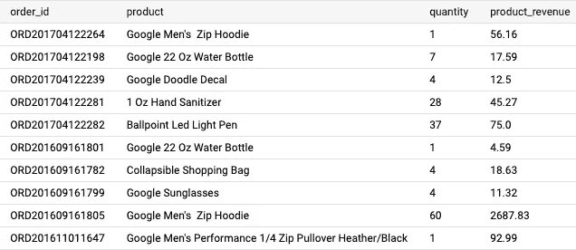
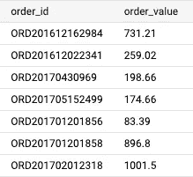
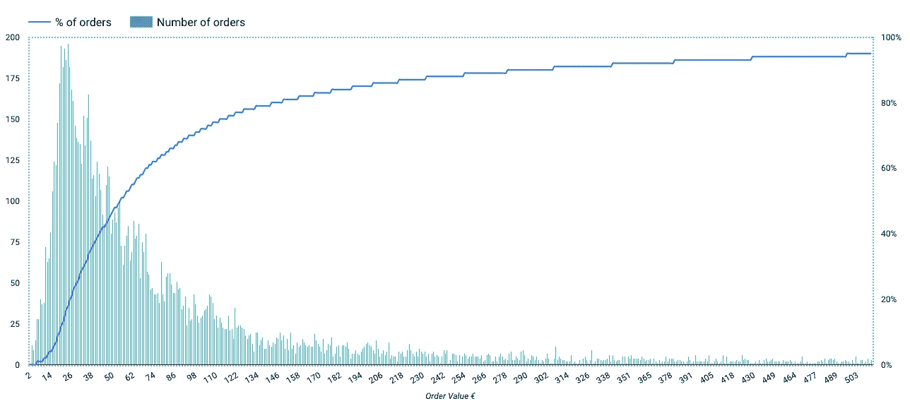
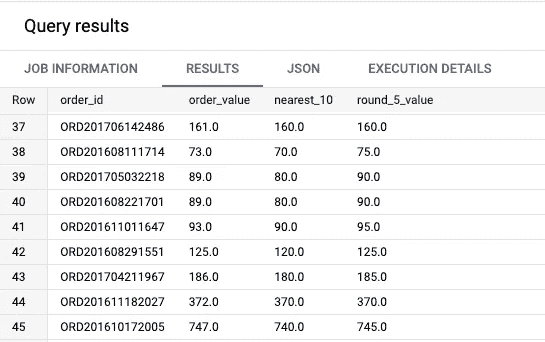
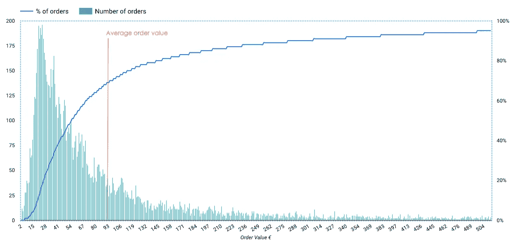
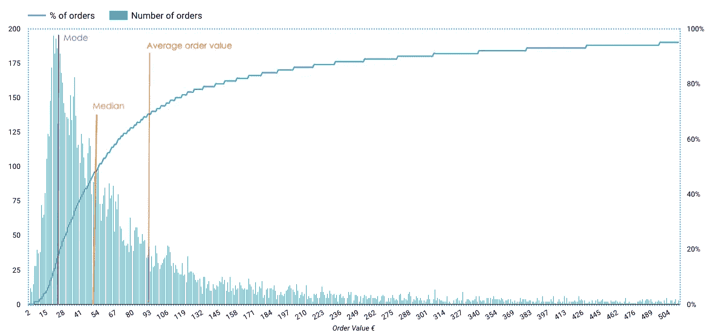
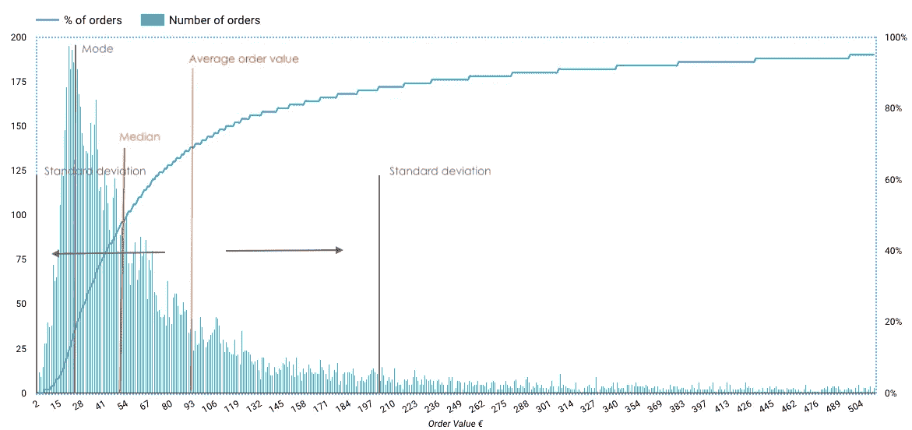

# 使用 SQL 的 BigQuery 中的中值、众数和平均顺序值

> 原文：<https://towardsdatascience.com/median-mode-and-average-order-value-in-bigquery-using-sql-8952bfbc288a>

## 了解客户的订购习惯，选择最佳策略增加订单价值

在 [Unsplash](https://unsplash.com?utm_source=medium&utm_medium=referral) 上由[小米勒](https://unsplash.com/@mildlee?utm_source=medium&utm_medium=referral)拍摄的照片

# 为什么使用中位数、众数或平均顺序值？

这些指标可以帮助您了解您的客户如何在**【订单级别】**进行购买。不同的维度，如你的产品组合的价格范围、获取渠道和位置，都会对这些指标产生影响。你也可以将它们与其他行业进行比较。

> 这样做的目的是在尝试新的销售策略来增加订单价值之前，充分了解客户的购买行为。

让我们从一个例子开始，假设你销售下列物品:

*   一件 t 恤(15€)
*   一件连帽衫(35€)
*   一顶太阳帽(10€)

您观察到您的平均订单价值( **AOV** )是 **13，75€。**这个可能意味着您的客户在每个订单中购买**少量商品**以及**低值产品。**

更准确地说，我们必须查看我们的**订单的价值分布**，并使用额外的指标，如**中值**或**众数、**或**标准差**，以给出一个比平均订单价值更广泛的图景。

## 使用附加维度

您还可以查看按国家或**采购渠道、**等细分的**订单价值的这些指标(平均值、中值、众数)**

目标是发现不同的行为或不同的趋势。也许通过电子邮件渠道获得的客户**使用了更多折扣** **(导致订单价值降低)**，而法国客户喜欢你的产品，因此订购了更多数量，或者**在每个订单中组合了多个项目**(**导致订单价值增加**)。

## 使用基准

基准可以用来比较你的公司和其他公司的表现。如果时尚界的基准显示,**AOV 60€**而你有 **13，75€ AOV** ，也许你的销售策略可能不会那么有效。

但是，请记住，您的平均订单价值**取决于几个方面，如您的定价点、地区/位置、细分市场**等等…

一个网站的例子，提供不同行业的 AOV 基准。

<https://marketing.dynamicyield.com/benchmarks/average-order-value/>  

## 增加订单价值的策略

当我们在这里关注 SQL 时，我推荐阅读这些不同文章中关于你可以使用什么策略来增加你的平均订单价值的内容。

<https://www.shopify.com/blog/average-order-value>  <https://medium.com/@Bold_Commerce/9-upselling-techniques-to-explode-your-average-order-value-99b727585b77>  

# 让我们计算和分析我们的指标

让我们定义我们的三个指标，并解释我们将使用哪些销售数据。

*   **平均值:**是客户在一个订单上花费的总金额，是所有订单的平均值。它可以告诉你，你预计客户在一个订单上会花多少钱。
*   **中值:**是您所有订单的**中间值。这意味着 50%的订单值小于或等于中值，50%的订单值大于或等于中值。**
*   **模式:**是所有订单中最频繁出现的值。也许你有一个明星销售产品，你的许多客户都在做同样的订单。

为了计算这些指标，我们使用来自官方 [**Google 商品商店**](https://shop.googlemerchandisestore.com/) 的销售数据，我们的表中每行都有一个产品、一个数量、一个收入和相关的订单 id。我们将把这个表称为我们的“基表”。

我们将用于计算指标的基础表(图片由[作者](https://romaingranger.medium.com/)提供)

## 计算每个订单的价值

我们的第一步是获取每个订单的值。在我们的例子中，产品收入一栏已经考虑了购买的数量。这意味着我们只需**对每个订单 ID** 的产品收入求和，即可获得订单价值。

获取按 order_id 分组的每个订单的总收入

这将简单地返回每个订单产生了多少欧元收入(我们的订单价值)。

显示每个订单收入的两栏表格。(图片由[作者](https://romaingranger.medium.com/)提供)

在我们的案例中，我们有大约**11，000 个订单**，每个订单都有一个价值(以欧元/€计算的收入)。

**订单值直方图**

当我们知道中位数、平均值和平均数在整个数据集中的位置时，它们就更容易解释了。直方图可以用来说明这一点。

这将导致 Datastudio 中的以下图表，这将帮助我们更好地了解我们的客户是如何购买的。

订单的价值分布和占订单总额的百分比。(图片由[作者](https://romaingranger.medium.com/)提供)

浅蓝色条显示了我们每个订单的价值分布。我们可以观察到**我们的大部分订单都在 15–50 欧元**和之间，也就是说我们有一个超过 100 欧元的**非常长的尾巴**。

蓝色的实线向我们展示了与订单总数相比有多少订单(在我们的例子中是 11k)。我们在这里看到，我们 80%的订单价值在 0 到 140 欧元之间。这有助于你知道什么时候你看到了一条长长的订单尾巴。

我们没有在图表的右轴上达到 100%,因为我们没有绘制所有的数据点。一些订单产生了巨大的收入(我们确实有从 2 欧元到 47 000 欧元的订单**),这可能被认为是异常值。**

我们可以使用桶来更好地绘制后面的整个数据集，并查看如何删除异常值。

在我们的案例中，我们将**删除**所有超过 **690 欧元**的订单，因为仅代表**我们订单的 3%** 。

> 提示 *:* 要在 SQL 中构建存储桶，并将您的值转换成可读性更好的直方图，您可以使用以下技术。
> 
> `*TRUNC(order_value,-1)*` *:* 这将返回最近的下 10 个值。
> 
> `*ROUND(order_value/5,0)*5*` *:* 这将每 5 步返回最近的值。

使用桶的示例(图片由[作者](https://romaingranger.medium.com/)提供)

**平均订单值**

因为我们有一个包含每个订单值的表，所以我们可以简单地使用`AVG()`聚合函数，如下所示:

是的，就是这么简单！该查询将返回一个数字，表明我们商店的订单平均价值为 93 欧元。

平均订单值(红色垂直线)绘制在我们的直方图上。(图片由[作者](https://romaingranger.medium.com/)提供)

**订单中值**

为了计算中值，我们将使用 `PERCENTILE_CONT(order_value, 0.5)`函数。

percentile 函数将遍历我们数据集的每一行，并返回`order_value`列的中值(这就是为什么我们使用 0.5 参数，这意味着 50%的值高于或低于该点)。

在之前绘制的直方图中，我们可能已经使用深蓝色线检查了中值的位置。

在我们的情况下，这个查询返回的值是 52。这表明我们一半的订单**价值不到 52 欧元，另一半价值更多**。

订单中值(黄色垂直线)绘制在我们的直方图上。(图片由[作者](https://romaingranger.medium.com/)提供)

因为这个函数是一个导航函数，所以我们应用一个`LIMIT 1`来只返回 1 行。

<https://cloud.google.com/bigquery/docs/reference/standard-sql/navigation_functions#percentile_cont>  

**模式顺序值**

为了获得模式，我们将使用`APPROX_TOP_COUNT(order_value,1)`功能。这将返回数据集中最常见的值。

我们使用 1 作为参数，所以这个函数只返回一个结果。

我们系列中最常见的价值是 **24 欧元**196 个订单。这是我们数据集的模式。

请记住，函数`APPROX_TOP_COUNT()`返回一个数组，而不是一个整数。

视觉上，在我们的直方图上也很容易看到。

模式阶数值(紫色垂直线)绘制在我们的直方图上。(图片由[作者](https://romaingranger.medium.com/)提供)

<https://cloud.google.com/bigquery/docs/reference/standard-sql/approximate_aggregate_functions#approx_top_count>  

**标准偏差**

为了完成这篇文章，我们将把最后一条信息添加到直方图中。

标准差衡量数据集相对于其均值的离差，用更简单的术语来说，它将帮助我们了解**什么是标准订单值，**或者换句话说，当有人说**“这是一个大订单”**或**“这是一个小订单”时，这意味着什么。**

在我们的案例中，一份订单平均是 93 欧元。

根据我们的查询，我们的标准偏差是 **112 欧元**。所有在 93 欧元(我们的平均值)+112 欧元(205 欧元)和-112 欧元(-19 欧元)范围内的订单都被视为标准订单。当然，在这种情况下，我们将边界标在 0，而不是-19。

我们订单值的标准偏差(黑色垂直线)绘制在直方图上。(图片由[作者](https://romaingranger.medium.com/)提供)

在我们的案例中，205 欧元以上的订单可以被认为是特殊的，或者是我们可以研究的边缘案例。了解它们对我们的业务意味着什么也很有意思。

此外，来自 **0 至 205 欧元**的订单占**订单**的 85%。这意味着这是我们观察到的范围，也是我们可以预期的范围。

<https://cloud.google.com/bigquery/docs/reference/standard-sql/statistical_aggregate_functions#stddev>  

**结论**

我们确实对客户的购买方式有了更全面的了解。似乎有一些订单**(大于 205 欧元)**可能是异常值，或者可能与业务的某个特定方面相关(可能是大公司的订单、技术活动的采购等……)。

我们一半的订单仍处于低值**(2-54 欧元)**，如果我们想增加订单价值，查看我们的产品组合和交叉销售/追加销售策略可能会很有意思。

根据模式并查看直方图，我们的大部分订单都在**20-24 欧元之间，**我们可能会在这些订单中出现畅销商品**或低价商品组合**。

希望这可以帮助你定义和决定在订单层面应用的策略，比如组合产品、改变运费、折扣优惠(买二送一)，甚至更有创意的策略。