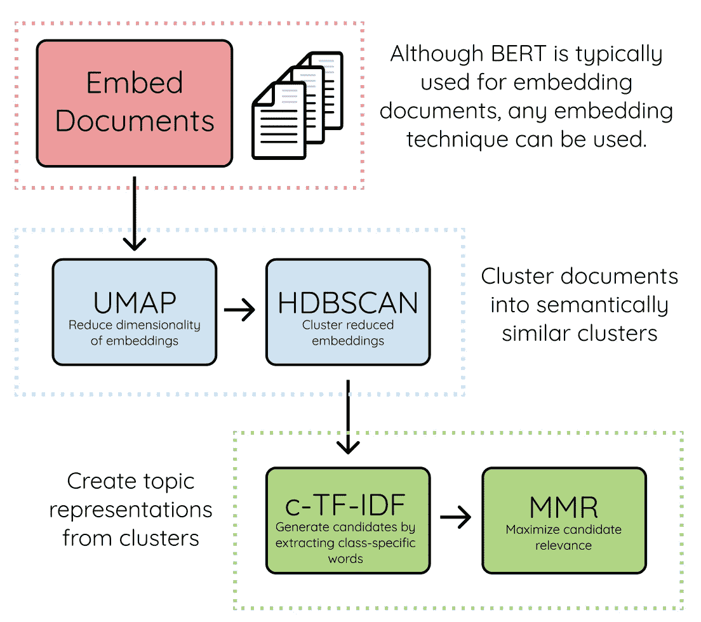
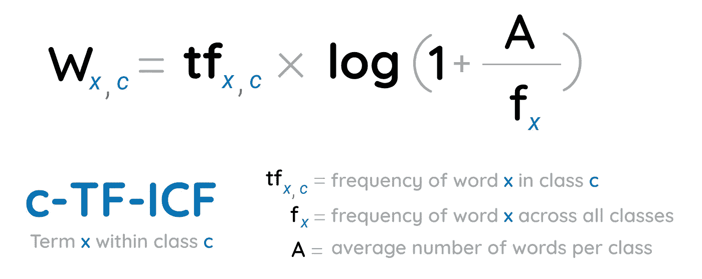
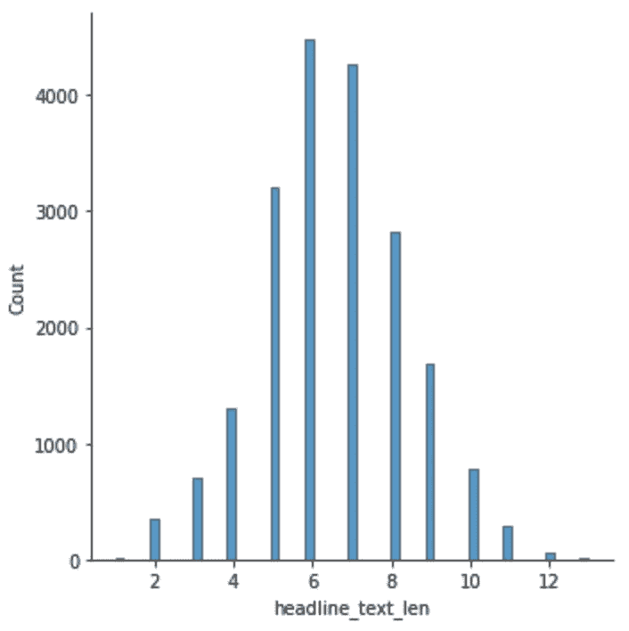
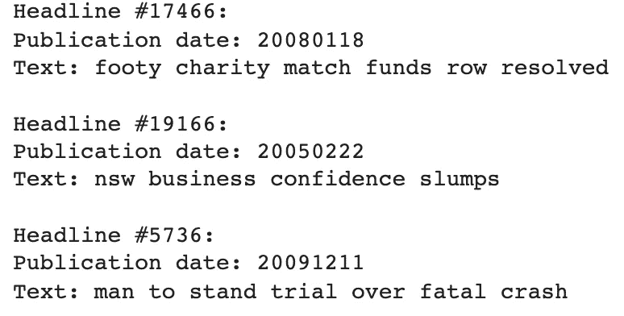
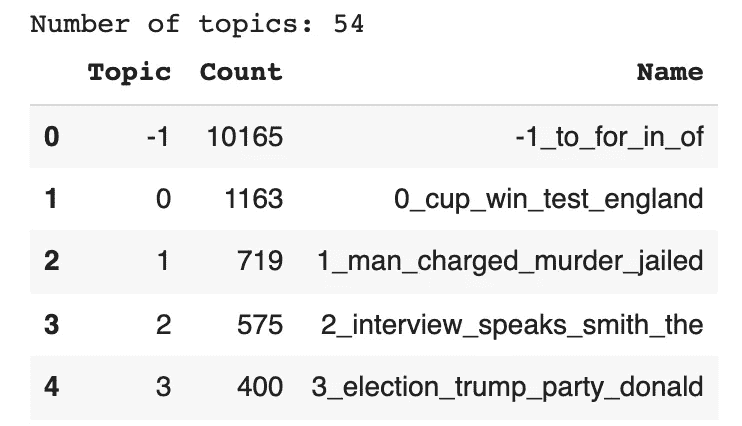
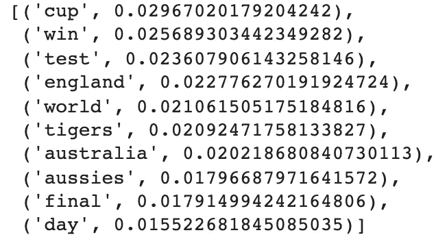
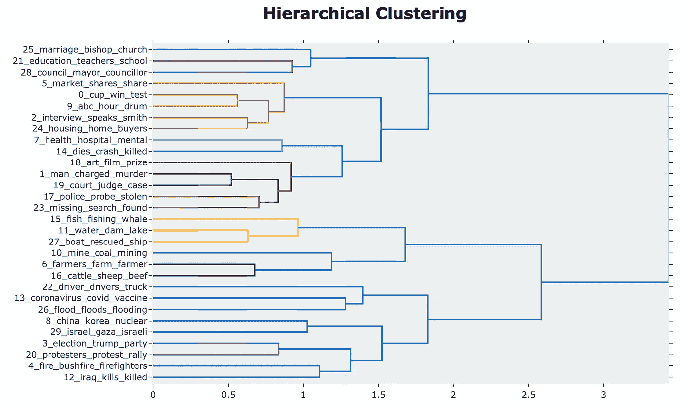

# 认识一下 BERTopic——BERT 的堂兄，学习高级主题建模

> 原文：<https://towardsdatascience.com/meet-bertopic-berts-cousin-for-advanced-topic-modeling-ea5bf0b7faa3>

## 使用转换器进行自动主题发现的综合概述


善良好奇的在 [Unsplash](https://unsplash.com/photos/ZDUXvlyU_iI) 上拍摄的

# 介绍

我们生活在一个被大量文本信息包围的时代，如调查回复、社交媒体评论、推文等。找到满足个人需求的合适信息是一项挑战，尤其是在处理大量不同的数据时。

多亏了[主题建模](https://en.wikipedia.org/wiki/Topic_model)，一个自然语言处理的时代用来通过将大 ***未标记文本*** 数据分组/聚类成主题来高效地分析它们。最近，我遇到了 BERTopic，这是一个用于主题建模的简单而强大的库。所以，我决定试一试，结果很厉害！

# 伯托皮—凯扎科？

该工具由 [Maarten Grootendorst](https://www.maartengrootendorst.com) 于 2020 年开发，根据文档:

> BERTopic 是一种主题建模技术，它利用了🤗transformers 和 c-TF-IDF 创建密集的集群，允许轻松解释主题，同时在主题描述中保留重要的单词。

从模型创建到各种可视化功能，它都非常简单且易于操作。

## BERTopic 的主要组件

下图显示了该算法的三个主要组件:



图 1:算法[文档页面](https://maartengr.github.io/BERTopic/algorithm/algorithm.html)上由[马腾·格罗腾德斯特](https://www.maartengrootendorst.com)制作的 BERTopic 主要部件

1.  **文件嵌入**

第一步是通过利用[句子转换器](https://github.com/UKPLab/sentence-transformers)来执行的，这是一个多语言框架，提供了一种简单的方法来为我们的数据语料库中的每个文档生成密集的向量表示。

**2。文档聚类**

根据之前的嵌入，我们可以使用 UMAP 方法对维度执行聚类，结果被传输到 HDBSCAN 以聚类语义相似的聚类(文档集)。

**3。主题表示**

这最后一步是通过使用基于类别的 TF-IDF 方法为每个聚类提取最相关的词来执行的，以便获得主题的表示。公式如下所示:



图 2:算法[文档页面](https://maartengr.github.io/BERTopic/algorithm/algorithm.html)上 [Maarten Grootendorst](https://www.maartengrootendorst.com) 的 c-TF-IDF 公式

既然我们已经了解了 BERTopic 是什么以及它是如何工作的，我们现在就可以准备用 Python 实现一个端到端的实现了。

如果您喜欢视频，可以观看本文的视频演示:

# 关于数据

*   这是澳大利亚广播公司历时八年发布的新闻， ***可免费获得*** 上的 [Kaggle](https://www.kaggle.com/therohk/million-headlines) 和 ***不得用于商业用途*** 。它有两个主要栏目:
*   ***发布日期*** :文章以 yyyyMMdd 格式发布的日期。
*   ***headline _ text***:英文标题的文字。 ***这是主题模型将使用*** 的信息。

为了能够使 BERTopic 训练更快，我使用了数据集的一个子集，你可以在我的 GitHub 页面上访问它。

**头条分布**

这里的目标是检查标题的长度分布，以便使用更适合数据集的模型。

数据信息. py



图 3:标题长度分布:最大长度为 15(图片由作者提供)

我们可以看到，最长的标题有 13 个标记，下面是 3 个随机标题:

random _ headlines.py



图 4:数据集中的 3 个随机标题

# BERTopic 实现

与本文相关的所有代码都可以通过我的 [GitHub](https://github.com/keitazoumana/Medium-Articles-Notebooks/blob/main/Advanced_Topic_Modeling_BERTopic.ipynb) 访问。

## 模型结构

这一步与 BERTopic 模型的实现相关，对默认参数进行如下微调:

BERTopic_model.py

*   `verbose`到`True`:使模型初始化过程不显示消息。
*   `paraphrase-MiniLM-L3-v2`是性能和速度权衡最好的句子变形金刚模型。
*   `min_topic_size`设置为 50，默认值为 10。该值越高，分类/主题的数量越少。
*   `.fit_transform()`在头条数据集上训练 BERTopic 模型。

## 主题抽取和可视化

一旦模型经过训练，就可以执行许多操作，例如主题提取和可视化。

top_topics.py



图 5:前 5 个“热门”话题信息(作者图片)

上表有 3 个主要列，按照主题大小/数量的降序提供了所有 54 个主题的信息。

*   **Topic** 是主题号，一种标识符，离群值标记为-1，那些对应的主题应该被忽略，因为它们没有带来任何附加值。
*   **计数**是题目中的字数/术语数。
*   **名称**是赋予主题的名称。

对于每个主题，我们可以检索出最热门的词及其对应的 c-TF-IDF 得分。分数越高，这个词就越能代表主题。

topic_info.py



图 6:第一个热门话题的术语(top #1)及其 c-TF-IDF 得分(图片由作者提供)

从这个话题中，我们观察到所有的单词对于潜在的话题都是连贯的，这个话题似乎是关于⚽️.足球的

# 主题可视化

主题可视化有助于更深入地了解每个主题。BERTopic 提供了几种可视化的可能性，例如*术语可视化、主题间距离图、主题层次聚类*等等，我们的重点将放在那些已经被引用的方面。

## 主题术语

每个话题最相关的词可以用 c-TF-IDF 评分出来的柱状图的形式可视化出来，直观对比话题很有意思。下面是主题 6 主题的相应可视化。

主题词得分(按作者)

话题 1 的热门词汇是男人，被控谋杀入狱，这显然是一个与犯罪有关的话题。同样的分析可以很容易地从每个剩余的主题中得出。横条越长，与主题的相关性越大。

## 主题间距离图

对于熟悉潜伏狄利克雷分配 [LDAvis](https://github.com/cpsievert/LDAvis) 库的人来说，如果不是 [**下面是我关于它的文章**](/do-you-want-to-cluster-unlabeled-text-data-try-out-topic-modeling-235795ae7cb7) 。这个库为用户提供了一个交互式仪表板，显示每个主题对应的单词及其分数。BERTopic 用 visualize_topics()函数做了同样的事情，甚至更进一步，给出了主题之间的距离(越低越相似)，所有这些都用一个函数`visualize_topics().`

主题间距离图(作者)

## 可视化主题层次结构

正如您在 Interdistance 主题仪表板中看到的，有些主题非常接近。我能想到的一件事是，我如何减少话题的数量？好消息是，这些主题可以分等级，以便选择适当数量的主题。可视化有助于理解它们之间的关系。



图 7:前 30 个主题的层次聚类(图片由作者提供)

通过查看树状图的第一层(第 0 层),我们可以看到具有相同颜色的主题被分组在一起。例如:

*   主题 7(健康、医院、精神)和主题 14(死亡、车祸、死亡)因为相近而被归为一组。
*   主题 6(农民，农场，农民)和 16(牛，羊，牛肉)也必须以同样的方式分组。
*   等等。

所有这些信息可以帮助用户更好地理解为什么主题被认为是相似的。

# 搜索主题

一旦训练了主题模型，我们就可以使用`find_topics`函数搜索与输入查询词/术语语义相似的主题。在我们的例子中，我们可以搜索与单词“*”相关的前 3 个主题。*

*topic _ search.py*

*   *`similar_topics` 相似主题包含从最相似到最不相似的主题索引。*
*   *`similarity`包含降序排列的相似性得分。*

*show_top_similar_topic.py*

*我们可以从下面的输出中看到，最相似的主题是显示术语“选举”、“特朗普”、“奥巴马”等。这显然与政治有关。*

```
*Most Similar Topic Info:  
[('election', 0.08389822503224101), ('trump', 0.0512571921683764), ('party', 0.034052442556456154), ('donald', 0.03268734381432749), ('obama', 0.030983388040422003), ('liberal', 0.02869493503505037), ('bush', 0.022854654022153992), ('liberals', 0.022814234525823825), ('vote', 0.02273902178387999), ('presidential', 0.02256653331627359)] Similarity Score: 0.7048206256962174*
```

# *模型序列化和加载*

*当您对模型的结果感到满意时，可以使用以下说明保存它以供进一步分析:*

*模型 _ 序列化. py*

# *结论*

*我真的很喜欢试验 BERTopic，结果非常令人鼓舞。请不要犹豫，在您的业务案例中尝试一下。然而，重要的是要注意，BERTopic 的结果在运行之间并不一致，这是由于用于降维的 UMAP 的随机性质。所以，在 UMAP 使用 random_state 参数任何随机行为。*

*在 YouTube[上关注我](https://www.youtube.com/channel/UC9xKdy8cz6ZuJU5FTNtM_pQ)获取更多互动会话！*

# *额外资源*

*[BERTopic 算法](https://maartengr.github.io/BERTopic/algorithm/algorithm.html)
[BERTopic FAQ](https://maartengr.github.io/BERTopic/faq.html#:~:text=Why%20are%20the%20results%20not%20consistent%20between%20runs%3F,-%C2%B6&text=Due%20to%20the%20stochastic%20nature,topics%20that%20suit%20you%20best.)
[BERTopic Github](https://github.com/MaartenGr/BERTopic)
ka ggle 上的数据集*

*再见🏃🏾*