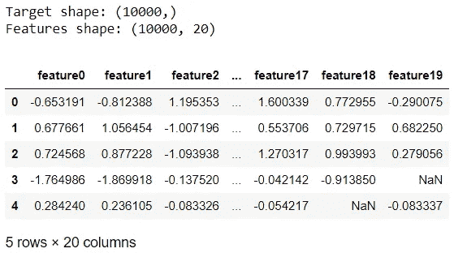
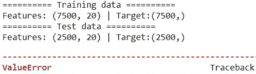
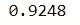
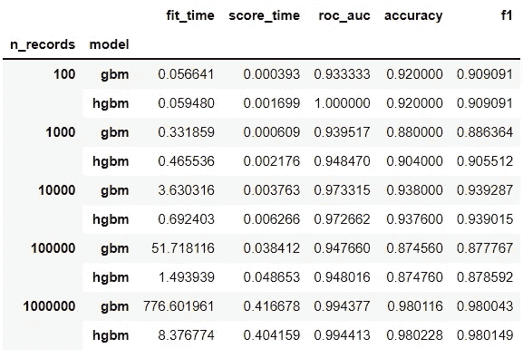
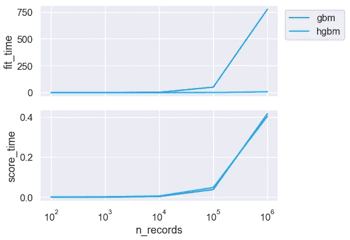
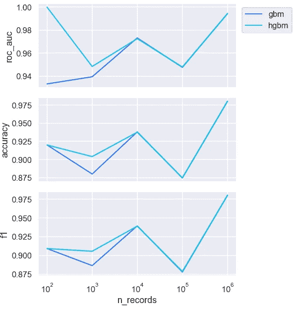

# 认识 histgradientsboostingclassifier

> 原文：<https://towardsdatascience.com/meet-histgradientboostingclassifier-54a9df60d066>

## 计算机编程语言

## 更加灵活和可扩展的梯度增强分类器

Scikit-learn 的[GradientBoostingClassifier](https://scikit-learn.org/stable/modules/generated/sklearn.ensemble.GradientBoostingClassifier.html#sklearn.ensemble.GradientBoostingClassifierhtml)(GBM 从这里开始)是最受欢迎的集成算法之一，在许多数据集上表现良好。[histgradientsboostingclassifier](https://scikit-learn.org/stable/modules/generated/sklearn.ensemble.HistGradientBoostingClassifier.html)(从这里开始的 HGBM)，一个基于直方图的 GBM 替代实现，在 [v0.21.0](https://scikit-learn.org/stable/whats_new/v0.21.html#version-0-21-0) 中作为实验估计器引入。从 [v1.0.0](https://scikit-learn.org/stable/whats_new/v1.0.html#version-1-0-0) 开始，这个估计量已经成为一个稳定的估计量。在本帖中，我们将探讨使用 HGBM 相对于 GBM 的两个主要优势。

*还有回归等价:*[*histgradientsboostingregressor*](https://scikit-learn.org/stable/modules/generated/sklearn.ensemble.HistGradientBoostingRegressor.html)*。然而，由于同样的逻辑适用，为了避免重复，我们将不涉及它。*


由[塞巴斯蒂安·斯文森](https://unsplash.com/@sebastiansvenson?utm_source=medium&utm_medium=referral)在 [Unsplash](https://unsplash.com?utm_source=medium&utm_medium=referral) 上拍摄的照片

# 📦 1.处理丢失的数据

该估计器可以处理缺失数据，因为它内置了对缺失值的支持。让我们来看看实际情况。我们将从导入库开始，并创建一个带有缺失值的样本数据:

```
import numpy as np
import pandas as pd
from time import perf_counter
pd.options.display.max_columns = 6from sklearn.datasets import make_classification
from sklearn.model_selection import train_test_split
from sklearn.ensemble import (GradientBoostingClassifier, 
                              HistGradientBoostingClassifier)
from sklearn.metrics import accuracy_score, roc_auc_score, f1_scoreimport matplotlib.pyplot as plt
import seaborn as sns
sns.set(style='darkgrid', context='talk', palette='rainbow')n = 10**4
X, y = make_classification(n, random_state=42)
X = pd.DataFrame(X, columns=[f'feature{i}' for i in range(X.shape[1])])# Randomly add missing data for all columns
for i, col in enumerate(X.columns):
    np.random.seed(i)
    X.loc[np.random.choice(range(n), 1000, replace=False), col] = np.nanprint(f"Target shape: {y.shape}")
print(f"Features shape: {X.shape}")
X.head()
```



作者图片

我们现在将对数据进行分区，并尝试适应 GBM:

```
X_train, X_test, y_train, y_test = train_test_split(X, y, random_state=42)
print("========== Training data ========== ")
print(f"Features: {X_train.shape} | Target:{y_train.shape}")
print("========== Test data ========== ")
print(f"Features: {X_test.shape} | Target:{y_test.shape}")gbm = GradientBoostingClassifier(random_state=42)
gbm.fit(X_train, y_train)
gbm.score(X_test, y_test)
```



作者图片|部分输出

像大多数 Scikit-learn 的估计器一样，试图用缺失值来拟合模型会触发`ValueError: Input contains NaN, infinity or a value too large for dtype('float32')`。

现在，让我们看看如果我们使用 HGBM 会发生什么:

```
hgbm = HistGradientBoostingClassifier(random_state=42)
hgbm.fit(X_train, y_train)
hgbm.score(X_test, y_test)
```



作者图片

太棒了，这非常有效，因为估计器本身就可以处理缺失数据。这是 HGBM 相对于 GBM 的一个优势。

# 📊 2.能够很好地适应更大的数据

HGBM 是一种实现速度更快的 GBM，可以很好地适应更大的数据集。让我们来看看这两种估计量如何对不同大小的样本数据进行比较:

```
n_samples = 10**np.arange(2,7)
tuples = [*zip(np.repeat(n_samples,2), np.tile(['gbm', 'hgbm'], 2))]
summary = pd.DataFrame(
    index=pd.MultiIndex.from_tuples(tuples, 
                                    names=["n_records", "model"])
)models = [('gbm', GradientBoostingClassifier(random_state=42)), 
          ('hgbm', HistGradientBoostingClassifier(random_state=42))]for n in n_samples:
    X, y = make_classification(n, random_state=42)
    X_train, X_test, y_train, y_test = train_test_split(
        X, y, random_state=42
    )

    for name, model in models:
        start = perf_counter()
        model.fit(X_train, y_train)
        end = perf_counter()
        summary.loc[(n, name), 'fit_time'] = end-startstart = perf_counter()
        y_proba = model.predict_proba(X_test)[:,1]
        end = perf_counter()
        summary.loc[(n, name), 'score_time'] = end-start

        summary.loc[(n, name), 'roc_auc'] = roc_auc_score(y_test, 
                                                          y_proba)
        y_pred = np.round(y_proba)
        summary.loc[(n, name), 'accuracy'] = accuracy_score(y_test, 
                                                            y_pred)
        summary.loc[(n, name), 'f1'] = f1_score(y_test, y_pred)
summary
```



作者图片

这里，总记录的 75%用于训练，剩余的 25%用于测试。我们可以看到，随着训练数据的增长，HGBM 的训练时间要快得多。数据越大，HGBM 的速度就越令人印象深刻。HGBM 通过将数据粗化为分箱的要素来实现其惊人的速度。让我们更仔细地看一下摘要:

```
fig, ax = plt.subplots(2, 1, figsize=(9,6), sharex=True)
sns.lineplot(data=summary['fit_time'].reset_index(), 
             x='n_records', y='fit_time', hue='model', ax=ax[0])
ax[0].legend(loc='upper right', bbox_to_anchor=(1.3, 1))
sns.lineplot(data=summary['score_time'].reset_index(), 
             x='n_records', y='score_time', hue='model', 
             legend=False, ax=ax[1])
ax[1].set_xscale('log')
fig.tight_layout();
```



作者图片

随着训练样本数量的增加，GBM 的训练时间显著增加，而 h GBM 在更大的数据集上仍然相对较快。两者的得分时间非常接近。

```
fig, ax = plt.subplots(3, 1, figsize=(9,9), sharex=True)
sns.lineplot(data=summary['roc_auc'].reset_index(), 
             x='n_records', y='roc_auc', hue='model', ax=ax[0])
ax[0].legend(loc='upper right', bbox_to_anchor=(1.3, 1))
sns.lineplot(data=summary['accuracy'].reset_index(), 
             x='n_records', y='accuracy', hue='model', 
             legend=False, ax=ax[1])
sns.lineplot(data=summary['f1'].reset_index(), 
             x='n_records', y='f1', hue='model', 
             legend=False, ax=ax[2])
ax[2].set_xscale('log')fig.tight_layout();
```



作者图片

总的来说，两者之间的预测性能非常相似，尽管当训练数据在 75 和 750 处较小时有一点差异。

正如您现在所知，HGBM 的第二个好处是，与 GBM 相比，它可以很好地扩展大数据集。

这就是这篇文章的全部内容！希望您喜欢了解这个灵活且可扩展的估计器，并乐于进一步探索它。如果您想了解更多，HGBM 也有对分类特性的本地支持。[本文档](https://scikit-learn.org/stable/auto_examples/ensemble/plot_gradient_boosting_categorical.html)展示了一些关于此功能的优秀示例。


由[米拉德·法库里安](https://unsplash.com/@fakurian?utm_source=medium&utm_medium=referral)在 [Unsplash](https://unsplash.com?utm_source=medium&utm_medium=referral) 上拍摄的照片

*您想访问更多这样的内容吗？媒体会员可以无限制地访问媒体上的任何文章。如果你使用* [*我的推荐链接*](https://zluvsand.medium.com/membership) ，*成为会员，你的一部分会费会直接去支持我。*

感谢您阅读这篇文章。如果你感兴趣，这里有我的一些其他帖子的链接:
◼️️ [从 ML 模型到 ML 管道](/from-ml-model-to-ml-pipeline-9f95c32c6512)
◼️️ [解释 scikit-用 SHAP](/explaining-scikit-learn-models-with-shap-61daff21b12a)
◼️️ [4 个在 Python 中绘制多个图形的简单技巧](/4-simple-tips-for-plotting-multiple-graphs-in-python-38df2112965c)
◼️ [美化熊猫数据帧](/prettifying-pandas-dataframes-75c1a1a6877d)
◼[python 中的简单数据可视化你会发现有用的](/simple-data-visualisations-in-python-that-you-will-find-useful-5e42c92df51e) ️
◼️ [6 个简单技巧](/6-simple-tips-for-prettier-and-customised-plots-in-seaborn-python-22f02ecc2393)

再见🏃 💨