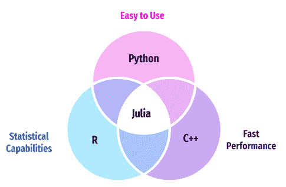
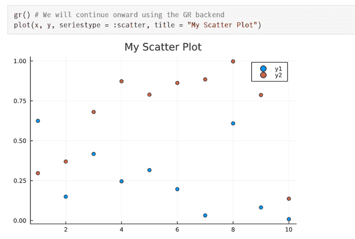
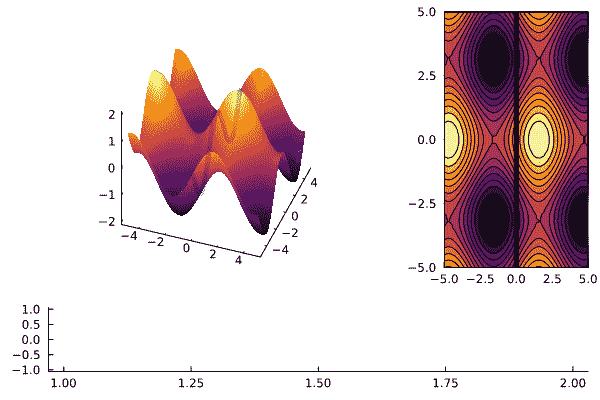
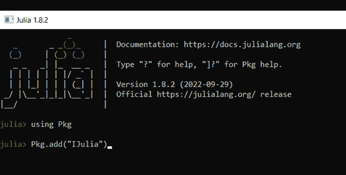
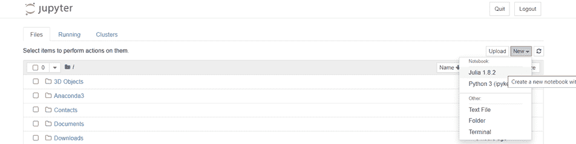
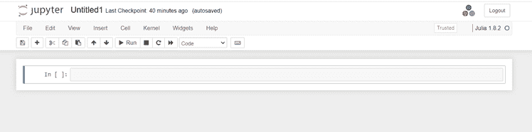

# 认识 Julia:数据科学的未来

> 原文：<https://towardsdatascience.com/meet-julia-the-future-of-data-science-52414b29ebb>

## 下一个大事件，还是被过分夸大了？


照片由 [Fotis Fotopoulos](https://unsplash.com/@ffstop?utm_source=unsplash&utm_medium=referral&utm_content=creditCopyText) 在 [Unsplash](https://unsplash.com/s/photos/programming?utm_source=unsplash&utm_medium=referral&utm_content=creditCopyText) 上拍摄

作为一个数据爱好者，你可能听说过 Julia，数据科学的未来编程语言。“有人声称 Julia 将在数据科学领域取代 Python 和 R，因为它在性能、效率和易用性方面提供了显著的优势。

在本文中，我们将探讨 Julia 是什么，它的应用，以及是否值得为数据科学学习这种语言。

# 朱莉娅是什么？



作者图片

创建 Julia 是为了提供 Python 的**简单性、R** 的**统计能力以及 C 和 C++** 的**速度。**

Python 是一种高级语言，语法简单，大多数程序员都觉得很容易使用。它允许数据科学家花更少的时间编写代码，专注于模型构建。Python 中的许多库允许用户构建统计算法和执行科学编程。

然而，Python 的一个主要缺点是速度慢。虽然它易于使用并且提供了高层次的抽象，但是这种语言有很高的延迟。

当构建大规模的机器学习应用程序时，Python 往往会慢很多，并且使用该语言运行预测模型可能需要几天时间。

另一方面，像 C++这样的语言提供了快速的执行，但是低级别的抽象使得编写代码不切实际、复杂且耗时。

Julia 通过提供易用性和效率来解决这个问题。

它旨在像 C++一样为用户提供低延迟，这意味着它比 Python 的 Pandas 库快 1.5 到 5 倍，即使没有启用多线程。

此外，与 Python 类似，Julia 是一种通用编程语言，也提供统计功能。它的语法很容易掌握。

因此，Julia 正越来越多地被数据科学家、经济学家、统计学家、科学家和数学家所使用。

# 朱莉娅的应用

如上所述，Julia 因其简单和快速的性能而被许多专业人士使用。以下是这种语言在现实世界中应用的一些例子:

## 1.数据科学

Julia 经常被数据科学家用来建立预测模型。该语言提供了机器学习包，如 [ScikitLearn.jl](https://scikitlearnjl.readthedocs.io/en/latest/) 和 [Tensorflow.jl](https://malmaud.github.io/tfdocs/) ，它们是 Python 中 ScikitLearn 和 Tensorflow 库的包装器。

许多数据科学家更喜欢 Julia 而不是 Python，因为它更快，更容易调试，简单，并且有更好的包管理。

## 2.Web 开发

Julia 的 [Genie.jl](https://genieframework.com/) 框架类似于 Python 中的 Django 库，可用于全栈 web 开发。

如果您正在寻找创建一个端到端的动态 web 应用程序，但是发现 Python 太慢，并且不想花时间学习更复杂的语言，Julia 是一个很好的选择。

如果您希望构建一个仪表板应用程序来展示可视化，可以使用 [Dash.jl](https://dash.plotly.com/julia) ，它相当于 Python 中的 Plotly Dash 库。

## 3.数据分析

所有数据专业人员都会发现需要从数据中分析和提取有意义的见解。Julia 为用户提供了一系列专门为数据分析和可视化而设计的库。

Julia 有一个名为 [DataFrames.jl](https://dataframes.juliadata.org/stable/) 的包，可以让你加载和操作表格数据。你可以认为这相当于 Python 中的熊猫。使用多线程，Julia 的速度可以比熊猫快 20 倍。

Julia 还允许用户使用 [Plots.jl](https://docs.juliaplots.org/latest/tutorial/) 可视化数据，这类似于 Python 中的 Matplotlib。

例如，您可以在一行代码中使用 Plots.jl 创建一个简单的散点图:



图片来自 Julia 的[文档](https://docs.juliaplots.org/latest/tutorial/)

你甚至可以在 Julia 中创建这样的动态动画情节:



图片来自 Julia 的[文档](https://docs.juliaplots.org/latest/animations/)

您可以在 Julia 中构建的其他一些图表包括热图、条形图、气泡图、小提琴图和点状图。

## 4.科学计算

Julia 广泛应用于化学、物理、天文学和生物信息学等领域。

这些行业的专业人员经常需要对大量数据进行统计分析，Julia 提供了大量的软件包来帮助他们完成这些工作。

[BioSequences.jl](https://biojulia.net/BioSequences.jl/v0.8/sequences/bioseq.html) 、 [Molly.jl](https://docs.juliahub.com/Molly/SNYdm/0.1.0/docs/) 和 [QuantumLab.jl](https://github.com/vonDonnerstein/QuantumLab.jl) 是一些可以用来解决 Julia 中特定领域问题的科学软件包的例子。

根据[评论](https://www.reddit.com/r/Julia/comments/ox1y40/python_vs_julia/)，Julia 的科学图书馆生态系统比 Python 的要广泛得多，并且允许用户解决问题，而不必从头开始编写解决方案。

# 我和朱莉娅的经历

我学习的第一门编程语言是 Python，这几乎总是我在处理数据科学任务时选择的语言。

我第一次遇到朱莉娅是在解决一个线性规划问题的时候。我不得不构建一个优化器来基于一组约束最小化一个函数。

然后，这个求解器必须自动化，以便我团队的其他人可以使用它，这意味着它必须接受约束和函数作为用户输入。

我在 Python 中找到了几个库来完成这项工作，但对输出的呈现方式并不满意。我使用的软件包效率也很低，所以我向 Julia 寻求替代解决方案。

[Optim.jl](https://julianlsolvers.github.io/Optim.jl/stable/) 库比我用 Python ( [Scipy](https://docs.scipy.org/doc/scipy/reference/optimize.html) 、 [Gekko](https://gekko.readthedocs.io/en/latest/) )试过的任何库都要快得多，并且节省了团队至少 4-5 个小时的时间。

因为我熟悉 Python 语言，所以我仍然用 Python 执行大量的数据分析和模型构建工作流，但是如果我发现 Python 太慢或者再次遇到类似上面的问题，我会切换到 Julia。

# 所以……数据科学要不要学朱莉娅？

数据科学家、分析师、开发人员和经济学家等专业人士可以在日常工作中使用 Julia。因为这种语言易于使用，速度快，并且有大量的科学库，所以它是 Python 和 r 的一个很好的替代品。

在过去的三年里，Julia 越来越受欢迎，目前正在被苹果、亚马逊、谷歌、IBM 和微软等大型机构使用。

虽然 Julia 目前没有像 Python 和 R 那样被很好地记录或广泛使用，但一些专家声称该语言是数据科学 的 [**。**](/bye-bye-python-hello-julia-9230bff0df62)

根据他们的说法，现在学习 Julia 是一个好主意——这样当该语言在未来 10 年成为“下一件大事”时，你就可以保持在该领域的领先地位。

[其他数据科学家](https://richardpelgrim.medium.com/julia-vs-python-for-data-science-in-2022-1f5f6f38f3ac)持更保守的观点，认为最好先学习 Python 或 R，因为它们是目前数据科学中使用最广泛的编程语言。

最终，只有时间能告诉我们朱莉娅的未来。

我个人认为，如果你有空闲时间，学点新东西总是个好主意。学习 Julia 可以帮助你加快机器学习工作流程，展示让你与众不同的投资组合项目。

# 数据科学如何学习 Julia？

以下是学习 Julia for data science 的 3 个步骤:

# 步骤 1:设置您的 Julia 环境

1.  首先，下载 Julia 的最新版本并运行可执行文件。
2.  一旦 Julia 安装完毕，点击开始并搜索 Julia。点击它。
3.  这应该会打开 Julia 命令行。键入以下内容并按 enter 键:

```
using Pkg
Pkg.add(“IJulia”)
```



作者图片

4.一旦安装完成，[下载](https://www.anaconda.com/products/distribution)Anaconda 的最新版本，并按照可执行文件中的说明进行操作。

5.导航到开始-> Jupyter 笔记本。这将打开一个如下图所示的选项卡:



作者图片

6.单击新建，并从下拉列表中选择 Julia。这将打开一个笔记本，您可以在其中编写 Julia 代码:



作者图片

如果您已经使用 Jupyter 运行 Python 程序，那么您应该熟悉这个接口。

# 第二步:学习基础知识

现在你已经有了 Julia，参加一个在线课程来学习编程语言的基础。这包括变量、数据结构、运算符、方法和函数等概念。

Julia 以一个名为[多重分派](https://docs.julialang.org/en/v1/manual/methods/)的特性而闻名，该特性使用函数的所有参数来选择应该调用哪个方法。

一旦掌握了 Julia 的基础知识，就可以了解该语言为统计、数据分析、机器学习和可视化提供的不同软件包。

最后，使用这些包来分析数据和执行预测建模。

我建议参加一个关于 Julia 的介绍课程来学习这门语言，因为它会更详细地涵盖上面提到的所有概念。

# 步骤 3:创建个人项目

一旦你理解了 Julia 的基本原理，你就可以开始使用这种语言创建个人项目了。这不仅会提高您的编程技能，还会极大地增加您的数据科学投资组合的价值。

以下是一些带有源代码的项目想法，您可以使用 Julia 来实现:

*   [鸢尾花分类](https://dev.to/bionboy/deep-learning-on-the-iris-data-set-in-julia-3pbe)
*   [石头剪子布](https://www.juliabloggers.com/rock-paper-scissors-game-in-less-than-10-lines-of-code/)
*   [面部检测 app](https://github.com/jakewilliami/FaceDetection.jl)
*   [手写数字分类](https://github.com/crhota/Handwritten-Digit-Recognition-using-MNIST-dataset-and-Julia-Flux)
*   [物体检测](https://github.com/r3tex/ObjectDetector.jl)