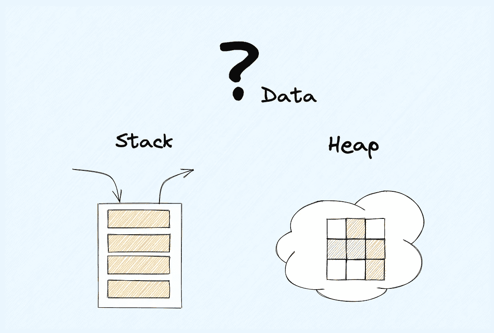
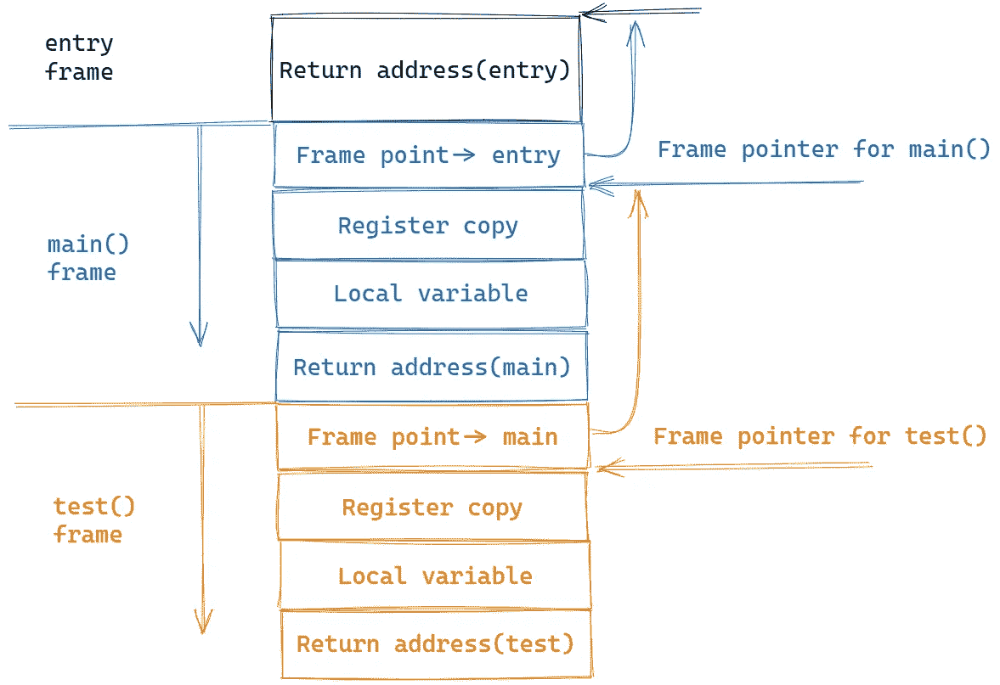

# 每个程序员都应该知道的内存管理

> 原文：<https://towardsdatascience.com/memory-management-every-developer-should-know-4f4911d8268b>

## 这可能是你最不能错过的编程知识



作者图片

本文将介绍一个非常重要的编程基础知识——内存管理。你可能对它有一个模糊的概念，或者经常忽略它。但是作为一个开发者知道它，可以开阔我们的视野，提高我们的认知，更快更安全地解决记忆问题。所以来和我一起看看吧！

# 问题

我先问你一个问题:

> **什么数据放在栈上，什么数据放在堆上？**

如果你擅长 JavaScript/Python/Java 等具有自动内存管理的语言，你可能会说下面这个答案:

> 基本类型存储在堆栈上，对象存储在堆上，闭包变量存储在堆上，等等。

这个答案对吗？没问题，但这只是表面，不是本质。那么本质是什么呢？

我们先分析一下程序中的栈和堆，然后给出答案。

# 堆

栈数据结构的特点是**先进后出**。因为这个特性，非常适合记录程序的函数调用，也叫函数调用栈。然后看一下下面的简单代码示例:

```
fn test() {}
fn main() {
  test()
}
```

我们来分析一下。首先，我们编写的代码将作为一个*“entry”*执行。请参见下图:



作者图片

函数调用栈**从上到下**增长。在这个简单的代码示例中，调用流是`entry -> main() -> test()`。

> 接下来，每当一个函数执行时，**一个连续的内存块**被分配在栈顶，这被称为一个**帧。**

这个**“帧”**存储当前函数的通用寄存器和当前函数的局部变量的上下文信息。

在这个例子中，当 main()调用 test()时，它会暂时中断当前的 CPU 执行进程，并在堆栈中存储一个 main()通用寄存器的副本。test()执行后，原寄存器上下文将**恢复**根据之前的拷贝，**好像什么都没发生。**

> 酷，这就是通用寄存器的神奇之处！

然后随着函数被一层一层的调用，堆栈会一层一层的扩展，调用结束后，堆栈会一层一层的回溯，每一帧占用的内存会被一一释放。

但是等等，我们好像漏了点什么！它需要连续的内存空间，这意味着程序在调用下一个函数之前必须知道下一个函数需要多少内存空间。

那么程序怎么知道呢？

> 答案是编译器为我们做了这一切。

在编译代码时，**函数是最小的编译单位。**每当编译器遇到一个函数，就知道当前函数使用寄存器和局部变量所需的空间。

**因此，不能在编译时确定大小或大小可以改变的数据不能安全地放在堆栈上。**

# 许多

如上所述，数据不能安全地放在堆栈上，所以最好放在堆上，例如下面的可变长度数组:

```
fn main() {
  let mut arr = Vec::new();
  arr.push(1); // length: 1, **capacity: 4**
  println!("length: {}, capacity: {}", arr.len(), **arr.capacity()**);
}
```

当我们创建一个数组时，如果我们没有事先指定数组的长度，程序会使用`libc`提供的`malloc()`函数向**请求一个系统调用来获取内存大小**。通常 Rust 中为这个数组预留的大小是 4，所以当我们添加的元素比它多的时候，程序会在系统中寻找一块新的内存，复制之前的值并添加新添加的值，最后释放旧的内存。

请求系统调用和寻找新内存然后逐个复制的过程是非常**低效的。**

> **因此，这里的最佳做法是提前预留阵列真正需要的空间。**

另外，需要跨栈引用的内存也需要放在堆上，这一点很好理解，因为一旦一个栈帧被回收，其内部的局部变量也会被回收，所以在不同的调用栈中共享数据只能使用堆。

但这又带来了一个新的问题，堆上占用的内存什么时候释放？

# 碎片帐集

各大编程语言都给出了答案:

早期的 C 语言把这一切都留给开发人员手动管理，这对有经验的程序员来说是一个优势，因为对程序内存的控制更好。但是对于初学者来说，记住那些内存管理的最佳实践是很重要的。但与机器不同，总会有一些疏忽，这会导致内存安全问题，导致程序运行缓慢或彻底崩溃。

以 **Java** 为代表的一系列编程语言使用**Tracing GC(**[**Tracing Garbage Collection**](https://en.wikipedia.org/wiki/Tracing_garbage_collection)**)**自动管理堆内存。这种方法通过定期标记不再被引用的对象并清理它们来自动管理内存，从而减轻了开发人员的负担。但它需要在标记和释放内存时执行额外的逻辑，这导致了 **STW(停止世界)**，就像程序卡住了一样，那些时间也是不确定的。所以如果要开发一些实时性要求高的系统，一般不会使用类似 GC 的语言。

苹果的 **Objective-C** 和 **Swift** 使用 **ARC (** [**自动引用计数**](https://en.wikipedia.org/wiki/Automatic_Reference_Counting) **)** ，在编译时为每个函数插入 retain/release 语句，自动维护堆上对象的引用计数。当对象的引用计数为 0 时，release 语句可以释放该对象。但是它增加了许多额外的代码来处理引用计数，这使得它比 GC 效率更低，吞吐量更小。

**Rust** 使用 [**所有权**](https://doc.rust-lang.org/book/ch04-01-what-is-ownership.html) 机制，默认绑定堆上数据的生命周期和栈帧的生命周期。一旦栈帧被破坏，堆上的数据也会被丢弃，占用的内存也会被释放。Rust 还为开发人员提供了 API 来改变这种默认行为或定制发布时的行为。

# 结论

**栈上存储的数据是** **静态的，大小固定，生命周期固定，不能跨栈引用。**

**堆上存储的数据是** **动态的，不固定大小，不固定生命周期，可以跨栈引用。**

今天就到这里。我是 Zachary，我会继续输出与 web 开发相关的故事，如果你喜欢这样的故事并想支持我，请考虑成为 [*中级会员*](https://medium.com/@islizeqiang/membership) *。每月 5 美元，你可以无限制地访问媒体内容。如果你通过* [*我的链接*](https://medium.com/@islizeqiang/membership) *报名，我会得到一点佣金。*

你的支持对我来说非常重要——谢谢。