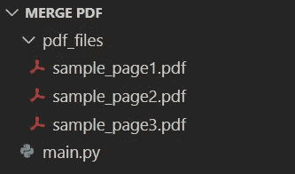

# 使用 Python 合并 PDF 文件

> 原文：<https://towardsdatascience.com/merge-pdf-files-using-python-faaeafe4926c>

## 在本教程中，我们将探索如何使用 Python 合并 PDF 文件


戴维·布鲁诺·席尔瓦在 [Unsplash](https://unsplash.com/s/photos/files?utm_source=unsplash&utm_medium=referral&utm_content=creditCopyText) 上的照片

**目录**

*   介绍
*   示例 PDF 文件
*   使用 Python 合并两个 PDF 文件
*   使用 Python 合并多个 PDF 文件
*   结论

# 介绍

在扫描多页文档或将多页文档保存为计算机上的单个文档后，合并 PDF 文件通常是一项必需的操作。

有几个软件可以帮助快速完成这项任务，比如 Adobe 和在线工具。然而，他们中的大多数要么是付费的，要么可能没有提供足够的安全功能。

在本教程中，我们将探索如何用几行代码在您的计算机上使用 Python 合并 PDF 文件。

为了继续学习本教程，我们需要以下 Python 库:PyPDF2。

如果您没有安装它们，请打开“命令提示符”(在 Windows 上)并使用以下代码安装它们:

```
pip install PyPDF2
```

# 示例 PDF 文件

为了继续学习本教程，我们需要一些 PDF 文件。

以下是我们将在本教程中使用的三个 PDF 文件:

*   [sample_page1.pdf](https://pyshark.com/wp-content/uploads/2022/05/sample_page1.pdf)
*   [sample_page2.pdf](https://pyshark.com/wp-content/uploads/2022/05/sample_page2.pdf)
*   [sample_page3.pdf](https://pyshark.com/wp-content/uploads/2022/05/sample_page3.pdf)

这些 PDF 文件将驻留在 **pdf_files** 文件夹中，该文件夹与包含我们代码的 **main.py** 在同一个目录中。

下面是我的文件的结构:



作者图片

# 使用 Python 合并两个 PDF 文件

为了在 Python 中执行 PDF 合并，我们需要从 PyPDF2 库中导入 **PdfFileMerger()** 类，并创建这个类的一个实例。

在本例中，我们将合并两个文件: *sample_page1.pdf* 和 *sample_page2.pdf* 。

在这种情况下，可以将两个文件路径放入一个[列表](https://pyshark.com/python-list-data-structure/)中，然后我们将对其进行迭代并追加一个到另一个:

您应该会看到 *merged_2_pages.pdf* 创建在与 **main.py** 文件相同的目录中，代码如下:

[merged_2_pages.pdf](https://pyshark.com/wp-content/uploads/2022/05/merged_2_pages.pdf)

# 使用 Python 合并多个 PDF 文件

在这一节中，我们将探索如何使用 Python 合并多个 PDF 文件。

合并多个 PDF 文件的一种方法是手动将每个 PDF 文件的文件名添加到一个列表中，然后执行与上一节相同的操作。

但是如果我们的文件夹里有 100 个 PDF 文件呢？使用操作系统库，我们可以将给定目录中的所有文件名作为一个[列表](https://pyshark.com/python-list-data-structure/)进行访问，并对其进行迭代:

您应该看到 *merged_all_pages.pdf* 创建在与 **main.py** 文件相同的目录中，代码如下:

[merged_all_pages.pdf](https://pyshark.com/wp-content/uploads/2022/05/merged_all_pages.pdf)

# 结论

在本文中，我们探讨了如何使用 Python 合并多个 PDF 文件。

如果你有任何问题或对编辑有任何建议，请随时在下面留下评论，并查看我的更多 [Python 编程](https://pyshark.com/category/python-programming/)教程。

*原载于 2022 年 5 月 17 日*[*https://pyshark.com*](https://pyshark.com/merge-pdf-files-using-python/)*。*