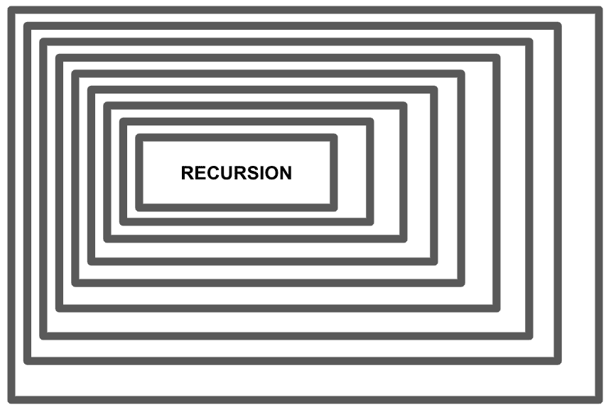
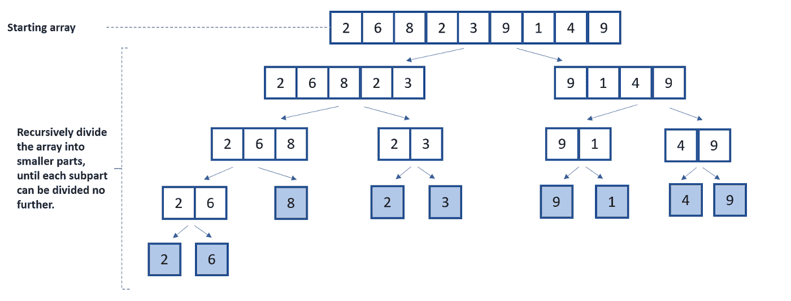
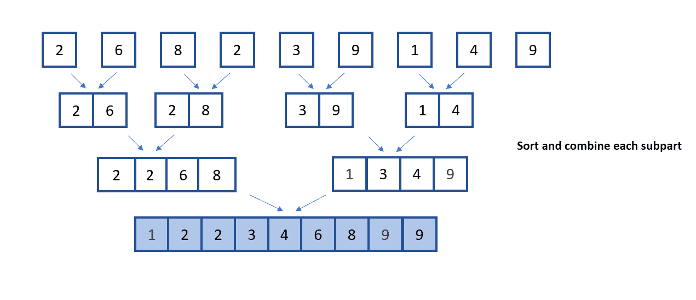

# 合并排序解释——数据科学家算法指南

> 原文：<https://towardsdatascience.com/merge-sort-explained-a-data-scientists-algorithm-guide-2f79d5034ba3>

## 用 Python 实现的合并排序算法的解释


阿诺·弗朗西斯卡在 [Unsplash](https://unsplash.com/s/photos/code?utm_source=unsplash&utm_medium=referral&utm_content=creditCopyText) 上的照片

# 介绍

数据科学家每天都与算法打交道。然而，数据科学学科作为一个整体已经发展成为一个不涉及复杂算法实现的角色。尽管如此，从业者仍然可以从建立对算法的理解和保留中受益。

在本文中，介绍、解释、评估和实现了排序算法 merge sort。这篇文章的目的是为您提供关于合并排序算法的可靠背景信息，这是更复杂算法的基础知识。

虽然合并排序并不复杂，但是理解该算法将有助于您认识到在选择最有效的算法来执行数据相关任务时需要考虑哪些因素。创建于 1945 年的[约翰·冯·诺依曼](https://en.wikipedia.org/wiki/John_von_Neumann)使用分治法开发了合并排序算法。

# 分步解决

要理解合并排序算法，您必须熟悉分治范式，以及递归的编程概念。计算机科学领域中的递归是指为解决某个问题而定义的方法在其实现体中调用自身。

*换句话说，该函数反复调用自身。*



图一。递归的可视化说明—作者提供的图像

分治算法(合并排序是其中的一种)在其方法中使用递归来解决特定的问题。分而治之算法将复杂的问题分解成更小的子部分，其中定义的解决方案递归地应用于每个子部分。然后，每个子部分被单独求解，解被重新组合以解决原始问题。

算法设计的分治法结合了三个主要元素:

1.  将较大的问题分解成较小的子问题。(除)
2.  递归利用函数来解决每个更小的子问题。(征服)
3.  最终的解决方案是一个大问题的更小的子问题的解决方案的组合。(联合收割机)

其他算法使用分治模式，如快速排序、二分搜索法和斯特拉森算法。

# 合并排序

在对列表中的元素进行升序排序的上下文中，merge sort 方法将列表分成两半，然后遍历新的一半，继续将它们进一步分成更小的部分。

随后，对较小的一半进行比较，并将结果组合在一起以形成最终的排序列表。

# 步骤和实施

合并排序算法的实现分为三个步骤。分而治之，再而三。

分而治之方法的 divide 组件是第一步。这个初始步骤将整个列表分成两个较小的部分。然后，列表被进一步分解，直到它们不能再被分割，在每个对半的列表中只留下一个元素项。

merge sort 第二阶段的递归循环关注的是以特定顺序对列表元素进行排序。对于这种情况，初始数组按升序排序。

在下图中，您可以看到合并排序算法中涉及的除法、比较和组合步骤。



图二。合并排序算法的分割组件图-按作者分类的图像



图 3。征服和组合组件-作者图片。

## 要自己实现这一点:

1.  创建一个名为 merge_sort 的函数，它接受一组整数作为它的参数。以下给出的所有指令都在此函数内。
2.  从将列表分成两半开始。记录列表的初始长度。
3.  检查记录的长度是否等于 1。如果条件评估为真，则返回列表，因为这意味着列表中只有一个元素。所以没有要求分榜。
4.  获取元素数量大于 1 的列表的中点。使用 Python 语言时，//执行无余数除法。它将除法结果舍入到最接近的整数。这也被称为地板划分。
5.  使用中点作为参考点，将列表分成两半。这是分治算法范式的划分方面。
6.  在这一步利用递归来促进将列表分成两半。变量 *'left_half'* 和 *'right_half'* 被分配给' *merge_sort'* 函数的调用，接受初始列表的两半作为参数。
7.  函数的作用是:返回一个函数的调用，这个函数合并两个列表，返回一个合并的排序列表。

```
def merge_sort(list: [int]):
    list_length = len(list)

    if list_length == 1:
         return list

    mid_point = list_length // 2

    left_half = merge_sort(list[:mid_point])
    right_half = merge_sort(list[mid_point:])

    return merge(left_half, right_half)
```

1.  创建一个*‘merge’*函数，该函数接受两个整数列表作为其参数。该函数包含分治算法范式的征服和合并方面。以下所有步骤都在该函数体内执行。
2.  将一个空列表分配给保存已排序整数的变量“output”。
3.  指针*‘I’*和*‘j’*分别用于索引左列表和右列表。
4.  在 while 循环中，对左列表和右列表的元素进行比较。在每次比较之后，输出列表被填充到两个被比较的元素中。追加元素列表的指针递增。
5.  要添加到排序列表的剩余元素是从当前指针值到相应列表末尾获得的元素。

```
def merge(left, right):
    output = []
    i = j = 0

    while (i < len(left) and j < len(right)):
        if left[i] < right[j]:
            output.append(left[i])
            i +=1
        else:
            output.append(right[j])
            j +=1
    output.extend(left[i:])
    output.extend(right[j:])

    return output

unsorted_list = [2, 4, 1, 5, 7, 2, 6, 1, 1, 6, 4, 10, 33, 5, 7, 23]
sorted_list = merge_sort(unsorted_list)
print(unsorted_list)
print(sorted_list)
```

# 性能和复杂性

大 O 符号是一种标准，用于根据算法的空间需求和执行时间来定义和组织算法的性能。

合并排序算法的时间复杂度在最佳、最差和平均情况下是相同的。对于大小为 n 的列表，合并排序算法完成的预期步骤数、最小步骤数和最大步骤数都是相同的。

正如本文前面提到的，合并排序算法是一个三步过程:划分、征服和合并。“除法”步骤涉及列表中点的计算，无论列表大小如何，只需一个操作步骤。因此，该操作的符号表示为 **O(1)** 。

“征服”步骤包括划分和递归求解子数组——符号 log n 表示这一点。“组合”步骤包括将结果组合成最终列表；这个操作的执行时间取决于列表的大小，表示为 **O(n)** 。

其平均、最佳和最差时间复杂度的合并排序符号是 log **n * n * O(1)** 。在大 O 符号中，低阶项和常数可以忽略不计，这意味着合并排序算法的最终符号是 **O(n log n)** 。有关合并排序算法的详细分析，请参考这篇[文章](https://www.khanacademy.org/computing/computer-science/algorithms/merge-sort/a/analysis-of-merge-sort)。

# 估价

合并排序在对大型列表进行排序时表现很好，但在对较小的列表进行排序时，其操作时间比其他排序解决方案要慢。合并排序的另一个缺点是，即使初始列表已经排序，它也会执行操作步骤。在排序链表的用例中，合并排序是最快的排序算法之一。合并排序可用于外部存储系统(如硬盘)中的文件排序。

# 关键要点

本文描述了合并排序技术，从它的组成操作和一步一步的过程方面对它进行了分解。

合并排序算法是常用的，与其他排序算法相比，该算法背后的直觉和实现相当简单。本文包括 Python 中合并排序算法的实现步骤。

您还应该知道，在不同的情况下，合并排序方法的执行时间的时间复杂度，对于最好、最差和一般的情况都是一样的。建议在下列情况下应用合并排序算法:

*   当处理较大的数据集时，使用合并排序算法。与其他排序算法相比，合并排序在小数组上的性能很差。
*   链表中的元素引用了链表中的下一个元素。这意味着在合并排序算法操作中，指针是可修改的，使得元素的比较和插入具有恒定的时间和空间复杂度。
*   以某种形式确定数组是未排序的。Merge sort 甚至会在已排序的数组上执行其操作，这是对计算资源的浪费。
*   当需要考虑数据的稳定性时，请使用合并排序。稳定排序包括保持数组中相同值的顺序。与未排序的数据输入相比，稳定排序的数组中相同值的顺序在排序后的输出中保持在相同的位置。

[**本文最早出现在英伟达数据科学博客**](https://developer.nvidia.com/blog/merge-sort-explained-a-data-scientists-algorithm-guide/)

# 我希望这篇文章对你有用。

要联系我或找到更多类似本文的内容，请执行以下操作:

1.  [**成为推荐媒介会员，支持我的写作**](https://richmondalake.medium.com/membership)
2.  订阅我的 [**YouTube 频道**](https://www.youtube.com/channel/UCNNYpuGCrihz_YsEpZjo8TA) 获取 AI 播客和即将推出的内容。
3.  订阅我的 [**电子邮件列表**](https://richmond-alake.ck.page/c8e63294ee) 获取我的简讯