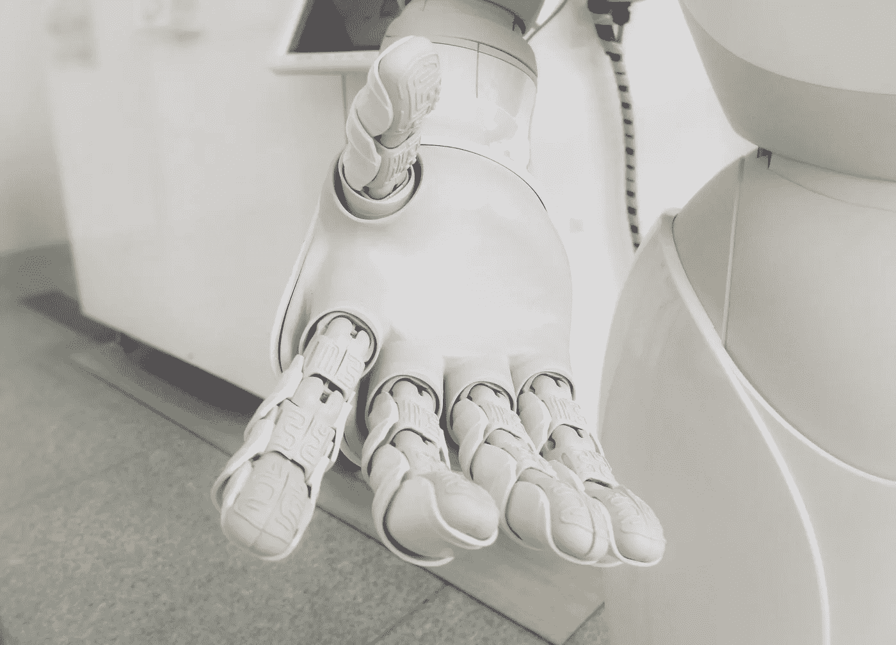
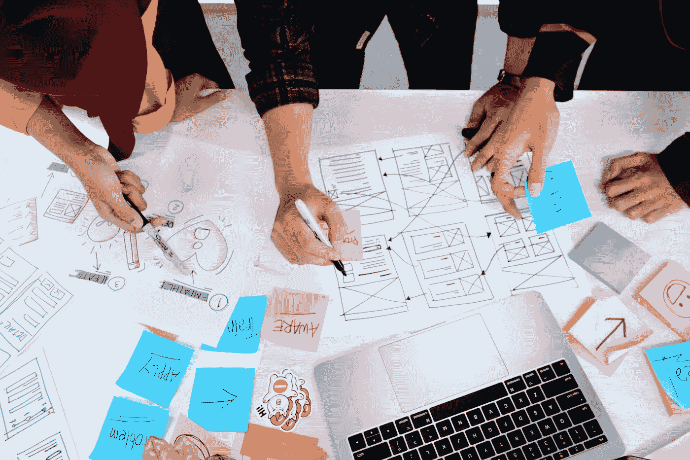

# 融合科学和设计，为每个人创造人工智能

> 原文：<https://towardsdatascience.com/merging-science-and-design-to-make-artificial-intelligence-for-everyone-a2a342e1c615>

我们在构建人工智能系统方面参与得越多，它们看起来就越不可怕，破坏性也就越小。[附身摄影](https://unsplash.com/@possessedphotography)在 [Unsplash](https://unsplash.com/) 上拍照。

到目前为止，每个人都听说过人工智能(AI)和它的小表弟机器学习。人工智能的各个子领域，如机器学习、计算机视觉等等，可能是当今使用最多但最不为人所知的技术之一。

事实上，许多在该领域工作的人实际上称人工智能系统为**【黑匣子】**，因为他们可以看到输入和输出，但他们实际上并不了解它们内部发生了什么。这对于某个实验室中的一些实验技术来说已经够麻烦的了，但请想想这样一个事实，即许多这些机器学习系统负责做出影响许多人生活的决策。

谁真正知道里面是什么，或者是什么让一个人工智能滴答作响？Sam Moghadam Khamseh 在 [Unsplash](https://unsplash.com/) 上拍摄的照片。

其中一些决定包括:

*   社会和司法系统的决策，如决定是否[拘留刑事被告](https://www.science.org/doi/10.1126/sciadv.aao5580)或是否将[儿童保护请求](https://www.cs.ubc.ca/~conati/522/532b-2019/papers/chouldechovaCaseStudyPredictionFairnessEtc.pdf)标记为可信。
*   筛选改变人们生活的申请，如职业申请、保险申请和贷款申请。
*   通过[审查社交媒体](https://www.pewresearch.org/internet/2022/03/17/mixed-views-about-social-media-companies-using-algorithms-to-find-false-information/)和[生成原创内容](https://openai.com/dall-e-2/)来影响人们的信息和媒体消费。
*   通过[面部识别监控](https://news.mit.edu/2018/study-finds-gender-skin-type-bias-artificial-intelligence-systems-0212)侵犯公众隐私。

## **呀呀对吧？！**

然而，这并不完全是悲观的。最近，[科技&科学界](https://www.sciencedirect.com/science/article/pii/S1071581922000660#!)和[设计界](https://arxiv.org/abs/1912.07381)一直在努力让人工智能系统变得更加可解释和透明。换句话说，让人们了解这些系统内部发生的决策过程，以及输入数据是如何被分析并影响结果的。虽然这些努力无疑是朝着正确方向迈出的一步，但它们往往是事后的反应性干预。相反，预防性措施可能更有价值，确保这些系统从一开始就利用受其影响最大的人群的洞察力来构建。

基于技术和设计主导的干预正在帮助揭示黑盒人工智能系统的内部工作原理。Hassan OUAJBIR 在 [Unsplash](https://unsplash.com/) 上拍摄的照片。

# 提示:合作设计

协作设计，或简称为合作设计，是和人一起设计*的行为，与传统的为*人设计*相对。这种设计方法最初在斯堪的纳维亚的设计实践中很受欢迎，近年来因为它给设计过程带来的价值而大受欢迎。*

通过让用户和其他受设计影响的利益相关者参与进来，设计团队可以在过程的早期了解他们的需求、观点和经验。这有助于团队从一开始就考虑这些信息，而不是构建一些东西，然后在最后的测试阶段发现它不合适，这是用户和利益相关者通常会参与的阶段。与仅仅采访或调查用户相比，联合设计的另一个好处是，它有助于克服所谓的用户知识的“粘性”:即用户在实际说出他们需要什么时的困难。通过让他们参与有趣的互动设计会议，参与者往往会感觉更舒服，并有不同的渠道来表达自己，而不仅仅是口头解释。

协同设计可以通过非语言渠道释放用户信息和体验。照片由[印度尼西亚 UX](https://unsplash.com/@uxindo)在 Unsplash 上拍摄。

# 科学与设计:一枚硬币的两面

你可能会想:我们怎么能让一个毫无技术知识的用户来设计一个大多数有技术背景的人都难以理解的人工智能系统呢？

而事实是，这比你想象的要容易！以前也有人这样做过。

越来越多的研究聚焦于将不同的协同设计实践应用于人工智能设计过程。这些研究使用了像[角色扮演](https://arxiv.org/abs/2203.06246)和[纸牌](https://www.aixdesign.co/toolkit)这样的技术来帮助不同的非利益相关者设计和决策人工智能系统的不同功能和行为。

使用这些技术并让更多的利益相关者参与进来有很多好处:

1.  它利用[“社区专业知识”](https://interactions.acm.org/archive/view/march-april-2020/inclusive-and-engaged-hci)使产品更具同理心和人性化，最终增加用户的接受度、信任度和认同度。
2.  它增加了关键决策的包容性和参与性，有可能导致偏见更少、目光更狭隘的结果，对某些人群产生危险的影响。
3.  它允许更多跨学科的人从事产品设计，这有数不清的好处——我以后会更多地谈到这一点。

事实上，设计的几个分支对技术项目，尤其是人工智能系统非常有价值，我将在以后的另一篇文章中介绍这些分支及其价值。

# 前进的道路

虽然现有的项目将设计技术应用于技术领域，特别是人工智能，是有益的，但它们还不足以产生深远的影响。这些努力中有很多是孤立的、单独的研究，其结果往往不会用于其他应用或更大范围。这些项目和几家公司已经朝着正确的方向迈出了大步，但现在缺少的是:

*   为了跨领域和应用程序复制和测试研究，以查看它们的概括程度，
*   创建一个完整的方法或过程，在整个人工智能生命周期中，而不仅仅是在最初的构思阶段，正式化和标准化不同利益相关者的参与，
*   关注对利益相关者最重要的价值，以及如何尊重和维护正在创造的技术中的价值。

将协同设计应用于创造人工智能系统肯定是有希望的，但是为了实践的成熟还需要采取下一步措施。

新的令人兴奋的工作正在设计和人工智能的交叉点上发生，但前面还有很长的路要走。 [Jukan Tateisi](https://unsplash.com/@tateisimikito) 在 [Unsplash](https://unsplash.com/) 上拍摄的照片。

# 我适合的地方

当前的现实是，人工智能系统悬而未决，有可能变得更加孤立、排外和复杂；或者开放，变得更容易接近和包容，这是我博士项目的灵感来源。通过查看上面的第 2 点和第 3 点，我正在努力创建这个统一的过程，以及一个支持它的工具包，以系统地让人们参与到人工智能的整个生命周期中来——重点关注价值敏感性。

你可以在伦敦帝国理工学院的网站上查看我的项目的官方页面。你也可以看看我写的另一篇文章，解释我的博士项目的[细节。](https://medium.com/@malaksadekIC/introducing-my-phd-project-to-make-ai-design-more-inclusive-80d0edf70378)

我建立了这个媒体账户来发布我在博士项目中的有趣发现，希望以一种任何人都可以理解的方式传播关于人工智能系统的新闻和信息。这篇文章是我计划的许多文章中的第一篇，它解释了各种各样的概念，以及我已经举办的研讨会的一些更新和我的文献综述中的一些很酷的主题。如果你喜欢这第一篇文章，那么请考虑跟随我发布新的东西，并请喜欢和分享！