# 元形式:视觉的事实需要？

> 原文：<https://towardsdatascience.com/metaformer-de-facto-need-for-vision-93476cc9fec5>

## 《视觉变形金刚》成功的关键是什么？

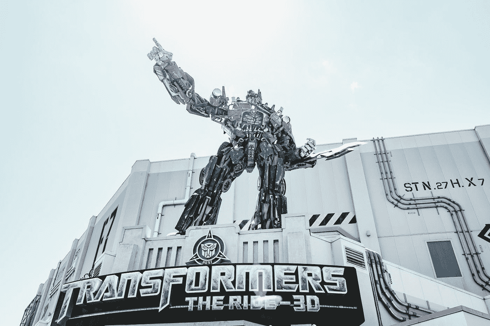

照片由 [Unsplash](https://unsplash.com?utm_source=medium&utm_medium=referral) 上的 [Aditya Vyas](https://unsplash.com/@aditya1702?utm_source=medium&utm_medium=referral) 拍摄

# 视觉变压器

最近，自从[阿列克谢·多索维茨基](https://scholar.google.de/citations?user=FXNJRDoAAAAJ&hl=en)在他的[论文](https://arxiv.org/abs/2010.11929v2)中提出视觉变形金刚(ViT)后，《变形金刚》开始流行起来。ViT 已被证明能够在图像分类任务中胜过卷积神经网络(CNN ),同时需要较少的计算资源。

在过去的十年中，CNN 一直在计算机视觉领域独占鳌头，一个年轻的 ViT 第一次踏入这个领域，出人意料地击败了 CNN。这就产生了一个大问题:

> ViT 成功的真正原因是什么？

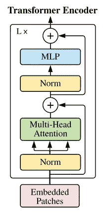

图片来自[论文](https://arxiv.org/abs/2010.11929v2)

上图显示了作为 ViT 核心的变压器编码器的结构。几年后，许多后续工作都专注于通过用多层感知(MLPs)等其他结构完全取代*多头注意力*来提高性能，并且他们在图像分类基准上取得了有竞争力的性能。这一轨迹后来吸引了许多研究人员去寻找新的注意力模块或*令牌混合器*。

# 元格式器

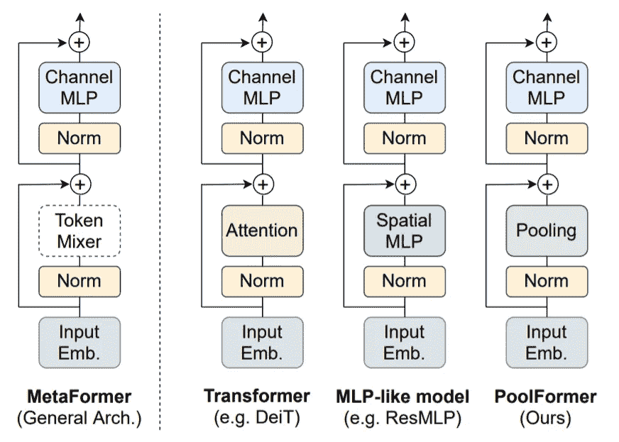

图片来自[纸张](https://arxiv.org/abs/2111.11418)

或者，新加坡国立大学的于等人认为，变形金刚在计算机视觉领域的成功主要依赖于它的总体架构，而不是令牌混合器的设计。为了验证这一点，他们已经提出使用一种令人尴尬的简单非参数操作，*平均池*作为*令牌混合器*，并且仍然在各种计算机视觉任务上实现了最先进的性能，如图像分类、对象检测和实例分割。

在论文中，他们将 Transformer 的一般架构称为*元形成器*，并研究了*池形成器*的效能，其中*平均池*操作被用作*令牌混合器*。令人惊讶的是， *PoolFormer* 优于采用注意力和空间 MLP 等其他复杂模块的 Transformer 架构。

# 前池

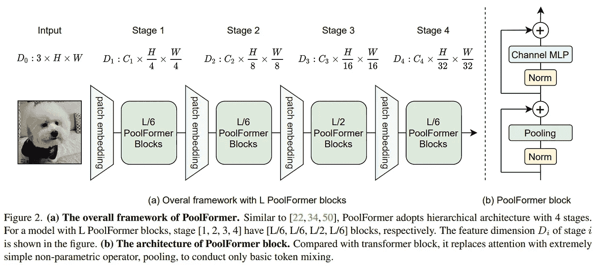

图片来自[纸](https://arxiv.org/abs/2111.11418)

*PoolFormer* 的整体架构如上图所示。该模型有 4 个主要阶段，它们具有相同的设计，一个*补丁嵌入*层，随后是 *PoolFormer 块*。

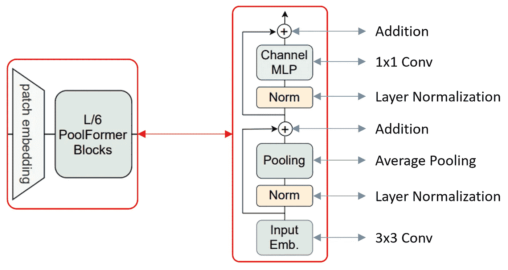

作者图片

每个阶段的细节可以如上图所示。*补丁嵌入*通过使用一个 3x3 的 Conv 层实现。*定额*图层可以批量归一化、图层归一化、分组归一化；在本文中，作者应用了组归一化，因为它在他们的实验中显示了更好的结果。*信道 MLP* 模块采用两个 1x1 的 Conv 层，中间是一个路斯激活层。官方代码可以在:[https://github.com/sail-sg/poolformer](https://github.com/sail-sg/poolformer)找到

图片来自[论文](https://arxiv.org/abs/2111.11418)

# 结果

PoolFormer 已经在计算机视觉任务的各种基准上与其他最先进的模型进行了比较，包括图像分类、对象检测和实例分割。结果总结如下:

## 图像分类

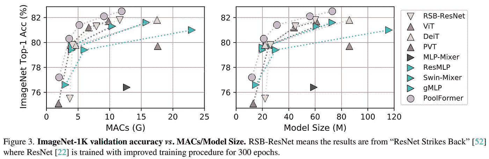

图片来自[论文](https://arxiv.org/abs/2111.11418)

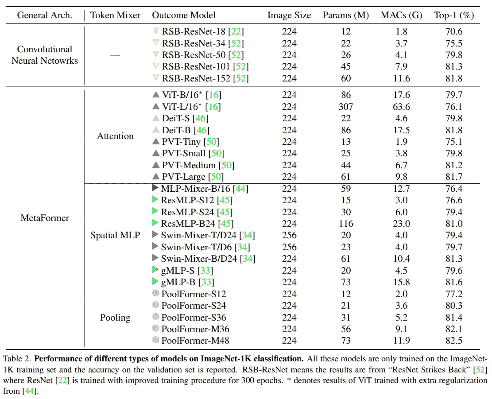

图片来自[纸](https://arxiv.org/abs/2111.11418)

## 对象检测和实例分割

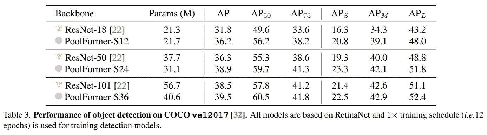

图片来自[纸](https://arxiv.org/abs/2111.11418)

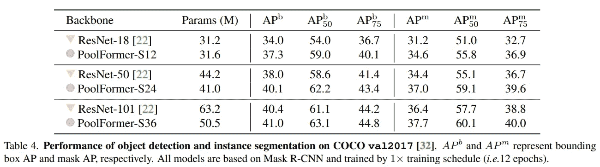

图片来自[纸](https://arxiv.org/abs/2111.11418)

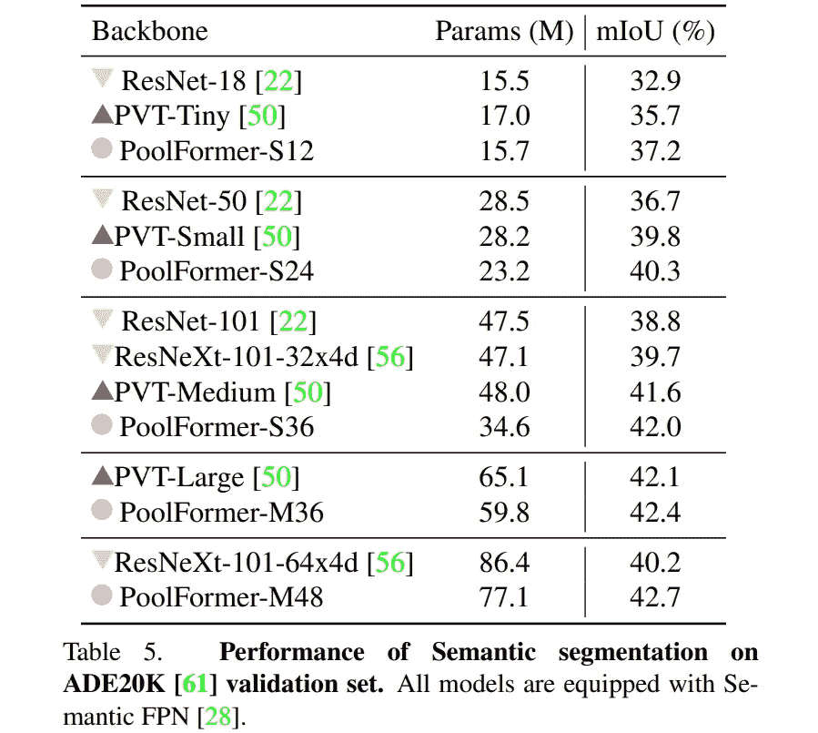

图片来自[纸](https://arxiv.org/abs/2111.11418)

# PoolFormer 块的 Pytorch 类代码

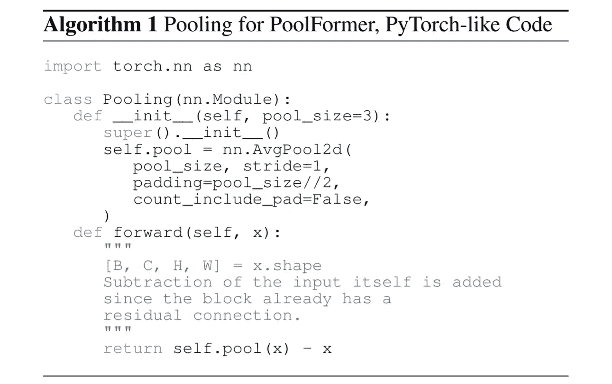

图片来自[纸](https://arxiv.org/abs/2111.11418)

图片来自[纸张](https://arxiv.org/abs/2111.11418)

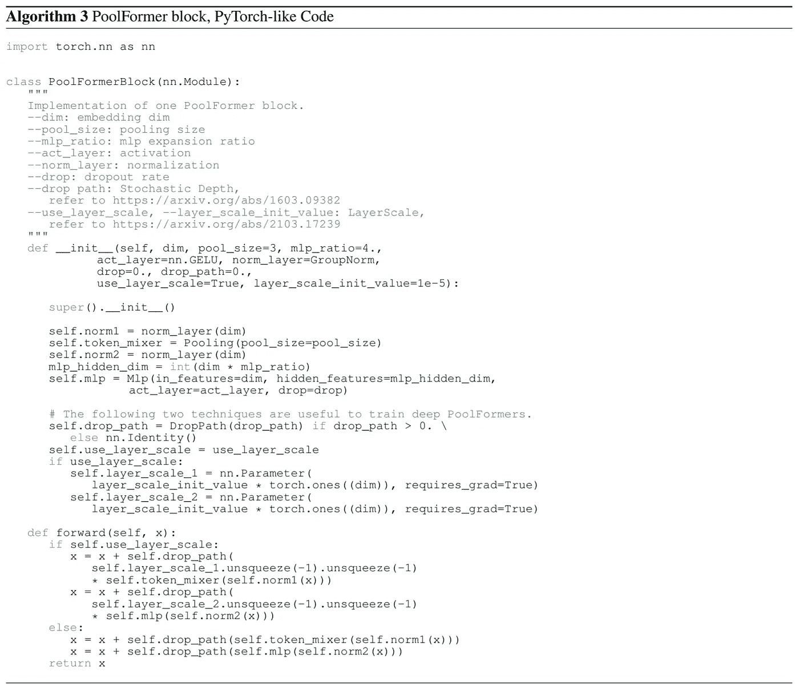

图片来自[纸](https://arxiv.org/abs/2111.11418)

# 结论

在这篇文章中，我简要回顾了 MetaFormer，这是一种基于变形金刚的通用架构，它是变形金刚及其变体在计算机视觉中取得成功的真正原因，作者说。作者基于一个假设提出了元形式，即变形金刚或类似 MLP 的模型的能力是通过它们的一般结构而不是*令牌混合器*获得的。为了证明这个假设，一个令人尴尬的简单的非参数操作符，*池*，被用作*令牌混合器*，并且仍然优于其他高级模块，例如 attention。MetaFormer 的能力也已经在图像分类、对象检测和实例分割任务的基准上得到验证。

欢迎读者访问我的脸书粉丝页面，分享关于机器学习的事情:[深入机器学习](https://www.facebook.com/diveintomachinelearning)。我的其他著名帖子也可以在这里找到:

*   [约洛夫 4–5D 评论](/yolov4-5d-an-enhancement-of-yolov4-for-autonomous-driving-2827a566be4a)
*   [黑暗时代](/darkeras-execute-yolov3-yolov4-object-detection-on-keras-with-darknet-pre-trained-weights-5e8428b959e2)
*   [EFPN:扩展特征金字塔网络](/efpn-extended-feature-pyramid-network-for-small-object-detection-980af794a093)
*   [数据扩充](/data-augmentation-compilation-with-python-and-opencv-b76b1cd500e0)
*   [数据提炼](/data-distillation-for-object-detection-92a89fe5d996)
*   而其他人在[我的页面](https://tranlevision.medium.com/)。

感谢您抽出时间！