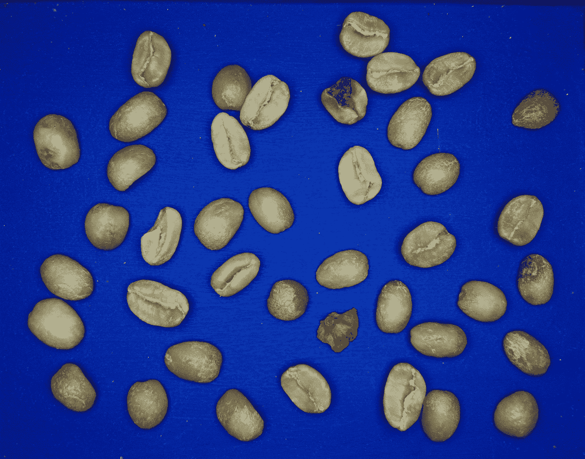
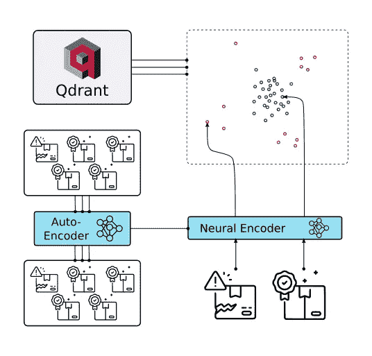
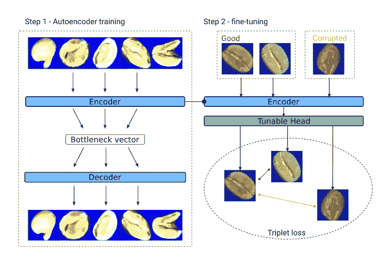
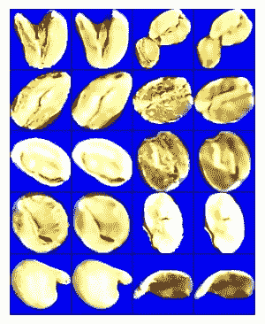
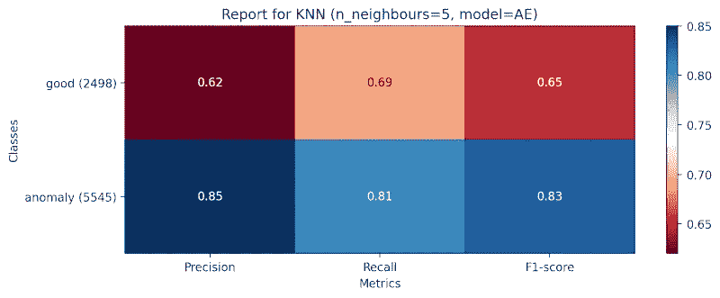
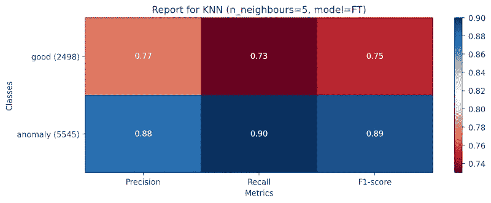

# 用于异常检测的度量学习

> 原文：<https://towardsdatascience.com/metric-learning-for-anomaly-detection-7bde550cfa56>

## 如何使用度量学习来检测异常:只有 200 个标记样本的咖啡豆质量评估

图片作者。

异常检测是一项迫切而又具有挑战性的任务，在各行各业都有大量的使用案例。这种复杂性主要是由于任务本身就缺乏数据。

同样，根据定义，异常也是经常变化的，它们可能会以意想不到的形式出现。因此，基于监督分类的方法有:

*   数据饥渴——需要相当多的标记数据；
*   昂贵——数据标注本身就是一项昂贵的任务；
*   费时——你会试图获得必然稀缺的东西；
*   难以维护-您需要反复重新训练模型，以响应数据分布的变化。

如果您想在快速变化的环境中将您的模型投入生产，这些并不是您想要的特性。此外，尽管存在上述所有困难，但与替代产品相比，它们并不一定能提供卓越的性能。在本帖中，我们将详细介绍从这样一个用例中学到的经验。

## 咖啡豆

Agrivero.ai 是一家为生产商、贸易商和烘焙商提供人工智能解决方案的公司。他们已经收集并标记了超过 **3 万张带有各种缺陷的咖啡豆图片——潮湿的、破损的、有缺口的或者有虫子的样本。该数据用于训练分类器，该分类器评估作物质量并突出可能的问题。**

咖啡中的异常现象。图片作者。

我们应该注意到异常是多种多样的，因此列举所有可能的异常本身就是一项具有挑战性的任务。在工作过程中，新的缺陷类型出现，拍摄条件发生变化。因此，一次性标记的数据集是不够的。

让我们看看度量学习如何帮助解决这一挑战。

## 度量学习方法

在这种方法中，我们的目标是在 n 维向量空间中编码图像，然后在推理过程中使用学习到的相似性来标记图像。

最简单的方法是 KNN 分类法。该算法检索给定查询向量的 K 个最近邻，并基于多数投票分配标签。

在生产环境中，kNN 分类器可以很容易地用 [Qdrant](https://qdrant.tech/) 矢量搜索引擎替换。

生产部署。图片作者。

这种方法具有以下优点:

*   我们可以从未标记的数据中受益，考虑到标记既耗时又昂贵。
*   相关的度量，例如，精度或召回率，可以在推理期间根据变化的要求进行调整，而无需重新训练。
*   标记有高分的查询可以作为新的数据点被动态地添加到 KNN 分类器中。

为了应用度量学习，我们需要一个神经编码器，一个能够将图像转换为矢量的模型。

从头开始训练这样的编码器可能需要我们可能没有的大量数据。因此，我们将培训分为两步:

*   第一步是训练自动编码器，用它我们将准备一个能够表示目标域的模型。
*   第二步是微调。其目的是训练模型来区分所需的异常类型。

模型训练架构。图片作者。

## 步骤 1 —未标记数据的自动编码器

首先，我们通过将标签放在一边，在普通的自动编码器架构中预处理了一个类似 Resnet18 的模型。Autoencoder 是由编码器和解码器组成的模型架构，后者试图从前者的低维瓶颈输出中重建原始输入。

没有直观的评估标准来指示该设置中的性能，但是我们可以通过直观地检查重新创建的样本来评估是否成功。

用自动编码器模型重建图像的例子。图片作者。

然后，我们使用编码器将数据的子集编码成 128 维向量，并在这些嵌入和相关标签的基础上创建 KNN 分类器。

虽然结果很有希望，但我们可以通过度量学习进行微调来做得更好。

## 步骤 2 —使用度量学习进行微调

我们从随机选择 200 个标记样本开始，没有替换。

在此步骤中，模型由自动编码器的编码器部分组成，随机初始化的投影层堆叠在其上。我们应用了来自冻结编码器的迁移学习，并且仅训练具有三重丢失的投影层和在线批量所有三重挖掘策略。

不幸的是，该模型在这种尝试中很快就过度拟合了。在下一个实验中，我们使用了一个在线批量硬策略和一个防止向量空间崩溃的技巧。我们将在后续文章中描述我们的方法。

这一次，它顺利地收敛了，我们的评估指标也有了相当大的改进，以匹配监督分类方法。

具有 KNN 分类器的自动编码器模型的度量。图片作者。

使用 KNN 分类器的微调模型的度量。图片作者。

我们用 500 个和 2000 个样本重复了这个实验，但它只显示出轻微的改善。因此，我们决定坚持 200 个样本——原因见下文。

## 监督分类方法

我们还想将我们的结果与传统监督分类模型的指标进行比较。为此，Resnet50 模型用大约 30k 标记的图像进行了微调，可用于训练。令人惊讶的是，F1 分数在 0.86 左右。

请注意，我们在度量学习方法中仅使用了 200 个标记样本，而不是监督分类方法中的大约 30k。这些数字表明，在性能没有显著下降的情况下，节省了大量成本。

## 结论

我们通过度量学习仅使用 0.66% 的标记数据**，获得了与监督分类方法相当的结果。这种方法既省时又节省资源，还可以进一步改进。下一步可能是:**

*   收集更多未标记的数据，并预训练更大的自动编码器。
*   获取少量图像的高质量标签，而不是成千上万的图像进行微调。
*   在微调步骤中使用超参数优化和可能的逐步解冻。
*   使用[向量搜索引擎](https://github.com/qdrant/qdrant)为生产中的度量学习服务。

我们正在积极研究这些问题，并将继续在本次挑战和其他度量学习用例中发布我们的发现。

如果你想享受这种关于度量学习、相似性学习和向量搜索的有趣讨论，请加入我们的 Discord:

 