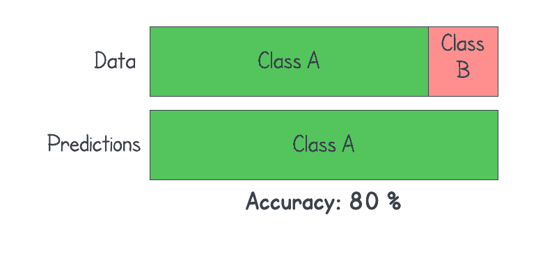
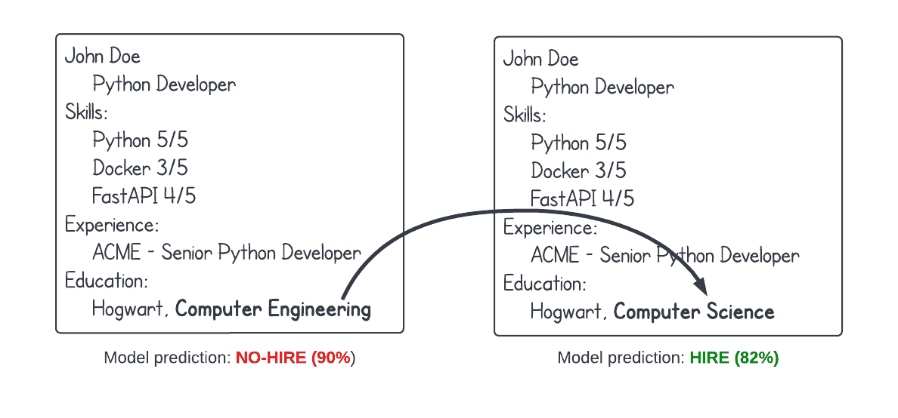
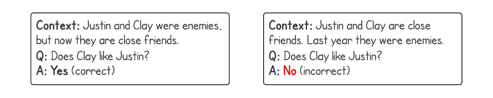
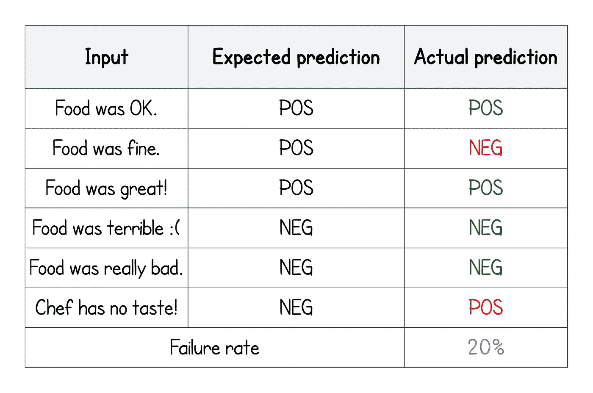
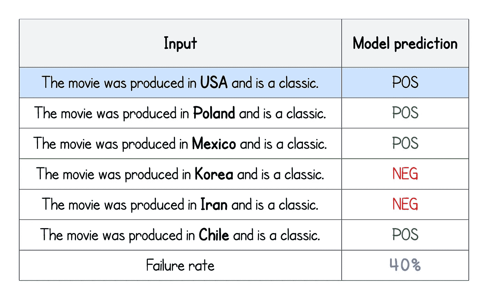
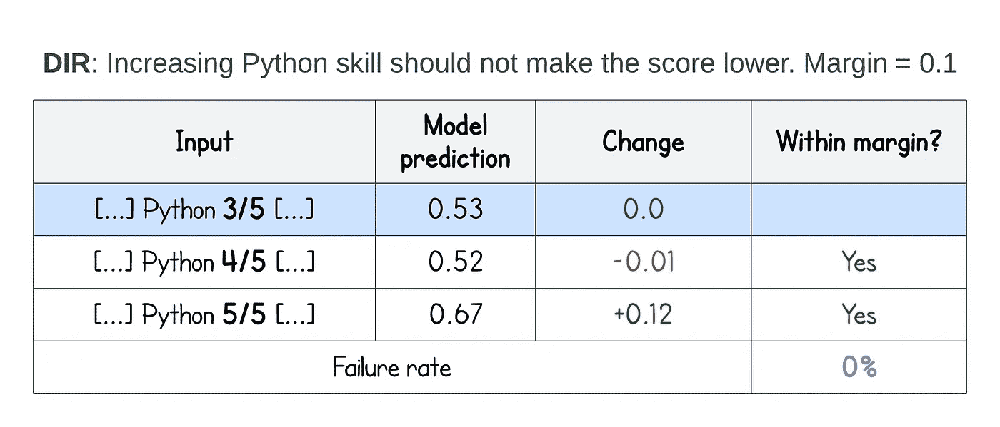

# 度量是不够的——您需要对 NLP 进行行为测试

> 原文：<https://towardsdatascience.com/metrics-are-not-enough-you-need-behavioral-tests-for-nlp-5e7bb600aa57>

## 通过行为测试跟踪模型的系统性问题

数据科学从业者学到的第一个概念是不同的指标。很早的时候，你就明白准确性不能用于所有场景，优化一个错误的度量标准弊大于利。但是一个好的度量标准足以知道一个模型的行为吗？

不正确度量的典型例子。图片由作者提供。

想象一下下面的场景:你的公司每个月都会收到成千上万份求职申请，实际上不可能阅读其中的每一份。此外，雇佣数十名人力资源员工只是为了筛选他们，成本太高。因此，您希望创建一个 NLP 模型来筛选简历，并丢弃那些明显不适合的简历。

你收集一个数据集(让我们假设你可以访问历史申请和招聘决定)并建立模型。对不同指标(精度/召回率/等)的评估显示了不错的性能。

**问题 1** :您认为使用公司内部数据建立模型有问题吗？

部署几周后，您注意到一些可疑的事情——该模型强烈偏好计算机科学专业毕业的候选人，而不是计算机工程专业。尽管它们都完全有效。你做一个快速测试——随机抽取几个应用程序，用计算机科学代替计算机工程，反之亦然。结果很明显:同样的简历，只是用计算机科学取代了计算机工程，得分要高得多。您刚刚发现您的系统存在系统性问题，并开始担心——还有更多这样的问题吗？

相同的工作申请除了同等学历使模型出错——图片由作者提供。

> 多加点数据就行了，兄弟/姐妹。

解决问题的第一个想法是添加更多的数据。但是你没有。即使你有——你怎么知道他们解决了问题？

事实上，现实是收集/注释新数据可能非常昂贵，甚至是不可能的。作为一名数据科学家，你必须意识到这一点，并提出其他解决方案。

# 鲁棒性标准

我们刚刚发现了模型的一个严重问题。在我们投入工作去解决它之前，让我们深吸一口气，想一想——我们可能还有什么其他问题？

1.  性别/种族偏见——你的模型是否歧视男性/女性或特定的国籍？
2.  对等词/同义词—如果候选人将“良好的 python 知识”替换为“良好的 python 3 知识”，您的模型会有什么反应？
3.  技能分级——您的模型是否会给“非常好的知识”、“好的知识”和“基础知识”分配更高的分数。形容词理解充分吗？具有“特殊技能”的候选人不应被评为低于具有“基本技能”的候选人。
4.  句子排序—如果我们颠倒工作经验的顺序，模型预测是否一致？
5.  错别字——我见过很多模型，一个完全不重要的单词中的错别字完全改变了模型预测。我们可能会认为工作申请不应该包含错别字，但我们都同意，一般来说，这是 NLP 中的一个问题
6.  否定——我知道这很难。但是如果你的任务需要理解它们，你会度量它吗？(例如，“我没有犯罪记录”对“我有犯罪记录”或“我完成了对我没有完成”。双重否定怎么样？

你可能会说这些标准很难满足。但另一方面，想象一下你在面试中被拒绝，而公司在给你的反馈中说，“我们预计你的工作经历会被颠倒过来”。我会不高兴的。

> 人工智能将对我们的日常生活产生越来越大的影响，我们这些从业者需要非常认真地对待我们的工作。

# 行为测试

所以我们需要行为测试。度量仅仅显示了模型质量的一部分，并且仅仅是一个高度聚合的数字。他们对内部模型假设、偏见和推理只字不提。即使你仍然进行交叉验证(这对深度学习来说是不切实际的)，你也不知道你的模型有多可靠。行为测试是一种评估影响模型预测的因素的系统方法。在继续之前，让我们看看更多的例子。

这个概念是由 Riberio 等人在论文“超越准确性:NLP 模型的行为测试与清单”中引入的。作者将我们关于模型能力的讨论形式化，并提出了一个系统的测试框架。让我们来看看所选择的子集。

## 方法学

清单论文介绍了三个主要贡献:

1.  能力——我们可能想要检查的特定行为(测试什么)
2.  测试类型——定义明确的测试类型(如何测试)
3.  模板和抽象——用于执行行为测试的 python 包

好的一面是，我们仍然可以使用作者提出的方法，而不使用他们的库(如果出于任何原因我们不想这样做)。在这篇文章中，我将着重于定义行为测试本身；如何使用清单库是第二部分的主题。

今天，带你的狗去看有执照的行为学家是很正常的。是时候用人工智能模型做同样的事情了。由[命运威恩斯](https://unsplash.com/es/@ilovethatforyou?utm_source=medium&utm_medium=referral)在 [Unsplash](https://unsplash.com?utm_source=medium&utm_medium=referral) 上拍摄的照片

## 模型能力

一个模型的能力是一个特定的对抗性设置，模型很容易受到它的攻击。我们对不同的任务使用不同的能力。功能的具体选择将取决于模型正在解决的问题，但是一些通用的功能可以应用于大多数模型。

*   词汇/分类法:模型如何处理用同义词/反义词替换单词。在情感分析中，我们期望用“惊人的”代替“伟大”不会显著改变预测。另一方面——用“糟糕”代替“伟大”应该会在特定的方向上产生影响。
*   鲁棒性:在次要单词中添加小的错别字应该不会显著影响预测。在我们的招聘例子中，以前工作场所的洗牌顺序也不应该有影响。这一点在处理非正式文档时显得尤为重要，因为在非正式文档中，打字错误和不相关的信息更为常见。
*   NER:如果我们改变一个人的名字，应该不会影响预测。比如“迈克是个很棒的服务员”vs“史蒂夫是个很棒的服务员”。我们不想选择麦克而不是史蒂夫或其他方式。位置也是如此。想想“去纽约的机票太贵了”和“去凤凰城的机票太贵了”。
*   时态:模型理解一系列的动作吗？它能区分过去和未来吗？

该模型错误地假设动作序列与作者在文本图像中的顺序相匹配。

*   否定:这是一个大问题。“食物很糟糕”和“食物还不错”是一个简单的例子。但是双重否定呢？`p`的真值等于`not(not(p))`。可以处理吗？即使对人类来说，这也很有挑战性！
*   共指:模型是否正确地链接了不同的主题？“约翰是一名管道工。凯特是一名会计，她每小时挣 50 美元。他每小时挣 20 美元。问题:“约翰挣多少钱？”
*   逻辑:模型是否理解基本的逻辑规律？“猿是哺乳动物。哺乳动物是动物。猿是动物吗？”
*   还有一些，但足够了:)

哇，我们怎么能测试它们呢？他们似乎很复杂！对于救援来说，CheckList 附带了预定义的测试类型和构建它们的框架。让我们仔细看看考试类型。

# 测试类型

为了有助于系统测试，作者还提出了三种不同类型的测试。每种测试类型都可以与任何功能一起使用(但是，当然，它们中的一些可能更适合/不太适合)。定义测试类型有助于我们决定如何测试一项功能。不充分的测试弊大于利！

## 最低功能测试(MFT)

它们可以与单元测试相提并论——在隔离环境中执行的单个小功能。对于行为测试，我们可以将 MFT 定义为一个小型的、合成的、有针对性的测试数据集。对于每条记录，我们都知道预期的答案，因此我们可以轻松地将其与模型预测进行比较。

让我们看一个用于情感分析的词汇能力的例子。

简单的 MFT (vocab 功能)。图片由作者提供。

您可以注意到一些事情:首先，测试结果被报告为失败测试的一部分——失败率。在大多数现实场景中，我们并不期望我们的模型是 100%正确的。可接受的误差量会有所不同——所以这个框架不会把任何东西强加给我们。此外，如果我们对现有模型进行行为测试，结果很有可能会很差。在这种情况下，我们不希望只报告失败——如果修复模型需要时间，那么最好跟踪一段时间内的失败率。

其次，测试用例**仅仅是为了行为测试**而产生的。它们不是来自训练/val/测试数据集。当然，可能偶然会有一些重叠，但原则上，只为 MFT 生成案例。

第三，有很多冗余。六分之五的案例遵循“食物是 ____”的模式。它看起来像是大量的手工工作。但是情况并没有那么糟糕——check list 为快速案例开发提供了工具，而不需要手动输入所有内容。

## **问题二**:

MFT 可以测试哪些能力？我们已经看过词汇了。你能想到更多吗？

# 不变性测试

不变性测试检查引入测试用例的修改是否没有改变预测。我们从单个输入例子(合成的或真实的)开始，并引入各种扰动。最简单的方法是在文本中引入一个随机的逗号。这种修改不应该影响模型预测。

INV 的可爱之处在于我们不需要带标签的数据。我们检查模型的一致性和稳健性——我们不关心实际预测是否正确——只要它是稳定的。这与 MFT 不同。

让我们看一个例子。我们取一个样本(用蓝色突出显示)并计算一个预测。它是正的(同样，我们不关心它是否是一个实际的类)。现在我们通过用不同的值替换一个国家名称来引入扰动。显而易见，该模型改变了韩国和伊朗的行为——因此它对原产国并不稳健。我们得出结论，该模型对特定国家有偏见，因此不公平。

简单的 INV 测试。更换国家不应该改变模型预测——因为情绪应该通过“是经典的”短语来识别——作者的图像。

## 问题 3:

INV 可以测试哪些能力？

# 方向期望

最后一种测试是方向性期望测试。在这里，我们预计预测将在一个特定的方向上变化。举个例子:如果加上一句“我看过更好的电影。”对一个影评来说，预测的情绪应该不会更好。当我们知道特定的修改应该将模型推向特定的方向时，这样的测试是有益的。

回到工作申请的例子:让我们考虑一个拥有 3/5 python 技能的候选人。他从模型中得到的分数是 0.53。假设我们用 4/5 代替；预测值变为 0.52。从技术上来说，它更少，但差异如此之小，以至于我们可以说它是一个噪音——这就是为什么我们定义一个余量——“我们认为多少变化是真正的变化”。假设边距设置为 0.1。

> 这非常类似于早期停止中的 delta 参数。

更进一步，5/5 的替换将分数变为 0.67——因此该模型确实更倾向于高技能开发人员。

将边距设置为 0.1 意味着我们期望预测在范围[0.43；1] —作者图片。

# 测试矩阵和定义测试

我们定义了功能和测试它们的不同方法。正如我们已经说过的，特定的能力可以通过一种或多种类型的测试来测试，从而创建一个矩阵。

## 问题 4:

尝试为工作应用示例定义一个测试套件。考虑应该测试哪些功能，哪些类型是合适的。如果你不确定分配能力/测试类型，只列出具体的主题作为开始是可以的；)此外，还要考虑可接受的错误率。您可以从以下内容开始:

*   这个模型不应该支持计算机工程胜过计算机科学(反之亦然)。能力:NER，测试类型:发票
*   模型应该拒绝所有 python 技能 1/5 或 2/5 的候选人。能力:词汇/分类，测试类型:MFT，目录
*   …

# 结束和进一步阅读

今天到此为止。在下一篇文章中，我们将使用 CheckList 为一个模型构建一个真实的测试套件。定义行为测试是非常有趣和令人满意的，并且可以显著提高对模型性能的理解。可以在这里查阅论文原文：<https://homes.cs.washington.edu/~marcotcr/acl20_checklist.pdf>

敬请期待！

我在 medium.com 的所有收入中，有 1.5%捐给了 [Stripe 的气候倡议](https://stripe.com/en-pl/climate)。