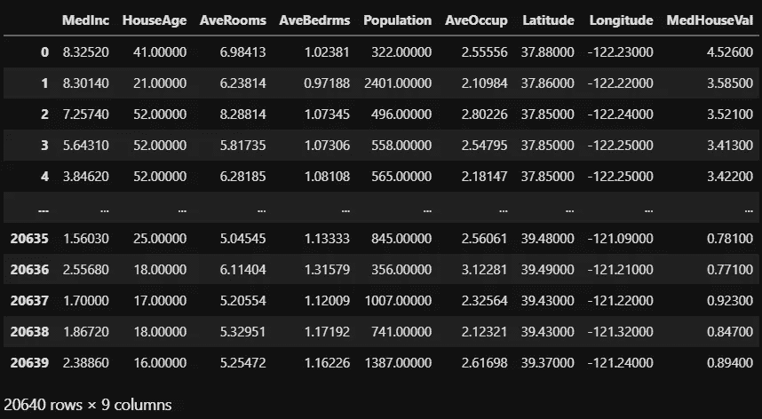
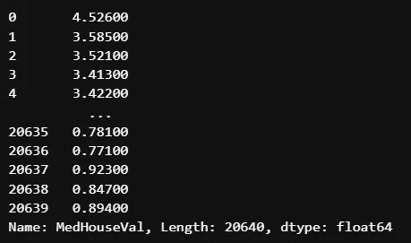
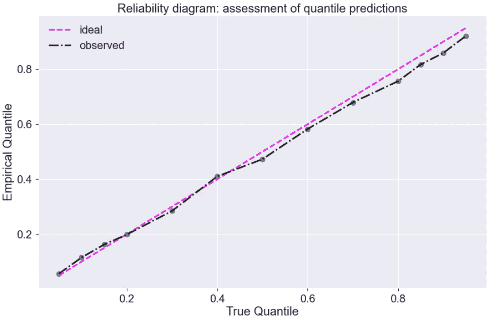
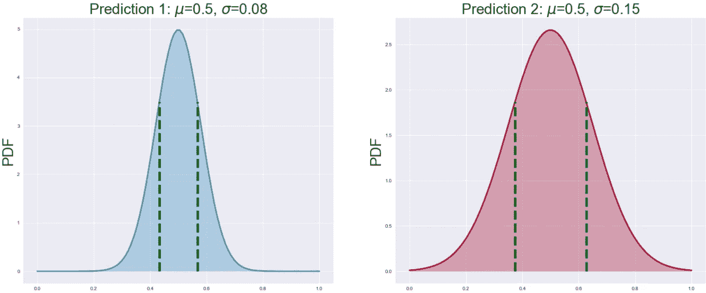
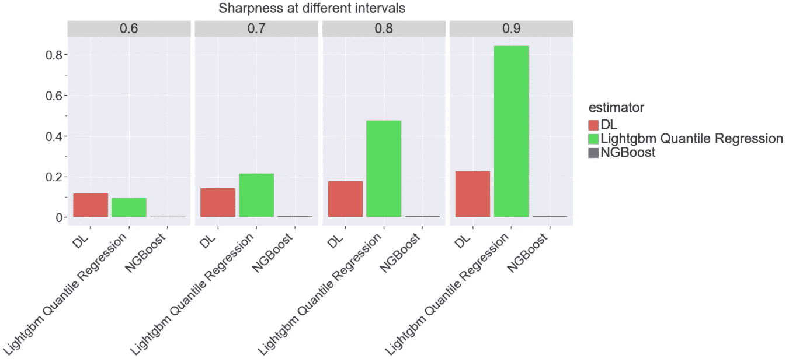
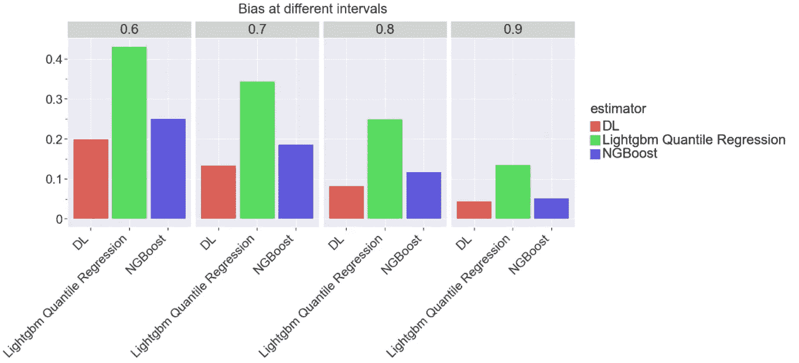
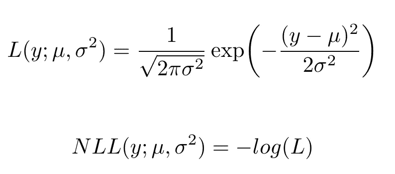
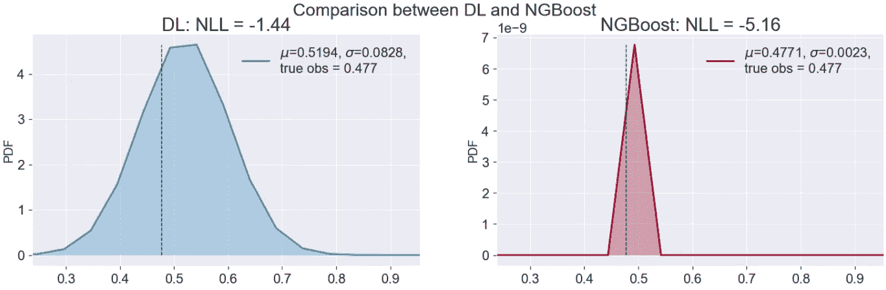

# 回归问题中不确定性评估的度量

> 原文：<https://towardsdatascience.com/metrics-for-uncertainty-evaluation-in-regression-problems-210821761aa>

## 如何用有效性、锐度、负对数似然和连续排序概率得分(CRPS)度量来评估不确定性


圣地亚哥·拉卡尔塔在 [Unsplash](https://unsplash.com?utm_source=medium&utm_medium=referral) 上拍摄的照片

许多现实世界的问题需要对未来结果进行不确定性估计，以便更好地做出决策。然而，大多数最新的机器学习算法只能估计单值预测，该预测通常是假设与真实结果匹配良好的条件分布的平均值或中值。单值预测不能暗示的是预测有多有把握。因此，最近提出了更复杂的方法，如 [NGBoost](https://arxiv.org/abs/1910.03225) 、 [PGBM](https://arxiv.org/abs/2106.01682) 、贝叶斯方法和基于深度学习的方法，可以估计每个数据点的条件分布。由于这些方法估计条件分布，就产生了如何评价这些方法的问题。显然，常用的准确性指标，如单点预测的 RMSE 或 MAE 并不适合。因此，在本文中，我展示了几种评估估计条件分布的模型的方法，以及如何评估不直接估计条件分布但提供预测区间的分位数回归。具体来说，我评估了三种算法:

*   带分位数回归的 LightGBM
*   NGBoost——一种具有概率预测的梯度推进算法
*   模拟平均值和标准差的概率回归神经网络

并使用四个度量标准进行不确定性评估:

*   有效性——评估概率环境中分位数和偏差的可靠性
*   锐度—估计概率的集中程度(预测区间)
*   负对数似然(NLL)-给定条件分布的推断参数时，观察数据出现的似然性
*   连续等级概率得分(close 估计条件分布与观察点的接近程度

# 数据

我正在使用由 [scikit-learn](https://scikit-learn.org/stable/modules/generated/sklearn.datasets.fetch_california_housing.html) 提供的[加州住房数据集](https://inria.github.io/scikit-learn-mooc/python_scripts/datasets_california_housing.html)。这是一个小数据集，有 20640 条记录，只有 8 个数字特征。目标变量是加州各区的房价中值，以十万美元计。

```
from sklearn.datasets import fetch_california_housingcalifornia_housing = fetch_california_housing(as_frame=True)#get the data
data = california_housing.frame
data
```



数据快照。作者图片

```
#get the target
target = california_housing.target
target
```



目标变量快照。作者图片

像往常一样，数据被分成训练集和测试集。我将使模型适合训练集，并在测试集上对它们进行评估。因为本文的重点是评估指标，所以我没有执行任何超参数调优，也没有应用算法的默认参数。

```
X_train, X_test, y_train, y_test = train_test_split(data, target, test_size=0.2, random_state=42, shuffle=True)
```

我将深度学习解决方案的功能标准化

```
x_scaler = StandardScaler()
X_train_scaled = x_scaler.fit_transform(X_train)
X_test_scaled = x_scaler.transform(X_test)
```

# 算法

我选择了三种算法进行评估。

## 带分位数回归的 LightGBM

[LightGBM](https://lightgbm.readthedocs.io/en/latest/index.html) ，一种梯度推进算法，广泛应用于机器学习社区。使用现有算法获得预测区间的最直接方法可能是构建至少两个分位数回归模型，以针对一些低和高条件分位数。例如，90%的预测区间需要拟合两个具有 5%和 95%分位数水平的分位数回归。幸运的是，LightGBM 实现了分位数回归，但是任何其他支持分位数回归的[算法也可以。](https://scikit-learn.org/stable/auto_examples/linear_model/plot_quantile_regression.html)

我定义了 13 个分位数水平，建立了 14 个模型。一个模型预测中值价格的预期平均值，其余 13 个模型预测给定分位数水平的中值价格:

```
quantiles = [0.05, 0.1, 0.15, 0.2, 0.3, 
             0.4, 0.5, 0.6, 0.7, 0.8, 
             0.85, 0.9, 0.95]#save quantile predictions
quantile_predictions = {}train_data = **lgb.Dataset**(X_train, 
                         label=y_train, 
                         free_raw_data=False)#first model that predicts expected mean
params = {'objective': 'regression'}
lgb_model = **lgb.train**(params=params, 
                      train_set=train_data, 
                      num_boost_round=100)lgb_prediction = **lgb_model.predict**(X_test)#train models on quantiles
for quantile in **quantiles**:
    print(f"modeling quantile {quantile}")
    params = {'objective': 'quantile', 'alpha': quantile}
    lgb_model = lgb.train(params=params, 
                          train_set=train_data, 
                          num_boost_round=100)
    pred = **lgb_model.predict**(X_test)

    quantile_predictions[quantile] = pred
```

## NGBoost

[NGBoost](https://arxiv.org/abs/1910.03225) 是一种估计条件(正态)分布参数的梯度推进算法。

```
ngb = **ngboost.NGBoost**(Base=learners.default_tree_learner, Dist=distns.Normal, Score=scores.LogScore, natural_gradient=True, verbose=True)
ngb.fit(X_train, y_train)**#predicted mean**
**ngb_mean_pred** = ngb.predict(X_test)**#predicted distribution parameters**
**ngb_dist_pred** = ngb.pred_dist(X_test)
```

## 回归神经网络

回归神经网络使用[张量流概率](https://www.tensorflow.org/probability/)框架估计条件(正态)分布的参数。

下面是神经网络的架构:

损失函数被定义为基础正态分布的负对数似然性:

```
def **nll_loss**(y, distr):
    return -distr.log_prob(y)
```

以下函数接收由两个节点组成的输入，一个节点用于平均值，另一个节点用于标准差:

```
def **model_distribution**(params): 
    return tfd.Normal(**loc**=params[:,0:1],   
                      **scale**=tf.math.softplus(params[:,1:2]))
```

均值和标准差分别建模。

平均:

```
inputs = layers.Input(shape=((len(X_test.columns),)))hidden1 = layers.Dense(100, activation = "relu", name = "dense_mean_1")(inputs)
hidden2 = layers.Dense(50, activation = "relu", name = "dense_mean_2")(hidden1)
**output_mean** = layers.Dense(1, name = "mean_output")(hidden2)
```

标准偏差:

```
hidden1 = layers.Dense(100,activation="relu", name = "dense_sd_1")(inputs)
hidden1 = layers.Dropout(0.1)(hidden1)
hidden2 = layers.Dense(50,activation="relu", name = "dense_sd_2")(hidden1)
hidden2 = layers.Dropout(0.1)(hidden2)
hidden3 = layers.Dense(20,activation="relu", name = "dense_sd_3")(hidden2)
**output_sd** = layers.Dense(1, name = "sd_output")(hidden3)
```

两者被连接并传播到分布层:

```
**mean_sd_layer** = layers.Concatenate(name = "mean_sd_concat")([output_mean, output_sd]) 
**dist** = tfp.layers.DistributionLambda(model_distribution)(mean_sd_layer)
```

最后一步是编译分布模型，并使用分布模型分别预测均值和标准差。

```
dist_mean = **tfp.layers.DistributionLambda**( make_distribution_fn=model_distribution, convert_to_tensor_fn=tfp.distributions.Distribution.mean)(mean_sd_layer)
dist_std = **tfp.layers.DistributionLambda**( make_distribution_fn=model_distribution, convert_to_tensor_fn=tfp.distributions.Distribution.stddev)(mean_sd_layer)**model_distr** = **models.Model**(inputs=inputs, outputs=dist)
**model_distr**.compile(optimizers.Adagrad(learning_rate=0.001), loss=nll_loss)#the model for mean
**model_mean** = **models.Model**(inputs=inputs, outputs=dist_mean)#the model for std **model_sd** = **models.Model**(inputs=inputs, outputs=dist_std)history = **model_distr.fit**(X_train_scaled, y_train, 
                          **epochs**=150, 
                          verbose=1, 
                          **batch_size** = 2**7, 
                          **validation_data**=(X_test_scaled,y_test))#mean predictions
dl_mean_prediction  = **model_mean.predict**(X_test_scaled).reshape(-1)
dl_mean_prediction#stand deviation predictions
dl_sd_prediction = **model_sd.predict**(X_test_scaled).reshape(-1)
dl_sd_prediction
```

# 韵律学

下面描述的四个指标是研究中最常用的指标。基于预测区间直接估计的方法，如分位数回归或共形分位数回归，通常使用覆盖率和区间长度(锐度)指标([论文](https://arxiv.org/abs/1905.03222))，估计条件分布的方法使用负对数似然(NLL) ( [论文 1](https://research.yandex.com/publications/323) 、[论文 2](https://arxiv.org/abs/1910.03225v1) )或 CRPS ( [论文](https://journals.ametsoc.org/view/journals/wefo/15/5/1520-0434_2000_015_0559_dotcrp_2_0_co_2.xml))

## 有效性/覆盖范围

对于某个水平为 0 < α < 1 的分位数预测，我们期望覆盖(100*α)%的观察值。例如，如果α是 0.8，我们期望分位数预测覆盖 80%的观察值。

为了更直观，让我们使用正态分布生成一些数据，并检查某个分位数级别覆盖的数据比例，比如 10%或α为 0.1

```
r = stats.norm.rvs(size=1000)
```

我们需要找出 10%分位数的 Z 值:

```
quantile = 0.1
percent_point = stats.norm.ppf(q = quantile)
#-1.281552
```

现在，让我们找出 10%分位数覆盖生成的观察值的情况的经验比例:

```
len(r[r < percent_point])/len(r)
#10.5%
```

无效条件分位数的一个明显标志是经验分位数偏离名义分位数太多。

让我们计算 LightGBM 分位数回归的有效性:

```
empirical_quantiles = []
for quantile in **quantiles**:
    empirical = (**quantile_predictions[quantile] >= y_test**).mean()
    empirical_quantiles.append(empirical)
```

并将结果可视化:

```
plt.figure(figsize=(16, 10))
sns.set_context("notebook", font_scale=2)
sns.lineplot(x = quantiles, y = quantiles, color = "magenta", linestyle='--', linewidth=3, label = "ideal")
sns.lineplot(x = quantiles, y = empirical_quantiles, color = "black", linestyle = "dashdot", linewidth=3, label = "observed")
sns.scatterplot(x = quantiles, y = empirical_quantiles, marker="o", s = 150)
plt.legend()
plt.xlabel("True Quantile")
plt.ylabel("Empirical Quantile")
_ = plt.title("Reliability diagram: assessment of quantile predictions")
```



作者图片

经验分位数(黑线)非常接近理想分位数(洋红色线)，这表明 LightGBM 生成的分位数预测是有效的。

## 清晰度/间隔长度

完美的概率预测应该为单个值估计 100%的概率。实际上，条件分布将为每个可能的结果分配不同的概率。锐度是预测密度紧密程度的量度。区间长度越窄，我们对预测就越有信心。

锐度计算的程序如下:

*   选择用于评估的预测间隔
*   迭代预测每个观察值的平均值和标准差(NGBoost 和神经网络)
*   对于测试集中的每个观察值，计算区间的边界
*   计算间隔的长度
*   计算所有间隔的平均值

为了更直观，让我们举两个预测的例子:

*   预测 1:均值= 0.5，标准差= 0.08
*   预测 2:均值= 0.5，标准差= 0.15

并比较它们对应的覆盖 60%概率的预测区间的宽度:



作者图片

绿色虚线是间隔的边界。60%的概率集中在两条线之间。第二预测比第一预测具有更高的预测不确定性，第一预测的区间更窄。

知道了分布的参数，我们可以使用 scipy 包计算区间宽度:

```
probability = 0.6
interval = **stats.norm.interval**(probability, loc = 0.5, scale=0.08)
interval
#(0.43267030131416684, 0.5673296986858332)width = interval[1] - interval[0]
#0.135
```

在分位数回归的情况下，过程略有不同。我们有每个分位数的预测，因此为了计算对应于 60%的间隔宽度，我们取 20%和 80%的两个分位数，并使用预测中的差异计算这两个分位数之间的间隔。

最后，我们可以在不同的时间间隔使用清晰度指标来比较三种模型:



作者图片

随着区间覆盖率从 60%增加到 90%，LightGBM 分位数回归的平均预测区间以比其他算法高得多的速度增加。对于非常高的区间覆盖率(低分位数水平)，[分位数回归器可能不会给出最佳结果](https://arxiv.org/abs/2107.00363v2)。NGBoost 在预测密度方面表现出最高的可信度。

也有可能某个算法对预测很有信心，但仍然是错误的。我们如何衡量这一点？我们可以计算不在给定区间的预测边界内的真实观测值的比例。

过程与上面几乎相同，但是我们不是计算平均间隔宽度，而是计算间隔内缺失观测值的数量。



作者图片

随着时间间隔的增加，缺失观测值的比例下降，但是正如我们所看到的，LightGBM 分位数回归具有最多的有偏观测值，其次是 NGBoost。

## 负对数似然

> 似然函数将观测数据的联合概率描述为所选统计模型参数的函数

该指标适用于生成条件概率分布的算法。NGBoost 和回归神经网络都使用 NLL 作为损失函数。

正态分布的 NLL 定义为正态分布概率密度函数的负对数:



使用(正态)分布的参数在每次观察时评估 NLL。为了比较算法之间的 NLL，我们对所有观测值的 NLL 进行平均。(平均)NLL 越低，拟合越好。

以下是回归神经网络和 NGBoost 的第一次观察及其相应 NLL 的预测分布的直观比较:



让我们看一个例子。观测值为 4，正态分布的均值和标准差为 3 和 1。这个观察的 NLL 是什么？

```
#first let's calculate the likelihood#using the formula
L1 = (1/np.sqrt(2 * np.pi * 1**2)) * np.exp ( - (4 - 3)**2/(2 * 1**2))#using the scipy norm pdf function
L2 = stats.norm.pdf(4, loc = 3, scale = 1)
#0.2419707assert(L1 == L2)#NLL
-np.log(L2)
#1.418939
```

NGBoost 的 NLL 可以用几种方法计算:

NGBoost 提供了函数 *pred_dist* 返回一个对象，该函数提供了一个 *logpdf* 函数来计算每个观察的对数似然性。得到 NLL 只是否定结果。最终 NLL 是单个 NLL 的平均值

```
ngb_dist_pred = **ngb.pred_dist**(X_test)
nll_ngboost = **-ngb_dist_pred.logpdf**(y_test)
**nll_ngboost.mean()**
**#-4.888**
```

第二种方法是从 *ngb_dist_pred* 对象获取每个条件分布的参数，并手动计算 NLLs。例如，可以如下提取对应于第一观察的条件分布的参数:

```
**ngb_dist_pred[0].params**
#{'loc': 0.47710276090295406, 'scale': 0.0022844303231773374}
```

所有观测值的参数都可以这样提取:

```
**ngb_dist_pred.params**
#{'loc': array([0.477,...,1.517]),
#'scale': array([0.002,...,0.002])}
```

在回归神经网络的情况下，我们迭代所有观察值及其相应的分布参数:

```
#extract mean predictions
dl_mean_prediction = **model_mean.predict**(X_test_scaled).reshape(-1)#extract standard deviations
dl_sd_prediction = **model_sd.predict**(X_test_scaled).reshape(-1)#iterate over all observations
nll_dl = []
**for** (**true_mean, mean_temp, sd_temp**) in zip(**y_test**, 
                                           **dl_mean_prediction**,
                                           **dl_sd_prediction**):
    nll_temp = **-stats.norm.logpdf**(**true_mean**, 
                                  **loc** = mean_temp, 
                                  **scale** = sd_temp)
    nll_dl.append(nll_temp)**#NLL**
**np.mean(nll_dl)**
#**-1.566**
```

就 NLL 而言，NGBoost 得到的值(-4.888)低于回归神经网络(-1.566)，因此我们可以得出结论，NGBoost 具有更好的拟合性。

## 连续分级概率得分

> 连续排序概率得分，也称为 CRPS，是一种在不知道数据真实分布的情况下，衡量建议分布如何逼近数据的得分

下面是[链接](https://datumorphism.leima.is/cards/time-series/crps/)，它很好地解释了 CRPS 背后的公式。简单地说，CRPS 测量对应于观察值的预测分布和理想分布之间的平方距离。

我用 *properscoring* 软件包计算了 CRPS

```
#**Computes the CRPS of observations x relative to normally distributed with mean, mu, and standard deviation, sig.**import properscoring as ps
**crps_ngboost** = **ps.crps_gaussian**(y_test, 
                               ngb_dist_pred.params["loc"],
                               ngb_dist_pred.params["scale"]).mean()
**crps_dl** = **ps.crps_gaussian**(y_test, 
                           dl_mean_prediction,  
                           dl_sd_prediction).mean()(crps_ngboost, crps_dl)
#(0.001, 0.0266)
```

NGBoost 具有比回归神经网络小得多的 CRPS，这再次表明 NGBoost 具有更好的适应性。

# 结论

在本文中，我介绍了评估回归问题中预测不确定性的四个指标。有效性和锐度最适合直接估计预测区间的方法，如分位数和保形回归。负对数似然和 CRPS 用于比较模拟条件分布的算法。

完整的代码可以从我的 [Github repo](https://github.com/slavakx/medium_posts) 下载

感谢阅读！