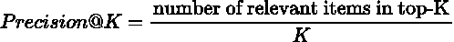
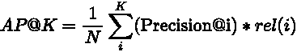
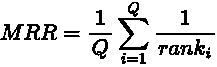
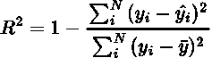
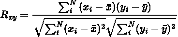
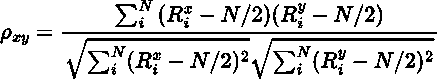
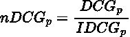
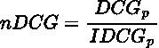
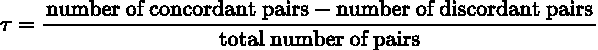

# 推荐系统的度量:综述

> 原文：<https://towardsdatascience.com/metrics-of-recommender-systems-cde64042127a>

## 推荐系统的度量不同于传统的度量。在这里，我们来了解一下 RecSys 领域中广泛使用的 9 个此类指标。

照片由[帕里什·弗里曼](https://unsplash.com/@parrish?utm_source=medium&utm_medium=referral)在 [Unsplash](https://unsplash.com?utm_source=medium&utm_medium=referral) 上拍摄

推荐系统的度量不同于传统的度量，如准确性，因为这些度量主要是在预测的排序列表上累积工作，而不是单个预测的分数。这是因为，对于推荐系统的场景，我们需要优化的业务需求几乎总是与作为一个整体的一组预测联系在一起，而不是单独的。也就是说，让我们来看 9 个对这个领域非常重要的指标。

# 1.精度@K

这与普通精度非常相似，只是当按照您想要的方式排序时，它计算前 k 项的精度。通过这种方式，您可以灵活地改变 K，并查看精度分数是如何变化的。

它在检索领域有很多用途。一个非常常见的用途是根据某个查询的前 10 个结果来衡量搜索引擎的性能。

# 2.回忆@K

类似于通常的召回度量，并且非常类似于上面的 Precision@K 度量。与上面的公式相比，它只有一个小的改动。

这在只有几个相关条目的情况下很有用，我们当然希望这些条目在最前面。一个很好的例子是通过用户点击一列项目来衡量性能。用户在商品上的大部分点击意味着推荐是有效的，并且会有很高的召回率。

# 3.地图@K

MAP@K 或 Mean Average Precision @ K 是 Precision @ K 的高级版本。它擅长对精度进行整体测量，而不是仅基于 K 的一个值进行度量。我们先来看看 Average Precision @ K。

这里， *N* 表示前 K 个项目中相关项目的总数。 *rel(i)* 是在第*个*位置的项目的相关性。对于一个简单的例子，它要么是 1(相关)，要么是 0(不相关)。MAP@K 只是所有 AP@K 在所有查询中的平均值。它是上述两个指标的更好替代方案。

# 4.维护、修理和更换

MRR 或平均倒数排名是每个查询的第一个相关项目排名的倒数的平均值。写成一个公式，它是这样的

这里， *rank_i* 表示第 *i 个*查询的第一个相关项目的等级。这是一个非常简单的指标。也许太简单了，以至于不能被广泛采用。然而，对于有 1 个完美/正确答案的推荐系统来说，这是完美的。对于像电子商务这样有多个相关项目的场景来说，这可能不是一个好主意。

# 5.r 分数

现在我们转移到一个稍微不同的领域，在这里我们不直接评估排名列表。直接评估列表有时会让我们错过列表中第一项和第二项有多接近(就置信度而言)这样的信息。决定系数，也称为 R，对于回归型问题是一个非常方便和有用的度量。

这里，分子表示残差的和(真实预测)，分母表示平方和(N *方差)。r 可以提供一个模型的建议与地面实况或一些其他模型的建议有多接近的信息。

# 6.皮尔逊系数

皮尔逊相关系数遵循与 R 相同的性质，尽管有不同的基本方法，但它有助于我们测量两组数据之间的相似性。其核心是两个变量之间的归一化协方差——它们的协方差和它们的标准差的乘积之间的比率。

这里，x 和 y 是我们的两组数据。n 是数据的大小。皮尔逊评分在过去被广泛用于老派的协同过滤来计算用户或项目之间的相似性。

# 7.斯皮尔曼系数

假设您正在使用皮尔逊系数计算两个模型的推荐集之间的相似性，并稍加改动。我们不是计算原始项目分数的相关性，而是计算项目在集合中的排序。这就是斯皮尔曼系数的本质。它是两个不同集合之间项目等级的相关性。

这里， ***R_x*** 和 ***R_y*** 是每个*I’*项在集合 x 和 y 中的等级。平均秩显然是 N/2。它可用于比较任何两个排序的项目列表。

# 8.NDCG

NDCG 或归一化折扣累积增益是信息检索中广泛使用的度量。它用于计算一组有序项目的累积分数。该度量的“折扣”部分惩罚出现在较低等级的较高相关性的项目。归一化的 DCG 取 DCG 直到某个等级“p ”,并将其除以通过对列表排序可获得的更高可能的 DCG(通过相关性分数对列表排序将最相关的项目放在顶部，这将给出最佳的 DCG)

这里 ***rel_i*** 是第*I’*位置的项目的相关性。 ***IDCG_p*** 是理想的或最高可能的 DCG，直到秩 p

# 9.肯德尔·陶

Kendall Tau 是另一种等级相关性度量，在它测量什么的意义上类似于 spearman 系数。但它的公式与我们迄今所见的任何公式都大不相同。肯德尔τ系数定义为

为了解释一致，让我们取两个列表 X 和 y 中的一对(item i，item j)设 X_i 是列表 X 中第 *i'* 项的秩，那么(I，j)是一致的，如果以下任一项为真，否则不一致:

1.  ***X _ I***<***X _ j***和***Y _ I***<***Y _ j***
2.  ***X _ I***>***X _ j******Y _ I***>***Y _ j***

基本上，它期望所有的配对在两个集合中遵循相同的顺序。

显然，我们没有涵盖所有内容。还有许多其他指标，尤其是在其他领域，这些指标对于 recsys 应用中的不同使用情形都很有价值。在试图解决问题之前，为特定问题最终确定完美的评估标准是重要的一步。