# F1 分数的微观、宏观和加权平均值，解释清楚

> 原文：<https://towardsdatascience.com/micro-macro-weighted-averages-of-f1-score-clearly-explained-b603420b292f>

## 用简单的插图理解 F1 分数在多类分类中的微观平均、宏观平均和加权平均背后的概念

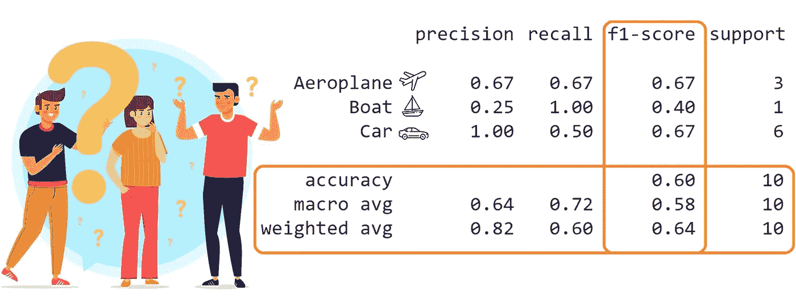

图片作者和 [Freepik](https://www.freepik.com/vectors/people)

F1 分数(也称为 F-measure)是一种用于评估分类模型性能的流行指标。

在多类分类的情况下，我们采用**平均**的方法计算 F1 得分，从而在分类报告中产生一组**不同的平均得分**(宏观、加权、微观)。

本文着眼于这些平均值的含义，**如何**计算它们，以及**选择哪个**进行报告。

## 内容

> ***(1)*** [*基础知识回顾(*可选*)*](#e273)***(2)***[*设定激励范例*](#7c80)*[*宏观平均*](#989c) *

# *(1)概述基础知识(可选)*

**注意:如果您已经熟悉精确度、召回率和 F1 分数的概念，请跳过这一部分。**

## *精确*

***外行定义**:在我做出的所有正面预测中，有多少是真正正面的？*

***计算**:真阳性数(TP)除以真阳性总数(TP) **和**假阳性总数(FP)。*

*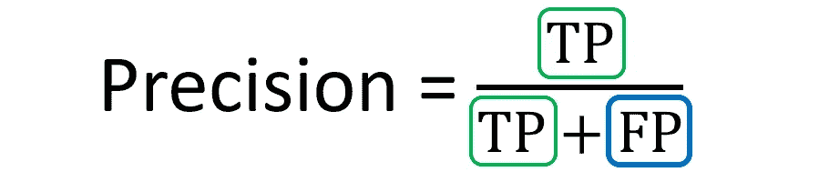*

*作者的精确公式|图像*

## *回忆*

*外行定义:在所有实际的正面例子中，有多少是我正确预测为正面的？*

***计算:**真阳性数(TP)除以真阳性总数(TP) **和**假阴性总数(FN)。*

**

*作者回忆|图片的方程式*

*如果你比较精确和召回的公式，你会发现两者看起来很相似。唯一的区别是分母的第二项，它对**精度**是假阳性，但对**召回**是假阴性。*

## *F1 分数*

*为了全面评估模型的性能，我们既要考察的精度，也要考察**的召回率。F1 分数是考虑这两者的有用指标。***

***定义**:精确和召回的调和平均值，用于模型性能的更平衡的概括。*

***计算:***

*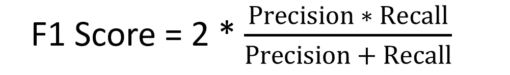*

*F1 得分公式|作者图片*

*如果我们用真阳性(TP)、假阳性(FP)和假阴性(FN)来表示，我们得到这个等式:*

*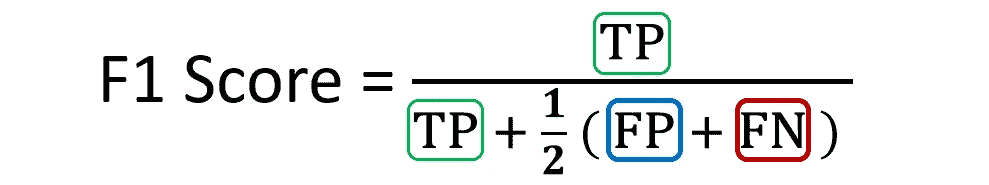*

*F1 分数的替代等式|作者图片*

# *(2)树立激励的榜样*

*为了说明平均 F1 分数的概念，我们将在本教程的上下文中使用以下示例。*

*假设我们已经在包含三个类的**图像的**多类**数据集上训练了一个**图像分类模型**:**A**IR plane、 **B** oat 和 **C** ar。***

**

*图片由[宏向量](https://www.freepik.com/vectors/car)——【freepik.com】宏向量*

*我们使用这个模型来预测十个测试集图像的类别。以下是原始预测:*

*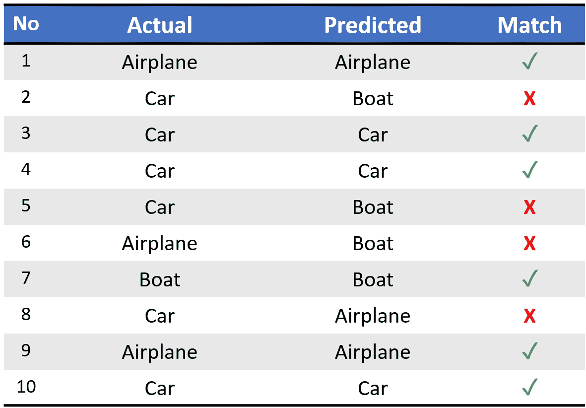*

*我们的演示分类器的样本预测|作者图片*

*运行`sklearn.metrics.classification_report`后，我们得到以下分类报告:*

*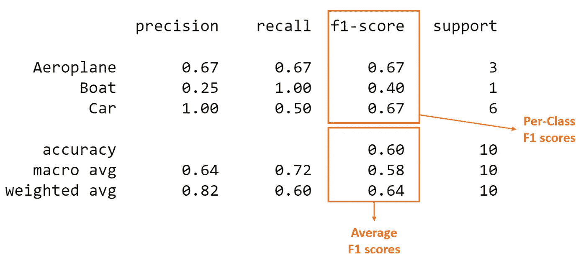*

*[分类报告](https://scikit-learn.org/stable/modules/generated/sklearn.metrics.classification_report.html)来自 sci kit-学习包|作者图片*

*带有每个班级的**分数(即每个班级的分数)和**平均分数**的列(橙色)是我们讨论的焦点。***

*从上面我们可以看到，数据集是**不平衡**(十个测试集实例中只有一个是‘Boat’)。因此**正确匹配比例**(又名准确度)在评估模型性能时是无效的。*

*相反，让我们来看看**混淆矩阵**，以全面了解模型预测。*

*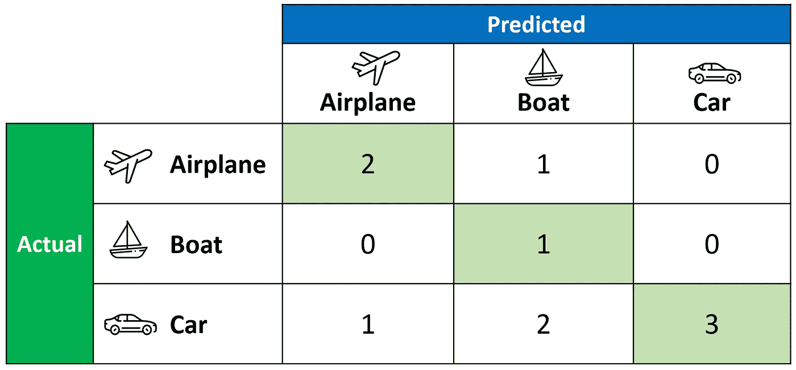*

*困惑矩阵|作者图片*

*上面的混淆矩阵允许我们计算真阳性( **TP** )、假阳性( **FP** )和假阴性( **FN** )的临界值，如下所示。*

*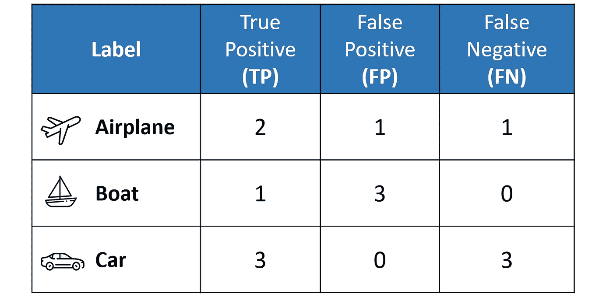*

*根据混淆矩阵计算出的 TP、FP 和 FN 值|图片由作者提供*

*上表很好地设置了我们来计算三个类中每个类的**精度**、**召回**和 F1 分数的**每类**值。*

*重要的是要记住，在**多类别分类中，我们以一对多(OvR)** 方法计算每个类别的 F1 分数，而不是单一的总体 F1 分数，如二进制分类所示。*

*在这个 **OvR** 方法中，我们分别确定每个类的度量，就好像每个类有一个不同的分类器。以下是每个班级的指标(显示 F1 分数计算):*

*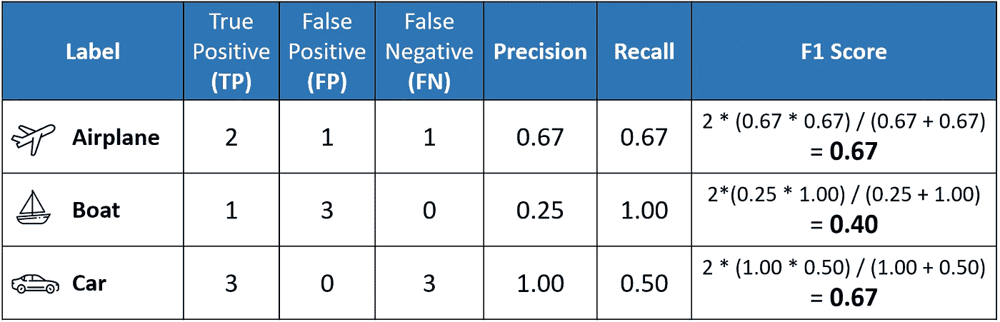*

*然而，与其有多个每级 F1 分数，不如**平均**它们，以获得一个**单一数字**来描述整体表现。*

*现在，让我们讨论导致分类报告的三个不同 F1 平均分数的**平均**方法。*

# *(3)宏观平均*

***宏平均**可能是众多平均方法中最简单的一种。*

*宏观平均 F1 分数(或宏观 F1 分数)是使用所有每级 F1 分数的算术平均值(又名**未加权**平均值)计算的。*

*这个方法平等地对待所有的类，不管它们的**支持**值。*

*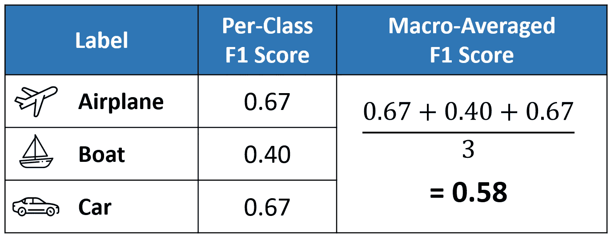*

*宏 F1 分数的计算|作者图片*

*我们上面计算的值 **0.58** 与我们分类报告中的宏观平均 F1 分数相匹配。*

**

# *(4)加权平均*

***加权平均的** F1 分数是通过取所有班级 F1 分数**的平均值，同时考虑每个班级的支持**来计算的。*

> *s**support**指的是该类在数据集中实际出现的次数。例如，**船**中的支持值 1 意味着只有一个实际标签为船的观察值。*

*“权重”实质上是指每一类的支持度相对于所有支持度值的总和的比例。*

*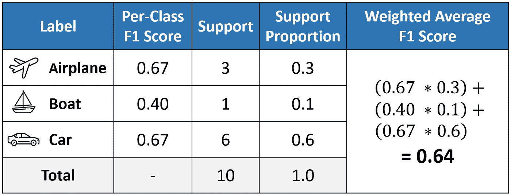*

*按作者计算加权 F1 分数|图片*

*使用加权平均法，输出平均值会考虑到每个类别的贡献，并根据给定类别的实例数量进行加权。*

*计算出的值 **0.64** 与我们分类报告中的加权平均 F1 分数相符。*

*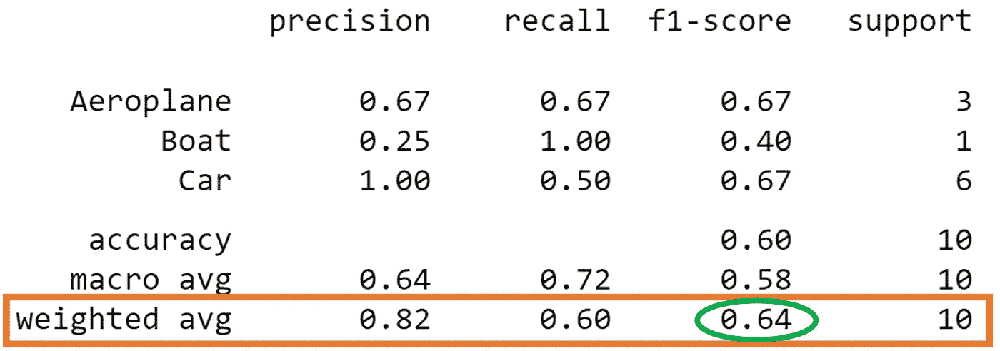*

# *(5)微观平均*

*微平均通过计算真阳性( **TP** )、假阴性( **FN** )和假阳性( **FP** )的**和**来计算**全局平均** F1 分数。*

*我们首先对所有类别的 TP、FP 和 FN 值求和，然后将它们代入 F1 方程，得到我们的微观 F1 分数。*

*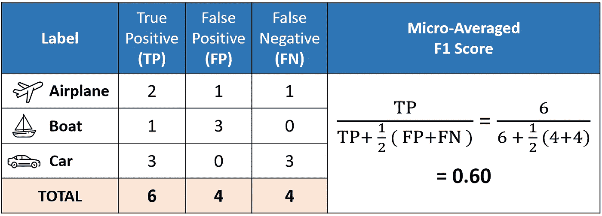*

*微 F1 分数计算|作者图片*

*在分类报告中，你可能想知道为什么我们的微 F1 分数 **0.60** 显示为“准确性”，为什么**没有一行说明** ' **微平均值'**。*

*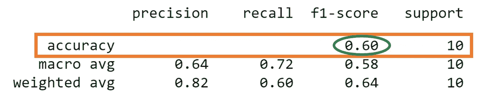*

*这是因为微平均本质上是计算所有观察值中正确分类的**观察值的**比例**。如果我们思考这个问题，这个定义就是我们用来计算总体**精度**的。***

*此外，如果我们对精确度和召回率进行微平均，我们将得到相同的值 **0.60** 。*

*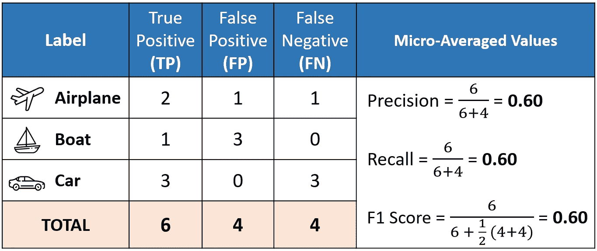*

*计算所有微平均指标|作者图片*

*这些结果意味着，在每个观测值具有一个**单标签**的多类分类情况下，**微 F1** 、**微精度**、**微召回、**和**精度**共享**相同的**值(即，在本例中为 **0.60** )。*

*这解释了为什么分类报告**只需要显示单个准确度值**，因为微 F1、微精度和微召回也具有相同的值。*

> ***微 F1** =准确度=微精度=微召回*

* * 

# *(6)我应该选择哪个平均数？*

*一般来说，如果您正在处理一个所有类都同等重要的不平衡数据集，使用**宏** average 将是一个不错的选择，因为它平等地对待所有类。*

*这意味着，对于我们涉及飞机、船只和汽车分类的例子，我们将使用宏 F1 分数。*

*如果您有一个不平衡的数据集，但希望将更多的样本分配给数据集中有更多样本的类，那么最好使用**加权**平均值。*

*这是因为，在加权平均法中，每个类别对 F1 平均值的贡献按其大小进行加权。*

*假设您有一个平衡的数据集，并且想要一个易于理解的总体性能指标，而不考虑类。在这种情况下，您可以选择准确性，这实质上是我们的**微** F1 分数。*

# *在你走之前*

*欢迎您来到**和我一起踏上数据科学学习之旅！**关注我的 [Medium](https://kennethleungty.medium.com/) 页面，查看我的 [GitHub](https://github.com/kennethleungty) ，了解更多精彩的数据科学内容。同时，享受解释 F1 分数的乐趣！*

*       *