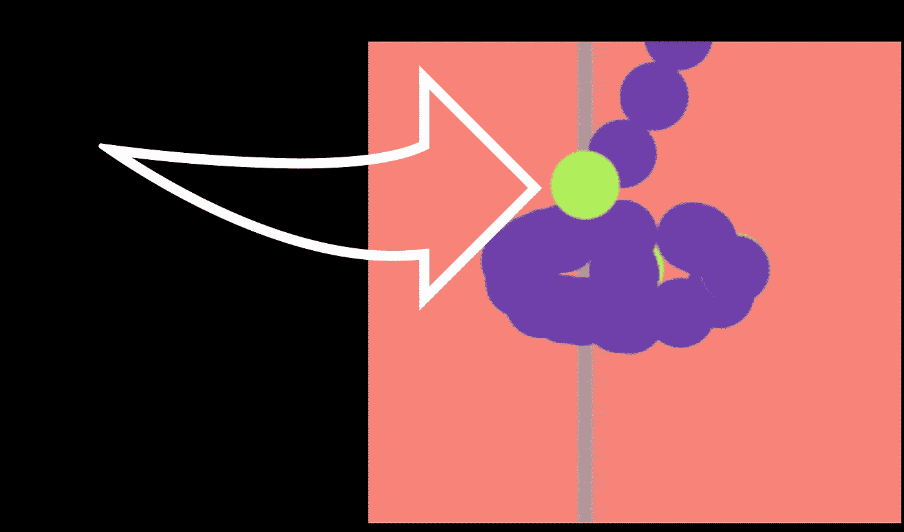
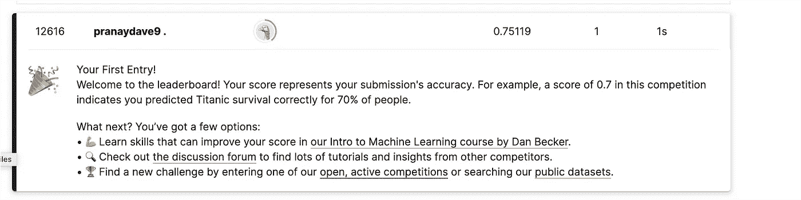
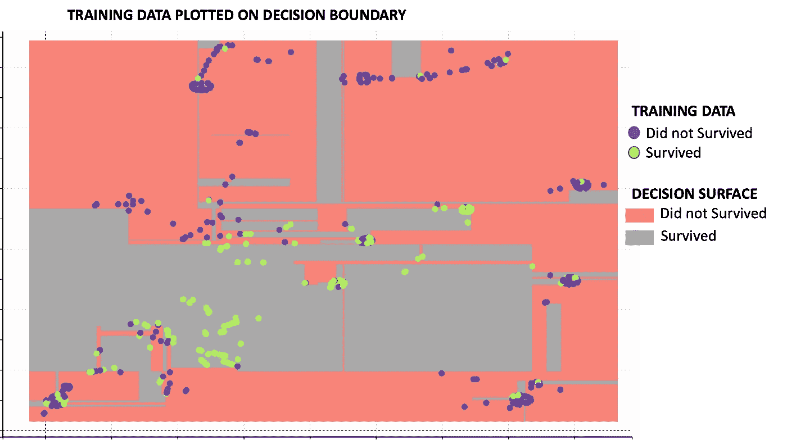
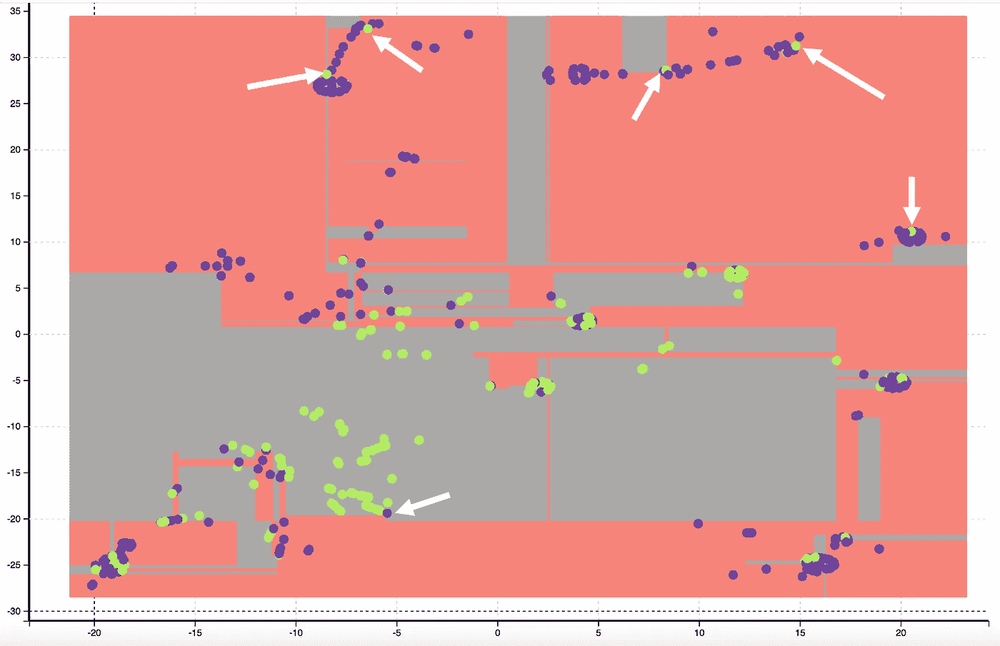
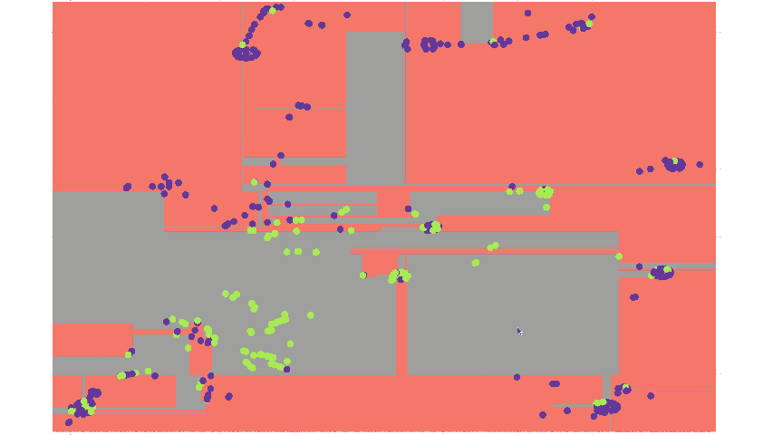
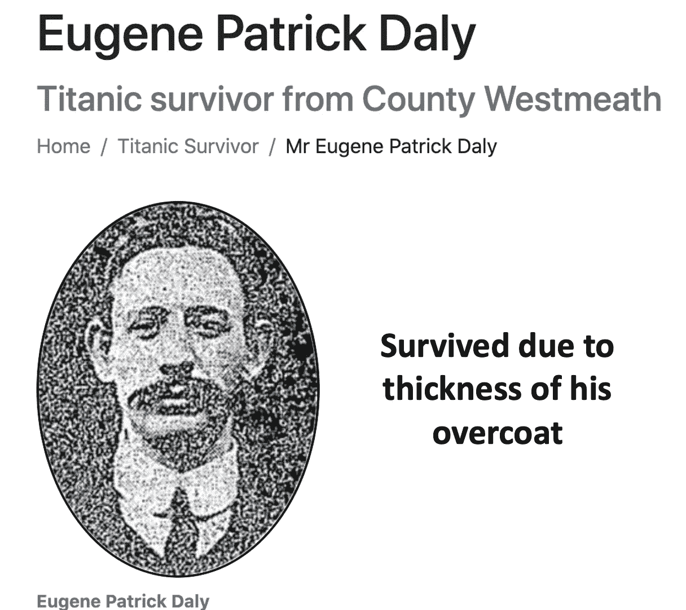

# 去除微小异常值:使用这种技术，以最小的努力爬上 Kaggle 的高处

> 原文：<https://towardsdatascience.com/micro-outlier-removal-climb-high-in-kaggle-with-minimum-effort-using-this-technique-6b5ba9d5014f>

## 我是如何用最小的努力在 Kaggle Titanic challenge 排行榜上取得巨大进步的

微小异常值(作者图片)

我经历了一些不可思议的事情。我在 10 分钟内尝试了几次，在 [Kaggle Titanic competition](https://www.kaggle.com/competitions/titanic) 排行榜上爬了 8000 级。

还有更惊人的消息。我不费吹灰之力就做了这件事。我没有做过特征工程。我没有填写缺失的值。我只用了几根柱子。我没有使用任何复杂的机器学习算法。只是一个简单的决策树。

在这个故事中，我将告诉你**让这一切发生的神奇技术**。

在我上次提交的时候，我在 14404 个团队中排名第 4057(前 30%)

> 这个故事的目标不是开发最好的模型，而是如何以最小的努力爬上排行榜。

***施展神功前——等级为 12616***

Kaggle 排名在前(图片由作者提供)

****施完神功——等级 4057！哇哦。****

**

*Kaggle 排名(图片由作者提供)*

*让我为我所使用的技术创造一个术语*

> ***去除微小异常值***

*瞧，这个术语听起来不错。这个术语还不存在。如果你正在读这个故事，那么你可能是第一次看到这个术语。*

# *微小异常值去除技术背后的动机*

*即使我们有许多技术来改进机器学习模型，但有时你会感觉缺少了什么。你可能会说我们拥有一切——超参数优化、网格搜索，甚至自动 ml。那么到底会少什么呢？*

*对我来说，缺少的是一种基于直觉的视觉方法。用一种基于直觉的视觉方法来增强所有机器学习优化技术，真的可以给你带来超乎寻常的优势。*

**

*左图由[马库斯·斯皮斯克](https://unsplash.com/@markusspiske?utm_source=unsplash&utm_medium=referral&utm_content=creditCopyText)在 [Unsplash](https://unsplash.com/s/photos/code?utm_source=unsplash&utm_medium=referral&utm_content=creditCopyText) 拍摄，右图由[阿里·哈坚](https://unsplash.com/@alisvisuals?utm_source=unsplash&utm_medium=referral&utm_content=creditCopyText)在 [Unsplash](https://unsplash.com/s/photos/detective?utm_source=unsplash&utm_medium=referral&utm_content=creditCopyText) 拍摄*

*所以让我们看看微观异常值是什么样子的。*

# *定位微小异常值*

*首先，这里有一些关于我使用的泰坦尼克号数据的模型训练的背景信息。为了简单起见，*

*   *我只按原样选择了以下领域:PClass、Sex、SibSp、Parch、Fare、Embarked。*
*   *字段 age 未被采用，因为它包含许多缺失值。*
*   *没有特征工程*
*   *所使用的机器学习算法是一个基本的 5 层决策树，具有 70–30 的训练测试分割*

*这里显示的是基于训练数据集和决策树算法的决策边界。下图中的图例说明了下图中颜色的含义。*

**

*决策表面和训练数据(图片由作者提供)*

*我们可以做出如下观察:*

*预测生存的决策面(绿色区域)大多位于中间。预测非存活(红色区域)的决策面主要位于侧面。*

*通常，没有幸存的乘客(蓝点)被分组在一起。类似地，幸存的乘客(绿点)被分组在一起。*

*微小异常值可以如下直观定位:*

*   *一群非幸存者中的幸存者*
*   *幸存者群中的非幸存者*

*下图显示了带有白色箭头的**微小异常值。***

**

*识别微小异常值(图片由作者提供)*

*现在让我们来分析微观异常值。*

# *分析微小异常值*

*为了更好地理解微异常值，让我们分析位于左上角的微异常值。下面的动画图像显示了可视化的分析方式。当我们将鼠标悬停在该点上时，它会显示每个点的列的雷达图。*

**

*分析微观异常值(图片由作者提供)*

*您将观察到所有的点都与男性乘客、具有高 PCLass(即 3 等)的乘客以及从 s 港上船的乘客相关。除了微小异常点，所有这些乘客都没有幸存。*

*这里的微观异常者是乘客尤金·帕特里克·戴利。你可以在[这里](https://www.encyclopedia-titanica.org/titanic-survivor/eugene-patrick-daly.html)的链接中读到他幸存的消息*

*他是位于下层甲板的三等舱乘客，他跳进了冰冷的水里。他没有生还的机会。然而，他声称他大衣的厚度归功于他的生存，这件衣服他穿了很多年，他把它命名为“幸运大衣”*

**

*微离群示例来源—[https://www . encyclopedia-titanica . org/titanic-survivor/Eugene-Patrick-Daly . html](https://www.encyclopedia-titanica.org/titanic-survivor/eugene-patrick-daly.html)*

***虽然我们为他高兴，但他对机器学习没什么好处！**由于大衣厚度等模糊原因而幸运幸存的人是离群值，这扰乱了机器学习模型。我们也不知道谁跳下去了，也不知道每位乘客外套的厚度。所以最好的办法就是把它从训练数据中去掉。*

*微异常视觉技术在泰坦尼克号数据中自动识别这些“幸运”的人！使用任何经典的离群点检测算法都无法做到这一点。*

*我去除了 6 个微小的异常值，训练了模型，并提交了我的报告。与没有微异常技术的提交相比，领导层有了很大的提升。*

# *结论*

*微异常值去除是一种很好的基于直觉的可视化方法，可以提高您的机器学习模型的准确性，而无需大量复杂的编码。在某种程度上，我们删除了可能使模型不必要地复杂化的数据点，从而获得了整体模型的准确性。*

*请**订阅**,以便在我发布新故事时随时获得通知。*

*  

你也可以通过我的推荐链接**加入 Medium**

  

# 额外资源

## 网站(全球资讯网的主机站)

你可以访问我的网站进行零编码分析。[**https://experiencedatascience.com**](https://experiencedatascience.com/)

## Youtube 频道

这是我的 YouTube 频道
[https://www.youtube.com/c/DataScienceDemonstrated](https://www.youtube.com/c/DataScienceDemonstrated)的链接*