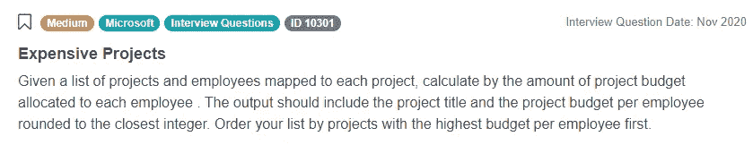
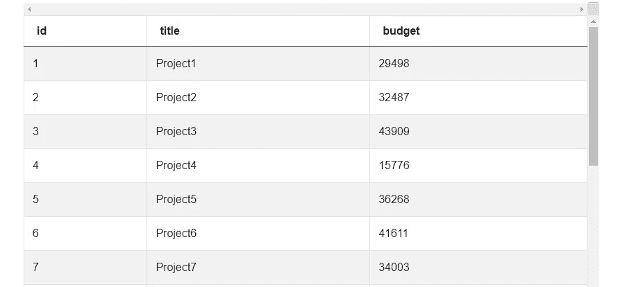
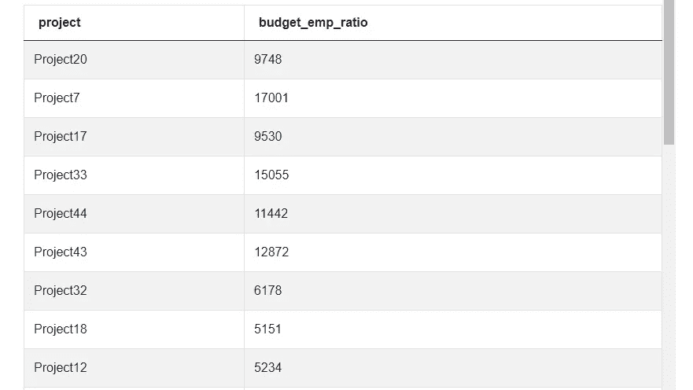
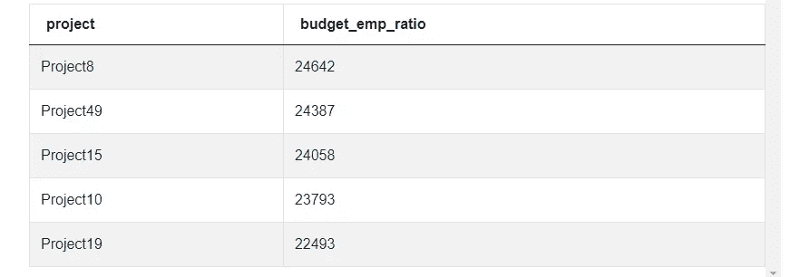

# 微软数据科学家 SQL 面试问题

> 原文：<https://towardsdatascience.com/microsoft-data-scientist-sql-interview-questions-172baceb5fce>

## *我们将回顾一个示例面试问题，以帮助您准备申请微软数据科学家的职位，该问题选自最近的数据分析师面试*


作者在 [Canva](https://canva.com/) 上创建的图片

微软的数据分析师角色可以设计和构建数据模型，为他们的团队提供有意义的数据和模型。下面是一个真实世界的例子，你可能会在微软的面试中遇到。下面，我们将向您展示如何分解出现的问题，逐步完成用于解决问题的逻辑，并讨论如何优化解决方案以获得更好的性能。

# Microsoft Data Scientist SQL 面试问题中测试的概念


作者在 [Canva](https://canva.com/) 上创建的图像

以下 Microsoft 数据科学家访谈问题中测试的主要概念包括:

*   聚合函数—求和/计数/分组依据
*   连接
*   限制

# 微软数据科学家 SQL 面试问题

**员工项目预算**

根据项目中分配给每个员工的预算金额，找出前五个最昂贵的项目。排除员工数为 0 的项目。假设每个员工只参与一个项目。输出应该是项目标题和分配给每个员工的预算(即预算与员工的比率)。首先显示预算与员工比率最高的前 5 个项目。



截图来自 [StrataScratch](https://platform.stratascratch.com/coding/10301-expensive-projects?python=&utm_source=blog&utm_medium=click&utm_campaign=medium)

* *请注意，此问题已在 StrataScratch 平台上更新，[请点击此处](https://platform.stratascratch.com/coding/10301-expensive-projects?python=&utm_source=blog&utm_medium=click&utm_campaign=medium)。在这篇文章和视频中，我们讨论这个问题的另一个版本。

**数据集**


截图来自 [StrataScratch](https://platform.stratascratch.com/coding/10301-expensive-projects?python=&utm_source=blog&utm_medium=click&utm_campaign=medium)

## 假设

从上述问题中得到线索，作出以下初步假设:

1.  一个项目可以有多个员工，但是每个员工只能参与一个项目
2.  只有前 5 名的结果需要显示，所以结果需要按成本排序，然后限制在 5 个最昂贵的项目

我们的数据集提供了以下细分:

*   id —每个项目的个人 id
*   标题—项目的名称
*   预算——每个项目的总成本
*   emp_id —雇员 id 的整数值
*   project_id —每个项目的唯一 id，与 ms_projects 表中的 id 值相同

在查看 ms_projects 中的预算列时，可以看到我们正在处理整数，因此也假设我们正在处理整数除法。



截图来自 [StrataScratch](https://platform.stratascratch.com/coding/10301-expensive-projects?python=&utm_source=blog&utm_medium=click&utm_campaign=medium)

## 方法

所需的 SELECT 语句需要返回项目的标题(这样就很容易识别)和项目中每个员工的预算。选择的开始很简单:

```
SELECT title AS project,
```

但是现在我们必须决定如何返回每个员工的项目成本。对于这种方法，我们将使用整数除法。首先，我们将测试每个项目可能有多名员工的理论。为了测试这一点，我们使用 COUNT()函数。将它放入一个快速查询中(这里显示的连接将在下面进一步解释)，结果显示这个假设是正确的:

```
SELECT title AS project, COUNT(emp_id) AS emps_per_project
   FROM ms_projects p
   INNER JOIN ms_emp_projects e
       ON p.id = e.project_id
   GROUP BY 1, budget
```


截图来自 [StrataScratch](https://platform.stratascratch.com/coding/10301-expensive-projects?python=&utm_source=blog&utm_medium=click&utm_campaign=medium)

为了计算每个项目的雇员成本，我们将 ms_projects 的预算列除以每个项目的雇员总数。这是使用 COUNT(emp_id)完成的:

```
SELECT title AS project, budget/COUNT(emp_id) AS budget_emp_ratio 
```

为了收集这个 SELECT 语句所需的所有列，ms_projects 和 ms_emp_projects [表必须连接在一起](https://www.stratascratch.com/blog/how-to-join-3-or-more-tables-in-sql/?utm_source=blog&utm_medium=click&utm_campaign=medium)。

与上面的解决方案非常相似，为了产生期望的结果，必须在这个查询中使用一个 JOIN 语句。这里，我们将对 ms_projects 和 ms_emp_projects 进行内部连接，其中 ms_emp_projects 中的 project_id 列相当于 ms_projects 中的 id 列:

```
SELECT title AS project, budget/COUNT(emp_id) AS budget_emp_ratio
FROM ms_projects p
INNER JOIN ms_emp_projects e
	ON p.id = e.project_id
```

由于 COUNT()是一个聚合函数，因此必须在项目标题和预算中与 GROUP BY 子句结合使用。

```
SELECT title AS project, budget/COUNT(emp_id) AS budget_emp_ratio
FROM ms_projects p
INNER JOIN ms_emp_projects e
	ON p.id = e.project_id
GROUP BY 1, budget
```

以下是当前查询的结果:



截图来自 [StrataScratch](https://platform.stratascratch.com/coding/10301-expensive-projects?python=&utm_source=blog&utm_medium=click&utm_campaign=medium)

最后，由于我们的[微软数据科学家](https://www.stratascratch.com/blog/microsoft-data-scientist-position-guide/?utm_source=blog&utm_medium=click&utm_campaign=medium)的采访问题是询问前 5 个最昂贵的项目，我们将它们按降序排列，并添加了一个限制子句，因此结果集中只返回前 5 行。

```
SELECT title AS project, budget/COUNT(emp_id) AS budget_emp_ratio
	FROM ms_projects p
	INNER JOIN ms_emp_projects e
		ON p.id = e.project_id
	GROUP BY 1, budget
	ORDER BY 2 DESC
	LIMIT 5
```

以下是最终结果:



截图来自 [StrataScratch](https://platform.stratascratch.com/coding/10301-expensive-projects?python=&utm_source=blog&utm_medium=click&utm_campaign=medium)

## 最佳化

通常，受访者会被问及解决方案是否可以优化。如果不是，什么使解决方案最优？这里的查询已经过优化，所以我们将集中讨论为什么没有改进建议:

1.  该解决方案符合预期
2.  使用的连接方法
3.  限制返回的结果

我们这里的解决方案提供的结果符合摘要的要求:不多也不少。在优化过程中首先要问的问题之一是当前的解决方案是否能产生预期的和准确的结果。

接下来，这里使用的连接方法是内部连接。内部联接检查被联接的两个表，并且只返回左侧表中的联接条件在右侧得到满足的行。这排除了不必要的数据，并处理空条目，因此在以后的查询中不需要考虑它们。如果在这个实例中使用了左连接，优化建议应该是将连接方法改为 INNER。为什么？左连接实际上执行两个连接:首先完成一个内连接；然后，对于表中参数左侧的其余行，如果在右侧没有匹配项，则向结果集中添加一行，该行包含左侧行的数据，并在右侧插入 NULL 值。这不仅需要额外的时间来运行查询，还必须在查询本身中考虑空值。因此，这里内部连接是正确的方法。

最后，限制查询返回的结果不仅满足赋值的参数，还节省了处理时间。需要注意的是，只有首先使用 ORDER BY 子句对结果进行排序时，限制结果才是最佳的。这是因为，如果不首先对结果进行排序，内置的 postgreSQL 查询优化器在生成查询计划时就没有排序约束，这意味着您的查询将产生无序的、不可预测的结果。

## 结论

现在，您已经看到如何将常见的 [SQL 面试问题](https://www.stratascratch.com/blog/sql-interview-questions-you-must-prepare-the-ultimate-guide/?utm_source=blog&utm_medium=click&utm_campaign=medium)分解为基本概念、用于解决方案的逻辑以及可用于优化结果的技术。我们主要关注连接和聚合函数，这是作为数据科学家或分析师在日常生活中使用的。您还看到了如何使用 COUNT 和 ORDER BY 来组织数据。在许多情况下，您会看到多个从中提取和组织数据的表，所以熟悉连接及其不同的技术是必须的。如果你喜欢这篇文章，看看我们以前的文章“ [*微软 SQL 面试问题*](https://www.stratascratch.com/blog/microsoft-sql-interview-questions/?utm_source=blog&utm_medium=click&utm_campaign=medium) ”和“ [*微软数据科学面试问题*](https://www.stratascratch.com/blog/microsoft-data-science-interview-questions/?utm_source=blog&utm_medium=click&utm_campaign=medium) ”，它们可以帮助你准备更多在面试中经常出现的概念。

*原载于*[*https://www.stratascratch.com*](https://www.stratascratch.com/blog/microsoft-data-scientist-sql-interview-questions/?utm_source=blog&utm_medium=click&utm_campaign=medium)*。*