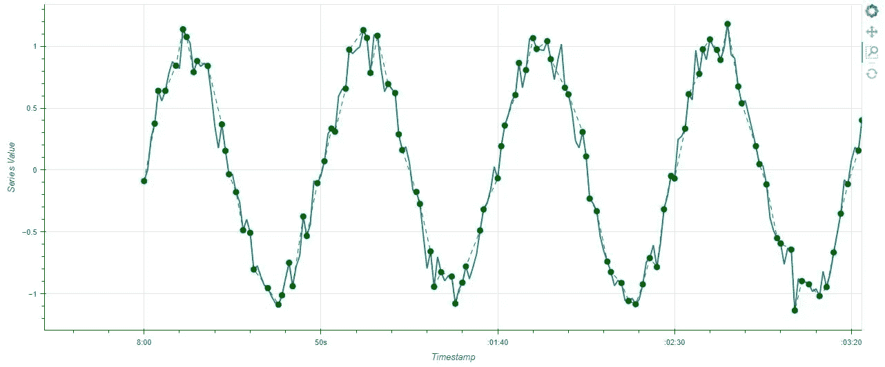
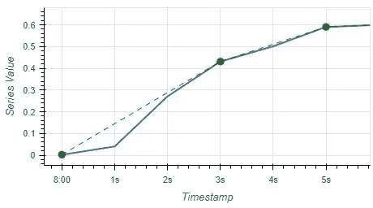

# 大型时序数据的 Midimax 压缩

> 原文：<https://towardsdatascience.com/midimax-data-compression-for-large-time-series-data-daf744c89310>

## 基于 Python 的时序曲线轻量级快速压缩算法


尼古拉斯·卡佩罗在 [Unsplash](https://unsplash.com?utm_source=medium&utm_medium=referral) 上拍摄的照片

**动机**

可视化是用我们的数据进行推理的强大而关键的一步。然而，绘制大型时间序列数据会产生很大的文件大小，这会降低用户交互速度，并使 RAM、磁盘、网络等计算资源紧张。在我的工作中，来自机械监控传感器的时间序列数据可能以 1 Hz(每秒 1 个点)到数千 Hz 的速率记录，每个传感器每天轻松生成 100k+个点，几天内生成数百万个点。除了数据长度的挑战之外，为了观察相关性，绘图通常需要多个变量，从而加剧了资源限制。

本文介绍了一种称为“Midimax”的数据压缩算法，该算法专门用于通过减少数据大小来提高时间序列图的性能。该名称表示从原始时间序列数据中分离出窗口的最小值、中间值和最大值点的基本方法。开发 Midimax 算法时考虑了以下三个目标:

1.  它不应该引入非实际数据。这意味着只返回原始数据的一个子集，因此没有平均、中值插值、回归和统计聚合。在绘图时避免对底层数据进行统计操作是有好处的，但是我们在这里不讨论它们。
2.  它必须速度快，计算量小。它必须在消费者电脑和笔记本电脑上运行。理想情况下，它应该在不到 3 秒的时间内处理 100k 个点，从而允许扩展到更长的数据和更多的变量。
3.  它应该最大限度地获取信息。这意味着它应该尽可能多地捕捉原始数据中的变化。这就是需要最小点和最大点的地方。
4.  (与第 3 点相关)由于单独取最小值和最大值可能给出夸大方差的错误观点，因此取中间点来保留关于信号稳定性的信息。

**工作原理**

为了理解 Midimax 的工作原理，这里有一段伪代码:

1.  向算法输入时间序列数据(例如 Python 熊猫序列)和压缩因子(浮点数)。
2.  将时间序列数据分割成大小相等的非重叠窗口，其中大小计算如下: *window_size = floor(3 *压缩因子)。*3 代表从每个窗口获取的最小值、中间值和最大值。因此，要实现 2 倍的压缩系数，窗口大小必须为 6。更大的系数需要更宽的窗口。
3.  按升序对每个窗口中的值进行排序。
4.  选择最小和最大点的第一个和最后一个值。这将确保我们最大化差异并保留信息。
5.  选择中间值，其中中间位置定义为*med _ index = floor(window _ size/2)。*因此，即使窗口大小为偶数，也不会进行插值。在 Python 中，索引从 0 开始。
6.  根据原始索引(即时间戳)对选取的点进行重新排序。

下图 1 中的示例显示了 1 秒采样率的原始数据(蓝线)和系数为 2 的压缩输出(绿点)。这意味着压缩后减少了 50%的点，因此在 50 秒处只有 25 个绿点。



图 Midimax 的输出示例。蓝线是原始数据。绿点是压缩数据。(图片由作者提供)。



图 1 放大到前 6 个数据点。(图片由作者提供)。

**完整代码**

用 Python 编写的完整代码可以从 GitHub 获得。

您可能会注意到 Python 代码中的一些算法改进，这些改进在上面的伪代码中没有提到。这些增加减少了处理空值或常量重复值时的计算量。当窗口包含常量值时，代码仅返回 1 个点，而不是 3 个冗余点。空值和冻结值的存在将导致更高的最终压缩因子。

**表演**

进行了性能测试，以生成具有一百万个点的模拟时间序列数据的[散景](https://docs.bokeh.org/en/latest/)图。作为基准测试的参考，测试的计算环境设置为:Windows 10 64 位笔记本电脑，16 GB RAM，SSD 磁盘，英特尔酷睿 i5 1.7 GHz 处理器，Python 3.7.10，Pandas 0.25.1，Bokeh 2.3.2。

输入数据由正弦波加 100，000 个数据点的高斯噪声生成，并在传递到压缩函数之前保存为 Pandas 系列。数据的开始部分绘制在上面的图 1 中。

演示绘图性能的 Python 代码如下:

```
import time
import numpy as np
import pandas as pdn = 100000 # points
timesteps = pd.to_timedelta(np.arange(n), unit=’s’)
timestamps = pd.to_datetime(“2022–04–18 08:00:00”) + timestepssine_waves = np.sin(2 * np.pi * 0.02 * np.arange(n))
noise = np.random.normal(0, 0.1, n)
signal = sine_waves + noise
ts_data = pd.Series(signal, index=timestamps).astype(‘float32’)# Run compression
timer_start = time.time()
ts_data_compressed = compress_series(ts_data, 2)
timer_sec = round(time.time() — timer_start, 2)
print(‘Compression took’, timer_sec, ‘seconds.’)> Compression took 0.45 seconds.
```

如上面的代码片段所示，该算法在 1.42 秒内完成了将 100k 个点压缩 2 倍的**。由于要处理的窗口数量较少，压缩因子越高，完成得越快。对相同数据运行 4 和 8 的压缩因子分别在 0.74 秒和 0.44 秒内完成。通过因子 2 压缩 100 万个点在 14.87 秒内完成。**


图 2)压缩系数为 2 和 4 的 Midimax 算法运行时间。(图片由作者提供)。

图 2 描绘了不同压缩因子和数据大小的算法运行时间。我们可以观察到运行时间随着数据点的数量线性增长。这种线性行为允许在应用程序纵向扩展时预测性能。

衡量性能的另一个标准是绘图的最终文件大小。100 万点的散景图 HTML 文件大小在 2X 压缩之前**为 15.6 MB，在 2X 压缩之后**为 7.8 MB。

**实用用法指南**

在图 1 中，我们可以看到，压缩因子为 2 导致了原始模式的良好重建。信号重建的质量高度依赖于数据的原始采样率。如果原始数据没有被充分采样，那么压缩只会恶化最终质量。建议用户首先在数据子集上尝试不同的压缩因子，以在大小减少和丢失细节之间找到适当的平衡。

Midimax 算法旨在提高视觉性能，而不是帮助使用大量数据进行建模。尽管该算法提供了具有良好趋势重构的压缩，但输出数据的分布与原始数据相比有很大的不同。使用它进行进一步的分析必须仔细考虑。

**结论**

Midimax 是一种简单的轻量级算法，用于减少数据大小，以便在消耗较少计算资源的同时快速绘制大型时间序列图。与任何压缩方法一样，细节会丢失，但在视觉分析的情况下，用户更感兴趣的是观察总体趋势，而不是小噪声。该算法被证明可以使用较少数量的点捕捉原始数据的变化，并在几秒钟内处理大量数据。

GitHub 库:[https://github.com/edwinsutrisno/midimax_compression](https://github.com/edwinsutrisno/midimax_compression)