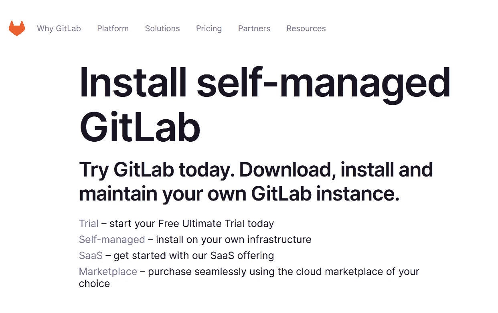
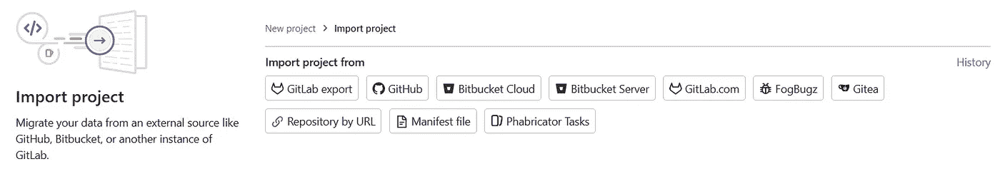
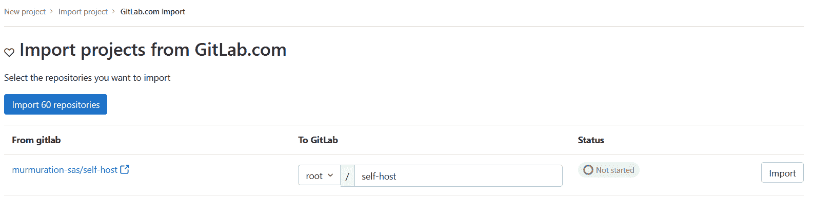

# 从 SaaS git lab 迁移到自托管

> 原文：<https://towardsdatascience.com/migrating-from-gitlab-saas-to-self-hosted-34b99bac0147>

## 使用自动备份部署您自己的 GitLab 实例


茱莉亚·克莱斯在 [Unsplash](https://unsplash.com?utm_source=medium&utm_medium=referral) 上的照片

几个月前， [GitLab 宣布了对免费层](https://about.gitlab.com/blog/2022/03/24/efficient-free-tier/)的修改，包括将私有名称空间限制为 5 个用户。由于我的团队将受到这些变化的影响，我们决定是时候尝试一下自托管了！更新将很快上线，所以我在这里分享一些关于我遵循的步骤的指导，收集和综合我使用的文档。


在本指南中，我将详细介绍如何:

*   使用 Docker 部署自托管 GitLab 实例
*   从 SaaS git lab 迁移到自托管实例
*   迁移 GitLab 容器注册表
*   配置上传到 S3 兼容存储的计划备份

实现相同配置所需的条件:

*   虚拟机实例
*   一个 [DockerHub](https://hub.docker.com/) 帐户(仅迁移您的容器注册中心)
*   具有读写权限的 S3 存储桶(用于存储备份档案)
*   对 Docker 启动 GitLab 服务器的基本了解

# 评估你的需求

第一步是确定部署服务器所需的资源。你可以遵循 GitLab 的需求，这取决于你的用户数量、存储库存储以及容器存储等等。您可以选择将数据直接存储在虚拟机存储上以获得更快的数据传输速度，或者存储在基于云的存储上以获得可扩展性。

# 部署 GitLab

GitLab 的官方文档为自托管服务器提供了多种部署方法。这里我选择了 Docker 方法，因为我熟悉 Docker 部署。其他方法包括 Omnibus 包，或 Kubernetes 集群的 Helm，并且与本指南兼容。



请注意，Docker 部署实际上将 Omnibus 包部署在一个容器中，许多配置选项都是相似的。

## 配置您的虚拟机

如果您正在一台全新的机器上部署，您可能希望首先检查一些先决条件，尤其是对于初学者。

1.  SSH:一些提供商提供带有一组默认用户和密码的机器，更改它以保护您的服务器。你可以创建一个无密码的用户，例如用 ssh 密钥连接(见[本教程](https://docs.oracle.com/en/cloud/cloud-at-customer/occ-get-started/add-ssh-enabled-user.html))。
2.  安装 docker 等工具:[选择适合你操作系统的服务器版本](https://docs.docker.com/engine/install/)。此时，您可能还想安装一个文本编辑器。

## 使用 Docker compose 部署

GitLab 文档提供了一个[Docker 组合配置示例](https://docs.gitlab.com/ee/install/docker.html#install-gitlab-using-docker-compose)。在这里，我分享了我的版本，并做了一些修改，解释如下:

```
version: "3.6"
services:
  web:
    container_name: gitlab
    environment:
      GITLAB_OMNIBUS_CONFIG: |
        external_url 'https://X.X.X.X'
        gitlab_rails['gitlab_shell_ssh_port'] = '2222'
        gitlab_rails['omniauth_providers'] = {
            name: "gitlab",
            app_id: "###",
            app_secret: "###"
          }
        gitlab_rails['backup_keep_time'] = '86400'
        gitlab_rails['backup_upload_connection'] = {
          provider: 'AWS',
          region: '###',
          aws_access_key_id: '###',
          aws_secret_access_key: '###',
          host: '###',
          endpoint: '###',
          path_style: '###',
          aws_signature_version: '2'
        }
        gitlab_rails['backup_upload_remote_directory'] = 'backup/gitlab'
image: gitlab/gitlab-ee:latest
    ports:
      - 2222:22/tcp
      - 443:443/tcp
      - 80:80/tcp
    restart: always
    volumes:
      - $GITLAB_HOME/logs:/var/log/gitlab
      - $GITLAB_HOME/data:/var/opt/gitlab
      - $GITLAB_HOME/config:/etc/gitlab
```

大部分配置在 GITLAB_OMNIBUS_CONFIG 变量中提供，该变量可以包含任何 gitlab.rb 参数。这里我使用了:

*   `gitlab_shell_ssh_port`:映射 GitLab 使用的端口，保持标准的 SSH 端口 22 空闲用于 SSH 连接。与对接器*端口*配置相匹配。
*   `omniauth_providers`:遵循[此配置](https://docs.gitlab.com/ee/integration/gitlab.html)以实现从 GitLab.com 的简单项目导入管理。
*   `backup_*`:上传备份档案到 S3，更多详情见下文备份部分。
*   `volumes`:访问并保存位于容器内的配置和数据目录。注意`$GITLAB_HOME`变量，指定虚拟机本地存储中卷的根文件夹。

要启动，执行以下命令:`docker compose up -d`

## 更新您的服务器

您以后可能需要更改服务器的配置。为此，您可以编辑合成文件，然后删除容器以创建新的容器。

您还可以通过修改`$GITLAB_HOME/config`文件夹中的配置文件将更改应用到当前服务器，并使用以下命令进行更新:`docker exec gitlab gitlab-ctl reconfigure`。这在名为`gitlab`的容器内执行*重新配置*命令。

## 迁移您的项目

现在您的服务器已经准备好，应该在`https://<your-host>/`可用。要连接到`root`用户，您可以在文件`$GITLAB_HOME/config/initial_root_password`中检索密码并登录到您的服务器。现在，您可以开始用您想要迁移的所有数据填充您的服务器。

首先，您可以创建一个新的群组或从您的 GitLab.com 帐户导入现有的群组。请注意，导入组仅检索子组结构，项目将在下一步导入。[此处的](https://docs.gitlab.com/ee/user/group/import/#migrated-group-items)是通过组导入迁移的所有项目的列表。


创建组

然后，您可以前往`create project`页面并选择您的导入方法。



导入项目

如果您配置了`omniauth_providers`选项，您可以访问 GitLab.com 导入页面，轻松地一次导入多个项目，这是推荐的导入大量项目的方法，方法是指定目标组并一次对多个导入进行排队。



从 GitLab.com 进口

请注意，您也可以通过 URL 导入从 GitLab.com 导入项目。在此检查[随着项目导入而迁移的项目列表。](https://docs.gitlab.com/ee/user/group/import/#migrated-project-items)

# 迁移容器注册表

如果您广泛使用 GitLab.com 容器注册中心，将映像迁移到您的自托管实例可能会占用大量空间，可能会超出您的虚拟机的处理能力。我个人选择用一个 [pro 帐户](https://www.docker.com/pricing/)将我的图像迁移到 DockerHub，以获得无限的私有存储库。无论您选择哪种解决方案，您都需要考虑以下几点:

*   图像需要被*推送到*新的容器注册表，
*   如果 CI/CD 管道推/拉映像，您需要更新它们。我建议使用 GitLab 变量来轻松地更改您的注册表 url 和登录名，
*   您需要更新任何与注册表交互的服务:例如，Kubernetes 的*docker-registry*secrets，或者您的服务器和开发人员计算机上的 *docker login* 。

# 配置备份

可靠部署的最后一步是确保您的数据是安全的，并且可以从存储故障中恢复。GitLab 自托管版本提供[内置备份功能](https://docs.gitlab.com/ee/raketasks/backup_gitlab.html)来创建和上传服务器数据的档案。我使用这个功能自动对我的所有存储库进行每日备份，并将存档文件上传到 S3 兼容的存储中。

## 自动化备份

GitLab 提供了一个[内置函数](https://docs.gitlab.com/ee/raketasks/backup_gitlab.html)来创建服务器数据的档案(存储库、构建、工件……)。它还将生成的归档文件上传到 docker-compose 文件中指定的云存储中。我使用了以下配置:

```
gitlab_rails['backup_keep_time'] = 86400
gitlab_rails['backup_upload_connection'] = {
    'provider' => 'AWS',
    'region' => '###',
    'aws_access_key_id' => '###',
    'aws_secret_access_key' => '###',
    'host' => '###',
    'endpoint' => '###',
    'path_style' => '###',
    'aws_signature_version'=> 2
   }
 gitlab_rails['backup_upload_remote_directory'] = 'backup/gitlab'
```

注意:

*   `backup_keep_time`:归档文件在虚拟机上保留的时间(秒)，超过此阈值的归档文件将在下次执行备份时被删除。它不处理上传到云存储上的归档。
*   如果是 S3 兼容的存储，使用带有`endpoint`的`'provider'=>'AWS'`作为您的服务的 url，一些提供商需要[以下版本以兼容](https://docs.gitlab.com/ee/raketasks/backup_gitlab.html#other-s3-providers) `'aws_signature_version'=>2`。

但是 GitLab 内置的备份功能并不备份配置文件，所以这里我分享一下用来备份我的服务器的 bash 脚本。它使用 [MinIO 客户端](https://min.io/docs/minio/linux/reference/minio-mc.html)来保存内置函数中不包含的文件，并删除旧的档案，并假设 S3 兼容存储器的别名为`my-s3`。它只存储当前的配置，并将数据存档长达一周，然后通过邮件通知该脚本的输出。

```
#!/bin/bash

# move old config files
mc mv --recursive my-s3/backup/gitlab/config my-s3/backup/gitlab/old

# copy files to s3
{ mc cp $GITLAB_HOME/config/gitlab-secrets.json my-s3/backup/gitlab/config/gitlab-secrets.json ; \
  mc cp $GITLAB_HOME/config/gitlab.rb my-s3/backup/gitlab/config/gitlab.rb ; \
  mc cp --recursive $GITLAB_HOME/config/ssl my-s3/backup/gitlab/config/ssl ; \
  mc cp --recursive $GITLAB_HOME/config/trusted-certs my-s3/backup/gitlab/config/trusted-certs ; \
} 1> /tmp/mc_logs.txt 2>&1

# auto backup with gitlab
if docker exec gitlab gitlab-backup create skip=builds,artifacts,registry CRON=1 1> /tmp/backup_logs.txt 2>&1
then
  status="Success"
  # remove old files
  echo 'Removing old config files' 
  { mc rm --recursive --force my-s3/backup/gitlab/old ; \
    mc rm --recursive --force my-s3/backup/gitlab/* --older-than 7d ; \
  } 1>> /tmp/mc_logs.txt 2>&1
else
  status="Failed"
fi

cat /tmp/mc_logs.txt | mail -s "GitLab Backup $status" my-mail@company.com -a FROM:backup@gitlab-server -A /tmp/backup_logs.txt
```

请注意:

*   第一步是将当前保存在 S3 上的配置移动到一个`old`文件夹中，而不是在复制失败的情况下覆盖它，
*   mc 步骤在列表中执行[，然后是`1>> /tmp/mc_logs.txt 2>&1`将日志保存在临时文件中，以便稍后在邮件通知中发送。在这里阅读更多关于 UNIX 重定向的信息，](https://unix.stackexchange.com/questions/64736/combine-the-output-of-two-commands-in-bash)
*   您可以从不存在的地址发送邮件通知，但是它可能会以垃圾邮件文件夹结束，尤其是带有附件的邮件。有[多种邮件客户端可供选择](https://linuxhint.com/bash_script_send_email/)，你可以向现有账户认证发件人，或者在收件箱中创建过滤器以防止通知被标记为垃圾邮件(Gmail 的[示例)。](https://support.google.com/mail/answer/6579?hl=fr#zippy=%2Ccr%C3%A9er-un-filtre)

我选择每天早上用下面的 cronjob 作为 CRON 运行这个脚本:`0 7 * * 5 /bin/sh /home/admin/self-host/backup.sh`。点击阅读更多关于 cronjobs [的信息。](https://docs.gitlab.com/ee/raketasks/backup_gitlab.html#configuring-cron-to-make-daily-backups)

## 恢复您的数据

GitLab 在这里提供官方恢复指南[。但是，在执行恢复功能之前，我们需要从 S3 检索文件。以下脚本收集了下载备份文件、停止服务和启动恢复功能的所有步骤。](https://docs.gitlab.com/ee/raketasks/restore_gitlab.html)

```
#!/bin/bash

backup_name=$1_gitlab_backup.tar

# download config files
mc cp my-s3/backup/gitlab/config/gitlab-secrets.json ./config/gitlab-secrets.json
mc cp my-s3/backup/gitlab/config/gitlab.rb ./config/gitlab.rb
mc cp --recursive my-s3/backup/gitlab/config/ssl ./config/ssl
mc cp --recursive my-s3/backup/gitlab/config/trusted-certs ./config/trusted-certs

sudo cp -r ./config $GITLAB_HOME/config
sudo rm -rf ./config# download archive
mc cp my-s3/backup/gitlab/$backup_name $backup_name
sudo mv ./$backup_name $GITLAB_HOME/data/backups/$backup_name# auto backup with gitlab
docker exec -it gitlab gitlab-ctl stop puma
docker exec -it gitlab gitlab-ctl stop sidekiq
docker exec -it gitlab gitlab-ctl status

docker exec -it gitlab gitlab-backup restore --force BACKUP=$1

docker restart gitlab

docker exec -it gitlab gitlab-rake gitlab:check SANITIZE=true
```

用法:`./restore.sh <BACKUP_NAME>`

注意事项:

*   `BACKUP_NAME`是备份归档文件的名称，不带`_gitlab_backup.tar`扩展名。
*   MinIO 将 S3 存储别名存储为依赖于用户的配置。虽然写入我的 GitLab 配置文件夹需要 root 权限，但是运行这个脚本需要 sudo 配置`root`的 MinIO 别名。我宁愿不使用 sudo 执行这个脚本，而是将下载操作分成两部分:首先下载到一个临时文件，然后`sudo`将文件移动到所需的路径。

# 结论

在本教程结束时，您应该能够部署一个具有自动备份功能的 GitLab 自托管服务器。如果容器注册表占用太多空间，您还可以使用外部工具来管理它们，并在存储失败时恢复您的服务器。一旦您迁移了您的项目，您就可以通过在本地克隆您的存储库并邀请服务器上的其他用户来开始使用您的实例。

你在设置你的服务器时有困难吗？你发现其他有用的方法了吗？不要犹豫分享任何反馈和快乐的编码！