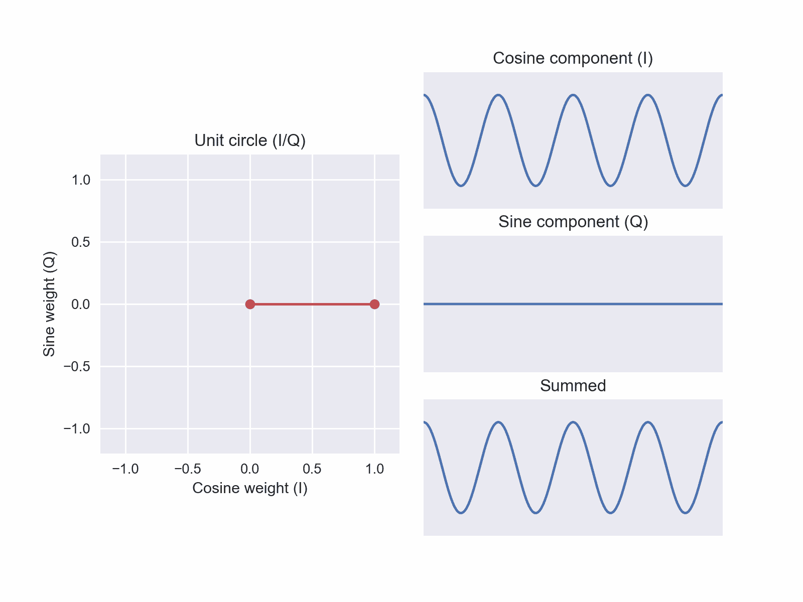
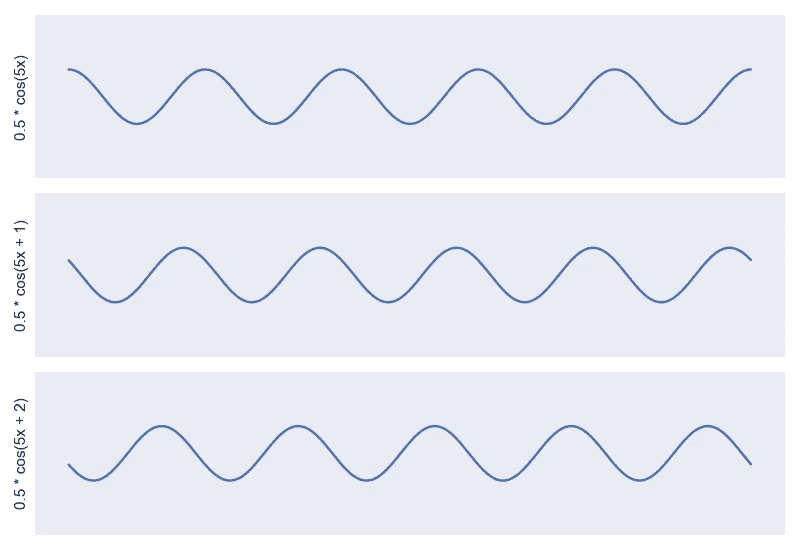
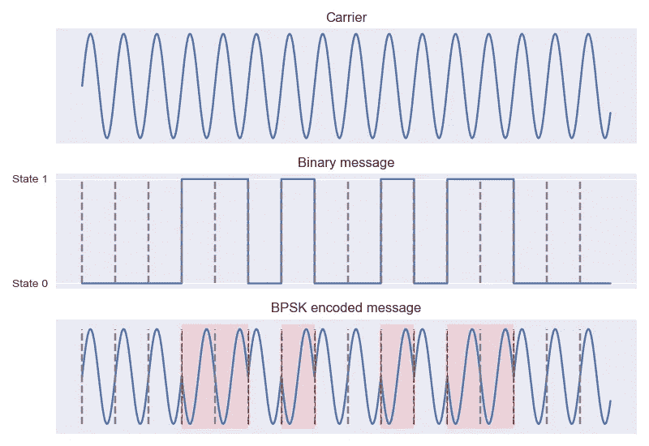
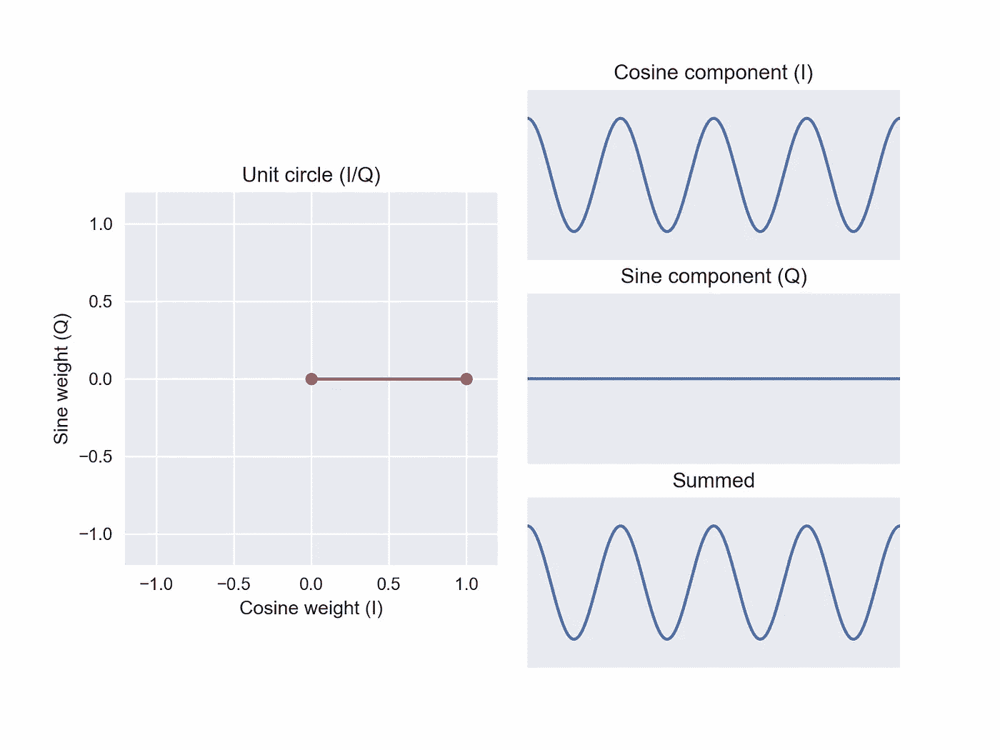
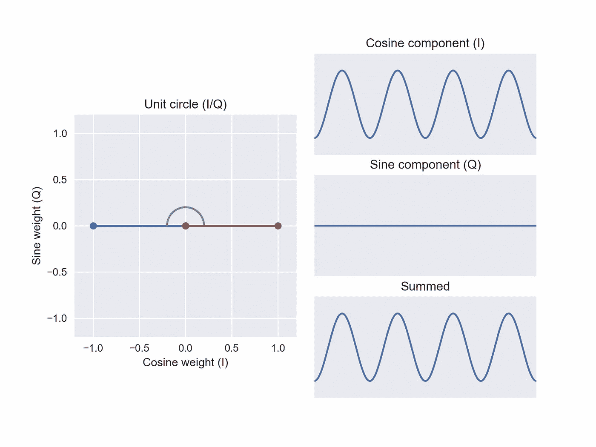
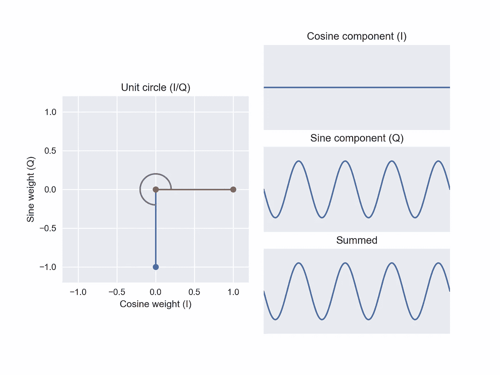

# 注意你的 I 和 Q:I/Q 数据的基础

> 原文：<https://towardsdatascience.com/mind-your-is-and-q-s-the-basics-of-i-q-data-d1f2b0dd81f4>

# 注意你的 I 和 Q:I/Q 数据的基础

## 使用相位调制示例了解同相和正交分量

I/Q 数据出现在许多数据科学设置中:RF(射频)数据、时间序列分析、音频处理等等。

另外，我最喜欢的几何演示之一是将一个角度调制正弦波分解成两个正交的幅度调制正弦波。作为未来的预告片…

图 8:预览图…这就是我们要去的地方！图片作者。

作为激励，我将使用一个无线电示例。从业余无线电到雷达成像，我对所有射频技术都充满热情。在本文中，我们将探讨如何使用“相移键控”在波中编码信息，以及如何使用两个振荡器的和来合成任意所需相位的波。让我们开始吧！

本文中的所有图片都是我创作的。在任何上下文中随意重用，无需注明出处(不保留任何权利)。

图 1:三个相同的正弦波相位偏移。图片作者。

正如在我的另一篇文章的[中更深入的讨论，“相位”描述了正弦波从左到右的移动。给定特定频率的正弦曲线，相位告诉我们振荡在时间或空间中的起始位置。在*图 1* 中，我绘制了三个相同的正弦波，只是相位不同。在 y 轴上，我也包括了生成方程。](/the-fourier-transform-2-understanding-phase-angle-a85ad40a194e)

如果你戴上工程学的帽子，你可能会想“如果我能改变一个东西，我可以用它来编码信息。”的确，你可以！我们可以采用简单的正弦波(即“载波”)并调制(即改变)相位，以将信息传递给接收器。

# 二进制相移键控(BPSK)

BPSK 是通过操纵载波相位来传递信息的最简单的机制。透射波的相位在两种状态之间变化。

**图 2** :二进制序列的简单 BPSK 编码。图片作者。

小菜一碟！在 BPSK 下，我们可以交流两个二元状态。我们只是将每个状态编码为不同的阶段。通常，两个相位状态尽可能相互偏移(180°)。上面(*图 2* )，我已经用 BPSK 方案编码了序列 0，0，0，1，1，0，1，0，0，1，0，1，1，1，0，0，0。

回到工程帽！如果我们可以用两个相位值对两个状态进行编码，那么如果我们使用额外的相位会怎么样呢？如果我们使用*四个*相位值来传输每个比特周期*四个*可能状态之一，以增加我们传输的信息密度，会怎么样？我们可以！这种扩展被称为“正交相移键控”(QPSK)。

不过，这提出了一些实际问题……随着我们继续引入额外的相位要求，我们是否需要引入额外的振荡器？

# 从同相和正交分量合成

相反，让我们想想如何利用简单的构建模块来创建许多不同相位的正弦波。

**图 3** :余弦和正弦参考图像。图片作者。

在我的无线电工具包中，我有很多方法可以从余弦波产生正弦波。例如，如果我有一个产生纯余弦的电子振荡器，我可以添加一个简单的功率分配器和一个延迟线来产生正弦。余弦和正弦只是彼此偏移 90°的相移。从另一个产生一个在硬件上很简单:我只需要一个时间延迟来转换信号。

不过，现在我同时使用了这两种方法，继续称它们为“余弦”和“正弦”可能会有点令人困惑。由于它们只是彼此的相移，如果我在未来的任意时间点开始测量信号，我的“余弦”可能看起来像正弦，我的“正弦”可能看起来像余弦！相反，让我们用余弦作为参考，称之为“同相”我们称正弦为“正交”分量。太棒了。我从一个阶段开始，现在只使用一个功率分配器和一个可调延迟线就有两个阶段了。

我的“同相”和“正交”分量似乎有一些有趣的特性。如果我把余弦信号和正弦信号相乘，然后求和，结果是零。更正式地说同样的事情，如果我取这两个函数乘积的积分，我的结果是零。这种特性被称为“正交性”它们的相关性为零！这是一个极好的消息，因为它使得建立坐标空间变得容易。如果我将同相度放在 x 轴上，将正交度放在 y 轴上，我知道它们是不相关的，因此沿一个轴增加不会影响另一个轴上的值。

**图 4** :纯余弦的 I/Q 空间。作者图片

让我们画出这个同相，正交空间。在 x 轴上，我们画出我们想要多少余弦(即余弦函数上的“同相”权重)。在 y 轴上，我们画出我们想要多少正弦(即正弦函数上的“正交”权重)。我们可以将两个加权分量和加权和可视化(*图 4* )。我们称这个新空间为 I/Q，用来描述两个轴:(i)n 相位和(Q)u 相位

用蓝色，我用一条到原点的线画出了坐标同相权重 1，正交权重 0。到原点的距离是 1: √(1 + 0)。不出所料，当正弦权重为零时，我们的加权和正好是余弦！

**图 5** :纯正弦的 I/Q 空间。图片作者。

让我们移动到坐标同相 0，正交权重 1 ( *图 5* )。这是从我们之前的位置(红线)旋转 90 度。同相权重为零时，我们只能得到正弦波。我们开始看到一些有趣的东西…在这个坐标中旋转 90 °,在我们的加权和中产生 90°的相位。以前是余弦，现在是正弦。我们空间的几何编码了这个属性。非常酷！

我们也可以在坐标轴上移动到负值。围绕 y 轴有效翻转(即反转)我们的余弦或正弦分量。

**图 6** :反余弦的 I/Q 空间。图片作者。

跳到坐标同相权重-1，正交权重 0 ( *图 6* )，我们把原来的余弦分量反过来！同样，如果我们回头看看原始余弦基准电压，这个翻转相当于第一个加权和的 180°相位偏移。这也是我们在这一领域构建的第一个“新”阶段。通过混合使用 I 和 Q 基函数，我们构建了一个前所未有的正弦相位。

**图 7** :反正弦的 I/Q 空间。图片作者。

最后，完成空间直觉，我们在坐标同相权重 0，正交权重-1 处反转我们的原始正弦函数(*图 7* )。这是我们的第二个“新”阶段:一个我们以前没有的阶段的信号。同样，加权和与我们首先考察的纯余弦值有 270°相位偏移。在我们看到的每个位置，角度(绿色)反映了应用于加权和的相位偏移。

只要我们可以任意混合这两种成分，似乎我们可以生成任何我们想要的相位！我们希望保持我们到原点的距离不变(这里是单位长度)，以确保我们不改变总功率(即幅度，更多内容见[我的其他文章](/the-fourier-transform-3-magnitude-and-phase-encoding-in-complex-data-8184e2ef75f0))，但是当我们扫过两个分量的权重时，我们可以合成任何我们想要的相位的正弦曲线。这太棒了。从单个振荡器开始，添加一个功率分配器和一个延迟线，现在引入一个混频器，我们可以组成任何相位的正弦波，频率和幅度保持不变。

我们有所有我们需要的直觉！现在我们可以重温我们最初的视觉化。

**图 8** :将一个角度调制正弦波分解成两个正交的幅度调制正弦波。作者图。

如果这不是一个令人满意的几何结果，我不知道什么是。这是催眠*和*有用。下次你在数据科学项目中遇到 I/Q 值时，我希望它们看起来不那么吓人！

如果你希望看到其他概念的解释，请留下评论。感谢阅读！