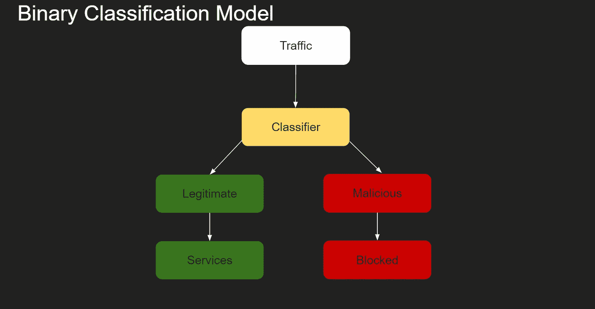
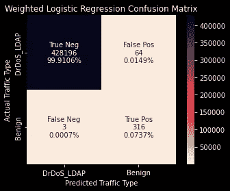
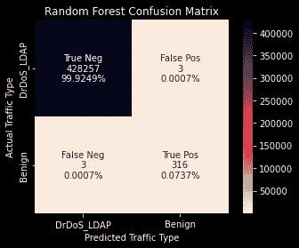
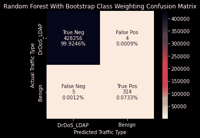
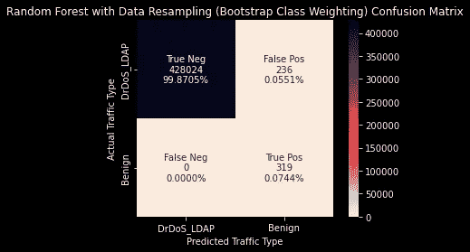
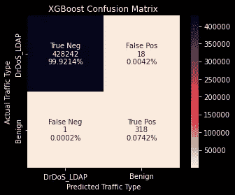
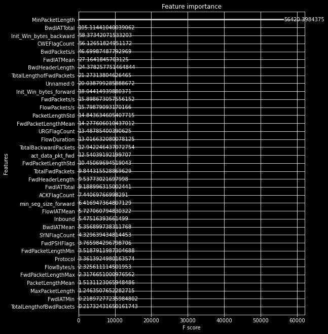
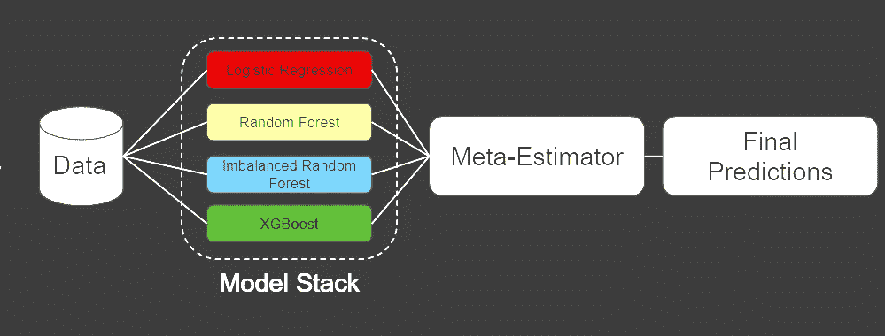
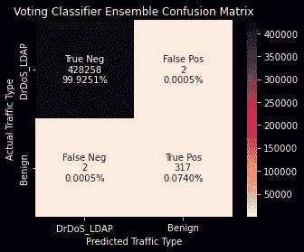
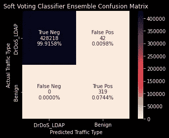

# 利用分类模型减轻 DDoS 攻击

> 原文：<https://towardsdatascience.com/mitigating-ddos-attacks-with-classification-models-aa75ea813d85>

## 使用 Dask、XGBoost 和 Stacked Ensembling 抵御无处不在的网络攻击


由 [Unsplash](https://unsplash.com?utm_source=medium&utm_medium=referral) 上的 [Kvistholt 摄影](https://unsplash.com/@freeche?utm_source=medium&utm_medium=referral)拍摄

[GitHub 回购 ](https://github.com/NateDiR/DDoS_traffic_classification)

[*演示文稿 PDF*](https://github.com/NateDiR/DDoS_traffic_classification/blob/main/DDoS%20Classification%20Presentation.pdf)

Metis 的数据科学和机器学习训练营的模块#4 已正式结束！本模块重点关注**分类**，这是**监督学习**的一个子集。在我们的期末项目中，我们被要求找出一个可以用分类方法解决的问题，并评估用我们制作的分类模型解决这个问题的可行性。

对于我的项目，我选择关注组织面临的一个越来越常见的问题:**分布式拒绝服务(DDoS)攻击。**我想构建一个解决方案，让组织能够识别恶意流量和合法流量，并防御 DDoS 攻击。

这个项目是一次宝贵的经历，原因有几个。如果我想使用我选择的数据集，它迫使我熟悉 Dask、RAPIDS/cuML 和 XGBoost 的 GPU 支持等新工具。在此之前，我也没有从纯预测能力的角度处理过建模问题，并且发现在追求更好性能的过程中进行调优和迭代是令人愉快的。最后，我正在处理的数据很难理解。我在一定程度上了解网络安全，但肯定没有到了解原始流量日志的程度。使用这样一个外来数据集并从中获得洞见，这本身就是一个有益的挑战。因为我在这篇文章中学到了很多，我希望其他人也能从这篇文章中学到东西。让我们开始吧！

# 基本原理

## 什么是 DDoS 攻击？

分布式拒绝服务(DDoS)攻击是一种常见的、几乎无处不在的网络攻击形式。其目的是通过用垃圾流量淹没目标周围的网络、互联网连接服务或技术基础设施来破坏组织的运营。定向到目标的流量会严重限制可用性，或者使其完全离线。

DDoS 攻击之所以有效，部分原因是它们利用了已经被恶意软件入侵的互联网连接设备。攻击者利用数十、数百、数千甚至数百万台设备中已经存在的漏洞来获得远程控制。这些“僵尸”设备(或“僵尸”)然后被编排成一个“僵尸网络”，并被攻击者导向目标服务。这个远程编排过程就是分布式拒绝服务的“分布式”部分。随着联网家用物品的激增，如冰箱、T2 恒温器和 T3，攻击者有了更多加密较弱的设备来参与他们的攻击。


照片由[迈克尔·泽兹奇](https://unsplash.com/@lazycreekimages?utm_source=medium&utm_medium=referral)在 [Unsplash](https://unsplash.com?utm_source=medium&utm_medium=referral) 上拍摄

## 为什么 DDoS 攻击是一个值得解决的问题？

DDoS 攻击是一个值得优先考虑的问题，原因有很多。它们是最常见的网络攻击形式之一，因为发起和维护它们相对便宜——一项估计发现，在黑暗网络上维持一次中等规模的 DDoS 攻击一个月的成本是 311 美元。

此外,[民族国家](https://www.theregister.com/2022/02/23/ukraine_ddos_russia_malware/)、[黑客组织](https://venturebeat.com/2022/02/25/hacking-groups-launching-cyber-proxy-war-over-ukraine-attacks-by-russia/)和[网络罪犯](https://www.darkreading.com/threat-intelligence/aggressive-blackcat-ransomware-on-the-rise)采用 DDoS 攻击的原因从政治、意识形态、金融到“因为我能”。攻击的矛头直指互联网巨头，如谷歌、亚马逊、金融机构、游戏公司、联邦机构、媒体和非营利机构。

就 DDoS 攻击可能造成的损失而言，很难量化。但是，组织必须考虑各种后果的成本，例如:

*   延长服务停机时间
*   员工的生产力限制
*   数据泄露
*   名誉损害
*   搜索引擎优化排名的损失
*   基于赎金/勒索的袭击

2017 年卡巴斯基调查发现，中小型企业忍受 DDoS 攻击的成本为 12 万美元。对于企业级组织来说，这个数字上升到 100 万美元 2M .此外， [2018 年的一项研究](https://www.a10networks.com/blog/this-is-how-much-time-and-money-ddos-attack-will-cost-you/)估计大型组织的停机成本在 30 万美元到 54 万美元之间。一份 [2020 年 IBM 报告](https://www.ibm.com/security/digital-assets/cost-data-breach-report/#/)发现，数据泄露的全球平均成本为 386 万美元，而美国的平均成本为惊人的 846 万美元

可以说，DDoS 攻击对各种各样的组织来说是一种无处不在的威胁。它们成本极高，对运营具有破坏性，并有可能造成长期损害。组织的 IT 安全团队不仅应在战术层面关注这一问题，主管人员也应考虑 DDoS 攻击对其组织构成的战略威胁，并考虑他们有什么工具来防范这些攻击。


由 [Lars Kienle](https://unsplash.com/@larskienle?utm_source=medium&utm_medium=referral) 在 [Unsplash](https://unsplash.com?utm_source=medium&utm_medium=referral) 上拍摄

# 辖域

## 项目目标

考虑到我们希望解决的问题，我对这个项目的目标如下:构建一个二进制分类模型，通过正确识别合法/良性流量和恶意流量来减轻 DDoS 攻击对组织运营的影响。如果流量是合法的，它将被传递给某个组织的服务。如果是恶意的，就会被屏蔽。这将确保真实用户的服务可用性，并防止上述 DDoS 攻击造成的损害。



交通警察分类模型。图片作者。

## 成功指标

在业务方面，我们的成功指标有两个方面:

1.  将模型将合法流量误识别为恶意流量的比率降至最低(理想情况下为 0，否则我们将为其执行攻击任务！)
2.  通过以 90%或更高的正确识别率来减轻 DDoS 攻击的影响(我们愿意接受服务性能的微小降低，只要它们保持在线并且合法流量不被阻止)。

从统计角度来看，我们的成功指标如下:

1.  **回忆**:尽可能接近 1.0
2.  **精度**:大于等于. 9
3.  **F2** :由于我们对召回率的加权比对精确度的加权更重要，我们将使用 F2 分数作为告知模型选择的北极星度量。

## 数据

这个项目的数据集是在得到位于新不伦瑞克大学的[加拿大网络安全研究所](https://www.unb.ca/cic/datasets/ddos-2019.html)的许可后使用的。该研究所提供的 DDoS 评估数据集包含各种 DDoS 攻击类型的最新数据。出于这个项目的目的，我们主要关注一种类型:DrDoS_LDAP。这个特殊的数据集包含了 210 万个以上的**观察值、**和 **80 多个特征**。它还严重偏向恶意流量，99.7%的观察结果被标记为恶意，而只有 0.03%被标记为良性。这显然在建模过程中提出了一些挑战，但它符合我们在现实世界场景中预期看到的情况——DDoS 攻击通过将大量垃圾流量定向到目标来工作，因此与少量良性日志相比，数百万条恶意日志对于组织在攻击期间预期会看到的情况是有意义的。

该数据集是由 CIC 在内部测试平台上创建的，这意味着它是在受控环境中发生的模拟攻击。良性背景流量也被自动化。从原始数据中提取特征[。PCAP 文件](https://en.wikipedia.org/wiki/Pcap)是使用 CIC 内部开发的工具[CIC 流量计](https://www.unb.ca/cic/research/applications.html)完成的。所有的感谢和赞扬都应归功于 UNB/加拿大公民和移民部的学生和工作人员，他们使得这个数据集可以公开使用。

# 代码、建模和结果

[*代码*](https://github.com/NateDiR/DDoS_traffic_classification/blob/main/final_script.ipynb)

## 数据争论

就清理这个数据集而言，没有大量的工作需要做。我在处理这些数据时面临的最大障碍是它的庞大规模！

我第一次尝试在我的 Macbook 上把这些数据读入 Pandas，结果崩溃了，所以我转到了我的 PC 上。它有 32 GB 的内存，16 核英特尔 9900K CPU 和 NVIDIA 2080ti GPU。当我试图加载这个数据集时，它蓝屏了。

接下来是一个漫长而有启发性的兔子洞之旅，讲述了熊猫对单个 CPU 内核的限制，以及如何解决这个问题。输入<https://dask.org/>****。** Dask 允许您在多个 CPU 内核上并行化流行的 Python 库，如 NumPy、Pandas 和 scikit-learn。它将工作负载“分块”成更小的块，将它们传递给不同的 CPU 内核并行执行工作，重新组合结果，并以预期的格式返回。下面是我如何使用 Dask 将这个数据集读入熊猫:**

```
**from** dask **import** dataframe **as** ddddf **=** dd**.**read_csv(r"FILEPATH", dtype**=**{'SimillarHTTP': 'object'},blocksize**=**'64MB')df **=** ddf**.**compute()
```

**就这么简单！**

**读入数据帧后，我必须清理列名:**

```
df**.**columns **=** df**.**columns**.**str**.**replace(' ', '')
```

**删除所有在现实世界中不相关的功能:**

```
df**.**drop(columns**=**['FlowID', 'SourceIP', 'DestinationIP', 'Timestamp', 'SimillarHTTP', 'SourcePort', 'DestinationPort'], inplace**=True**)
```

**去掉任何 NaN 或 Infinity 值:**

```
pd**.**options**.**mode**.**use_inf_as_na **=** **True**df**.**dropna(inplace**=True**)
```

**并将标签编码:**

```
labels **=** pd**.**get_dummies(df['Label'])
```

## **建模**

**清理完数据集后，我准备开始评估模型。因为数据集是不平衡的，所以在进行训练/测试分割时，我很注意分层。这确保了相同比例的观察值出现在每个数据分割中。**

```
X **=** df**.**drop(columns**=**["Label"], axis**=**1)
y **=** labels**.**BENIGNX_train_val, X_test, y_train_val, y_test **=** train_test_split(X, y, test_size **=** .2, stratify**=**y, random_state**=**1)X_train, X_val, y_train, y_val **=** train_test_split(X_train_val, y_train_val, test_size**=**.25, stratify**=**y_train_val, random_state**=**1)
```

**由于数据集如此之大，我很快了解到拟合模型是一项耗时的工作。幸运的是，Dask 在这里也掩护了我！**

```
**import** joblib
**from** dask.distributed **import** Client

client **=** Client(processes**=False**)
```

**[**Joblib**](https://joblib.readthedocs.io/en/latest/) 是 Python 的流水线库，提供了一些并行化能力。scikit-learn 构建在 joblib 之上。可以传递给许多 scikit-learn 模型的 n_jobs 关键字参数由 joblib 支持。**

**Dask 与 joblib 完美集成，可用于为 scikit-learn 模型提供另一个 joblib 后端:**

```
**with** joblib**.**parallel_backend("dask"):
    lr**.**fit(X_train_scaled, y_train)
```

**这在本地机器上提供了额外的并行化能力，或者扩展到基于云的计算集群的能力(如果您有这种能力的话)。**

**我使用逻辑回归模型作为起点，并使用初始结果来通知进一步的迭代:**

```
y_val_preds **=** lr2**.**predict(X_val_scaled)print("Precision: {}, Recall: {}, F2 Score: {}"**.**format(precision_score(y_val, y_val_preds), recall_score(y_val, y_val_preds), fbeta_score(y_val, y_val_preds, beta**=**2.0)))group_names **=** ['True Neg', 'False Pos', 'False Neg', 'True Pos']group_counts **=** ["{0:0.0f}"**.**format(value) **for** value **in** lr_confusion**.**flatten()]group_percentages **=** ["{0:0.4%}"**.**format(value) **for** value **in** lr_confusion**.**flatten()**/**np**.**sum(lr_confusion)]labels **=** [f"{v1}\n{v2}\n{v3}" **for** v1, v2, v3 **in** zip(group_names,group_counts,group_percentages)]labels **=** np**.**asarray(labels)**.**reshape(2,2)sns**.**heatmap(lr_confusion,cmap**=**'rocket_r', annot**=**labels, fmt**=**'', square**=True**, xticklabels**=**['DrDoS_LDAP', 'Benign'], yticklabels**=**['DrDoS_LDAP', 'Benign'])plt**.**xlabel('Predicted Traffic Type')plt**.**ylabel('Actual Traffic Type')plt**.**title('Logistic Regression Confusion Matrix');
```

## **基线逻辑回归**

****

**图片作者。**

*   ****F2: .921****
*   ****召回:. 921****
*   ****精度:. 918****

**第一次通过还不错。**

**因为我想考虑类的不平衡，所以我尝试将“balanced”传递给 class_weights 参数，作为逻辑回归的第二次迭代。这使得我们的标签中存在的类的相对权重与该类中的观察数量成反比(在本例中，恶意类的权重为 0.03，良性类的权重为 0.97)。这有效地惩罚了模型在少数类(良性)上的错误，比在多数类(恶意)上的错误更严重。混淆矩阵结果证实了这一点:**

## **加权逻辑回归**

****

**图片作者。**

****F2: .954****

****回忆:. 990****

****精度:. 831****

**这两个模型让我对逻辑回归在这个问题上的表现有了很好的理解。虽然对参数进行更多的调整可能会得到更好的结果，但我也想评估不同方法的可行性。**

## **基线随机森林**

```
**with** joblib**.**parallel_backend("dask"):
    rf**.**fit(X_train, y_train)
```

****

**图片作者。**

****F2: .990****

****回忆:. 990****

****精度:. 990****

**在没有任何参数调整的情况下，随机森林在这个问题上表现得非常好！因此，我进行了一些额外的迭代，探索处理数据中类别不平衡的不同方法，以及这将如何影响随机森林结果。我尝试了平衡类权重，在引导级别平衡类权重，并使用[不平衡学习](https://imbalanced-learn.org/stable/)包对大多数(恶意)类进行欠采样。这些方法要么根本没有多大作用，要么提高了模型正确识别良性流量的速度，同时严重阻碍了其识别恶意流量的能力:**

## **具有引导类权重的随机森林**

****

**图片作者。**

****F2 .984****

****召回:. 984****

****精度:. 987****

**与基线相差不大。**

## ****带数据重采样的随机森林(不平衡学习)****

****

**图片作者。**

****F2: .871****

****召回:1.0****

****精度:. 574****

**对良性流量表现完美，对恶意流量表现不佳。值得归档。**

**因为随机森林表现如此之好，我想尝试的下一个方法是梯度增强树。梯度增强通常可以超越现成的随机森林，在 [XGBoost](https://xgboost.readthedocs.io/en/stable/) 库中找到的梯度增强实现是许多数据科学家的最爱。**

**XGBoost 还有一个额外的好处，就是对 [GPU 的支持](https://xgboost.readthedocs.io/en/stable/gpu/index.html)。图形处理单元(GPU)主要用于玩 PC 游戏，但因为它们旨在以高帧速率实时渲染复杂的三维空间，GPU 非常适合计算密集型过程，如在大型数据集上拟合机器学习模型。NVIDIA 开发了一整套软件库，用于完全在 GPU 上执行数据科学和分析管道，称为 [RAPIDS](https://developer.nvidia.com/rapids) 。据我所知，RAPIDS 目前只能在 Linux/Ubuntu 机器上使用，但是有一些方法可以让 T4 在 Windows 上运行。然而，对于这个项目，我并没有陷入那个兔子洞，很高兴 XGBoost 中有原生 GPU 支持，这将我的模型拟合时间从使用 scikit-learn 的 Random Forest 的大约 8 分钟减少到使用 XGBoost 的 20 秒。**

```
gbm **=** xgb**.**XGBClassifier(
                        n_estimators**=**100000,
                        max_depth**=**6,
                        objective**=**"binary:logistic",
                        learning_rate**=**.1,
                        subsample**=**1,
                        scale_pos_weight**=**99,
                        min_child_weight**=**1,
                        colsample_bytree**=**1,
                        tree_method**=**'gpu_hist',
                        use_label_encoder**=False**
                        )eval_set**=**[(X_train,y_train),(X_val,y_val)] 
fit_model **=** gbm**.**fit( 
                    X_train, y_train, 
                    eval_set**=**eval_set,
                    eval_metric**=**'auc',
                    early_stopping_rounds**=**20,
                    verbose**=True** 
                   )
```

## **基线 XGBoost**

****

**图片作者。**

****F2: .986****

****回忆:. 996****

****精度:. 946****

**除了 XGBoost 模型的出色速度之外，开箱即用的结果也同样出色。以至于随后重新调整参数的迭代几乎没有改变结果。**

**作为一个额外的好处，XGBoost 还为我们提供了相对容易地绘制特性重要性的能力:**

```
fig,ax2 **=** plt**.**subplots(figsize**=**(8,11))
xgb**.**plot_importance(gbm, importance_type**=**'gain', ax**=**ax2)
```

**当 importance_type 设置为 gain 时，将输出每个要素在信息增益方面的重要性，即当给定要素位于其子集中时，模型获得了多少预测能力。如您所见， **MinPacketLength** 特性具有极高的重要性:**

****

**图片作者。**

**肯定是值得进一步探索的东西，但是可解释性不是这个项目的目标，所以我们就此打住。**

## **组装**

**我尝试的三种方法都表现得很好，但是它们都没有得到我想要的结果。为了从我的模型中挤出一点点预测能力，我转向了**集成。****

**集合获取我已经创建的模型的输出，并使用它们进行最终预测**

****

**图片作者。**

**集合有三种风格:**硬投票**、**软投票**和**堆叠。****

## **硬投票集合**

```
model_names **=** ["lr2", "rf", "imb_rf3", "gbm"]

model_vars **=** [eval(n) **for** n **in** model_names]
model_list **=** list(zip(model_names, model_vars))voting_classifier **=** VotingClassifier(estimators**=**model_list,
                                    voting**=**'hard',
                                    n_jobs**=-**1)
```

**硬投票是指每个模型对输入的数据进行二进制分类，集合模型对投票进行统计并输出最终结果。以下是硬投票组合的表现:**

****

**图片作者。**

****F2: .993****

****回忆:. 993****

****精度:. 993****

## **软投票集合**

```
soft_voting_classifier **=** VotingClassifier(estimators**=**model_list,
                                    voting**=**'soft',
                                    n_jobs**=-**1)
```

**软投票是指每个模型输出恶意/良性分类的概率。然后，集合模型汇总这些概率，并根据哪个概率高做出最终预测。以下是软投票组合的表现:**

****

**图片作者。**

**F2: .974**

**召回:1.0**

**精度:. 883**

## **堆叠系综**

```
stacked **=** StackingClassifier(estimators**=**model_list, n_jobs**=-**1)
```

**堆叠集成是指每个模型的输出被用作元分类器中的特征。在 scikit-learn 中默认情况下，元分类器是逻辑回归，但它可以是您选择的任何方法。堆叠集成利用了所有模型的智慧，并输出最终的预测。最好给出一个堆叠的分类器模型来“覆盖”彼此的弱点，而不是为了获得最佳结果而相互对抗。堆叠是一种非常强大的集合方法，但也是非常计算密集型的。即使使用 Dask 进行并行化，这个模型也需要大约 60 分钟才能在我的台式机上安装 16 核英特尔 9900K CPU @ 5.0 GHz。然而，结果是值得的:**

****

**图片作者。**

****F2: 1.0****

****召回:1.0****

****精度:1.0****

**没有比这更好的了。堆叠集成分类器胜出。让我们看看它在最终维持集上的表现如何:**

****

**图片作者。**

**虽然不完美，但仍然是经过测试的最佳模型，也是我们提出的解决方案的最终选择。**

# **结论**

**总结一下这个项目的主要收获:**

1.  **分类被证明是解决这一问题的可行方案。**
2.  **Random Forest 和 XGBoost 开箱即用性能都很好。**
3.  **具有逻辑回归、随机森林和 XGBoost 的堆叠集成总体表现最佳。**
4.  **MinPacketLength 特性值得进一步分析和理解。**

# **解决方案验证**

**实际考虑如何验证您提议的解决方案始终是最佳实践。在这种情况下，很难说。我们的数据集是在一个受控的环境中创建的，因此我们预计真实世界的数据会更加混乱。但是，除了在 DDoS 攻击期间将其投入生产之外，我们如何在真实世界的数据上测试这个模型呢？**

**首先，我们可以在正常情况下测试它，看看它在识别常规合法流量方面表现如何。我们还可以对合成攻击进行测试，就像数据集是如何创建的一样。我们还可以根据供应商解决方案(如 Cloudflare、Akamai)对模型进行基准测试，最后一步是实际部署模型并评估其在攻击期间的性能。**

****

**照片由[this engineering RAEng](https://unsplash.com/@thisisengineering?utm_source=medium&utm_medium=referral)在 [Unsplash](https://unsplash.com?utm_source=medium&utm_medium=referral) 上拍摄**

# **进一步的工作**

**与所有项目一样，这里也有需要改进和进一步迭代的地方。首先，这个项目只研究了一种类型的 DDoS 攻击。有许多种攻击(CIC 有许多攻击的数据集)具有不同的流量特征。添加更多类型的恶意数据并评估性能将是值得的，并可能使模型对现实世界的场景更加健壮。**

**第二个需要改进的地方是模型本身。我想从一开始就尝试集成，所以我没有尽可能多的时间来调优超参数。使用 GridSearchCV 来优化我的模型可能会将性能提升到不需要集成的程度。此外，我可以尝试不同的数据重采样方法，比如使用不平衡学习包进行过采样，或者尝试不同的分类方法，比如朴素贝叶斯。**

**第三个需要改进的地方是减少代码运行时间。总的来说，运行这个笔记本需要大约 90 分钟，我有兴趣探索简化它的可能性，无论是通过额外的计算资源，巧妙的代码操作，还是减少数据集中的维数。**

# **结束语**

**希望您喜欢学习 DDoS 攻击，以及如何使用各种分类方法和 Python 库来解决这个问题！我非常喜欢这个项目，并且对结果非常满意。如果你有任何问题或意见，请留言！**