# 米托:JupyterLab 扩展，无需代码即可轻松操作数据

> 原文：<https://towardsdatascience.com/mito-a-jupiterlab-extension-for-easy-data-manipulation-with-no-code-57a54a34e65e>

## 操纵新冠肺炎疫苗数据的交互式软件包概述


Marc-Olivier Jodoin 在 [Unsplash](https://unsplash.com/photos/NqOInJ-ttqM) 上拍摄的照片

如果您在 Python 中处理过真实数据，您肯定会注意到数据操作和数据清理会占用您大部分时间，甚至高达 70%的时间。当我开始我的数据科学之旅时，我依赖 Pandas 上的这些类型的任务，Pandas 是一个强大而完整的库，可以处理您的数据集。

突然，我发现了米托，这是一个 JupiterLab 扩展，可以通过交互式电子表格自动化和加速数据工程，其中许多枯燥的操作都得到了简化，如导入数据集，应用过滤器，创建透视，删除重复项。

这个工具的美妙之处在于你不需要写任何一行代码。您可以像在 excel 中一样手动执行操作，但不同的是，这些操作一旦被应用，就会被翻译成下面的 Python 代码。在这篇文章中，我将通过一个真实的例子——来自约翰·霍普金斯大学的新冠肺炎疫苗数据——来概述米托。

# 先决条件

[米托](https://docs.trymito.io/)本质上是一个电子表格界面，只要你编辑和可视化数据集，它就会生成 Python。在安装米托之前，你需要检查你是否已经安装了 **Python 3.6** 或者更新的版本以及 **JupiterLab 环境**，因为米托是一个 JupiterLab 扩展。

一旦满足了这些先决条件，您就可以在浏览器上打开 JupiterLab 并创建一个新的终端，您可以在其中复制以下命令:

```
python -m pip install mitoinstaller 
python -m mitoinstaller install
```

在你必须重启内核之后，你就可以开始使用这个神奇的 Python 包了！为了确保米托运行良好，创建一个新的笔记本并复制这两行代码:

```
import mitosheet
mitosheet.sheet()
```

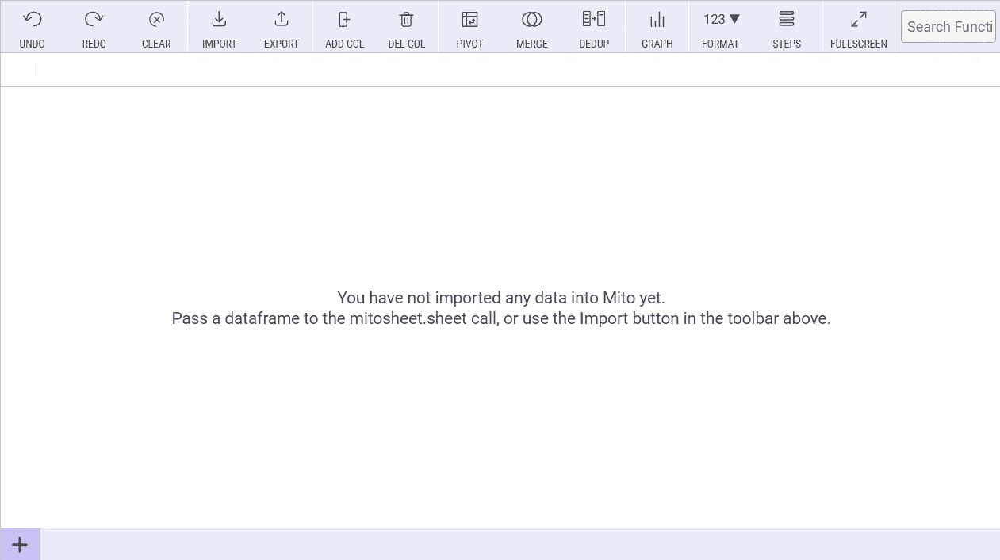

作者插图

当您运行这些代码行时，您应该在注册后获得这样的输出。

# 米托概况

让我们从导入两个数据集开始，[time _ series _ covid 19 _ vaccine _ global . CSV](https://raw.githubusercontent.com/govex/COVID-19/master/data_tables/vaccine_data/global_data/time_series_covid19_vaccine_global.csv)和[world _ pop _ by _ country . CSV](https://github.com/govex/COVID-19/blob/master/data_tables/world_pop_by_country.csv)，这两个数据集可在 GitHub 存储库中获得，GitHub 存储库由约翰·霍普金斯公民影响中心为冠状病毒资源中心(CRC)创建[1]。一旦加载了两个数据集，相应的 Python 代码就会神奇地出现:

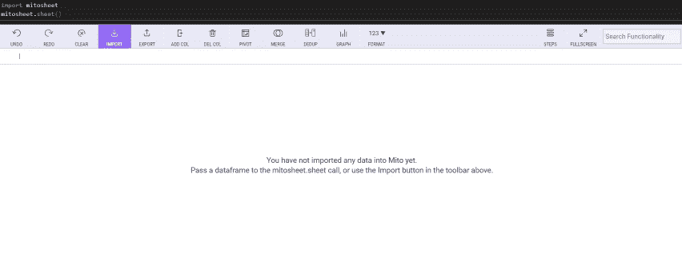

作者 GIF

正如您可以在上面的输出中看到的，有一个菜单栏允许许多功能。最重要的行动是:

*   `import`从文件系统加载数据集
*   `add/delete`列
*   `undo`到**到**删除最后编辑的数据集
*   `pivot`哪一项对分组和汇总数据有用
*   `merge`两张桌子
*   `dedup`删除表格内的重复项
*   `graph`生成绘图
*   `steps`可视化对数据集执行的操作的时序

稍后将显示的其他选项是位于右上角的**搜索栏**，在这里您可以查找其他功能，如米托的文档。此外，每一列都有一个**过滤器图标**，它允许改变类型、编辑格式、排序，当然还有过滤。

在这篇文章中，我将重点介绍以下操作:

1.  **更改数据类型、排序和过滤**
2.  [**添加和删除列**](#d2a6)
3.  [**合并表格**](#d5d2)
4.  [**透视表**](#103b)
5.  [**可视化剧情**](#a4df)

# 1.**更改数据类型、排序和过滤**

第一部分关注过滤器图标允许的三种操作。首先，我展示了一个最让我恶心的操作，那就是当我需要更改日期列的数据类型时。米托允许快速完成:

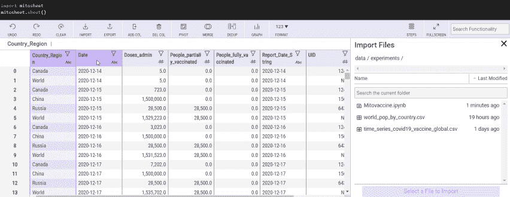

作者插图

还可以通过按**降序**排列日期来查看最新结果。

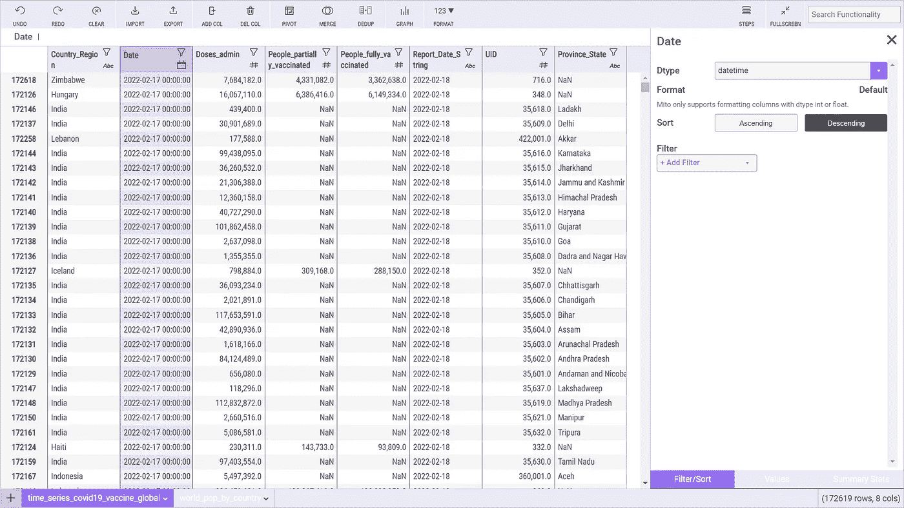

作者插图

我们还可以在 Country_Region 列上添加一些**过滤器**。很难同时分析很多国家，我更愿意关注一个较小的子集:

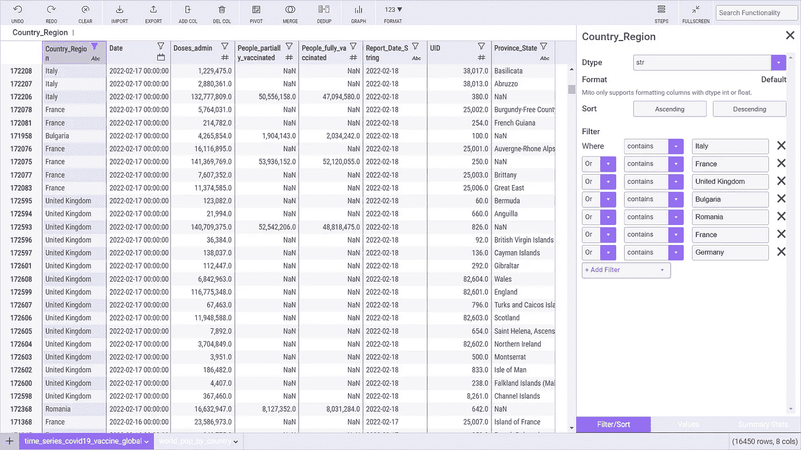

作者插图

在所有这些操作之后，出现以下代码行:

```
# Sorted Date in time_series_covid19_vaccine_global in descending order
time_series_covid19_vaccine_global = time_series_covid19_vaccine_global.sort_values(by='Date', ascending=False, na_position='last')# Changed Date from object to datetime
import pandas as pd
time_series_covid19_vaccine_global['Date'] = pd.to_datetime(time_series_covid19_vaccine_global['Date'], infer_datetime_format=True, errors='coerce')# Changed Date from datetime64[ns] to datetime
time_series_covid19_vaccine_global['Date'] = time_series_covid19_vaccine_global['Date']# Sorted Date in time_series_covid19_vaccine_global in descending order
time_series_covid19_vaccine_global = time_series_covid19_vaccine_global.sort_values(by='Date', ascending=False, na_position='last')# Sorted Date in time_series_covid19_vaccine_global in descending order
time_series_covid19_vaccine_global = time_series_covid19_vaccine_global.sort_values(by='Date', ascending=False, na_position='last')# Filtered Country_Region in time_series_covid19_vaccine_global
time_series_covid19_vaccine_global = time_series_covid19_vaccine_global[time_series_covid19_vaccine_global['Country_Region'].apply(lambda val: any(s in val for s in ['Italy', 'France', 'United Kingdom', 'Bulgaria', 'Romania', 'France', 'Germany']))]
```

用米托完成这些操作可以节省很多时间，你不觉得吗？注释沿着 Python 行出现也很好。

# 2.添加和删除列

另一个重要的操作是创建/删除列。删除字段非常简单:你只需要选择列，然后点击菜单栏上的“删除列”。

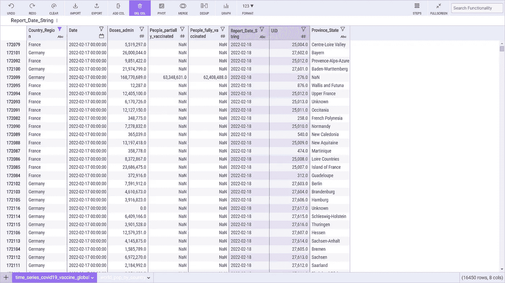

作者插图

我们还可以基于日期字段 Year 创建一个新列，这对于以后的深入了解很有用:

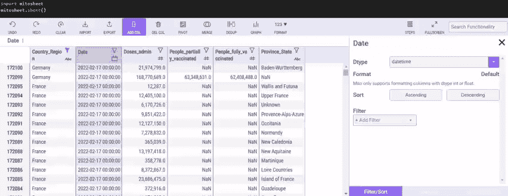

作者插图

另一个有用的列可以是月，它总是基于日期字段:

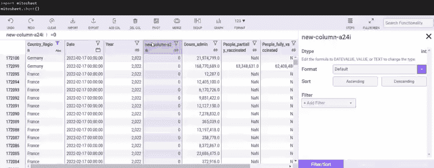

作者插图

这两个操作是如此的直观，立竿见影。下面我展示了相应的 Python 代码:

```
# Added column new-column-1cwn to time_series_covid19_vaccine_global
time_series_covid19_vaccine_global.insert(2, 'new-column-1cwn', 0)# Renamed new-column-1cwn to Year in time_series_covid19_vaccine_global
time_series_covid19_vaccine_global.rename(columns={'new-column-1cwn': 'Year'}, inplace=True)# Set new-column-1cwn in time_series_covid19_vaccine_global to Year(Date)
time_series_covid19_vaccine_global['Year'] = YEAR(time_series_covid19_vaccine_global['Date'])# Added column new-column-a24i to time_series_covid19_vaccine_global
time_series_covid19_vaccine_global.insert(3, 'new-column-a24i', 0)# Renamed new-column-a24i to Month in time_series_covid19_vaccine_global
time_series_covid19_vaccine_global.rename(columns={'new-column-a24i': 'Month'}, inplace=True)# Set new-column-a24i in time_series_covid19_vaccine_global to MONTH(Date)
time_series_covid19_vaccine_global['Month'] = MONTH(time_series_covid19_vaccine_global['Date'])
```

让我们进入下一部分来合并表！

# 3.合并表格

开始时，我还导入了 world_pop_by_country.csv。我们希望合并这两个表，以便更完整地了解新冠肺炎的全球情况。这个合并操作可以非常容易地完成:

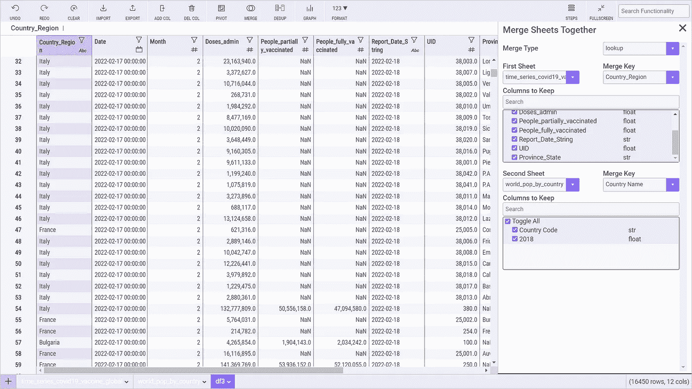

作者插图

该选项还提供了不同的方式来合并两个数据集，例如左连接和右连接。我们选择选项 lookup，它包括疫苗数据的所有行，并且只包括人口文件中匹配的行。关于国家的列被认为是一个键，允许合并两个表。现在，我们有了一个名为 df3 的新数据帧。下面是米托生成的代码:

```
# Merged time_series_covid19_vaccine_global and world_pop_by_countrytemp_df = world_pop_by_country.drop_duplicates(subset='Country Name') # Remove duplicates so lookup merge only returns first matchdf3 = time_series_covid19_vaccine_global.merge(temp_df, left_on=['Country_Region'], right_on=['Country Name'], how='left', suffixes=['_time_series_covid19_vaccine_global', '_world_pop_by_country'])
```

# 4.数据透视表

pivot 选项相当于 pandas 函数 groupby，这真的很烦人，因为它要花很多时间，而且不是很直观。另一方面，米托通过其电子表格避免了这种耗时的操作。例如，我们想知道每年、每月和每个国家完全接种疫苗的人数。让我们单击“PIVOT”选项，将会打开一个包含以下选项的窗口:

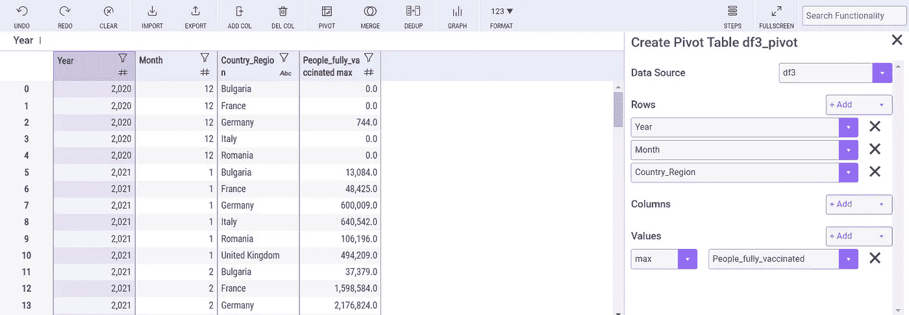

作者插图

现在，我们可以看到创建这个数据透视表后的相应代码:

```
# Pivoted df3 into df4
unused_columns = df3.columns.difference(set(['Year', 'Month', 'Country_Region']).union(set([])).union(set({'People_fully_vaccinated'})))
tmp_df = df3.drop(unused_columns, axis=1)
pivot_table = tmp_df.pivot_table(
    index=['Year', 'Month', 'Country_Region'],
    values=['People_fully_vaccinated'],
    aggfunc={'People_fully_vaccinated': ['max']}
)
pivot_table.columns = [flatten_column_header(col) for col in pivot_table.columns.values]
df3_pivot = pivot_table.reset_index()
```

要配置数据透视表，需要做一些选择。选项、**行**和**列**都指定了用于分组和聚合数据的变量，**值**部分允许决定如何聚合特定的列。为了让您更好地理解，让我们尝试使用列部分，而不是行:

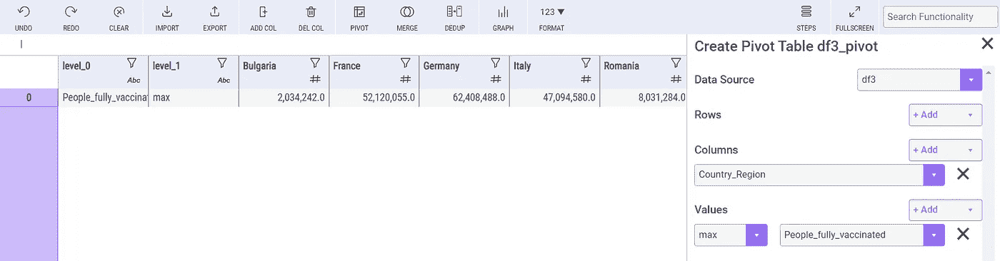

作者插图

这一次，每个国家完全接种疫苗的人数显示在每一栏中。但是通常最好是将接种疫苗的人数放在不同的栏目中。因此，我将把 Country_region 列放在 Rows 部分。我们还添加了人口一栏，以便更全面地了解情况:

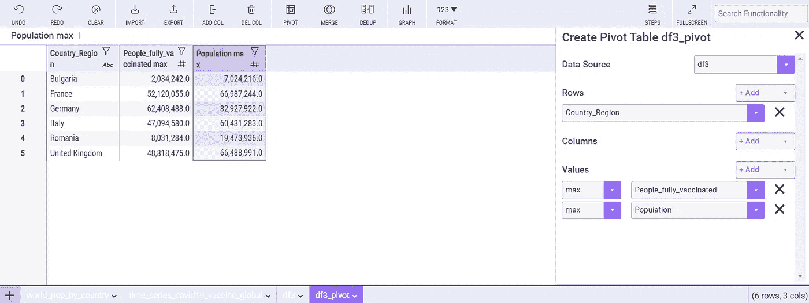

作者插图

生成的相应 Python 代码如下所示:

```
# Pivoted df3 into df4
unused_columns = df3.columns.difference(set(['Country_Region']).union(set([])).union(set({'People_fully_vaccinated', 'Population'})))
tmp_df = df3.drop(unused_columns, axis=1)
pivot_table = tmp_df.pivot_table(
    index=['Country_Region'],
    values=['Population', 'People_fully_vaccinated'],
    aggfunc={'Population': ['max'], 'People_fully_vaccinated': ['max']}
)
pivot_table.columns = [flatten_column_header(col) for col in pivot_table.columns.values]
df3_pivot = pivot_table.reset_index()
```

瞧啊！现在，我们不费吹灰之力就获得了这些统计数据！

# 5.可视化绘图

最后，我们显示一些基本的图表来深入了解我们的数据，这些数据是上一次透视操作的结果。

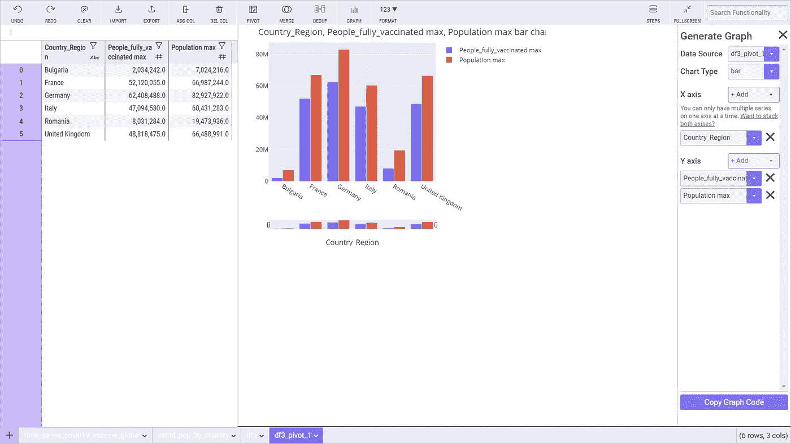

作者插图

在这种情况下，米托不会为下面的图形生成任何代码。无论如何，它允许通过右下角的“复制图形代码”按钮来复制 Python 代码。

从该图中，我们可以注意到，该国人口需要对该国总人口中有多少人接种了疫苗有一个完整的了解。否则，我们可能会得出棘手的结论。值得注意的是，生活在法国、德国、意大利和英国的大多数人完成了前两剂疫苗接种，而在保加利亚和罗马尼亚，不到 50%的人口完全接种了疫苗。

## 最终想法:

我希望这个教程对你有用。选择新冠肺炎数据集是为了更好地了解米托如何有助于处理现实生活中的数据集，这些数据集在大多数情况下是不完整的，您需要添加新列来进行更详细的分析，如果可能的话，应用机器学习模型。感谢阅读。祝您愉快！

## 更多相关文章:

[](https://betterprogramming.pub/how-to-deal-with-time-series-using-pandas-and-plotly-express-45b6848432df)  [](https://betterprogramming.pub/3-pandas-functions-to-group-and-aggregate-data-9763a32583bb)  

**参考文献:**

[1]https://github.com/CSSEGISandData/COVID-19

*免责声明:该数据集由约翰·霍普金斯大学代表其工程系统科学中心在知识共享署名 4.0 国际协议(CC BY 4.0)下授权。版权所有约翰·霍普金斯大学 2020 年*

你喜欢我的文章吗？ [*成为会员*](https://eugenia-anello.medium.com/membership) *每天无限获取数据科学新帖！这是一种间接的支持我的方式，不会给你带来任何额外的费用。如果您已经是会员，* [*订阅*](https://eugenia-anello.medium.com/subscribe) *每当我发布新的数据科学和 python 指南时，您都会收到电子邮件！*