# 米托:最好的数据可视化 Python 库之一

> 原文：<https://towardsdatascience.com/mito-one-of-the-best-python-libraries-for-data-visualization-1bca9ad4d3e3>

## 大蟒

## 让我们探索一下用于数据分析的最酷的 Python 库之一


来自 Unsplash 的蔡斯·沙佩尔的图片

几个月前，我写了一篇关于[米托](/mito-one-of-the-coolest-python-libraries-you-have-ever-seen-5261dbfedceb)的博客，这是一个带有图形用户界面(GUI)的便捷 Python 库，让数据分析变得像使用 Microsoft Excel 一样简单。对于那些正在学习 Python 或者每天都在使用它的人来说，这是一个非常有用的工具。但是，在我的第一篇博客中，我主要关注的是如何完成数据分析、数据清洗、数据修改任务等。现在，是时候回顾一下米托大放异彩的任务之一了:数据可视化。

## 什么是米托？

米托是一个带有 GUI 的 Python 库，它允许我们通过几次点击来进行数据清理、数据操作、分析和可视化。

你可能会问自己:有用户界面的 Python？我们为什么要考虑它？嗯，对于学习 Python 的人来说是一个极好的工具。这使得完成需要多行代码的任务变得更容易，即使你使用的是 GUI，米托也向我们展示了完成任务所生成的代码，这可以提高学习速度。对于专业人士来说，这也是一个很好的工具，因为你可以在几秒钟内完成需要几分钟的任务。

## 好得不真实(或免费)？

每当有些事情听起来好得不像是真的，我就问自己是否好得不像是免费的。好消息是米托是开源的，可以免费使用！他们有付费计划，但我将在这个博客中使用开源版本。

既然他们有付费计划，我需要说我不写赞助内容，对于这个博客来说也没什么不同。我没有得到任何报酬。我的真实想法是基于我对这个图书馆的体验。

## 入门指南

安装很容易，如果你在安装米托时遇到任何问题，他们的 [GitHub 页面](https://github.com/mito-ds/monorepo)会提供非常丰富的信息。为了简化这个过程，您只需在您的终端上复制并粘贴以下代码，就可以开始了:

在 Mac 上:

```
python3 -m venv venv;
source venv/bin/activate;
pip install -r requirements.txt;
python -m mitoinstaller install
```

在 Windows 上:

```
python3 -m venv venv
venv\Scripts\activate.bat
pip install -r requirements.txt
python -m mitoinstaller install
```

现在，你可以从你的终端打开 Jupyter 实验室。要开始使用米托，您只需要导入它，并键入以下命令开始一个新的工作表:

```
import mitosheet
mitosheet.sheet()
```

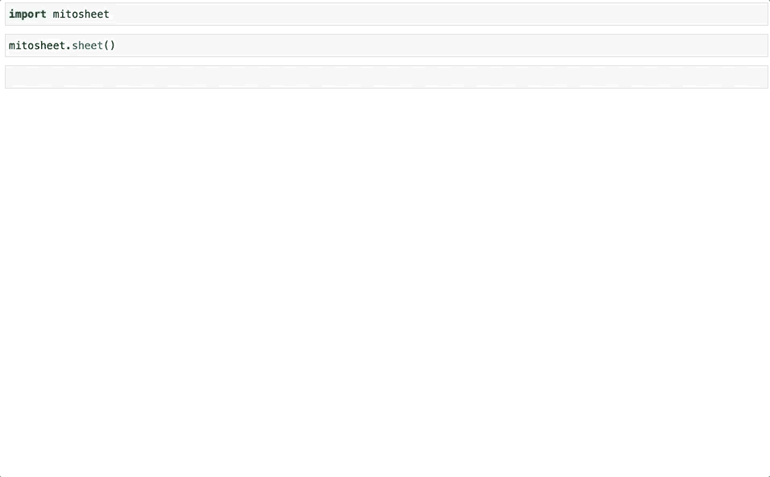

作者 GIF

酷毙了。让我们暂停一下，探索一下米托的用户界面。如果你熟悉微软的 Excel，你会看到许多熟悉的米托。这个库很酷的一点是，您一眼就能看出列的数据类型。我们还可以看到许多功能，如导入文件、添加列、删除列、更改数据类型、更改数字类型(整数、浮点、添加或删除小数)、旋转数据、创建图表。我在我的第一篇关于米托的博客中提到了其中的一些特色。今天，我们来重点构建一些图表。

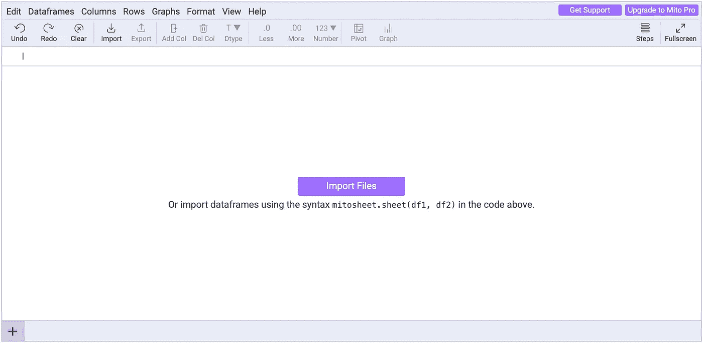

作者 GIF

现在我们已经熟悉了米托的 UI，让我们使用超市销售数据集，它包含多种数据类型，这将允许我们创建一些有趣的可视化。你可以在这里找到数据集。将文件导入米托再简单不过了。只需点击导入文件，我们就可以开始了。

值得一提的是，您可以在列名下看到特性的数据类型，这已经使我们不必为一些数据探索而键入代码。

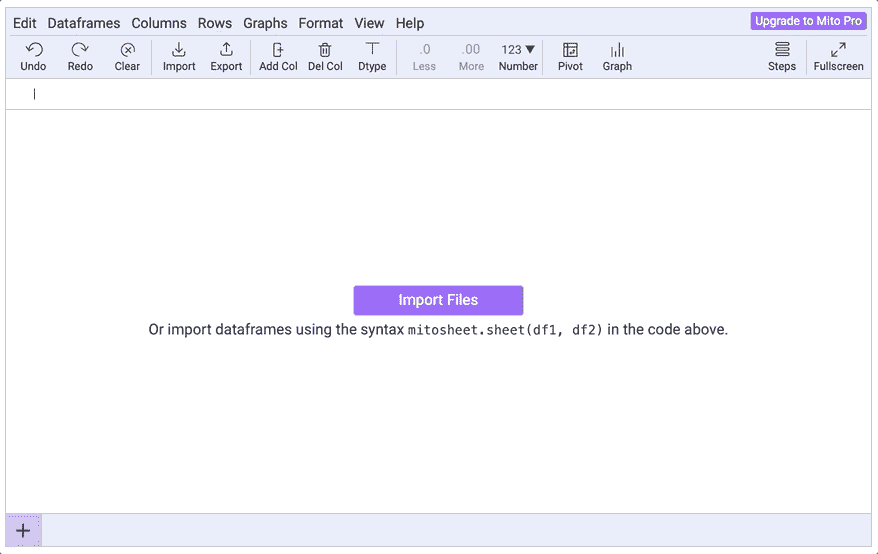

作者 GIF

首先，我们为什么不把总销售额按日期可视化呢？为此，单击图形，会出现一个侧菜单。选择图表类型，然后选择 x 轴(我将在这个可视化中使用日期)，y 轴(总计，即该客户的总销售额)，然后完成。我们刚刚在几秒钟内创建了一个图表。

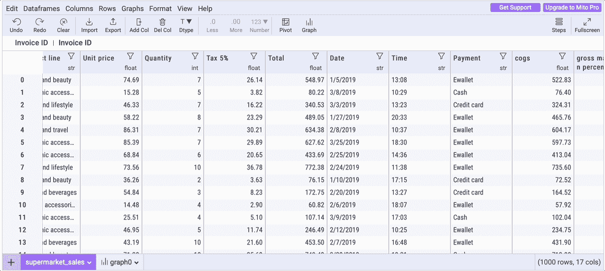

需要注意的一点是，为图表创建了一个新的选项卡。这有助于我们组织笔记本的内容。

现在，我们可以对图表进行一些更改。让我们将图表标题更改为“按日期销售”,将 y 轴更改为“总销售额”。

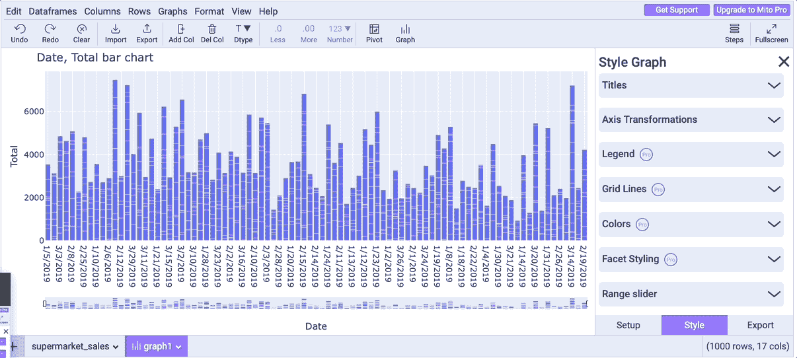

作者 GIF

我们还可以将轴转换为线性、对数、类别等。我们今天不会进行这些转换，但是您可以在自己的终端上尝试一下。还有其他付费功能来编辑图表，但由于我今天只使用开源软件，所以让我们跳过这些。另外，你可以自己修改代码，而不必付费。

我创建的图表只能告诉我们一点。让我们探索一些更多的选项，使它更有见地。首先，我们可以很容易地改变图表类型——如散点图、折线图、直方图、密度热图、小提琴图、带状图等。我们还可以通过单击“按列显示颜色”来将颜色更改为不同的类别。轻松微风！

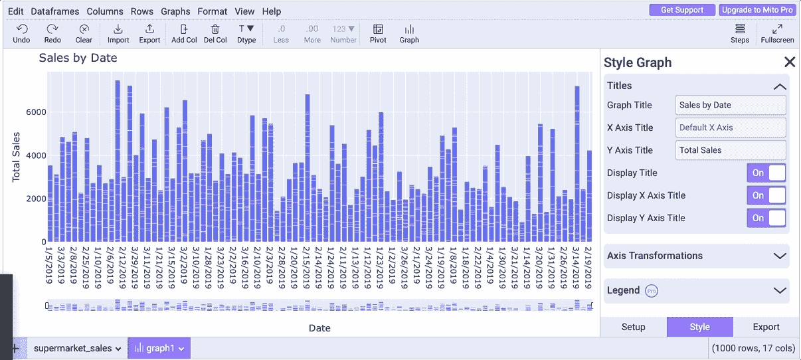

作者 GIF

如果你注意我们到目前为止的图表，你会发现日期需要更有条理和有序。这是因为日期数据类型是字符串。我们需要将其更改为 DateTime 类型，这非常简单。

转到 dataframe 选项卡，找到您想要更改数据类型的列，单击数据类型图标(在本例中为 *str* ，并选择您想要更改的数据类型。看下面的图表，你会看到日期正在上升。

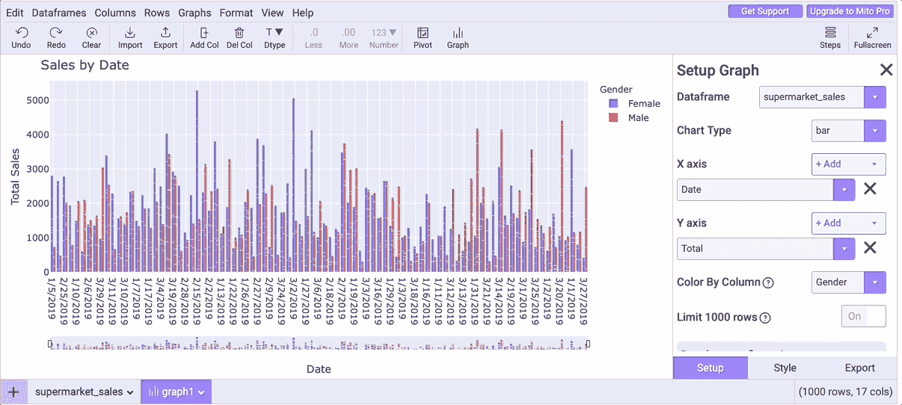

作者 GIF

需要注意的一点是，米托生成了用于更改数据类型的代码。另一件很酷的事情是，任何人都可以使用米托生成的代码运行这台笔记本，即使他们没有安装米托。


作者图片

回到我们的图表，您会注意到我们现在有两个选项卡。让我们重命名“图表”选项卡，使事情更有条理。只要点击标签，你就可以改变它的名字了。

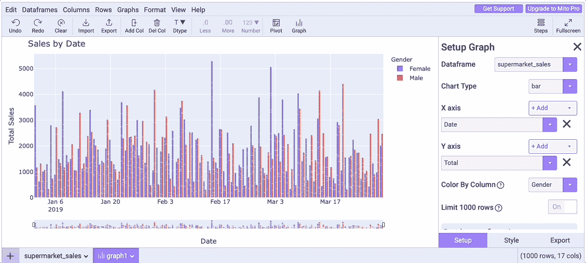

作者 GIF

我们目前掌握的图表很有趣，但它并没有告诉我们太多。让我们通过查看哪些城市的销售额最高来更深入地了解一下。

为此，我们将按列将颜色更改为城市，然后单击直方图以更改图表类型。完成后，我们可以导出图表。让我们复制代码，看看能否运行它。要复制代码，点击 Export，并选择选项*复制显示图形*的代码。现在我们可以将代码粘贴到 Jupyter 笔记本的任何单元格中。

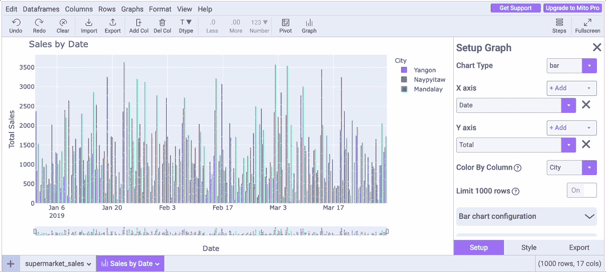

作者 GIF

厉害！我们创建了一个漂亮的图表，生成了代码，并在笔记本上运行。让我们再来看看米托生成的图形和代码。

```
import plotly.express as px
# Construct the graph and style it. Further customize your graph by editing this code.
# See Plotly Documentation for help: https://plotly.com/python/plotly-express/
fig = px.histogram(supermarket_sales, x='Date', y='Total', color='City', histfunc='count')
fig.update_layout(
    title='Sales by Date', 
    xaxis = dict(
        showgrid=True, 
        rangeslider = dict(
            visible=True, 
            thickness=0.05
        )
    ), 
    yaxis = dict(
        title='Total Sales', 
        showgrid=True
    ), 
    legend = dict(
        orientation='v'
    ), 
    barmode='group', 
    paper_bgcolor='#FFFFFF'
)
fig.show(renderer="iframe")
```

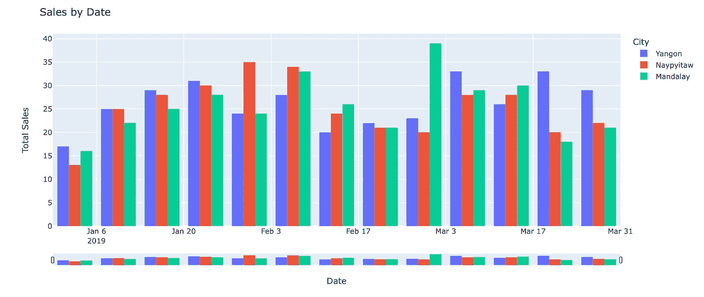

作者图片

这是一个用 Plotly 创建的好看的图形，只需要几秒钟就可以完成。如果我们看一下代码，它需要多行代码来实现相同的结果，例如，图表可以添加到演示文稿中。

好了，让我们再制作一个图表，按性别检查哪些产品线卖得最多。点击 Graph，然后选择 histogram 作为数据类型，性别作为 x 轴，产品线作为 y 轴，产品线作为 Color by Column，这就完成了。让我们复制并粘贴生成的代码，看看能否将结果打印在笔记本上。

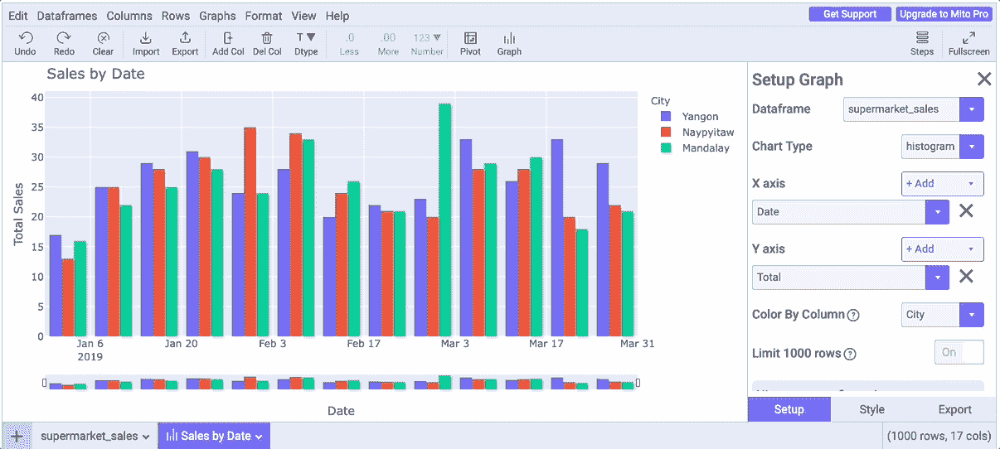

又一次成功了，只用了几秒钟。很酷，对吧？

## 最后的想法

今天我们讨论了如何使用米托进行数据可视化。米托可以完成更多的任务，他们的团队正在不断增加功能，使其更加有用。最大的问题是:你应该使用它吗？即使你已经使用 Python 很多年了，你也应该尝试一下。它可以在几秒钟内完成繁琐耗时的任务，这样你就可以把时间用在更具挑战性的任务上。

我相信每个人都应该接受教育，米托帮助那些开始新的职业生涯或者正在考虑学习 Python 但不知道从哪里开始的人。最重要的是，它可以帮助使用 Python 并且需要每天编写重复代码的人。因此，他们不需要输入几十行代码，只需点击 3 到 4 次就可以获得相同的结果。

你可以尝试一下，看看米托在哪里可以为你申请。每个人都可以找到这个不可思议的 Python 库的用例。如果你决定测试它，让我知道它怎么样。编码快乐！

**您可能还喜欢:**

[](/mito-one-of-the-coolest-python-libraries-you-have-ever-seen-5261dbfedceb)  [](/d-tale-one-of-the-best-python-libraries-you-have-ever-seen-c2deecdfd2b)  [](/4-amazing-python-libraries-that-you-should-try-right-now-872df6f1c93) 