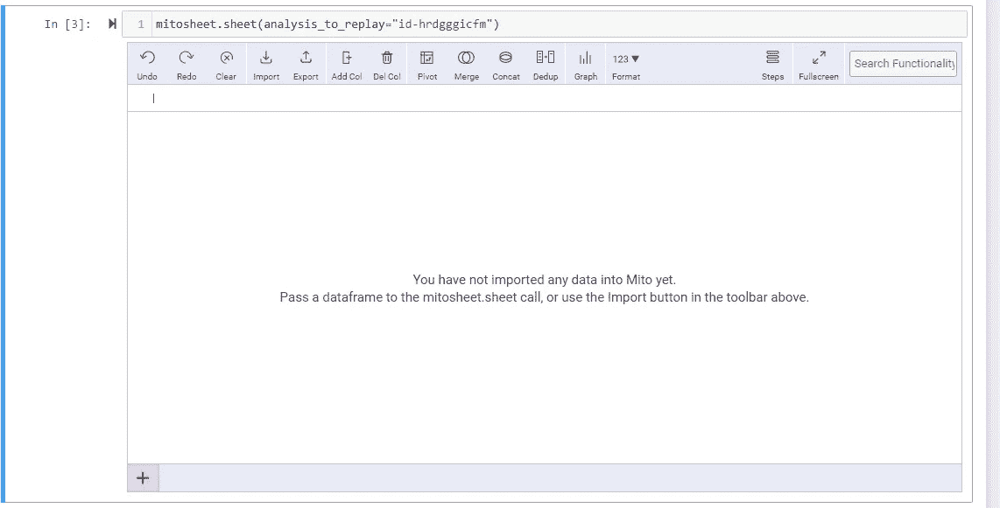
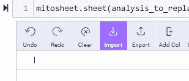
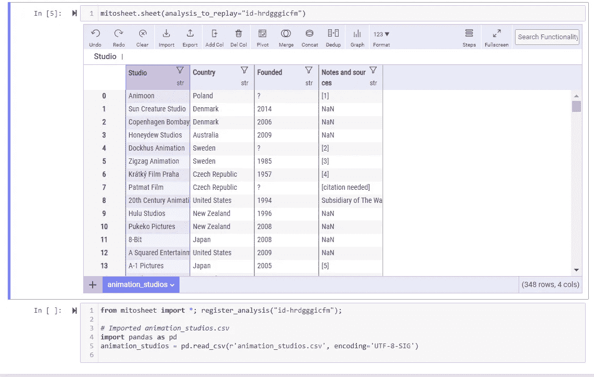
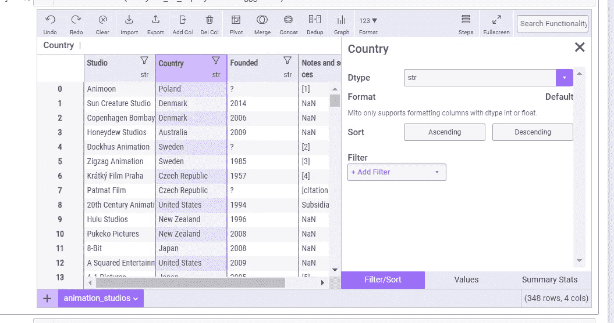
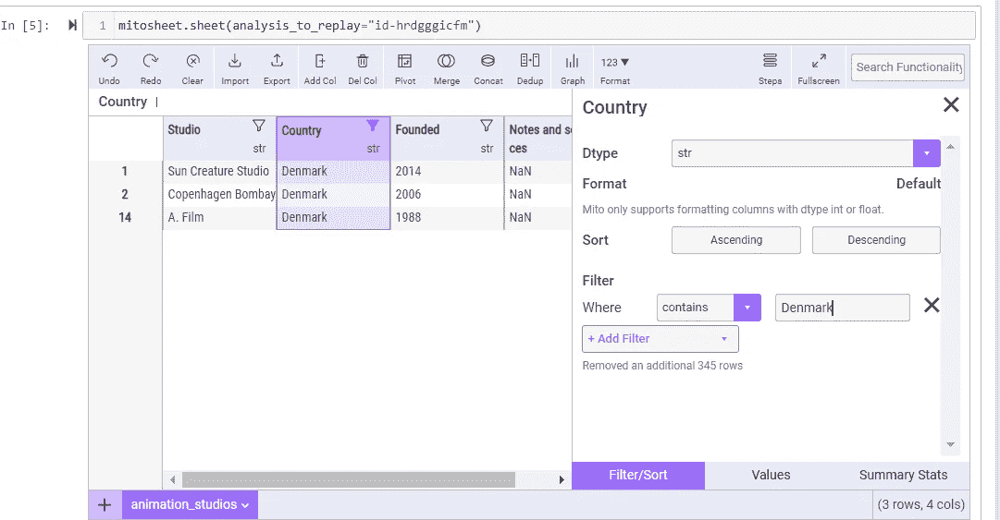
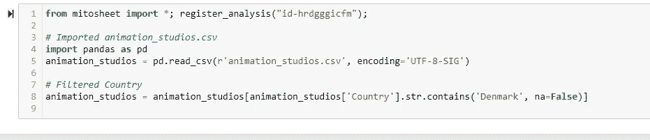

# 米托—第 1 部分:介绍一个 Python 包，它将改进和加快您的分析

> 原文：<https://towardsdatascience.com/mito-part-1-an-introduction-a-python-package-which-will-improve-and-speed-up-your-analysis-17d9001bbfdc>

> 米托是一个 Python 包，它允许用户以更快的速度用 Python 完成他们的分析！用户将创建一个 Mitosheet，然后在处理该表后为他们生成 Python 代码。今天，我们将简单地看看什么是米托，以及如何用 Python 安装它，并给出一个简短的例子。这是一系列帖子中的第一篇，旨在理解如何使用有丝分裂表及其在数据集中的交互作用。


[活动发起人](https://unsplash.com/@campaign_creators?utm_source=medium&utm_medium=referral)在 [Unsplash](https://unsplash.com?utm_source=medium&utm_medium=referral) 上的照片

# 什么是米托？

米托是一个 Python 包，可以帮助数据科学家执行更快的分析。它可以在一个 Jupyter 笔记本中实现，用户将在其中创建一个米托电子表格。 关于米托最好的部分？**用户只需操作 Mitosheet，python 代码就为他们创建好了！告别经常为项目中的各种任务搜索堆栈交换或代码文档！**

# 如何安装米托？

我在 Jupyter 笔记本上使用了以下代码来安装米托。安装前，确保您阅读并理解了[服务条款](https://docs.trymito.io/misc/terms-of-service)和[隐私政策](https://docs.trymito.io/misc/privacy-policy)。首先，您必须确保您运行的是 Python 3.6 或更高版本。

```
import sys
sys.version
```

我用 Python 3.8.3 安装了米托。在验证了 Python 版本之后，我通过我的 Anaconda 命令提示符安装了这个包。您将希望确保您处于安装米托的正确虚拟环境中(在此了解如何安装虚拟环境[)。在正确的环境中工作后，使用以下代码安装米托。](https://www.geeksforgeeks.org/set-up-virtual-environment-for-python-using-anaconda/)

```
python -m pip install mitoinstaller
```

下载完软件包后，运行安装程序。

```
python -m mitoinstaller install
```

代码运行完成后，打开你的 Jupyter 笔记本，导入米托！

```
import mitosheet
```

# 例子

正如我前面提到的，当你操作电子表格时，米托包将为你提供 Python 代码。这个示例将简单地向您展示代码是如何生成的，稍后将提供对米托功能的更深入的审查。使用的数据集是来自[kaggle.com](https://www.kaggle.com/datasets/jkanthony/list-of-animation-studios)的动画工作室数据集列表。首先，我们要创建一个有丝分裂表。

```
mitosheet.sheet()
```

运行此代码将在 Jupyter 笔记本中创建以下弹出窗口(在接受条款和条件之后)。



图片:Jupyter 中的 Mitosheet(图片来自作者)

接下来，单击“import”按钮将数据集导入笔记本。



图片:导入按钮(图片来自作者)

既然数据集已经导入，我们就可以开始操作电子表格来生成代码了。请注意代码已经为我们启动了！



图像:带数据的 Mitosheet(图像表单作者)

现在，为了补充这个例子，假设我们想要按国家过滤数据。首先，单击电子表格国家列中的 delta 符号。



图像:选择列(来自作者的图像)

单击国家栏中的 delta 符号，我们会看到各种选项，包括**过滤/排序、值、**和**汇总统计。**在这个例子中，我们将使用**过滤/排序。**



图片:过滤/排序弹出框(图片来自作者)

通过“丹麦”过滤，Mitosheet 给出了丹麦所有的动画工作室。此外，还为整个示例生成了以下代码！



图片:米托生成的代码(图片来自作者)

就这样，我们可以快速地为我们的分析创建一个基线！

# 结论

今天只是对我最近接触的一个新的 Python 包**米托**的一个快速总结。使用米托*的主要好处是它会为你提供 Python 代码*并且用户所要做的就是修改数据表！这将为数据科学家带来更快的分析速度，并减少用户查找他们希望对数据集采取的特定操作的代码所需的时间。如果你曾经陷入如何编写特定实例的困境，米托可以成为帮助你完成下一个项目的向导和救星！这是我计划在米托上发表的一系列文章的第 1 部分，以展示该库提供的全部功能。在我的下一篇文章中，请继续关注更多的动手分析。

如果你喜欢今天的阅读，请关注我，并告诉我你是否还有其他想让我探讨的话题！另外，在[**LinkedIn**](https://www.linkedin.com/in/benjamin-mccloskey-169975a8/)**上加我，或者随时联系！感谢阅读！**