# 米托:用熊猫做电子表格

> 原文：<https://towardsdatascience.com/mito-using-pandas-as-a-spreadsheet-within-jupyter-lab-6a6bd04310a8>

## 查看 *mitosheet* python 包


由[艾萨克·史密斯](https://unsplash.com/@isaacmsmith?utm_source=medium&utm_medium=referral)在 [Unsplash](https://unsplash.com?utm_source=medium&utm_medium=referral) 上拍摄的照片

电子表格是一个很好的解决方案，可以检查新数据，初步掌握其内容，并与它们快速、直观地进行交互。然而，当这些任务需要频繁执行时——就像数据科学项目中的典型工作流一样——基于电子表格的工具(如 [Excel](https://www.microsoft.com/it-it/microsoft-365/excel) 或 [Google Sheets](https://www.google.com/intl/it/sheets/about/) )的优势被手动多次重复相同操作的负担所限制。

编程语言为后一部分的自动化提供了一个方便的选择，尽管根据语言和用户的熟练程度，在第一次传递数据时可能需要一些麻烦。

在这篇文章中，我们将探索 [**米托**](https://www.trymito.io/) ，*一个基于 python* 的熊猫数据帧的类似电子表格的界面。特别是，我将指导你通过它的安装和主要功能，评估完整性，有效性和易用性的米托的功能从 1 到 5 的规模。

> ***免责声明*** *:本帖赞助。然而，它提出了一个关键的和诚实的评价图书馆及其表现。*

# 什么是米托？

[米托是一个开源的 python 库](https://github.com/mito-ds/monorepo)，它将电子表格的*直观和可视化*方面与编程的好处相结合，以*处理更大的数据集*，提供*及时的阐述*并轻松创建*可重复的流程*。

简而言之，米托是一个 **Jupyter Lab 接口**，它允许用户**处理**数据**，就像在电子表格**中一样，同时**在下面的单元格中自动生成相应的 python 代码**。

# 给谁的？

对于老派的电子表格用户来说——例如 **Excel 从业者**——米托是向面向编程的范式过渡的完美工具。

然而，我也向像我一样的 python 程序员推荐米托，他们厌倦了复制粘贴相同的样本代码来进行探索性数据分析。我相信这是一个用于**探索性数据分析、**的便利工具，也是一个**快速设置大部分代码，然后在各处应用一些定制调整的良好起点。**

# 装置

安装非常简单，只需要[文档](https://docs.trymito.io/)中详细描述的[几个步骤](https://docs.trymito.io/getting-started/installing-mito)，例如对于 *conda* :

```
# this article uses mitosheet version '0.1.392'
conda create -n mitoenv python=3.8
conda activate mitoenv
python -m pip install mitoinstaller
python -m mitoinstaller install
```

我在我的 *ubuntu 20.04* 平台上试了一下，几乎一眨眼就成功了。实际上，我无法立即完成`python -m pip install mitoinstaller`,因为有些依赖关系没有解决:

```
(mitoenv) luca@ASUS-ROG:~/workspace/blog_mito$ python -m pip install mitoinstaller
Collecting mitoinstaller
  Downloading mitoinstaller-0.0.122.tar.gz (14 kB)
  Preparing metadata (setup.py) ... done
Collecting analytics-python
  Downloading analytics_python-1.4.0-py2.py3-none-any.whl (15 kB)
Requirement already satisfied: colorama in /home/luca/.local/lib/python3.8/site-packages (from mitoinstaller) (0.4.4)
Collecting termcolor
  Using cached termcolor-1.1.0.tar.gz (3.9 kB)
  Preparing metadata (setup.py) ... done
Collecting monotonic>=1.5
  Downloading monotonic-1.6-py2.py3-none-any.whl (8.2 kB)
Collecting backoff==1.10.0
  Downloading backoff-1.10.0-py2.py3-none-any.whl (31 kB)
Requirement already satisfied: python-dateutil>2.1 in /home/luca/.local/lib/python3.8/site-packages (from analytics-python->mitoinstaller) (2.8.1)
Collecting six>=1.5
  Using cached six-1.16.0-py2.py3-none-any.whl (11 kB)
Collecting requests<3.0,>=2.7
  Downloading requests-2.27.1-py2.py3-none-any.whl (63 kB)
     ━━━━━━━━━━━━━━━━━━━━━━━━━━━━━━━━━━━━━━━━ 63.1/63.1 KB 605.1 kB/s eta 0:00:00
Collecting certifi>=2017.4.17
  Downloading certifi-2021.10.8-py2.py3-none-any.whl (149 kB)
     ━━━━━━━━━━━━━━━━━━━━━━━━━━━━━━━━━━━━━━━━ 149.2/149.2 KB 1.1 MB/s eta 0:00:00
Collecting urllib3<1.27,>=1.21.1
  Downloading urllib3-1.26.8-py2.py3-none-any.whl (138 kB)
     ━━━━━━━━━━━━━━━━━━━━━━━━━━━━━━━━━━━━━━━━ 138.7/138.7 KB 1.4 MB/s eta 0:00:00
Collecting charset-normalizer~=2.0.0
  Downloading charset_normalizer-2.0.12-py3-none-any.whl (39 kB)
Collecting idna<4,>=2.5
  Downloading idna-3.3-py3-none-any.whl (61 kB)
     ━━━━━━━━━━━━━━━━━━━━━━━━━━━━━━━━━━━━━━━━ 61.2/61.2 KB 1.6 MB/s eta 0:00:00
Building wheels for collected packages: mitoinstaller, termcolor
  Building wheel for mitoinstaller (setup.py) ... done
  Created wheel for mitoinstaller: filename=mitoinstaller-0.0.122-py3-none-any.whl size=19809 sha256=68b55bfd4dbc4f916f6cd1a19500aefdfab6f25f86737c2ae7c258264eff410f
  Stored in directory: /home/luca/.cache/pip/wheels/46/c6/8a/8b77ea33ddac40eff0b3e1847f84789d316e557e48bb0bc110
  Building wheel for termcolor (setup.py) ... done
  Created wheel for termcolor: filename=termcolor-1.1.0-py3-none-any.whl size=4848 sha256=84532fa74eca34fbe56efd5665ff9c8ebce197dc2a32254a19f145f97d6da515
  Stored in directory: /home/luca/.cache/pip/wheels/a0/16/9c/5473df82468f958445479c59e784896fa24f4a5fc024b0f501
Successfully built mitoinstaller termcolor
Installing collected packages: termcolor, monotonic, certifi, urllib3, six, idna, charset-normalizer, backoff, requests, analytics-python, mitoinstaller
ERROR: pip's dependency resolver does not currently take into account all the packages that are installed. This behaviour is the source of the following dependency conflicts.
requests-oauthlib 1.3.0 requires oauthlib>=3.0.0, which is not installed.
pandas 1.2.2 requires pytz>=2017.3, which is not installed.
oauth2client 4.1.3 requires httplib2>=0.9.1, which is not installed.
moto 1.3.16.dev122 requires MarkupSafe<2.0, which is not installed.
moto 1.3.16.dev122 requires more-itertools, which is not installed.
moto 1.3.16.dev122 requires pytz, which is not installed.
moto 1.3.16.dev122 requires zipp, which is not installed.
google-api-core 1.26.3 requires packaging>=14.3, which is not installed.
google-api-core 1.26.3 requires pytz, which is not installed.
Successfully installed analytics-python-1.4.0 backoff-1.10.0 certifi-2021.10.8 charset-normalizer-2.0.12 idna-3.3 mitoinstaller-0.0.122 monotonic-1.6 requests-2.27.1 six-1.16.0 termcolor-1.1.0 urllib3-1.26.8
```

这导致我在运行`python -m mitoinstaller install`时出现以下错误:

```
(mitoenv) luca@ASUS-ROG:~/workspace/blog_mito$ python -m mitoinstaller install
Starting install...
Create mito user
Upgrade mitoinstaller
Check dependencies
Remove mitosheet3 if present
Install mitosheet
Create import mito startup file
Creating a Mitosheet starter notebook
Start JupyterLab
Traceback (most recent call last):
  File "/home/luca/anaconda3/envs/mitoenv/bin/jupyter-lab", line 5, in <module>
    from jupyterlab.labapp import main
  File "/home/luca/anaconda3/envs/mitoenv/lib/python3.8/site-packages/jupyterlab/labapp.py", line 13, in <module>
    from jupyter_server.serverapp import flags
  File "/home/luca/anaconda3/envs/mitoenv/lib/python3.8/site-packages/jupyter_server/serverapp.py", line 38, in <module>
    from jinja2 import Environment, FileSystemLoader
  File "/home/luca/.local/lib/python3.8/site-packages/jinja2/__init__.py", line 12, in <module>
    from .environment import Environment
  File "/home/luca/.local/lib/python3.8/site-packages/jinja2/environment.py", line 25, in <module>
    from .defaults import BLOCK_END_STRING
  File "/home/luca/.local/lib/python3.8/site-packages/jinja2/defaults.py", line 3, in <module>
    from .filters import FILTERS as DEFAULT_FILTERS  # noqa: F401
  File "/home/luca/.local/lib/python3.8/site-packages/jinja2/filters.py", line 13, in <module>
    from markupsafe import soft_unicode
ImportError: cannot import name 'soft_unicode' from 'markupsafe' (/home/luca/anaconda3/envs/mitoenv/lib/python3.8/site-packages/markupsafe/__init__.py)
```

然而，这可能依赖于我的本地配置，并且很容易通过单独安装缺失的依赖项来修复:

```
pip install mitoinstaller
pip install requests-oauthlib
pip install oauth2client
pip install pandas
pip install moto
pip install google-api-core
```

比率:4 / 5 ⭐⭐⭐⭐

# **功能**

米托以非常直观和高效的方式提供了大多数(几乎所有)电子表格功能。

## 输入数据

米托支持从 *csv* 和 *xlsx* 文件导入数据。导入本身就像导入 *mitosheet* 包并在用户第一次被要求注册并选择想要的[计划](https://www.trymito.io/plans)时运行`mitosheet.sheet().` 一样简单。之后，您可以简单地遵循一个简洁的图形界面来选择要导入的数据文件。

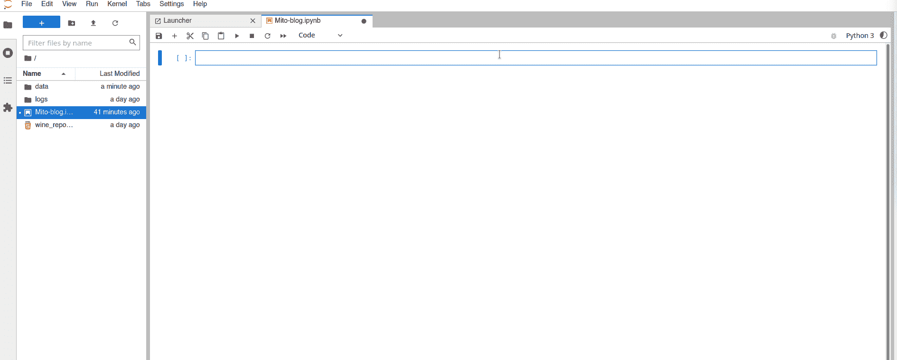

**数据导入。**图片作者

或者，米托也支持每个工作表的熊猫数据帧`mitosheet.sheet(df1, df2)`。

一个小的限制是您不能在导入时为 *csv* 文件定制数据类型——但是您可以在以后通过数据格式化来修复它。

**比率:4 / 5** ⭐⭐⭐⭐

## 检查值和分布

每个数据科学项目的第一步是探索数据，检查值并探索变量的分布。有了米托，这真是又快又直观。

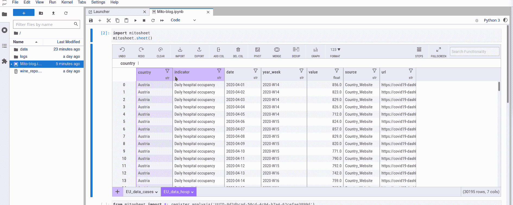

**数据值和分布。**图片作者

对于不同类型的数据，我的体验非常流畅，涵盖了我能想到的所有用例。这是一个很好的工具！

**比率:5 / 5** ⭐⭐⭐⭐⭐

## **过滤和分类**

过滤和排序也是处理数据时非常常见的操作。米托允许基于条件和直接排除不需要的值进行过滤。

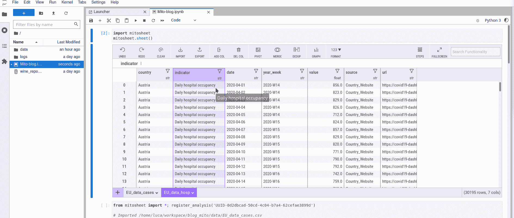

**过滤。**图片作者

排序也是有效的，尽管基于多列的排序本身不被支持。一种可能的解决方法是连接这样的变量，并按结果列进行排序。

**比率:4 / 5** ⭐⭐⭐⭐

## 格式化

良好的数据格式是可视化探索的关键。米托提供了大量的选项来安排他们的内容，以满足任何需求。

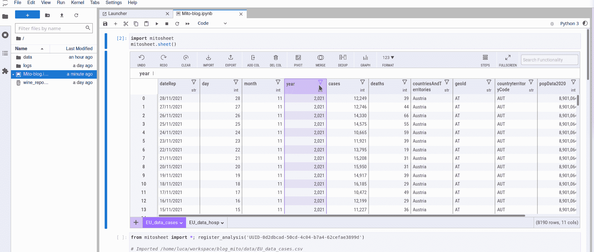

**数据格式化。**图片作者

**比率:5 / 5** ⭐⭐⭐⭐⭐

## **数据类型**

在预处理过程中经常需要处理数据类型，以便为下面的分析管道准备适当的数据。米托在这方面也做得很好，平衡了数据导入过程中最初缺乏定制的问题。

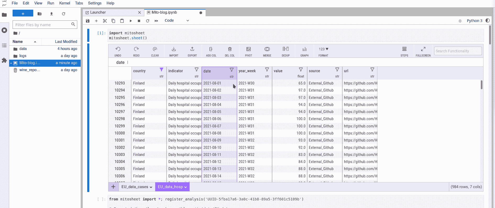

**数据类型。**图片作者

除了像`int`、`float`、`str`和`bool`这样的标准数据类型之外，我还针对数据科学家最大的噩梦之一:*日期对米托进行了测试。*从字符串到`datetime`的转换是无缝的，您可以使用 Excel 公式进行更多的定制。做得好！

**比率:5 / 5** ⭐⭐⭐⭐⭐

## 数据操作

米托支持几种利用最常用的 Excel 公式的数据操作。*添加和删除列*，以及*编辑*单个单元格或整个变量只需点击几下鼠标。

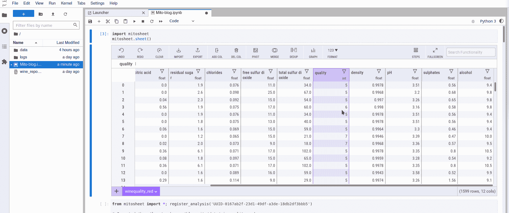

**数据操作。**图片作者

我真的很欣赏你输入命令时有建议的漂亮界面，还有右上角的`Search Functionality`框。

但是，我没有成功复制 Excel 的一个杀手级特性:**拖动公式**。这很遗憾，我认为这应该是未来发展的首要任务之一。

此外，添加的列是不可按单元格编辑的，这意味着您可以批量编辑新列。同样，这错过了 Excel 的便利性。

**比率:3 / 5** ⭐⭐⭐

## 合并

米托支持合并工作表的多种选项，包括*左/右/内/外连接*，以及*查找*，所有这些都在下拉菜单中有很好的解释。

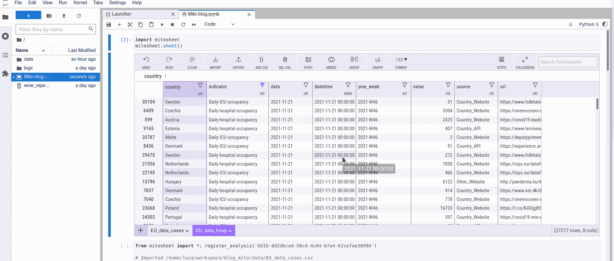

**合并。**图片作者

另一个很棒的特性是能够快速地从每个表中选择关键变量和要保留的列。我真的很喜欢！

不利的一面是，**多键合并**不被本地支持。但是，文档涵盖了这种使用情形:

> 如果希望使用多列作为合并键，请尝试创建一个新列，并使用 CONCAT 函数将所有列合并为一列。然后，选择新列作为合并键！

此外，我没有设法垂直合并两个工作表——类似于熊猫`.concat()`——这需要一个外部通道。

**比率:4 / 5** ⭐⭐⭐⭐

## 重复数据删除

这是我需要的时候总要谷歌一下的东西之一。用米托删除重复行只需几次点击。它支持多列组合，并为要保留的值提供不同的选项: *first，last，none* 。

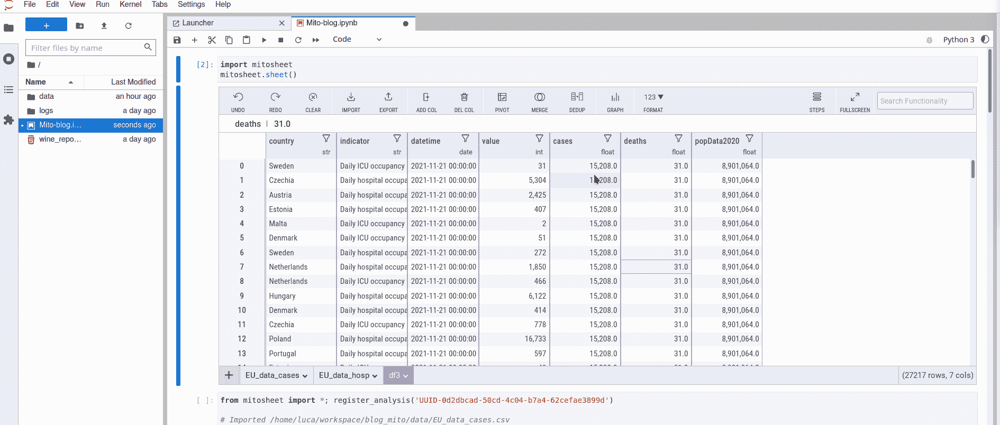

**重复数据删除。**图片作者

**比率:5 / 5** ⭐⭐⭐⭐⭐

## 图表

这可能是我在这样的工具中寻找的顶级特性之一。米托在这个功能上做得很好，支持多种绘图类型，包括条形图、线形趋势图、箱线图、小提琴图、热图等等。

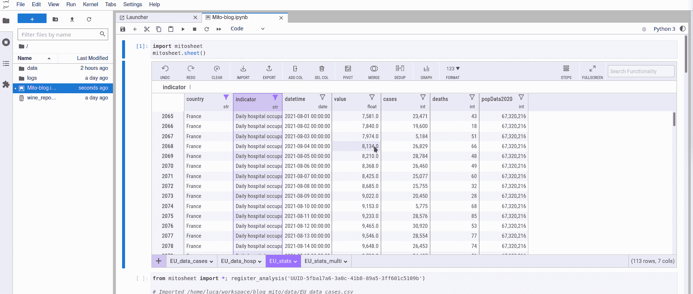

**折线图。**图片作者

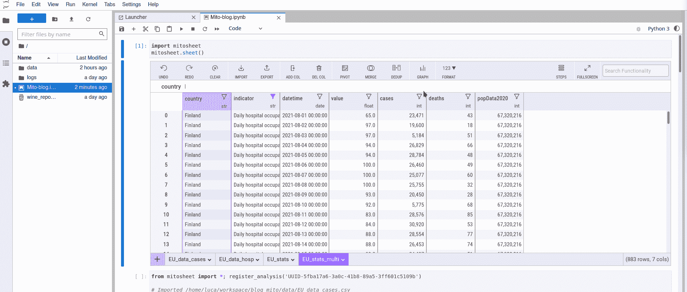

**分布图。**图片作者

通过界面的流程非常流畅，结果也很不错，使用 *plotly* 制作交互式图表还有额外的好处。不幸的是，改变它们的外观是不可能的，但对于探索性分析来说，这不是一个大问题。此外，生成的代码可以作为快速适应所需外观的基础。

> 但是米托有令人惊叹的因素吗？

单变量图很好，很实用，绝对值得称赞！

不过，这个结果对多变量图的效果稍差。米托处理一些功能，但是不能通过组来表示相同的信息。

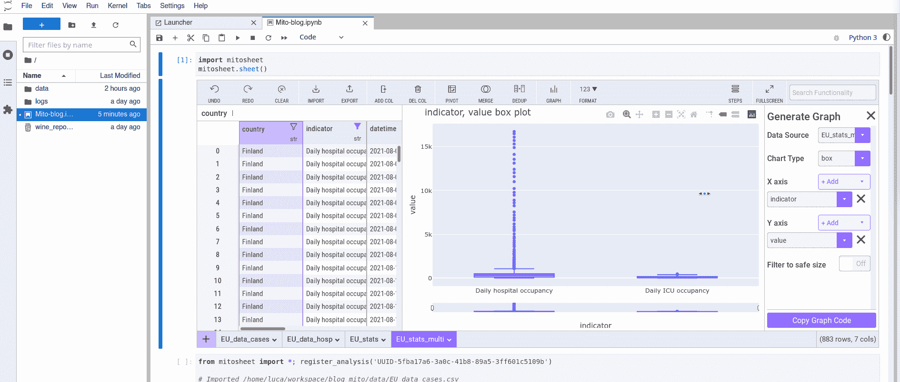

**多组箱线图。**图片作者

在上面的例子中，自动生成的代码只是连接了 X 轴上的值，在我看来这有些不直观:

我认为更好的处理方式是添加第二个 x 变量作为*颜色参数*:

总的来说，这是一个很好的快速探索解决方案，适用于大多数常见用例。对于更清晰的需求和风格，还有一些改进的空间。

**比率:4 / 5** ⭐⭐⭐⭐

## 数据透视表

数据透视表是一种通过汇总统计数据来总结调查结果的方式。米托允许以类似 Excel 的方式非常顺利地做到这一点。

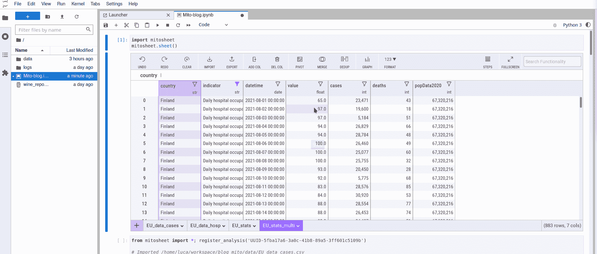

**数据透视表。**图片作者

界面非常直观，支持你能想到的所有聚合函数。然后可以使用格式化实用程序来更好地可视化结果或优化输出，以便以后导出和共享。

对于未来的开发来说，增加一个如何处理缺失值的选项将是一个不错的附加功能。

**比率:5 / 5** ⭐⭐⭐⭐⭐


摄影:谢尔曼杨在 [Unsplash](https://unsplash.com?utm_source=medium&utm_medium=referral)

# 最后的想法

总而言之，米托是一个成熟的工具，做得很好，使用户能够直观地检查数据，并与他们进行直观有效的互动。它几乎涵盖了探索性数据分析**的所有最常见用例**，如检查值和分布、编辑和格式化数据、合并工作表、创建数据透视表以及各种绘图。所有的操作都被跟踪并自动转换成 python 代码，在底层的 pandas 数据帧上执行操作。

我很欣赏生成代码的顺序，以及它包含注释来引导用户浏览的事实。此外，它被很好地优化以利用快速 pandas 实现——例如，它使用`.at()`而不是`.loc()`来根据 [pandas 文档](https://pandas.pydata.org/pandas-docs/version/0.17.0/generated/pandas.DataFrame.at.html#pandas.DataFrame.at)有效地设置单元格的值。

此外，还有一个额外的奖励，那就是**简单安装**、现场和综合 [**文档**](https://docs.trymito.io/)——我在探索图书馆时发现这些很有帮助——以及一个 [**不和谐频道**](https://discord.com/channels/885865606203736104/885865606748966924) **的可用性**——我甚至在周末就收到了回复！

就局限性而言，我遇到了两个主要的缺失特性:Excel 风格的公式拖动和编辑创建的列的可能性。

作为进一步的扩展或丰富，我会喜欢在多个键上*合并*表*的可能性，而不是为此目的创建一个连接的键。
此外，在过滤*后有一个图形或数据透视表*的*自动刷新*会很好。
最后，*多元图*还是不完整。我认为它们的增强可能是最终确定米托内部端到端数据探索工具的缺失部分。*

## 资源

为了尝试一下，这里有一些更多资源链接:

**网址:**[https://www.trymito.io/](https://www.trymito.io/)
YouTube:[https://www . YouTube . com/channel/ucn 9 o _ 0 m1 fwcjigfipnkr 0 OA/featured](https://www.youtube.com/channel/UCN9o_0m1fwCjigfIpnKr0oA/featured)
**Github:**[https://github.com/mito-ds/monorepo](https://github.com/mito-ds/monorepo)

这次到此为止！如果你*喜欢这篇文章*并且你对更多*数据分析内容*感兴趣，那么**查看我的** [**故事**](https://medium.com/@luca.clissa) 和**让我知道你的想法！**